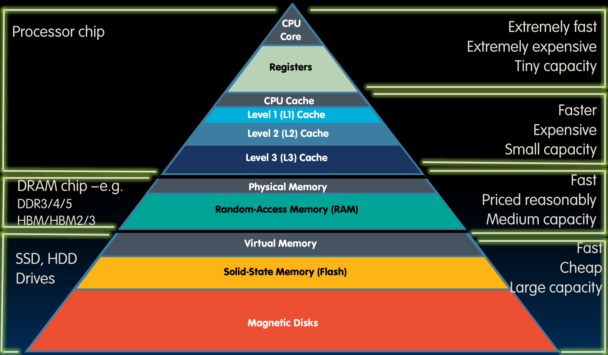
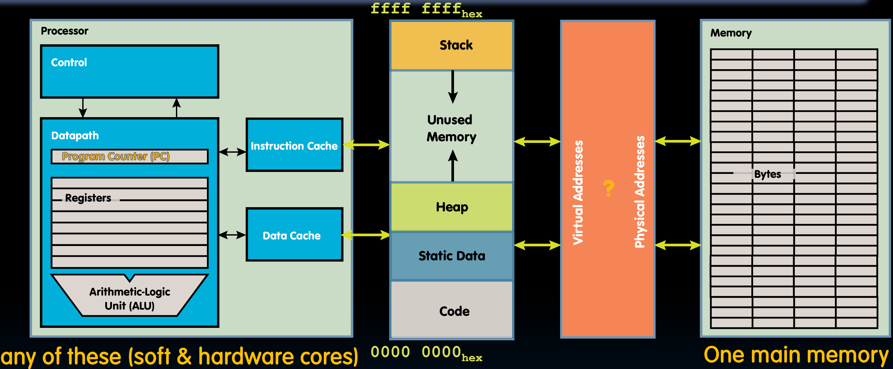
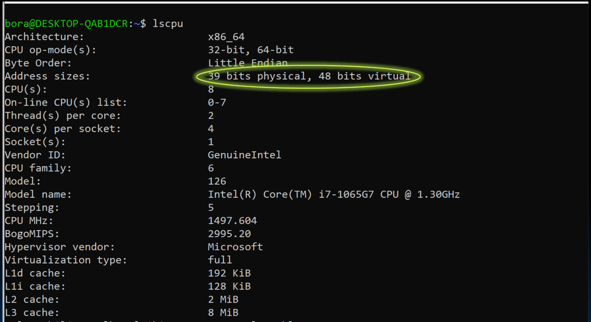

# 29.1-Virtual Memory Concepts


Lecture Video Address


在Lec28.3我们已经学习了多任务处理以及操作系统如何通过其监督模式支持在同一个核心上运行的多个进程。一个微处理器上可以运行许多进程，它们通过轮流占用处理器核心来共享时间。监督模式的存在是为了支持这种操作，可以中断一个进程并让另一个进程运行。

但是，除了共享处理器外，还需要弄清楚如何有效地共享内存。

## Virtual Memory

1. Virtual memory - Next level in the memory hierarchy:
    - Provides program with illusion of a very large main memory: Working set of “pages” reside in main memory - others are on disk
    - Demand paging(按需分页): Provides the ability to run programs larger than the primary memory (DRAM)
    - Hides differences between machine configurations

> 虚拟内存是内存层次结构中的下一个级别，在缓存之外。其目的是为了让每个进程都有一个幻觉(illusion)，即在任何时候都有非常大的内存可供使用。
>
> 它是围绕页的概念组织的，这些内存页可以驻留在DRAM中，但其中一些会放在磁盘上。那些更活跃、最近使用的页会在内存中，而那些不常用或长时间未使用的页会放在磁盘上。DRAM，即主内存，比磁盘要快得多。
>
> 围绕这些页的概念称为分页或按需分页(demand Paging)。它提供了==**运行大于主内存的程序的能力**==，因为可以将一些页交换到磁盘上。这样就可以将磁盘用作扩展的DRAM。
>
> 并且virtual memory其隐藏了不同机器间配置的差异，比如不同机器内存的大小可能不同，有8GB，16GB等等，但是无论多大，超过这些内存大小的应用(例如32GB)都可以运行，因为会通过分页和虚拟内存的概念将部分内存扩展到磁盘。

2. Also allows OS to share memory, protect programs from each other

> 虚拟内存另一个功能是，它使操作系统能够保护进程之间的互不干扰。我们不希望程序意外或恶意地覆盖彼此的内存空间。所以每个进程都有自己的世界，操作系统负责协调，虚拟内存支持这一点。

3. Today, more important for protection than just another level of memory hierarchy

4. Each process thinks it has all the memory to itself

> 当某个进程在运行时，当它获得处理器时间时，它会认为所有内存都是它自己的。

5. (Historically, it predates caches)

> 虚拟内存是一个非常古老的概念，它早于缓存。在很久以前的60年代在IBM 360处理器中引入的，并且随着时间的推移得到了扩展。当时处理器和内存之间的速度差距并不大，它们的运行速度大致相同，所以并不需要缓存。但是需要支持多个进程的运行，这就是虚拟内存概念的由来。

---

总的来说，虚拟内存的功能有两个：

1. 按需分页：使得程序在运行的时候能够拥有较大的内存（实际上是用磁盘来扩展了DRAM），也隐藏了不同机器间的配置。
2. 允许共享内存并防止进程间覆盖内存。

## Great Idea #3: Principle of Locality / Memory Hierarchy

回顾之前学习的金字塔

- 最顶端，是CPU，它的寄存器速度极快，但数量很少（在RISC-V中，有32个通用寄存器）
- 物理内存是随机存取内存（RAM）
- 处理器核心的速度和物理内存之间有一个速度差距。为了弥补这一差距，构建了多层缓存。每一层缓存都比前一层大一些，但速度稍慢一些。
- Virtual memory将Physical Memory扩展到了固态硬盘（SSD）和硬盘驱动器（HDD），它们速度很快，但不如物理内存快。

通过使用**内存层次结构**，CPU可以有一个幻觉，即所有东西都非常快，就像寄存器或缓存一样快，并且像我们的虚拟内存空间一样大。

> CPU能看到的最大的空间就是虚拟内存空间了。

## Virtual vs. Physical Addresses

为了实现上述的虚拟内存，需要在Processor和Dynamic Memory之间添加一层抽象。

这个抽象给processor已经运行的program提供了一层illusion

对于Processor：

- 其有连续的内存空间，即Code-Static Data-Heap-Stack这样的内存模型对于Processor来说是连续的（如上图中左边第二块）
- 其有完整的内存空间，Processor会认为其拥有 0x00000000 ~ 0x ffffffff全部的内存空间（即Dynamic Memory的空间，在建立Stack的时候，需要从Memory的最高地址开始建立，因此可能需要读取PC的Memory的内存大小）
- 当有多个processor的时候，彼此不需要协调避免内存地址冲突

在虚拟内存与物理内存之间，要有一个Memory Manager来负责实现Virtual Addresses与Physical Addresses的映射。

以上便是虚拟内存系统的模型，有许多进程和数据在运行，许多处理器核心独立运行，支持所有运行在同一虚拟内存空间中的进程，然后会有一个主内存，操作系统和虚拟内存系统将进行内存地址的翻译。

## Address Spaces

过去，我们谈论的Address space如下

Address space = set of addresses for all available memory locations

Now, two kinds of memory addresses

- `Virtual Address Space`: Set of addresses that the user program knows about
- `Physical Address Space`: 
    - Set of addresses that map to actual physical locations in memory（由DRAM和磁盘的数量决定）
    - Hidden from user applications(上层的应用是看不到物理内存空间有多大)

Memory manager maps ('translates') between these two address spaces

---

可以在Linux上使用`lscpu`查看虚拟内存地址的位数

> Physical Memory的地址位数是39位，但是Virtual Memory的地址位数是48位，这台笔记本电脑上的虚拟地址空间比物理地址空间大。

## Analogy

下面用一个类比来形象的说明虚拟内存和物理内存之间的映射。一个很好的类比是图书馆以及图书馆中的工作方式。

在一个实体图书馆中，使用借书卡和借书卡号，我们可以将书名看作虚拟地址，实体书有一个唯一的号码，这个号码与国会图书馆的索书号相关联。这就是的物理地址。

如果你想去图书馆找到那本特定的书，图书馆中有装有卡片的抽屉，每张卡片指向图书馆中可以找到那本书的特定位置以及它在哪个书架上。这些卡片目录就像是页表，它将书名（因为我们是按作者名或书名搜索的）映射到相应的索书号。当我们在本地图书馆把卡片拿出来时，它会告诉我们书在那个书架上。但如果在另一个分馆，它可能会说这本书在这个图书馆或在某个保留地点，需要从那里取回来。这意味着它可能在本地可用，就像在内存中，或者可能在磁盘上，就像那些使用频率非常低的书籍。

> 本地图书馆相当于物理内存，分管相当于磁盘，常用的书在本地图书馆，不常用的书在分管。

还有一个对应于虚拟内存系统的重要部分，它会告诉我们可以借多长时间的书。有些书可能限于在图书馆内阅读两个小时，有些书可以借两周，有些书可以借一个学期。这就是我们所说的访问权限。

## Summary

总结一下虚拟内存的作用以及它在支持内存层次结构中的要求。

- Allow multiple processes to simultaneously occupy (all or most of the)memory and provide protection – don't let one program read/write memory from another
- Address space – give each program the illusion that it has its own private memory
    - Suppose code starts at address 0x40000000. But different processes have different code, both residing at the same address. So each program has a different view of memory.
