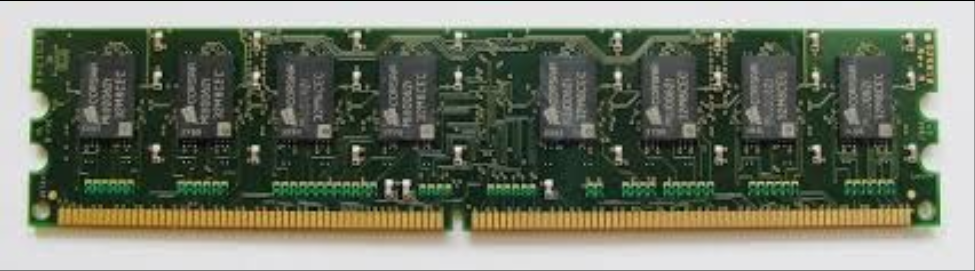
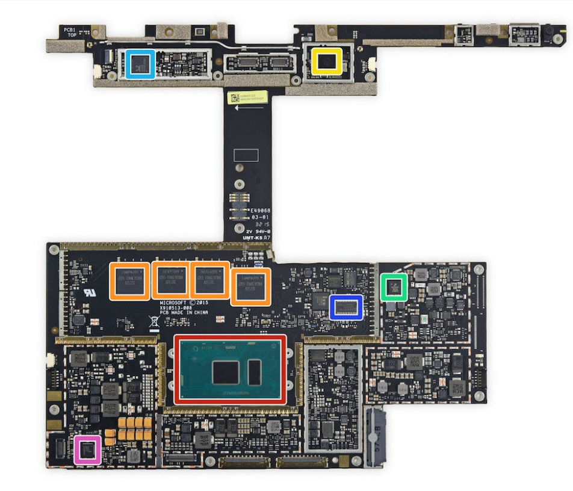
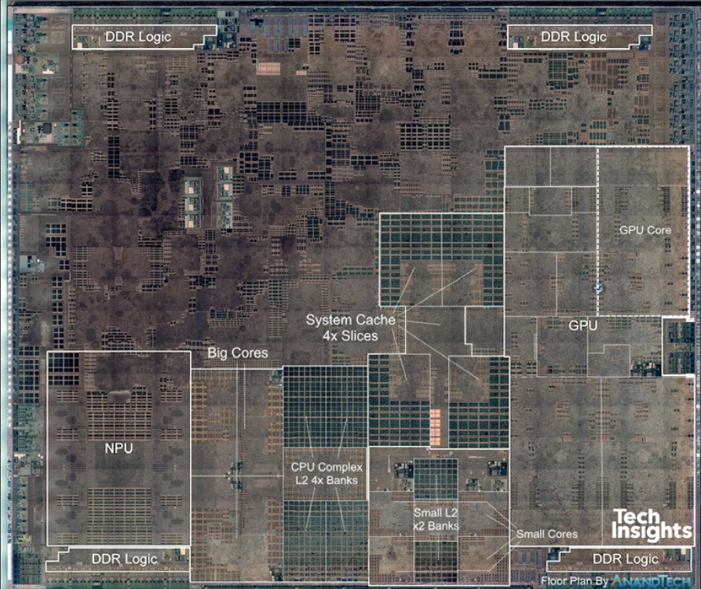
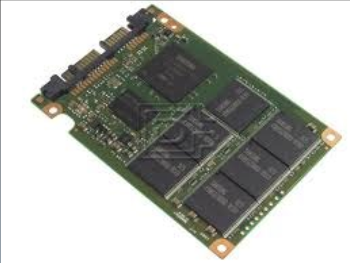
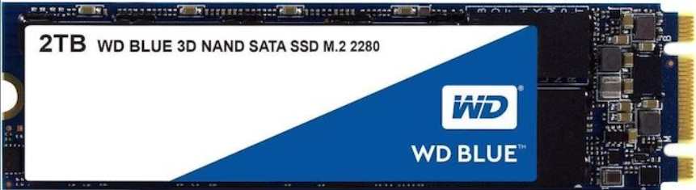
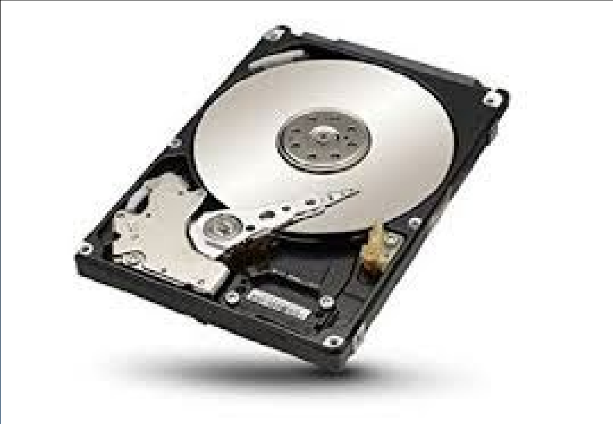
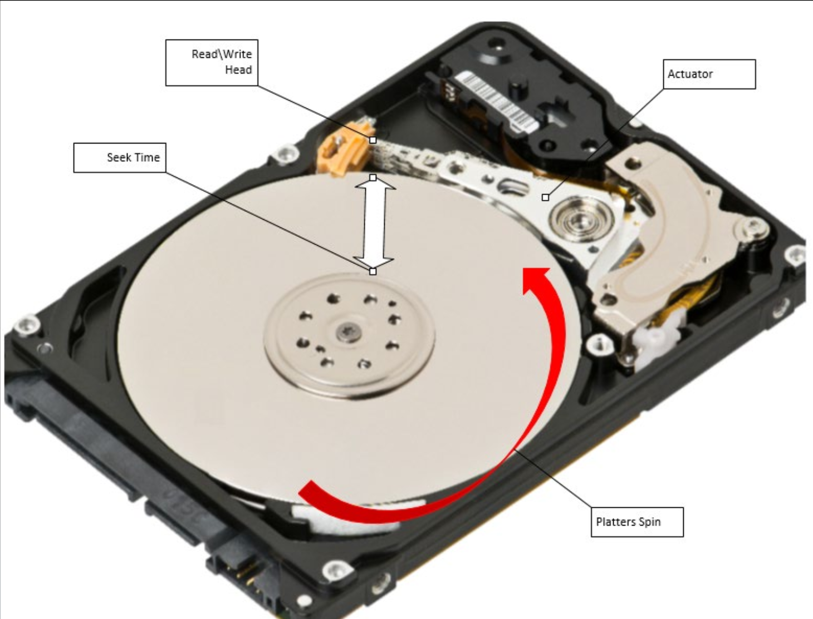
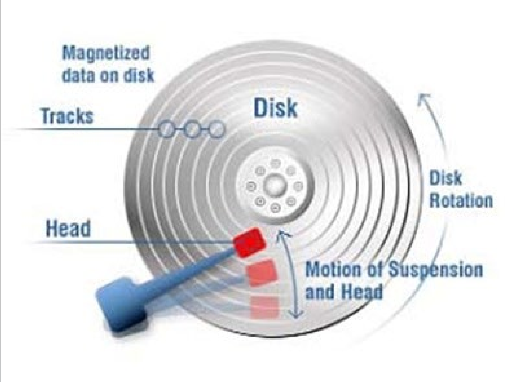
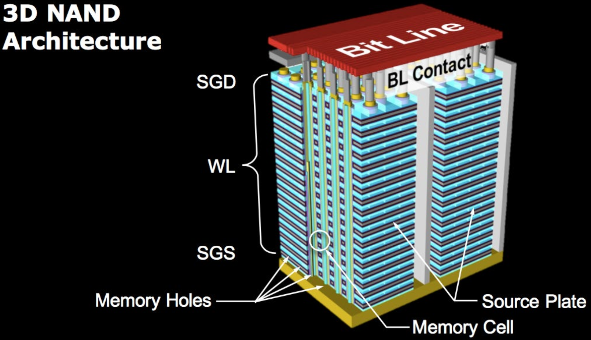

# 29.2-Physical Memory and Storage


Lecture Video Address


在我们开始理解虚拟内存的工作原理之前，先了解一些内存和存储设备的物理原理。

## Memory

Memory一般指的是Dynamic Random Access Memory简称DRAM，其制造过程与Logic Process不同。DRAM也是使用CMOS的技术，但是优化方式不同，DRAM有特殊的DRAM bit cells, 这些cells优化了存储bit的技术，但是Logic Process优化的是速度，互联和逻辑密度。

当我们将DRAM位单元与SRAM位单元进行比较时，会发现DRAM单元要小得多。SRAM单元用于构建微处理器缓存(Caches)，而DRAM是我们的外部主内存。相比之下，DRAM的密度几乎是SRAM的十倍。当我们查看现代微处理器的规格表时，会发现它可能有数十兆字节的缓存。而另一方面，具有相同面积的DRAM芯片可能有超过10GB的DRAM单元。

所有DRAM芯片的技术基本相同或非常相似，但它们用于与微处理器通信的协议或接口以及封装可能有所不同。

下面是几种用于不同地方的Memory

|                             diagram                            | usage                               | desc                                                                                                                                                                                            |
| :------------------------------------------------------------: | ----------------------------------- | ----------------------------------------------------------------------------------------------------------------------------------------------------------------------------------------------- |
|  | Desktop/server                      | 用于桌面和服务器的DRAM类型，即所谓的DIMM或双列直插式内存模块，它在一个小的印刷电路板上有8或16个DRAM芯片，可以插入桌面或服务器。                                                                                                                         |
|  | MS Surface Book                     | 
如图是较旧的Microsoft Surface Book，大多数笔记本电脑实际上没有空间容纳上述DRAM芯片。相反，DRAM芯片直接焊接到主板上。如图中橙色框的芯片，其靠近微处理器。 （顺便说一句，红色框的事微处理器，这是几年前的英特尔微处理器，它有两层或三级缓存。最后一级缓存是在DRAM工艺中作为单独的芯片构建的，位于与微处理器在同一封装内的微处理器旁边。）
 |
|  | Apple A12 Bionic (DRAM goes on top) | 几年前的Apple A12仿生处理器上装有四个DRAM芯片。使用DDR接口，这是用于与DRAM通信的一种协议。四个DRAM接口连接到放置在微处理器上的四个DRAM芯片。                                                                                                            |

不论封装如何，所有DRAM芯片和所有DRAM内存都是易失性的(Volatile)。这意味着当我们关闭电源时，存储在DRAM中的所有数据都会丢失。这对DRAM和SRAM都是一样的。微处理器需要电源来保留缓存中的数据。同样，DRAM芯片也需要供应电压来保留其中存储的数据。这就是为什么我们称它们为易失性的。

DRAM比SRAM更易失。SRAM只要有电源就会保留数据，但DRAM会忘记。这就是为什么它被称为Dynamic。数据以电荷的形式动态存储在DRAM单元中，电荷可能会从DRAM单元中泄漏出去。因此，需要刷新。因此，每隔几百毫秒，控制器会访问DRAM，读取内容并写回DRAM。这就是刷新过程。处理器不需要对此做任何事情，这是控制器的功能。

关于DRAM的一些特性

* 访问第一个word的延迟大约是10纳秒（30\~40 processor cycles）
* 连续的读写是很快的，每次连续读取或写入发生在每0.5到1纳秒。在每次访问的时候，我们可以访问64bits。
* DRAM支持一种burst Mode

> ChatGPT-burst mode
>
> DRAM的Burst Mode是一种数据传输模式，旨在提高数据传输速度和效率。以下是Burst Mode的一些关键点：
>
> 1. **定义**：Burst Mode是一种连续的数据传输模式，允许DRAM在一次访问中传输多个连续的内存单元数据，而无需每次访问都重新指定内存地址。
> 2. **工作原理**：
>    * 当一个请求发出时，DRAM控制器会指定一个起始地址。
>    * 随后，DRAM会按照一定的顺序自动传输多个连续的内存单元数据。
>    * 这样减少了每次访问前重新指定内存地址的时间，从而提高了数据传输效率。
> 3. **优势**：
>    * **提高带宽**：由于减少了地址传输的开销，可以更快地传输数据。
>    * **降低延迟**：一次访问可以传输多个数据单元，减少了多次访问带来的延迟。
> 4. **应用**：
>    * Burst Mode通常用于缓存、图形处理和其他需要高速数据传输的应用中。
> 5. **配置**：
>    * Burst长度可以配置，常见的长度有2、4、8等。
>    * 配置取决于系统需求和内存控制器的设计。
>
> 通过利用Burst Mode，DRAM可以更高效地处理大量数据传输任务，适应现代计算和图形处理需求。

## Storage – "Disk"

下面进入存储部分。存储通常是我们所说的磁盘disk。

> Memory一般不属于Storage。整个计算机的运行过程相当于一个FSM，而Memory在FSM负责保存状态，Storage是外部连接的存储。

有两种类型的磁盘我们会遇到，固态硬盘（SSD）和硬盘驱动器（HDD）。都作为外部I/O设备连接。

SSD和HDD都是所谓的非易失性存储类型，这意味着即使断电也能保留数据。否则我们的计算机会忘记所有内容。每次启动时都需要将操作系统和所有数据加载到驱动器中。

如下是SSD和HDD的区别

|         | SSD(固态硬盘, solid state disk)                                                                                                  | HDD(磁盘, hard disk drive)                                       |
| ------- | ---------------------------------------------------------------------------------------------------------------------------- | -------------------------------------------------------------- |
| picture |  |  |
| Access  | Access: 40-100µs (\~100k proc. cycles)                                                                                       | Access: <5-10ms (10-20M proc. cycles)                          |
| price   | $0.05-0.5/GB(贵)                                                                                                              | $0.01-0.1/GB                                                   |

1. 两个disk都比Memory慢很多，SSD比HDD要快一些
2. SSD的价格大概是HDD的5倍
3. SSD有不同的形状和形式。它可以是类似于小型HDD的形状，或是更现代的m.2形式（如上述的两幅图）

### HDD

为什么HDD这么慢并且便宜。

磁盘主要是机械的，具有非常复杂的机电系统，将数据存储在氧化铁上，就像铁锈一样。中间有一个旋转的盘片，还有一个机械臂在这个表面上方飞行，并磁化表面以存储数据。相反，当它处于读取模式时，它只是悬浮在表面上方并读取数据。这些磁性区域非常小，每侧只有几纳米，为了识别这些bit，机械臂在表面上方几纳米处飞行。

数据通常组织在同心圆上，称为磁道。这个机械臂悬挂在上方，被设计成类似机翼的形状，飞行在磁盘表面上。

磁盘有不同的类别，大多数从7200 RPM到10000 RPM，有些达到15000 RPM，如果转换成毫秒，每次旋转约需6毫秒，这意味着对于这种磁盘，平均随机访问时间约为3毫秒，对于典型的7200 RPM磁盘驱动器，大约是5毫秒。这相当于1000万处理器周期。

#### How Hard Drives Work?

可以看下面的视频

https://cs.stanford.edu/people/nick/how-hard-drive-works/

### SSD

固态硬盘SSD由闪存Flash Memory构建而成。

闪存和固态硬盘里面没有机械部分。这有点类似于DRAM。

* 技术上，Flash Memory由非易失性单元构建的(本质上也是金踢馆)，可以在单元中捕获电荷（是在DRAM中，仅仅是存储了电荷）使其即使在断电时也能留在位单元中。
* 组织上，SSD类似于DRAM，但它的密度更高，甚至比DRAM还要高。
* SSD相当快，虽然比DRAM慢，但比磁盘快得多。
* 在访问SSD时总是读写block，永远不会访问字节或字而且如果你想要擦除一块内容，它有一些不寻常的要求。如果你想将所有内容设置为零，你必须擦除整个块。
* SSD访问每一个位置的速度几乎都一样，不管地址是什么。

由于电荷的捕获，闪存驱动器的寿命有限。因此，你只能完全擦除它们几千次。目前，HDD上有备用块和备用扇区以延长寿命，但SDD通常比HDD更不可靠。

#### Flash Memory

3D array of bit cells (up to 256 layers!)

Western Digital/Semiengineering

关于Flash Memory，它们的闪存技术，真的是当今科技的奇迹，已经变得非常便宜，并且在扩展时并没有真正放慢速度。虽然我们不能使这些单个存储单元的面积变得更小，但该行业正在做的是将它们堆叠在一起。每一层都有一个存储单元阵列，然后他们在上面堆叠层。这基本上延长了技术扩展的时间，因此闪存技术将在未来几年内继续在第三维度上发展。
