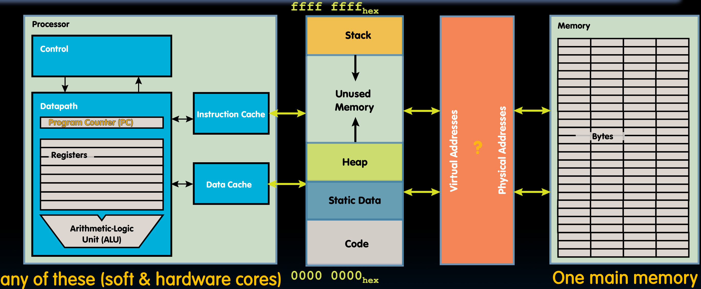
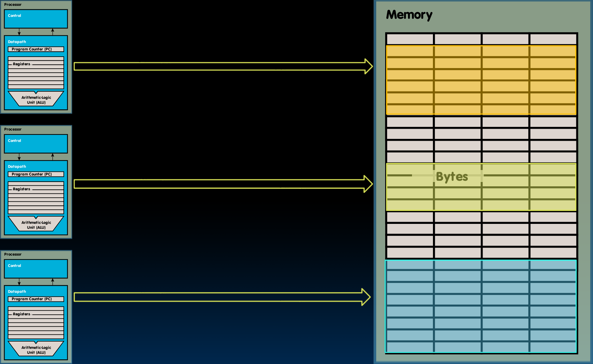

# 29.3-Memory Manager


Lecture Video Address


我们已经了解了实际物理内存是如何工作的，内存中的每个位置，每个字或块，都有其自己的物理地址。

本节要学习当有多个进程试图使用内存时，这种内存和内存寻址是如何工作的。

## Virtual Memory

### 'bare metal' system

In a 'bare metal' system (without OS), addresses issued with loads/stores are real physical addresses

> 只有loads和stores指令会与Memory相关。

In this mode, any process can issue any address, therefore can access any part of memory, even areas which it doesn't own

> 在这种情况下，多个进程可以在内存中互相覆盖。更危险的是，当这种模型中有操作系统时，一些进程可能会覆盖操作系统的数据结构。

We should send all addresses through a mechanism that the OS controls, before they make it out to DRAM - a translation mechanism: Check that process has permission to access a particular part of memory 

> 每个进程将使用虚拟地址空间，然后这些地址在某种程度上与物理地址空间脱钩。在访问内存中的特定物理位置之前，我们会检查特定进程是否有权访问该位置。

### 100+ Processes

100+ Processes, managed by OS

> 下图中左侧的每一行对应一个不同的进程

每个进程都生活在这样一种幻觉下，它在某个时间点独自占有整个内存。数百个进程可能存在，并且它们都由操作系统多路复用到Core。每一个进程在核心上运行一段时间，然后通过上下文切换机制，另一个进程接管核心。

> Processor是可以切换服用的，切换的时候使用context switch机制

- But what about memory?
    - There is only one!
    - We cannot just "save" its contents in a context switch …（因为这样的话要将其他的数据放在内存上）

为了能够共享内存，有了虚拟内存机制。

### Virtual vs. Physical Addresses

如下图

> 上图中的左二块是不存在的，是虚拟的，是Virtual Memory。
>
> Cache位于Virtual Memory之前，接受的是Virtual Address

每个进程都在自己的世界中运行，其可以使用完整的，连续的整个内存。但实际上，这些虚拟地址以不同的方式翻译为每个进程的物理地址。

Memory manager负责翻译。

### Conceptual Memory Manager

从概念上讲，Memory Manager本质上**将每个进程映射到内存的一部分**。因此，虽然每个进程认为它是从零地址运行到最高地址，实际上它只使用了**内存的一部分**。如图所示。

这些内存部分不一定是连续的。实际上，它们更像是交错的，分布在整个内存中并相互混合。

## Responsibilities of Memory Manager

Memory Manager的作用是什么

1. Map virtual to physical addresses
2. Protection:
    - Isolate memory between processes
    - Each process gets dedicate "private" memory
    - Errors in one program won't corrupt memory of other program
    - Prevent user programs from messing with OS's memory
3. Swap memory to disk
    - Give illusion of larger memory by storing some content on disk 
    - Disk is usually much larger and slower than DRAM
        - Use "clever" caching strategies（DRAM有点类似于Cache）
