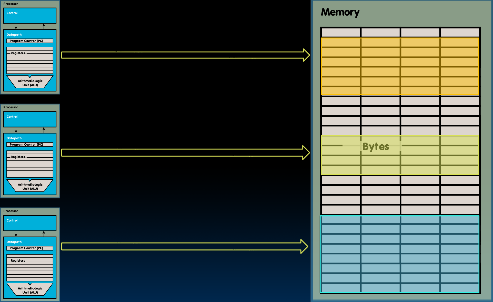
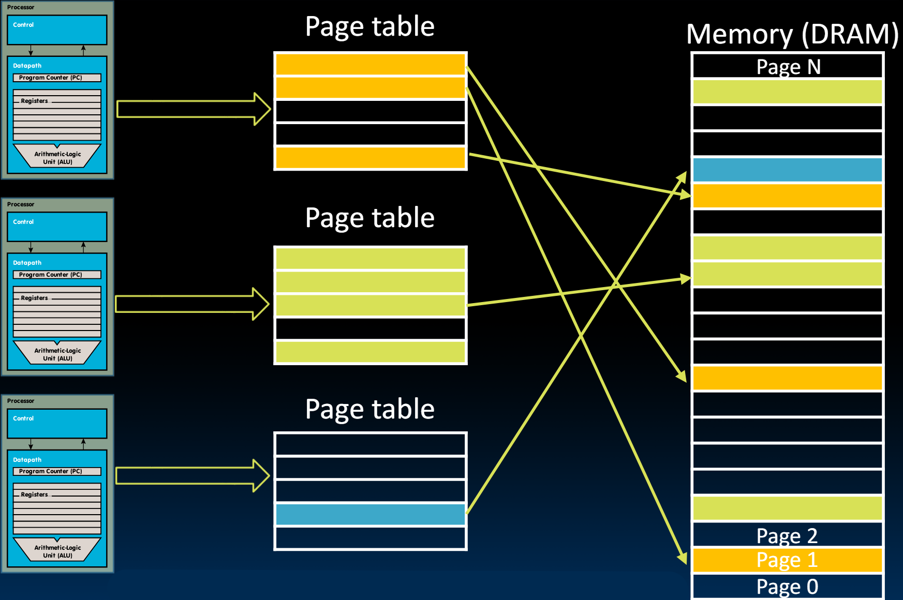
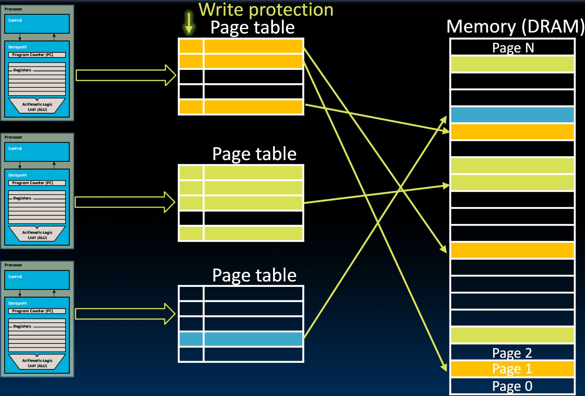
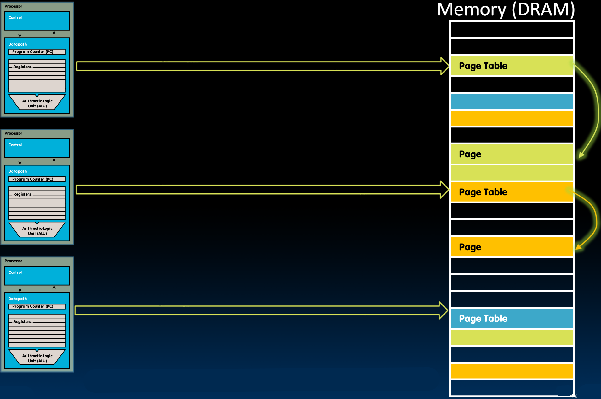

# 29.4-Paged Memory


Lecture Video Address


之前我们已经讲了Virtual Memory的概念，并且介绍了其中Memory Manager的作用：

1. 提供Virtual Address到Physical Address的映射
2. 提供进程之间的保护，以防止它们在内存中相互覆盖
3. 将一些数据块从DRAM交换到磁盘

下面我们讨论这些是如何实现的

## Paged Memory

### Page Size

通常，在DRAM与Disk之间移动的数据的大小是固定的（在计算机架构中，追求的是简洁，可变的数据交换单位会使得结构变得复杂难以调整）这个数据块的大小称为Page，因此会将Memory看做一个page memory system

> 不同存储层次之间的交换都有单位，Register与Memory的交换单位一般是word，Cache与Memory的交换单位是block。

Page的大小设定

* Page不应该太小，因为不希望太频繁地访问磁盘，因为磁盘操作在时间上是昂贵的
* 另一方面，我们也不希望移动太大的数据块(这样会增加单词访问的时间成本)。
* <mark style="background-color:green;">大多数现代操作系统选择的页面大小</mark>为4KiB(4 kibi Bytes)，而这也恰好是硬盘驱动器中最小可寻址块的倍数（最小可寻址块是512字节）。

> 问题？所以虚拟内存地址的解释方式是OS决定还是底层的硬件决定呢？

由于RISC-V是Byte addressable的，也就是说，Page里面的每一个Byte都需要可寻址，这样就需要有12bits来表示地址，因此可以将32bits的Virtual Address如下切分。

| page number | offset  |
| ----------- | ------- |
| 20 Bits     | 12 Bits |

* Page的数量是 $$2^{20}$$ ，每个Page有 $$2^{12}$$ 个bytes

### Paged Memory

如下，是Conceptual Virtual Memory的逻辑示意图

* Conceptual Memory Manager为每个进程分配了一部分内存。每个进程都可以访问整个内存，但它们通常不会使用所有内存。
* 每个进程通常在Stack和Heap之间有哦一部分未使用的空内存。
* 在这个概念中，其显示的是将连续的内存分配给每个进程，但是在实际中，为了方便，paged Memory可以随意的排列这些Page。

如下图

> Each process has a dedicated page table. Physical memory non-consecutive.

* 地址转换是通过页表完成的。
* <mark style="background-color:green;">每个进程都有一个由操作系统管理的页表</mark>(page table)。一个进程可以有多个Pages，管理一个进程的多个Page的结构就是page table。每一个进程对应一个page table。
*   所有虚拟地址本质上都指向页表。页表条目是DRAM中Memory page的物理地址。

    > * 页表的条目仅仅保存page的物理地址，但是不会详细到Byte或者word的物理地址，这个Offset直接由Virtual Address中提取。
    > * <mark style="background-color:green;">每个条目中至少含有Physical Address的高几位</mark>（低几位由Virtual Address的Offset拼接）
    > * 图中看到的page Table仅仅有5个items，但是实际上，在Virtual Address中有20Bits用于表示page number，这个是作为page Table的索引的，也就是说，每一个Process对应的page Table都有 $$2^{20}$$ 个items

如上图，第一个进程目前使用3个Page，每个Page有4ki bytes，所以第一个Process指向的页表有3个条目分别指向不连续的Memory page

* 同一page table的pages(也就是一个进程使用的pages)可以位于内存中的不同位置，不需要连续，这取决于OS。
* 而且pages不需要都在DRAM中，有些可能被交换到磁盘上
* page table由OS管理（怎么管理呢）

下面来看看如何使用paged Memory system实现之前所说的三个功能。

## Paged Memory Address Translation Control

将Virtual Address转换为Physical Address，在此过程中保留Offset

*   OS keeps track of which process is active(Chooses correct page table)

    > 当进程接管处理器时，其页表也变得active。这也属于与该进程对应的state的一部分（应该会有个State保存当前process对应的page Table）
* Memory manager extracts page number from virtual address (e.g. just top 20 bits)，并保留后面12bits
* **Looks up** page address in page table（Virtual Address的page table entry作为索引）
* Computes physical memory address from sum of `Page address` and `Offset` (from virtual address)

Physical addresses may (but do not have to) have more or fewer bits than virtual addresses

## Protection

* Assigning different pages in DRAM to processes also keeps them from accessing each others memory
  * Isolation
  *   Page tables handled by OS (in supervisory mode)

      > 换言之，page table不是由Process控制的，Process被限制在了OS分配的内存当中，没有权限使用其他Process的内存
*   <mark style="background-color:green;">Sharing is also possible</mark>

    * OS may assign same physical page to several processes

    > 有一个位会标记某个特定页面在进程之间是可共享的。因此，操作系统会将同一个物理页面分配给两个不同进程中的两个不同虚拟地址，这样就可以在进程之间共享数据。

除此之外，在Page Table Entry(PTE)中还有很多<mark style="background-color:green;">状态位</mark>，用于限制一个Process对某一个Page的操作，如下展示对于Write的Protection

### Write Protection

如何确保我们不会写入不应写入的页面？

> 因为有多个进程可能会共享内存，所以可能需要确保这些进程不会写入共享的Memory page

会有一个位表示该页面是写保护的。我们可以用一个单个位来做到这一点。因此，页表除了这些物理地址作为其条目外，还会有一些标志位，表示页面的状态。例如，那些写保护的页面其位可能被设置为1。如果你尝试写入写保护页面，会引发异常，然后操作系统会处理该异常。

## Where Do Page Tables Reside?

我们理解了整个翻译过程是如何发生的，以及保护是如何实现的，但这些页表在哪里？它们在处理器内部吗？还是它们是另一块单独的内存？

下面分析一个page table有多大。

E.g., 32-Bit virtual address, 4-KiB pages

* Single **page table** size: （这里指的是1个page而不是page table）
  * 4 x $$2^{20}$$ Bytes = 4-MiB（每一个page table有 $$2^{20}$$ 个item，每一个item都有32Bits，也就是4Bytes）
  * 0.1% of 4-GiB memory
  * But much too large for a cache!

> 由于一个page table太大了，因此不能将整个page table保存在Cache里面。也就是说，page还是保存在Cache中的。
>
> 但是Cache是接受Virtual Address的。

Store page tables in memory (DRAM)

Two (slow) memory accesses per `lw`/`sw` on cache miss（这两个指令每次需要读取两次Memory，第一次是读取page table获取Physical Address，然后根据Physical Address再次从内存中读取数据）

但是读取Memory的成本是比较高的，怎么提高性能呢？

* 使用Cache存储部分page table，由于spatial locality，页表中经常访问的条目将被缓存。
* 大多数时候，我们不需要两次访问DRAM来加载或存储数据。数据和页表条目都将驻留在Caches中。

### Page Table Stored in Memory

简而言之，我们的页表将存储在内存中。因此，每当我们引用内存中的一些数据时，我们首先引用页表，页表将引用实际的页面。

> 如图，每个进程都指向Memory中的page table
