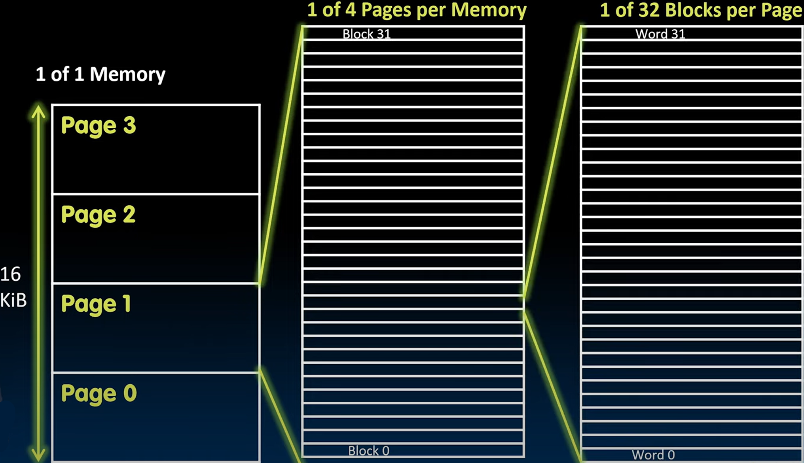
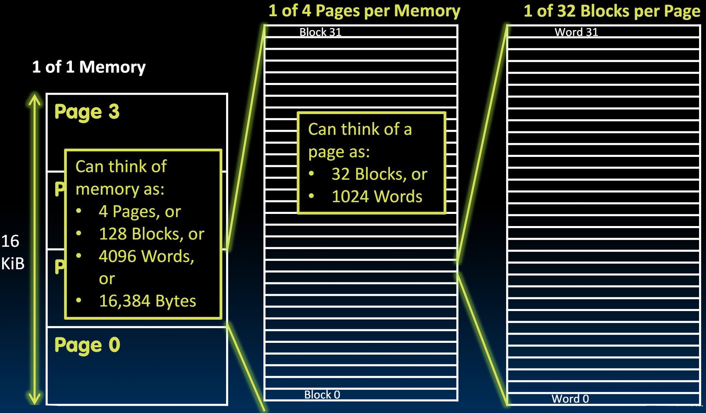
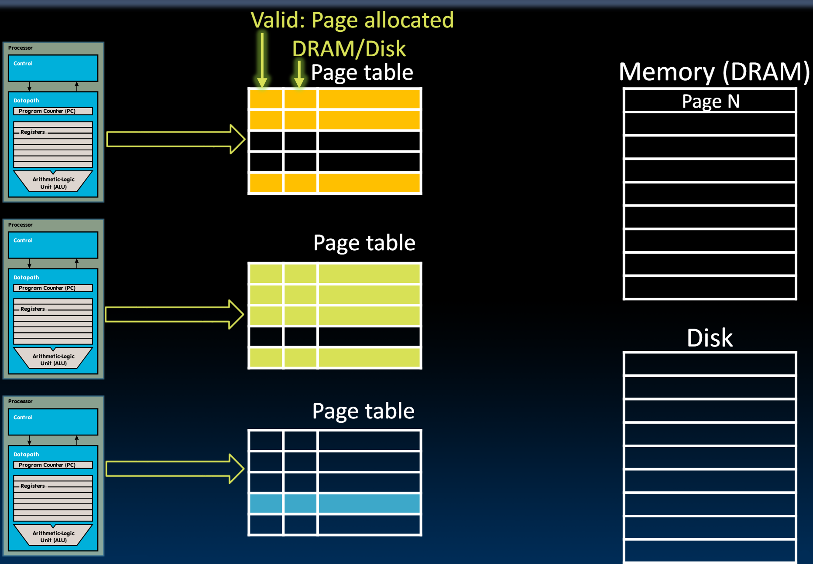

# 29.5-Data Unit, Memory Access, Page Faults, Write-Back


Lecture Video Address


已经介绍了paged Memory system，并了解了Page的工作原理。Page可以驻留在DRAM中或Disk上，有一个Page Table告诉我们页面是否已分配以及它们是在DRAM中还是在磁盘上。

我们将更详细地了解系统的实际工作原理。

## Data Units

在此之前，需要回顾一些可能混淆的内容。

首先是数据单位

### Blocks vs. Pages

Block和Page是不同的度量单位来表示正在移动的字节数量。

| Component          | data unit                      | common size in modern systems |
| ------------------ | ------------------------------ | ----------------------------- |
| Caches             | Block(这里的Block与SSD的Block不是一回事) | 64 bytes                      |
| VM(Virtual Memory) | Page                           | 4 Ki bytes                    |

> 不用在意Block和Page大小的联系，Cache给Processor提供了一层抽象，VM给Cache提供了一层抽象，两个单位只是在各自的抽象层下面有效。

Common point of confusion: Bytes, Words, Blocks, Pages are all just different ways of looking at memory!

### Bytes, Words, Blocks, Pages

我们下面举一个简单的计算机为例，各个指标如下：

| usage          | Unit  | Size  |
| -------------- | ----- | ----- |
| DRAM           | DRAM  | 16KiB |
| Virtual Memory | Page  | 4 KiB |
| Cache          | Block | 128 B |
| `lw`/`sw`      | word  | 4 B   |



* DRAM可以分为4个Page
* 每个Page为4KiB，可以分为32个Block（每次Cache读取的都是1个Block）
* 每个Block可以分为32个word(每次lw/sw操作的都是一个word)
* 每个word有4个bytes



## Review: Analogy

下面继续回顾图书馆的例子，来说明已有的Virtual Memory还缺什么

* Book title like `virtual address`
* Library of Congress call number like `physical address`
* Card catalogue like `page table`, mapping from book title to call #
* On card for book, in local library vs. in another branch like `valid bit` indicating in main memory vs. on disk (storage)
* On card, available for 2-hour in library use (vs. 2-week checkout) like `access rights`

现在，我们还缺少`valid bit`和`Access right`

> 这里需要提到的另一个重要事情是，当图书馆将新书引入其收藏时，它不会只是将其直接放到书架上。每次引入新书时，即虚拟内存系统中引入新页面时，我们需要为其创建一个目录页面。我们需要为其创建一个目录卡片并将其放入收藏中。

## Paged Memory

因此，在原来的基础上，我们需要为每个page table的item添加状态位



* Valid bit用于标识该page是否被分配
* DRAM/Disk用于标识page此时在DRAM还是在Disk中

> 图中使用bit来表示这些信息，但这样仅仅是概念上的做法，具体怎么编码是根据ISA决定的，而且还有很多更长的控制位，噶欧尚每个page item的状态，后面会介绍更多。

## Memory Access

下面是在`lw`/`sw`指令执行时，根据Virtual Address得到Physical Address的步骤

Check page table entry（先检查Valid bit）:

* Valid?
  * Yes, valid → In DRAM?
    * Yes, in DRAM: read/write data
    * No, on disk: allocate new page in DRAM（<mark style="background-color:red;">**Page Fault**</mark>）
      1. If out of memory(用尽内存), evict(驱逐) a page from DRAM
      2. Store evicted page to disk
      3. Read page from disk into memory
      4. Read/write data
* Not Valid（<mark style="background-color:red;">**Page Fault**</mark>）
  * allocate new page in DRAM
  * If out of memory, evict a page
  * Read/write data

> valid表示这个Virtual Address是否有对应的Physical Address，如果not valid，说明没有，也肯定在disk中没有，所以不需要考虑从disk中读取，直接分配即可

在这个过程中，如果数据是valid but on disk或者not valid的时候，需要分配内存或者与disk交换，认为发生了Page Fault，此时需要操作系统的干预。

## Page Fault

> Exception是内部引起，同步的，需要立即处理的。

* Page faults are treated as exceptions
  * Page fault handler (yet another function of the interrupt/trap handler) does the page table updates and initiates transfers
  *   Updates status bits

      > 这是由OS在Supervisor Mode做的
*   (If page needs to be swapped from disk, perform context switch)

    > 现在，如果这个过程涉及将数据从磁盘移动到内存或从内存移动到磁盘——本质上是页面与磁盘的交换——通常会进行context Switch，因为这是一个耗时的过程。这意味着这个进程需要从很远的地方获取数据，因此进程将闲置几十毫秒。这是启动上下文切换的最佳时机，让其他进程在数据传入时使用处理器。
    >
    > 也就是说，在从磁盘移动数据的过程中，一般一个Process占用processor的时间也会用完，此时正好初始化context，用于下一个Process
* Following the page fault, the instruction is reexecuted（当处理Exception的时候，当前的指令会被取消）

## Remember: Out of Memory

虽然有了Virtual Memory可以使用disk来扩充Memory，但是这毕竟不是无穷的，仍然会有用尽的时候。

```c
int main(void) {
    const int G = 1024 * 1024 * 1024;  // 非常大的空间
    for (int n = 0;; n++) {
        char *p = malloc(G * sizeof(char));
        if (p == NULL) {
            fprintf(stderr, "failed to allocate > %g TiBytes\n", n / 1000.0);
            return 1; // abort program
        }
        // no free, keep allocating until out of memory
    }
}
```

```
$ gcc OutOfMemory.c; ./a.out
failed to allocate > 131 TiBytes
```

## Write-Back

在Cache与Memory之间有Write policy，同样，在Memory与disk之间也需要Write policy。

但是也有区别，在Cache中，有Write-through和Write-Back的Write policy用于不同的应用。但当我们处理数据传输和更新到磁盘时，实际上只有一个选项，由于将数据写回磁盘的成本非常高，因此我们唯一能做的就是write-back。write-through根本不是一个选项，因为它会非常非常慢。所以在这里唯一的策略是回写最近最少使用的页面。因此，虚拟内存系统中的写策略比我们在缓存中遇到的要简单得多。

> 也就是说，当某一个Page的数据发生变化后，只有这个Page需要被evict回disk的时候，才会将改动写到disk。
