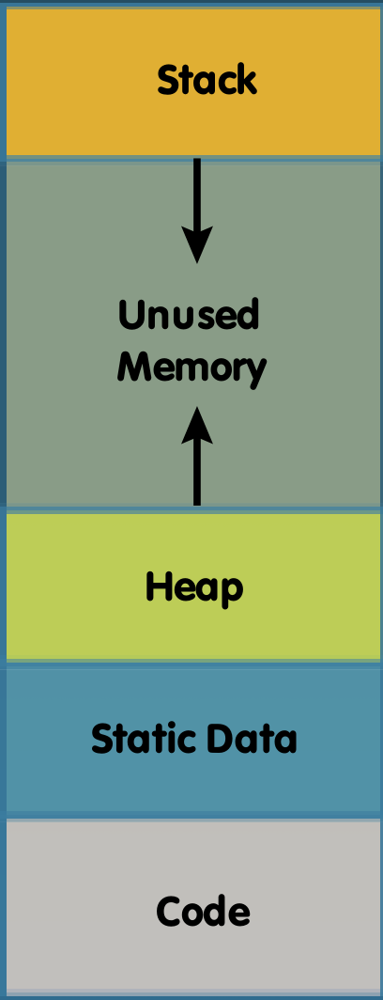
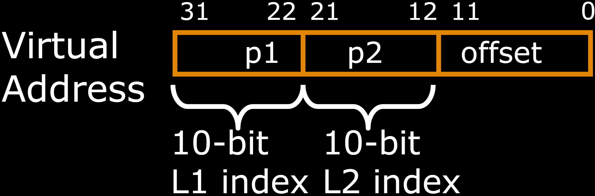
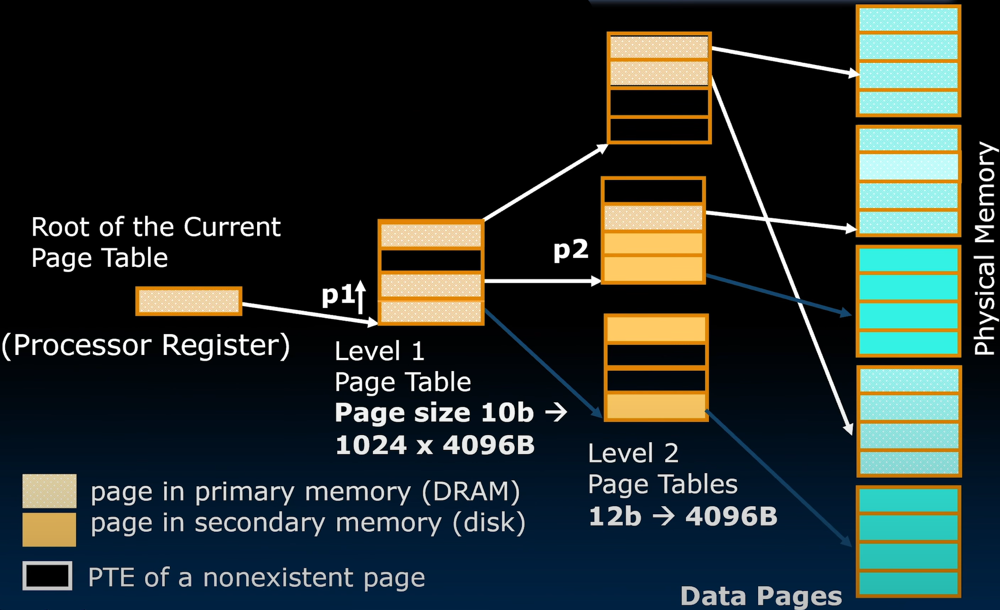
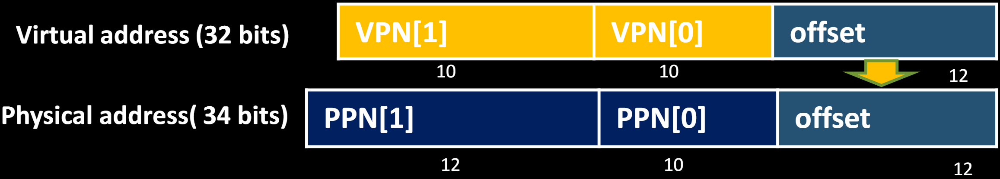

# 30.1-Hierarchical Page Tables


Lecture Video Address


在前面几节课，我们介绍了paged Memory system，并介绍了Page table作为管理虚拟内存系统的一种方式。

就好像去图书馆找书一样，如果不直接从书架中挨个寻找，而是先去目录或者计算机上的数据库搜索位置，会很快的找到书。这也是Page table的作用。

但是，在计算系统中实现这一点有一些非常重要的差异，其中分配给这些页面表的内存大小很重要。

## Size of Page Tables

先来考虑在之前的课程中，Page table的大小，这里选用32-Bit virtual address, 4-KiB pages为例

> 4-KiB pages，则有12Bits表示Offset，其余20位作为page table的索引，每个条目都是32Bits，也就是4bytes

- 单个进程的page table的size为：
    - 4 x 2^20^ Bytes = 4-MiB
    - 0.1% of 4-GiB memory

这样的大小对于一个Cache来说比较大，但是对于4-GiB的DRAM来说是完全可以接受的

但是现代计算机是可以支持上百个进程，每一个进程都需要有单独的page table

- 256个进程的page table的size的总和为：
    - 256 x 4 x 2^20^ Bytes = 256 x 4-MiB = 1-GiB
    - 25% of 4-GiB memory!

这么多空间就太大了，限制了进程可以用于存储程序和数据的内存量。而且大多数计算机都有64-bit addresses，会导致page table的 大小急剧增大。

因此需要想办法减小page table的大小。

## Options for Page Tables

### Increase page size

其中一个办法就是增加page的大小，例如由4KiB切换为8KiB，这样Virtual Address中的offset就会多1位，page number就会少1位，page table的大小也会减半。

缺点：如果程序用不到8KiB的page，会造成浪费

### Hierarchical page tables

从page table的结构入手，设置多级page table：第一级table寻址比较大块的Memory，第二级table将聚焦到更小块的内存上。

> 实际上，大多数程序仅仅使用一小部分内存，很少有程序会完全使用所有内存。如下
>
> 
>
> Heap和Stack中间有很多没有使用的区域。

因此，可以将page table分成两部分(当然可以分成更多的几部分)。

RISC-V就是这样做的。

## Hierarchical Page Table

首先将Virtual Address再分成三部分，其中page number分成两部分。

> 在32位地址空间中，我们通常会看到两级分层页面表。当转到64位地址空间时，为了进一步利用这种稀疏性并且不使页面表的大小再次爆炸，我们通常会看到四层层次结构，例如RV64I，x86等等。

据此得到的page table的结构如下（这是一个Process的page table）

- L1 Index作为P1的索引寻找Level 2 PT
- L2 Index作为P2的索引寻找page
- offset用于定位在一个page里面的位置

> 节省空间？
>
> 对比单个page table的size
>
> - 单级：4 * 2^20^ = 4MiB
> - ~~P1的大小为2^10^ * 4 = 4KiB, P2的总大小为1024 * 2^10^ * 4 = 4MiB(好像多了？)~~
>
> 节省空间的点在于并不是所有的L2 Page Table都存在的，L1 Page Table的一些指针指向的可能是空地址，这样很多没有使用的Page对应的page Table就不会存在，也就不会占用内存了。

如何存储这棵树呢？或者说如何寻找这棵树呢？由于PT有非常严格的结构，所以只需要关心PT的root即可，root被存储在一个processor Register（叫做Supervisor page table base register (SPTBR) in RISC-V），当切换进程时进行context Switch的时候，会将SPTBR为Process的PT的root位置

## Example: 32-b RISC-V

下面看看RISC-V是怎么实现的。

> - VPN: Virtual Page Number
> - PPN: Physical Page Number
>
> Physical Address有那么多位可能是Memory也分多块

- 32位虚拟地址空间分为12位偏移量用于4-KiB页面，和两个各10位宽的Virtual Page Number
- VPN[1]和VPN[2]用于两层检索

---

- Page Table Entry (PTE) is 32b and contains（这里指的是Level 2 PT的内容）: 
    - `PPN[1]`, `PPN[0]`
    - Status bits for protection and usage (read, write, exec), validity, etc. 

> 物理地址的offset直接由Virtual Address截取，PTE的低几位是状态位

R= 0, W=0, X = 0 points to next level page table; otherwise it is a leaf PTE（leaf表示没有子节点。）

> R= 0, W=0, X = 0意味着什么都不能做，所以可以用于标识leaf
