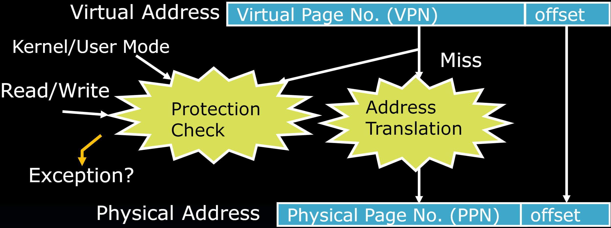
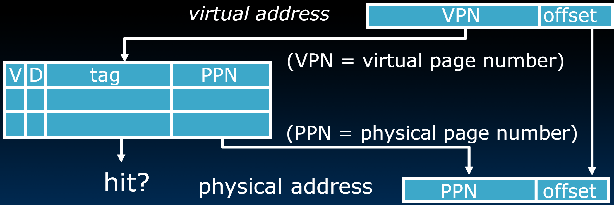
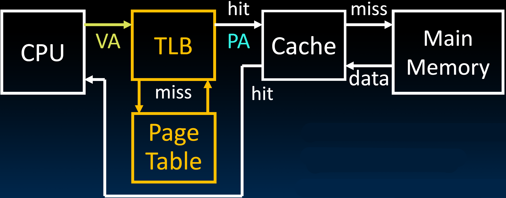
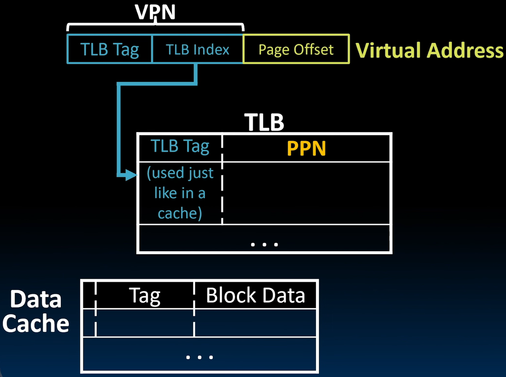
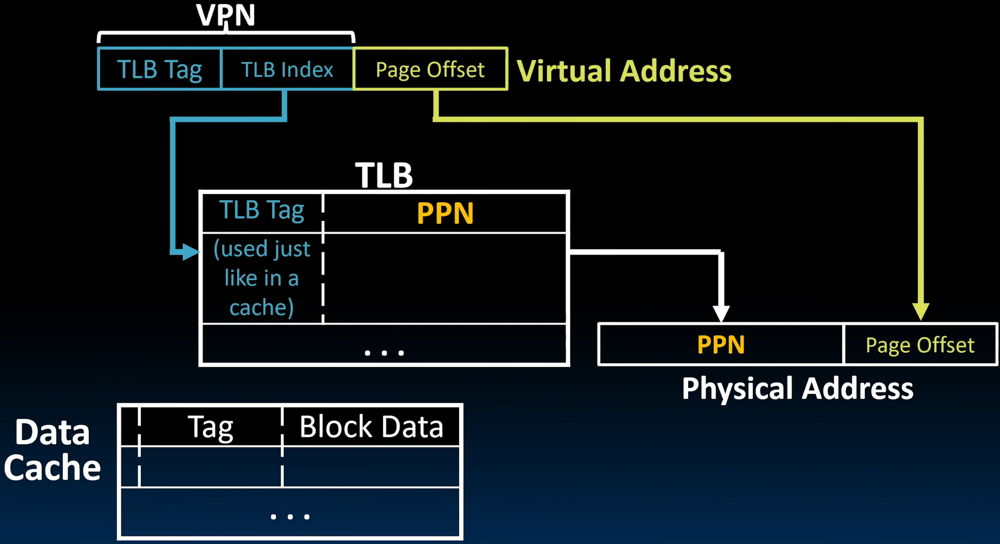
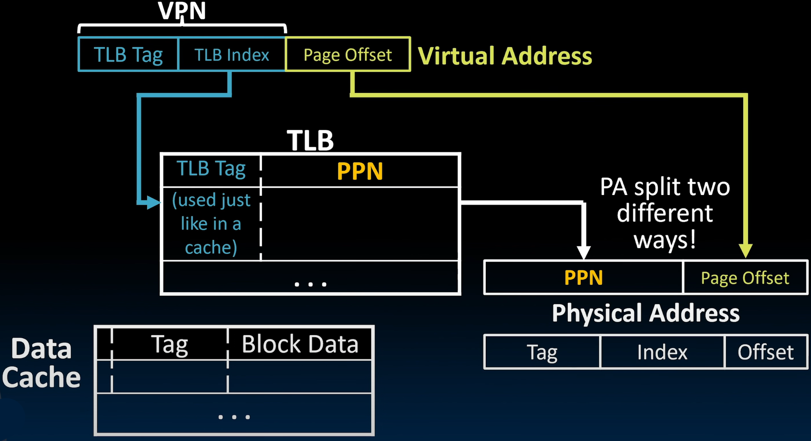
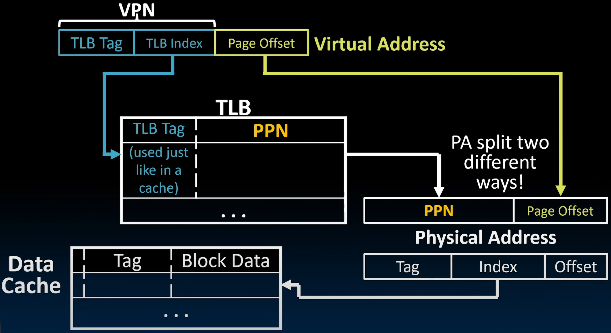

# 30.2-Translation Lookaside Buffers (TLB)


Lecture Video Address


到目前为止，我们已经理解了虚拟内存系统的基本操作原理。

处理器或我们的进程使用虚拟地址，通过使用页表(Page Table, PT)将这些虚拟地址转换为物理地址，但是PT存在于内存当中，读取PT无非加速了Memory reference。

> 如果使用单级PT，那么需要进行两次访存。两级PT需要三次访存，四级PT需要五次访存。访问内存的时间是远大于寄存器的时间的。

因此在本节中，我们需要加速在使用Virtual Memory，也就是page table的情况下的Memory reference

## Address Translation and Protection

首先来看看正常情况下translation的过程（以单级PT为例，page size = 4KiB）

1. Virtual Address被分为(Virtual Page Number, VPN)和offset

2. 根据VPN寻找Page Table中的PTE(Page Table Entry)

3. 然后先进行Protection Check，其实就是检查PTE中的状态位，如果有问题抛出Exception

4. 如果可以操作，那么提取出(Physical Page Number, PPN)，与offset拼接得到Physical Address

    > 其实3,4步是同时进行的，只不过逻辑上有先后。

Every instruction and data access needs address translation and protection checks

所以单级PT得到一个数据需要进行两次访存，第一次访存需要进行Protection Check以及Address translation得到Physical Address

我们希望这个在一周期内完成。

## Translation Lookaside Buffers (TLB)

### Concept

> 这个实际上就是Virtual Address与PTE之间的Cache，只不过这个概念在Cache之前提出，当时是以buffer命名的

Address translation is very expensive!

- In a single-level page table, each reference becomes two memory accesses
- In a two-level page table, each reference becomes three memory accesses

Solution: **Cache** some translations in TLB

结构图如下：

- TLB有一个输入，两个输出（与Cache十分类似）
    - 输入为Virtual Address的VPN
    - 输出为hit和PPN
        - hit，则在1 cycle就可实现翻译
        - miss，则需要根据层次结构重新检索PT获取PPN，然后更新TLB
- TLB的每一个Entry必须继承PTE中的状态位，图中只显示了valid bit和dirty bit
    - valid bit表示buffer中存储的PPN是否是valid的
    - dirty bit表示Memory中的内容和disk中的是否一致，如果不一致，说明Memory中有改动并且未写到disk当中。

> 和其他存储结构层次一样，TLB也是作为PT的copy，所以状态位仍然也要copy

### Design

那么TLB是如何设计的呢？如今

Typically 32-128 entries, usually **fully associative**

> 回顾一下Cache与Memory的映射关系，包含Directly mapped，fully Associative，set-associative

- 因为每个Entry映射一个比较大的Page，所以空间局部性不是很好(即一个Page很少会有附近的Page也被使用)，所以很少会担心conflict，所以使用fully Associative即可
- Sometimes larger TLBs (256-512 entries) are 4-8 way set-associative（这仍然是为了能够在1个cycle内进行转换）
- Larger systems sometimes have multi-level (L1 and L2) TLBs

Random or FIFO replacement policy

> 因为希望在TLB中保留最新的Address translation，所以FIFO是最常见的，但是LRU是比较少的，因为LRU在fully Associative实现起来成本比较高。

"TLB Reach": Size of largest virtual address space that can be **simultaneously** mapped by TLB

> 如果我们有64个TLB entry，并且它们引用的是4KiB pages，那么TLB Reach是多少呢？是的，它是64乘以4，即四分之一MiB。这就是我们可以直接从TLB访问的内存量。

## Implementation

上面已经介绍了TLB是如何工作了，下面介绍TLB是怎么实现的。

### Where Are TLBs Located?

首先应该知道TLB在哪里，也就是在Datapath中TLB的位置。

Which should we check first: Cache or TLB?

- Can cache hold requested data if corresponding page is not in physical memory? **No**
- With TLB first, does cache receive VA or PA? **PA**

因此，TLB应该在Cache之前，流程图如下所示。

Notice that it is now the TLB that does translation, not the Page Table!

> Page Table存在于Main Memory，只有当TLB miss的时候，才会遍历Page Table然后更新TLB。
>
> 遍历Page Table的方式就是先根据CPU中的SPTBR定位到PT的root，然后根据VA翻译得到对应的PA

TLB通常设计得非常高效，命中率非常高。我们在TLB中的命中率通常超过99%，甚至远高于99%。一般的数字是99.9%或99.999%。

> 因此可以考虑一个周期内完成转换。

### Address Translation Using TLB

下面是转换的流程（这里有Index，使用的应该是Set-Associative）

1. Virtual Address中的VPN被切分为Tag和Index，Index指定了TLB的某一行(这里是Set-Associative，应该是某一个Set)

> Tag应该要参与比较

2. TLB输出PPN，然后与Virtual Address的offset拼接，得到Physical Address

3. Physical Address用于从Cache中寻找数据，因此再次根据TIO的结构划分

> VPN是没有Offset的，一个Entry就是一个PPN，Cache和TLB的TIO也是没有任何联系的

4. Physical Address切分之后送到Cache中读取数据

