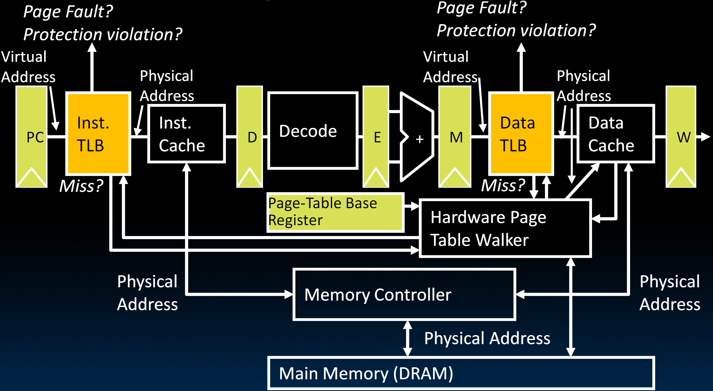

# 30.3-TLBs in Datapath


Lecture Video Address


到目前为止，我们已经了解了虚拟内存系统的工作原理。我们也看到了TLB在加速虚拟地址到物理地址转换中的作用。现在剩下的就是在我们的流水线中实现这一点。

## VM-related Events in Pipeline

### Datapath

下面是五阶段流水线，将TLB插入到对应的位置如下

- TLB位于Cache之前
- TLB也分为Inst TLB和Data TLB
    - PC取址得到的是Virtual Address，经过TLB转换为Physical Address然后传给Inst Cache获取指令
    - ALU计算得到的地址为Virtual Address，经过Data TLB转换得到Physical Address，然后传给Data Cache读取数据

> 这里值得注意的是，将MEM替换为Cache了，一方面，CPU中有Cache而没有MEM(MEM在CPU外面)，另一方面，Cache为CPU提供了一层illusion(或者叫abstraction)，CPU只需要从Cache中读取或者写数据即可。

但是还有一些是TLB应该关注的事情：miss，Page fault，Protection violation

- Handling a TLB miss needs a hardware or software mechanism to refill TLB (Usually done in hardware，并且可以很快的完成)
- Handling a page fault (e.g., page is on disk) needs a precise trap so software handler can easily resume after retrieving page
    - 当发生Page fault的时候，需要停止或者取消当前的lw/sw指令，因为这个Trap会花费很长的时间。
    - 一旦页面可用，那么从相同的指令继续执行
- Protection violation may abort process
    - 有了Protection violation，OS知道后会立即终止当前的进程

将TLB需要注意的事项添加到Datapath中如下：

1. TLB如果miss，那么会请求Hardware Page Table Walker进行地址转换，然后更新回TLB
2. Hardware Page Table Walker是用硬件从Page Table中查询Physical Address，其接受Page-Table Base Register的root，以及TLB提供的Virtual Address，输出Physical Address
3. Cache与Memory Controller交互（这是我们未曾也不会学的部件），它本质上是一块将processor语言转换为DRAM语言的digital Logic，其知道如何与DRAM工作，知道如何刷新它，知道如何发出读写指令，以及如何进行burst操作等。
4. 当在Inst TLB或Data TLB中遇到page fault或protection violation时，需要发出信号。

### Address Translation

下面是地址转换的流程图

> 图中的过程用不同颜色的框表示，橙色表示只能用软件处理，青黄色表示用硬件处理，中间的表示可以用硬件，也可以用软件处理

- Virtual Address先传递到TLB查询，在99.999%的情况下会hit，然后进行Protection Check
- Protection Check会检查一些状态位来判断是否允许执行想要的操作，如果出现了Protection fault，一般由OS在软件中处理（user会看到一个segfault）
- 如果没有Protection fault，则输出Physical Address到Cache
- 如果TLB miss，则会进行Page Table Walk(现在一般都由硬件实现)，如果Physical Address在Memory中(查询某个状态位即可)，那么更新TLB
- 如果不在Memory中，那么发生了Page Fault，由OS加载Page，并在页面从磁盘到来期间做其他事情（例如context Switch）

## Summary: Modern Virtual Memory Systems

现代虚拟内存系统旨在提供一个大容量、私有且统一的存储幻象（或者叫抽象）。

其中有很多机制确保数据总是触手可及，即使真实的数据距离非常远。

> Modern Virtual Memory System的作用之一是实现了abstraction来提供一个又大又快的存储

在此过程中还实现了许多其他功能，如下

- Protection & Privacy: Several users/processes, each with their private address space（通过demand Page来实现）
- Demand Paging: Provides the ability to run programs larger than the primary memory
    - Hides differences in machine configurations（即使拥有不同的硬件，也能运行相同的软件）
- The price is address translation on each memory reference
    - 使用TLB加速这一过程，TLB与缓存的无缝写作，使我们的机器看起来像是无线快且有无穷大的内存

| multiple users                                               | Demand Paging                                                | Address translation                                          |
| ------------------------------------------------------------ | ------------------------------------------------------------ | ------------------------------------------------------------ |
|  |  |  |

## Context Switching

How does a single processor run many programs at once?

Context switch: Changing of internal state of processor (switching between processes)

- Save register values (and PC) and change value in Supervisor Page Table Base register (SPTBR)

What happens to the TLB?

- Current entries are for different process
- Set all entries to invalid on context switch
