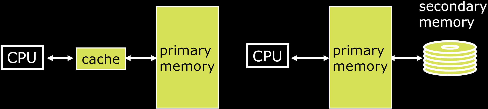

# 30.4-VM Performance


Lecture Video Address


到现在为止，我们已经很好地了解了虚拟内存系统是如何工作以及如何实现。下面将评估其性能。将使用评估缓存性能的相同原则。

## Comparing the Cache and VM(Params)

先比较Cache和VM的一些参数

|              | Cache version                        | Virtual Memory version                          |
| ------------ | ------------------------------------ | ----------------------------------------------- |
| data unit    | Block or Line                        | Page                                            |
|              | Miss                                 | Page Fault                                      |
| data size    | Block Size: 32-64B(8 words)          | Page Size: 4K-8KiB(2KiB和16KiB都由，一般是4KiB) |
| placement    | Direct Mapped, N-way Set Associative | Fully Associative                               |
| Replacement  | LRU or Random                        | Least Recently Used (LRU), FIFO, random         |
| write policy | Write Through or Back                | Write Back                                      |

有了这些参数，就可以评估性能了。

## VM Performance

Virtual Memory is the level of the memory hierarchy that sits below main memory

- TLB comes before cache, but affects transfer of data from disk to main memory
- Previously we assumed main memory was lowest level, now we just have to account for disk accesses

> TLB实现的是将Virtual Address转换为Physical Address，尽管TLB在Cache之前，但是其本质是将memory扩展到disk(即影响着磁盘到Main memory的数据传输)，并且为CPU提供了更大更快的内存，所以在存储结构层次中位于Physical memory下面
>
> 

Same CPI, AMAT equations apply, but now treat main memory like a mid-level cache

因此，和Cache一样，我们将经历L1缓存的命中/未命中推测，然后计算，然后是L2缓存的命中和未命中，然后我们会命中DRAM或者未命中，最终到达磁盘。

## Typical Performance Stats

以下是我们关心的一些参数。

| Caching                     | Demand paging            |
| --------------------------- | ------------------------ |
| cache entry                 | page frame               |
| cache block (≈32-64 bytes)  | page (≈4Ki bytes)        |
| cache miss rate (1% to 20%) | page miss rate (<0.001%) |
| cache hit (≈1 cycle)        | page hit (≈100 cycles)   |
| cache miss (≈100 cycles)    | page miss (≈5M cycles)   |

## AMAT

> ATAM(Average memory Access Time)，指的是访问Memory的平均时间，Virtual Memory和Cache都在在CPU与Memory起作用，因此计算AMAT二者都需要考虑

Memory Parameters:

- L1 cache hit = 1 clock cycles, hit 95% of accesses
- L2 cache hit = 10 clock cycles, hit 60% of L1 misses
- DRAM = 200 clock cycles (≈100 nanoseconds)
- Disk = 20,000,000 clock cycles (≈10 milliseconds)

由下来计算

1. Average Memory Access Time (no paging): `1 + 5%×10 + 5%×40%×200 = 5.5 clock cycles `

2. Average Memory Access Time (with paging): `5.5 (AMAT with no paging) + ?`

    > 经历Cache的时间与VM的时间是独立的

3. Average Memory Access Time (with paging) = `5.5 + 5%×40%× (1-HRMem)×20,000,000`

    > 5%是L1 Cache的miss rate，40%是L2 miss rate, HR~Mem~是Hit Rate，也就是Page在Memory中的几率，1-HR~Mem~就是要从内存中读取的几率
    >
    > 5%×40%× (1-HR~Mem~)×20,000,000就是如果L2 Cache也没有，并且要从硬盘中读取的时间

所以HR~Mem~是具有决定性的

AMAT if HRMem = 99%?

| HR~Mem~(Hit Rate Memory) | ATAM                                               | supplyment                                                   |
| ------------------------ | -------------------------------------------------- | ------------------------------------------------------------ |
| 99%                      | 5.5 + 0.02×0.01×20,000,000 = 4005.5 (≈728x slower) | 1 in 20,000 memory accesses goes to disk: 10 sec program takes 2 hours! |
| 99.9%                    | 5.5 + 0.02×0.001×20,000,000 = 405.5                |                                                              |
| 99.9999%                 | 5.5 + 0.02×0.000001×20,000,000 = 5.9               |                                                              |

可以看到，HR~Mem~提升几个百分点，就会大大减少ATAM(这也是由于读取disk的时间太多了)
