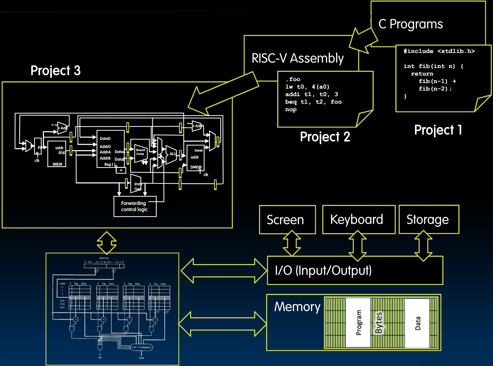
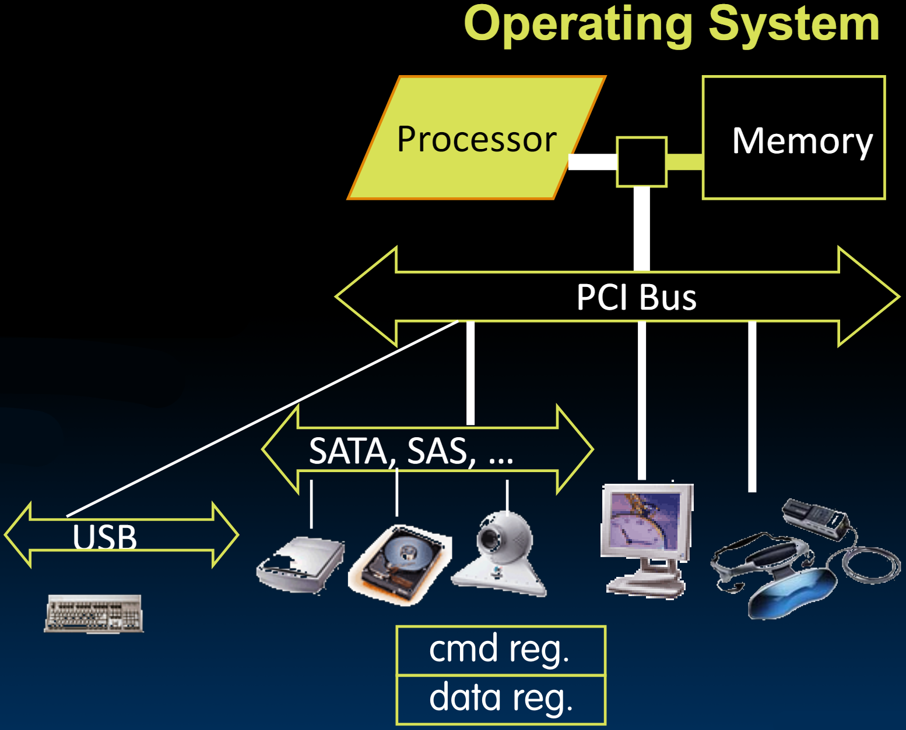
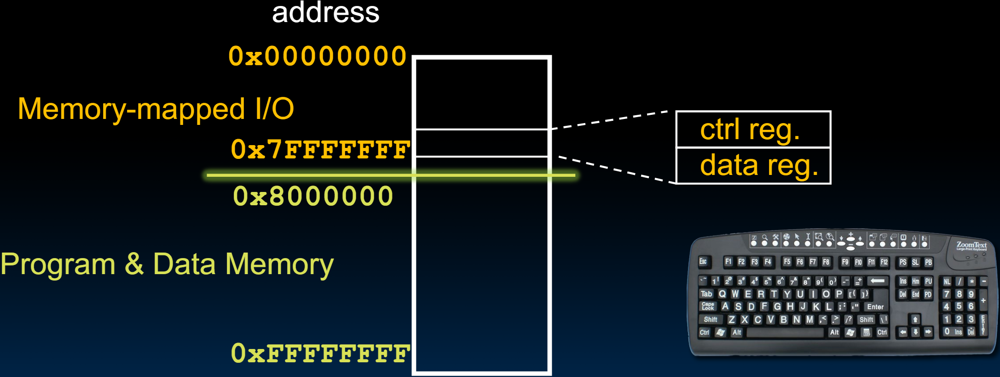

# 31.1-I/O Devices


Lecture Video Address


到目前为止，我们已经大致搞清楚了虚拟内存是如何工作的。

为了完成计算系统，我们需要添加I/O设备。

## Adding I/O

到目前为止，我们几乎已经构建了一台计算机，从HLL(C语言)，到RISC-V Assembly language，到RISC-V machine Code，再到Datapath(基本可以执行project2的程序，除了e-calls，因为学这个指令没啥教育上的意义，只是增加了负担)，然后又添加了Cache和VM。

接下来，我们所需要的就是添加I/O设备，这样我们就可以连接键盘和鼠标，并在屏幕上显示内容，或许还可以连接到网络。

关键是，要了解这些I/O设备连接的原则，这样我们就不必每次都使用一些特殊的程序来一个一个地连接。

## How to Interact with Devices?

Assume a program running on a CPU. How does it interact with the outside world（比如打印内容到屏幕上，或者接受来自键盘的输入）

需要为键盘、网络、鼠标、显示器等设备提供一个I/O接口。

- 通常会有大量的设备，它们会有不同的需求或数据呈现和接收的方式。

- 希望以一种统一的方式来实现接口，这样就不必为每个设备单独处理。

- 外设通常通过某种层次结构的总线连接起来。

    > 可以将这些总线视为高速公路，很多数据以相对较高的速率在上面移动，然后有些东西通过出口连接到这条高速公路上。本课程不会深入设计总线的细节，只需要将它们视为连接到处理器内存系统的抽象物体即可。

- 这些设备与外界通信的方式通常是通过**标准化的接口**，这些接口由命令(比如打印一些东西)和状态寄存器以及数据寄存器(包含实际打印的东西)组成。

- 通常，操作系统会检查设备是否准备好与我们通信，然后协调底层进程如何访问这些设备。

> 每个外设提供的标准化接口都有`cmd reg`和`data reg`

如何通过我们的ISA支持这种类型的I/O接口呢？

## Instruction Set Architecture for I/O

如何让原有的ISA能够实现I/O呢？

What must the processor do for I/O?

- Input: Read a sequence of bytes
- Output: Write a sequence of bytes

> 这些sequence可能是命令，也可能是数据。

如下有两种方式

Interface options

1. 设计专门的输入/输出指令和匹配的硬件来与每种设备通信。
    - 这在过去的几十年是比较流行的
    - 缺点：设备会发生变化，每隔几年就会有新的标准和接口。而旧的设备会过时被废弃。但ISA却必须支持很多年。

2. Memory mapped I/O(内存映射I/O)
    - 一部分内存地址(通常是低地址)是专门用于到I/O的，准确的说是映射到I/O的寄存器。这块地址对于程序来说是不可见的，由OS管理。
    - 程序可以使用`lw`/`sw`来访问这些设备，或者使用`syscall`来访问，这也是RISC-V的实现方式

### Memory mapped I/O

如下图

- Certain addresses are not 'regular memory'
- Instead, they correspond to registers in I/O devices

- 0x00000000 ~ 0x7FFFFFFF用于外设，这块内容将复制到外设的`ctrl reg`和`data reg`当中
- 数据内存中的程序将从地址8000000开始，一直到内存的顶端。

每个I/O设备都将在内存映射I/O区域中有一份其寄存器的副本。

> 这个映射并不是逻辑上的虚拟映射，而是真正将一部分物理上的内存空间留给I/O

## Processor-I/O Speed Mismatch

1 GHz microprocessor I/O throughput: 4 GiB/s (`lw`/`sw`)

但是很多设备都达不到这个速度。

- Typical I/O data rates:

| I/O device                | data rates      |
| ------------------------- | --------------- |
| keyboard                  | 10 B/s          |
| bluetooth 3.0             | 3 MiB/s         |
| USB 2/3.1                 | 0.06-1.25 GiB/s |
| Wifi, depends on standard | 7-250 MiB/s     |
| G-bit Ethernet            | 125 MiB/s       |
| SATA3 HDD                 | 480MiB/s        |
| cutting edge SSD          | 560 MiB/s       |
| Thunderbolt 3             | 5GiB/s          |
| High-end DDR4 DRAM        | 32 GiB/s        |
| HBM2 DRAM                 | 64 GiB/s        |

> These are peak rates – actual throughput is lower

- 可以看到，知道Thunderbolt3开始，才能和processor的速度达到一个数量级（前面的都少一个数量级）
- 最后几个超过processor读写速度的设备是为了支持高端处理器和多核处理器设计的（每个core可能都希望将数据加载或存储到内存中）

Common I/O devices neither deliver nor accept data matching processor speed

因此必须来调整这一点
