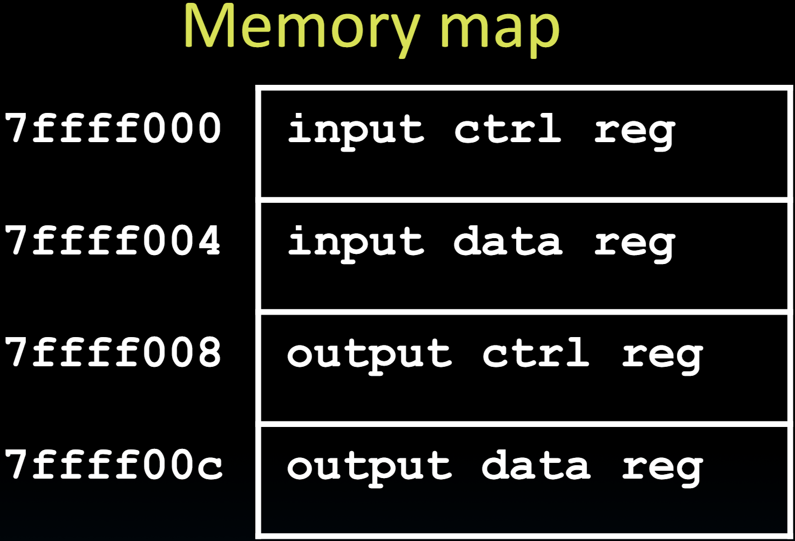

# 31.2-I/O Polling


Lecture Video Address


> Polling(轮询)

上节课讲到，各种设备通常以非常不同的数据速率工作。有些设备非常慢，而有些设备可能会生成大量数据，处理器需要跟上这些数据。

## Polling: Processor Checks Status, Then Acts

processor与设备交互的方式是访问其`Memory mapped Register`

Device registers generally serve two functions:

* `Control Register`, says it's OK to read/write (I/O ready) \[think of a flagman on a road]
* `Data Register`, contains data

Processor reads from Control Register `in loop`

* Waiting for device to set Ready bit in Control reg (0 → 1) (`Control Register`是由device设置的，只有1bit)
* Indicates "`data available`" or "`ready to accept data`"

Processor then loads from (input) or writes to (output) data register

* I/O device resets control register bit (1 → 0)

Procedure called "Polling"

> 不论是Control Register还是Datapath Register，Processor读或者写的方式就和读写内存一样。

## I/O Example (Polling)

下面是一个轮询代码的例子

如下是Memory mapped Register



Input: Read from keyboard into a0

```assembly
lui t0, 0x7ffff #7ffff000 (io addr) 
Waitloop: lw t1, 0(t0) #read control
andi t1 t1 0x1 #ready bit 
beq t1 zero Waitloop
lw a0 4(t0) #data 
```

* `lui`: load upper immediate, `lui t0, 0x7ffff`之后，t0的内容为`7ffff000`，也就是`input ctrl reg`的位置
* 下面进入一个循环
  * `lw t1, 0(t0)`读取`input ctrl reg`中的word
  * `andi t1 t1 0x1`按位与，只保留`t1`的LSB
  * `beq t1 zero Waitloop`
* 也就是不断读取`input ctrl reg`，判断其LSB是否为1，如果为0，就一直读取

Output: Write to display from a1

```assembly
lui t0 0x7ffff #7ffff000
Waitloop: lw t1 8(t0) #write control
andi t1 t1 0x1 #ready bit
beq t1 zero Waitloop
sw a1 12(t0) #data
```

* output的过程与input的一致

> disc11中最后一题有相关的训练，手写RISC-V来接受或者输出数据

## Cost of Polling?

Assume for a processor with

* 1 GHz clock rate
* Taking 400 clock cycles for **a polling operation**
  * Call polling routine
  * Check device (e.g., keyboard or WiFi input available)
  * Return

> 一次轮询操作需要调用一个轮询例程，检查设备（无论是键盘还是Wi-Fi）是否准备好发送或接收数据，然后返回，这需要400个时钟周期。

* What's the percentage of processor time spent polling?

### % Processor Time to Poll Mouse

下面用Mouse做一个例子

* Mouse
* Poll 30 times per second(每秒轮询30次)
  * Set by requirement not to miss any mouse motion (which would lead to choppy motion of the cursor on the screen)，也就是防止屏幕上的抖动

> 也就是不同的设备需要轮询的次数不同？

*   Mouse Polling \[clocks/sec] = 30 \[polls/s] \* 400 \[clocks/poll] = 12K \[clocks/s]

    > 也就是每秒需要12K个周期来轮询Mouse
* % Processor for polling: 12,000 \[clocks/s] / 1\*10^9^ \[clocks/s] = 0.0012%

结论：Polling mouse little impact on processor...

如果你轮询所有设备并且不知道何时停止轮询鼠标，这就不实用了。

### % Processor Time to Poll Hard Disk

下面以轮询磁盘为例。假设这个磁盘速度适中，可以产生每秒16兆比特的数据，并且我们**每次轮询需要16字节**。

Frequency of Polling Disk (rate at which chunks come could off disk)= 16 \[MB/s] / 16 \[B/poll] = 1M \[polls/s]

> 每次轮询读取的数据是有限的，每秒要进行1M次轮询

Disk Polling, Clocks/sec = 1M \[polls/s] \* 400 \[clocks/poll] = 400M \[clocks/s]

> 也就是每s需要400M个时钟周期

% Processor for polling:

* 400\*10^6 ^\[clocks/s] / 1\*10^9^ \[clocks/s] = 40%

这个比例会使处理器除了轮询外什么都做不了。

同时，轮询产生大量数据的大块磁盘，以接收小块数据并不太有意义。因此，每次轮询获取16字节可能不是最好的方法。

***

综上，鼠标这样产生小数据的设备使用轮询勉强可以接受，需要提出一种更好的方法来处理这些可以产生大量数据的设备
