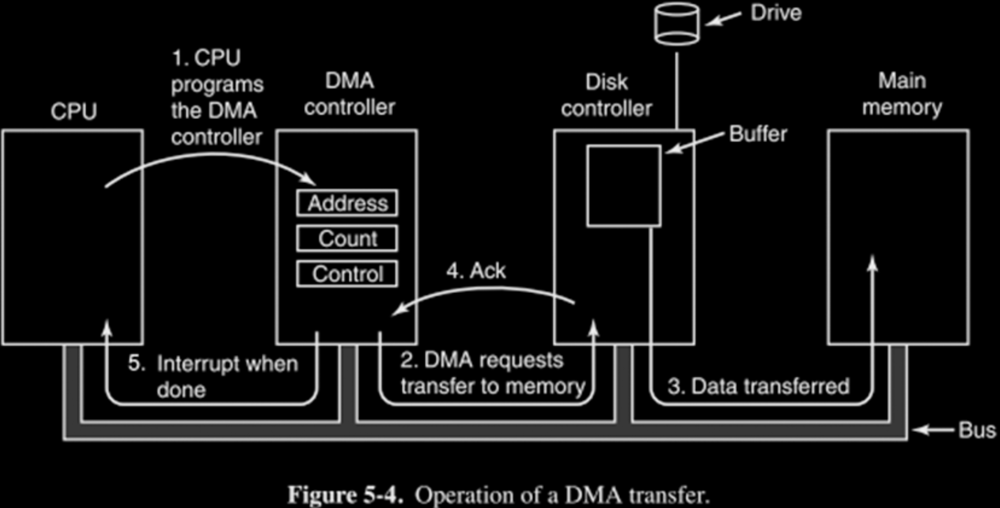

# 31.4-DMA


Lecture Video Address


到目前为止，我们已经看到了两种与输入输出设备交互的机制：轮询和中断。

中断被用于那些不生成大量数据且不消耗大量数据的设备。而那些消耗大量数据的设备，通常现在是基于直接内存访问（DMA）的。

## Direct Memory Access (DMA)

到目前为止，只有processor能够控制数据传输到Main Memory。

为了减少processor的负担，使其不需要花费大量时间处理这些Load和Store操作，需要设计一种新的设备，它将帮助处理器将大块数据移动到主内存并从主内存中移动数据。

- Allows I/O devices to directly read/write main memory
- New hardware: The DMA Engine
- DMA Engine可能存在于与processor相同的芯片上，但它将在CPU的监督下控制内存通道。
- DMA Engine会独立工作。

以下是DMA Engine的组成

DMA engine contains `registers` written by CPU（可能使用Memory Map的方式写）:

- Memory address to place data
- \# of bytes
- I/O device #, direction of transfer
- unit of transfer, amount to transfer per burst

## DMA Illustration Example

为了说明DMA是如何工作的，这里有一张教科书中的图片（以disk为例）

1. CPU 负责启动传输（无论是传输到内存还是从内存传输）。它将Address、Count和Control bit写入 DMA 控制器。
2. DMA 将请求从设备向内存传输数据。通常有大量数据需要移动的是磁盘或可能控制多个磁盘的磁盘控制器(Disk Controller)。现代磁盘通常有缓冲区，并且可以提前读取并缓冲一些数据量。因此，DMA 引擎基本上会告诉它将其缓冲区的内容传输到由 CPU 指定的内存中的特定位置。
3. Disk Controller接受到信号之后将Buffer中的数据传输到Memory
4. 当传输完成时，该控制器会向 DMA 引擎发送确认(Ack)
5. DMA 引擎将中断 CPU，告知它传输已完成，文件已移动。

在整个过程中，CPU 只被中断两次。

1. 第一次是开始传输。当有数据要传输的时候CPU被中断然后向DMA Engine发送信号
2. 当数据传输完成后，再次中断 CPU，通知文件传输已完成。

在传输过程中，CPU可以做其他事情。

> DMA也体现了并行的思想，当CPU在等待内存与设备之间的输入与输出的时候，可以进行其他操作。

## Steps

下面总结一下，在输入数据或者输出数据时候的步骤

### Incoming Data

1. Receive interrupt from device
2. CPU takes interrupt, initiates transfer
    - Instructs DMA engine/device to place data @ certain address
3. Device/DMA engine handle the transfer
    - CPU is free to execute other things
4. Upon completion, Device/DMA engine interrupt the CPU again

> 在输入的时候，第一次Interrupt是device发出的，device准备好输入的数据之后向CPU发送Interrupt

### Outgoing Data

1. CPU decides to initiate transfer, confirms that external device is ready
    - 通过读取设备的控制寄存器
2. CPU begins transfer
    - Instructs DMA engine/device that data is available @ certain address
3. Device/DMA engine handle the transfer
    - CPU is free to execute other things
4. Device/DMA engine interrupt the CPU again to signal completion

---

在 90 年代，使用programme I/O ，例如 88 磁盘。在 2000 年代，DMA 已取代了它，如今的大多数磁盘，或所有磁盘，都支持 DMA 传输。

## DMA: hierarchy?

这些与processor共享芯片区域的 DMA Engine，我们可以自由选择将它们插入的位置。那么我们想把 DMA 控制器放在内存层次结构的哪个位置呢？

Two extremes:

- Between L1$ and CPU:
    - Pro: Free coherency(一致性)
    
        > 处理器内存系统、缓存系统将处理一致性。
    
    - Con: Trash the CPU's working set with transferred data
    
        > 每次启动 DMA 传输时，我们都会用传输数据破坏 CPU 的工作集，也就是Cache
    
- Between Last-level cache and main memory:
    - Pro: Don't mess with caches
    - Con: Need to explicitly manage coherency

第二种是常用的方法，DMA 必须以某种方式与一致性引擎合作以支持它。
