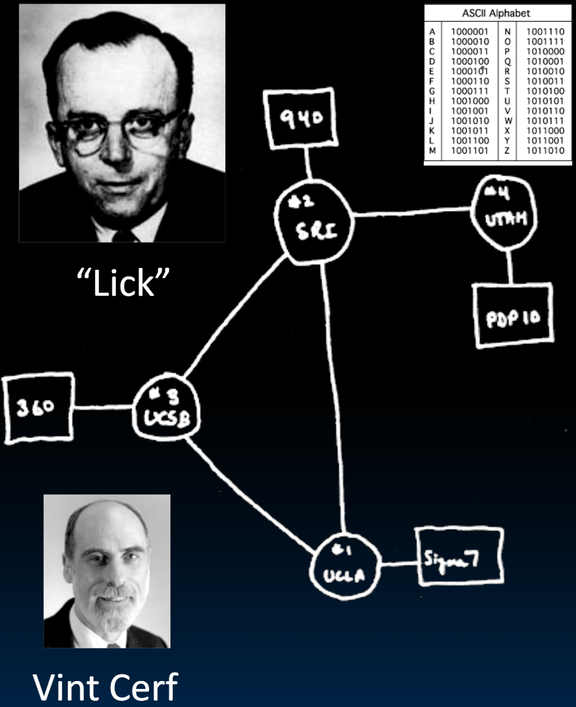

# 31.5-Networking


Lecture Video Address


到目前为止，我们讨论的设备通常是处理一台机器内的设备，如磁盘、键盘、鼠标、显示器等等。本节课会通过网络连接我们的计算机与其他计算机。

不论是网络还是其他IO设备，都是基于相同的原理。

下面先回顾一下网络相关的工作。

## Purposes

下面是计算机网络目的变化

|      | idea                                             | e.g.                   | desc                                                   |
| ---- | ------------------------------------------------ | ---------------------- | ------------------------------------------------------ |
| 1    | Originally sharing I/O devices between computers | printers               | printer仅仅是一个设备                                  |
| 2    | Then communicating between computers             | file transfer protocol | 计算机可以传输文件                                     |
| 3    | Then communicating between people                | e-mail                 | 人与人可以彼此通信（这与简单的文件传输不同）           |
| 4    | Then communicating between networks of computers | file sharing, www, …   | 计算机连成了一个网络，每个计算机都可以访问网络内的内容 |

## History

### The Internet (1962)

| year | development                                                  |
| ---- | ------------------------------------------------------------ |
| 1963 | JCR Licklider, while at DoD's ARPA, writes a memo describing desire to connect the computers at various research universities: Stanford, Berkeley, UCLA, ... |
| 1969 | ARPA(国防部) deploys 4 "nodes" @ UCLA, SRI, Utah, & UCSB     |
| 1973 | Robert Kahn & Vint Cerf invent TCP, now part of the Internet Protocol Suite |

从那时到现在，互联网一直在指数级增长，并将继续在可预见的未来增长。

### The World Wide Web (1989)

上面仅仅说明了通过网络连接计算机。

"System of interlinked hypertext documents on the Internet"

| year  | development                                                  |
| ----- | ------------------------------------------------------------ |
| 1945  | Vannevar Bush describes hypertext system called "memex" in article |
| 1989  | Sir Tim Berners-Lee proposed and implemented the first successful communication between a Hypertext Transfer Protocol (HTTP) client and server using the internet. |
| ~2000 | Dot-com entrepreneurs rushed in, 2001 bubble burst           |

Today : Access anywhere!

## Software Protocol to Send and Receive

下面是这个协议的简要步骤，分为发送和接受。

### Send steps

SW Send steps

1. Application copies data to OS buffer
2. OS calculates checksum, starts timer
3. OS sends data to network interface HW and says start

> 用中文来描述：
>
> 1. 发送时以数据包为单位发送。这些数据包由软件生成。软件应用程序会将数据复制到操作系统的缓冲区。
> 2. 操作系统会计算某种校验和，防止在传输过程中出现错误（因为数据在远距离或长途传输时，一些位可能会损坏）并启动计时器。
> 3. 然后OS将数据发送到网络接口（一个硬件网络接口）并告诉其开始传输。

### package

数据的打包格式如下：

数据包有其目的地地址、源地址、长度（因为有些数据包可能是可变长度的），以及一些确认信息和负载，这可能是注释、地址或数据。最后，它有一个以校验和形式存在的尾部。

### Receive steps

SW Receive steps

1. If OK, OS copies data to user address space, & signals application to continue
2. OS calculates checksum, if OK, send ACK; if not, delete message (sender resends when timer expires)
3. OS copies data from network interface HW to OS buffer

> 用中文来描述：
>
> 1. 在接收端，数据会出现在另一个网络接口上，这是一个特殊的卡，并将数据传输到操作系统缓冲区。
> 2. 操作系统会检查校验和是否正确。如果匹配，如果没有问题，它会将确认信息发送回发送方。如果不正确，它将删除该消息，发送方将重新发送该消息。如果在计时器到期后未收到确认信息，发送方也会重新发送该消息。
> 3. 如果一切正常，消息已被接收，操作系统将其复制到用户空间并通知其应用程序继续。

## What do we need?

要实现上面的过程，需要什么呢？

Traditionally, a Network Interface Card (NIC)，即通过网卡实现的，如下是服务器中的网卡，但在笔记本中，已经缩小到仅仅是板上的一个芯片，

- Wired or wireless
- 在一些较老的卡中，这是通过使用programme I/O来完成的。在较新的卡中，是通过DMA（直接内存访问）来完成的。

DMA是一种机制，用于将要通过互联网进行长途传输的数据从主内存中转移。同样，当数据到达目的地时，其网络接口卡将使用DMA将其传回内存。

## Module conclusion

We have figured out how computers work!

- And figured out how the OS works and how to interact with it

We have built a virtual memory system

- And have developed understanding of physical memory, storage devices

And we can attach peripherals for I/O!
