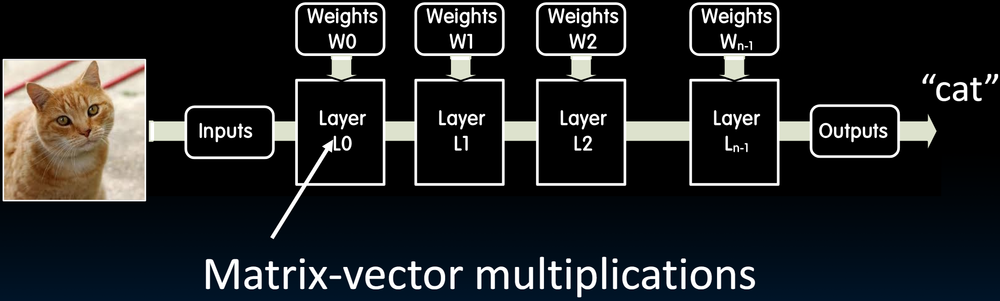

# 32.1-Data Parallelism


Lecture Video Address


从本模块开始，我们讨论并行性，旨在构建更好的计算机并加快应用程序的运行速度。

我们已经学习了一些软件技术，这些技术有助于我们实现这一目标，但我们大部分时间都在努力构建更好的计算机，并理解构建这些更好计算机的原理。其中一个原理是使用并行性，而我们已经遇到了并行性。

我们已经学习过利用多道程序设计(multiprogramming)来提升处理器的利用率：

- 在DMA技术中，在等待数据从DRAM中传输过来的时候，processor可以执行其他任务。
- 在Pipeline中，通过同时处理多个指令来提高性能。

流水线也是人们在20世纪90年代到21世纪初期尝试提高处理器性能的主要方式，当时人们不断构建越来越深的流水线，并同时提高时钟频率。结果是每一代处理器的功耗不断上升，这是不可持续的。为了保持在合理的功耗范围内，人们探索了使用**并行性**的方向。

> 流水线是指令级别的并行性。

## New-School Machine Structures

本节开始研究如何处理并行数据。

例如处理某种向量，如果我们有多个能够同时进行进行加法的单元，就可以并行进行向量加法。

## Application

### Machine Learning

很多地方需要数据并行性，机器学习推理(Inference in machine)就是其中之一

Inference in machine learning applications 

如今，机器学习推理是最主要的任务之一。在机器学习推理中，通常要对某张图片进行分类。

例如，从一张猫的图片开始，并希望能够判断这是猫而不是狗。通过多个分类层来实现这一点，这些层在本质上是并行的。它们可能是卷积、矩阵到向量的乘法或矩阵到矩阵的乘法。经过一系列这些分类步骤后，可以确定这是猫而不是狗。同样，如果我们将狗的图片输入到我们的神经网络中，它会告诉我们这是狗。如果我们输入手写的数字，它将能够告诉我们那个数字是8还是9。

在这里，**不仅每一层内部有并行性，而且我们还可以同时处理多个层次**。我们已经介绍了矩阵乘法。

> 每一层内部的标量计算有并行性，不同层的计算也有并行性。

### Reference Problem: Matrix Multiplication

> Reference Problem(参考问题)

Matrix multiplication

- 矩阵乘法不仅在神经网络中常见，其也是我们在工程(enginee)、数据科学(data science)和许多其他应用领域中最常遇到的操作之一，
- Image filtering(图像过滤), noise reduction(模糊处理), machine learning…
- Many closely related operations

矩阵乘法不是现在才有的，其很早就被编程语言所支持。例如有一种`Fortran`语言，有一个指令叫做`dgemm`，其执行双精度浮点矩阵乘法指令

> dgemm(double-precision floating-point matrix multiplication)

## Matrix Multiplication

下面回顾一下矩阵乘法相关的知识。

### Matrices

Square matrix of dimension NxN

我们不能将这个矩阵作为一个方阵存储在内存或磁盘中，而是顺序存储的。一般有两种选择，按行还是按列顺序存储。

通常，它是**按列序列化**的，在这种情况下，矩阵中的第一个元素A(0,0)之后是该列的第二个元素A(1,0)，然后我们会依次存储到A(N-1,0)。

> 尽管在访问的时候总是按照`A[0][0]`, `A\[0]\[1]`的顺序，但是实际上存储到时候`A[0][0]`下一个是`A[1][0]`

### Matrix Multiplication

下面是两个矩阵相乘的例子。本质上是执行迭代过程

A * B，A的一行与B的一列对应位相乘。计算结果矩阵Cij的元素和成对的乘积A~ik~和B~kj~的和。

> 基本上意味着矩阵A的列数必须与矩阵B的行数相同

所有元素A~ik~和B~kj~的乘法可以同时进行，然后将它们相加。
