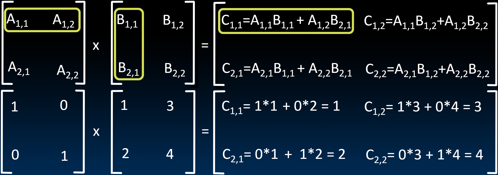

# 32.2-Baseline & C vs. Python


Lecture Video Address


在我们介绍实际实现并行操作的方式之前，让先试着建立一个基准。这个基准将使用之前学过的编程技术来建立，后续的并行方式都会在这个基准上进行评估。

## Matrix Multiply

下面是矩阵乘法的计算方式。

$$
C_{i,j} = (A \times B)_{i,j} = \sum_{k=1}^2A_{i,j}\times B_{k,j}
$$


这实际上是一个三重循环，下面用编程语言来实现。

## program implementation

> 由于matrix在矩阵中也是顺序存储，因此代码中也使用一维数组来表示矩阵，使用N来表述矩阵的行与列数

### Python

Matrix multiplication in Python

```python
def dgemm(N, a, b, c):
    for i in range(N):
        for j in range(N):
            c[i + j * N] = 0 # cij
            for k in range(N):
                c[i + j * N] += a[i + k * N] * b[k + j * N]
```

> 这里用一维数组来表示矩阵，行列数为N，则`a[i][j] = a[i + j * N]`（本节中按列序列化）

这个循环的所需时间如下。可以发现结果与矩阵的大小几乎无关。

| N    | python[MFLOPs] |
| ---- | -------------- |
| 32   | 5.4            |
| 160  | 5.4            |
| 480  | 5.4            |
| 960  | 5.3            |

- 不论矩阵多大，最终的结果都是5.4 megaflops
- 1 MFLOP = 1 Million floatingpoint operations per second (fadd, fmul)

> MFLOPs代表每秒百万次浮点运算，是衡量计算吞吐量速度的指标，越大表示执行浮点运算的次数越多。FLOP表示floating point operation

- 这个循环中，有两种运算，`a[i + k * N] * b[k + j * N]`的乘法和`c[i + j * N] +=`的加法，每个加法和每个乘法将是两个独立的浮点运算。因此每次循环都执行两个浮点数操作。

- 最终得到，dgemm(N …) takes 2*N^3^ FLOPs

    > 也就是总共进行2*N^3^次浮点运算

### C

```c
void dgemm_scalar(int N, double *a, double *b, double *c) {
    for (int i = 0; i < N; i++)
        for (int j = 0; j < N; j++) {
            double cij = 0;
            for (int k = 0; k < N; k++)
                // a[i][k] * b[k][j]
                cij += a[i + k * N] * b[k + j * N];
            // c[i][j]
            c[i + j * N] = cij;
        }
}
```

> 这里用`double *`表示一维矩阵的类型

可以用如下的方式来测试时间。

```c
#include<stdio.h>
#include<stdlib.h>
#include<time.h>

int main(void) {
    // start time
    // Note: clock() measures execution time, not real time big difference in shared computer environments and with heavy system load
    clock_t start = clock();

    // task to time goes here:
    // dgemm(N, ...);

    // "stop" the timer
    clock_t end = clock();

    // compute execution time in second
    double delta_time = (double)(end - start) / CLOCKS_PER_SEC;
}
```

## C vs. Python

C的执行结果如下， 与Python进行对比

| N    | C[GFLOPS] | Python[GFLOPS] |
| ---- | --------- | -------------- |
| 32   | 1.30      | 0.0054         |
| 160  | 1.30      | 0.0055         |
| 480  | 1.32      | 0.0054         |
| 960  | 0.91      | 0.0053         |

> 这里的prefix已经不是mega了，而是giga，因为C的单位太大了

C比Python快了240倍

> 由此可见C语言的执行效率是相当高的，也可见61C这门课是多门重要

- 与Python相同，当N小于一定数值的时候，执行次数与N的大小是无关的
- 但是当N超过一定数值之后，执行次数减小了，很可能与缓存大小有关，这些矩阵中的一些可能无法装入缓存中。

此处的差距仅仅是因为Python是解释性语言，C是编译型语言导致的效率差异，下一节开头会介绍。
