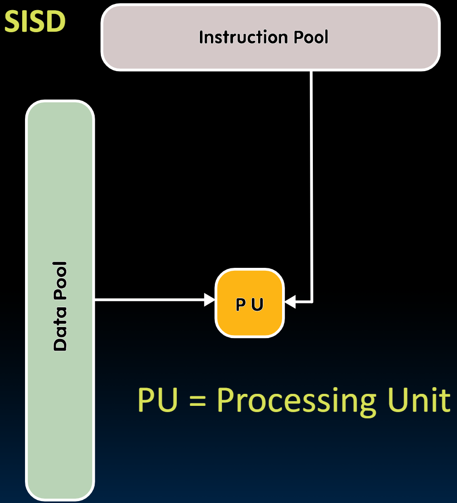
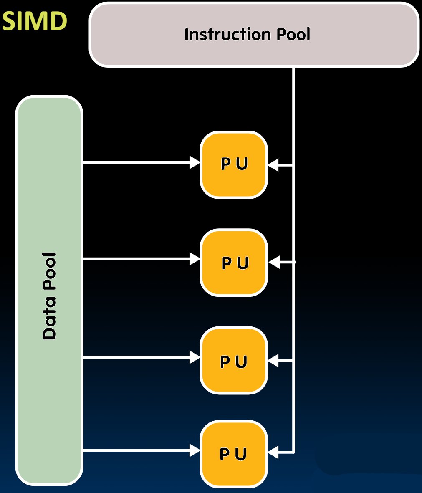
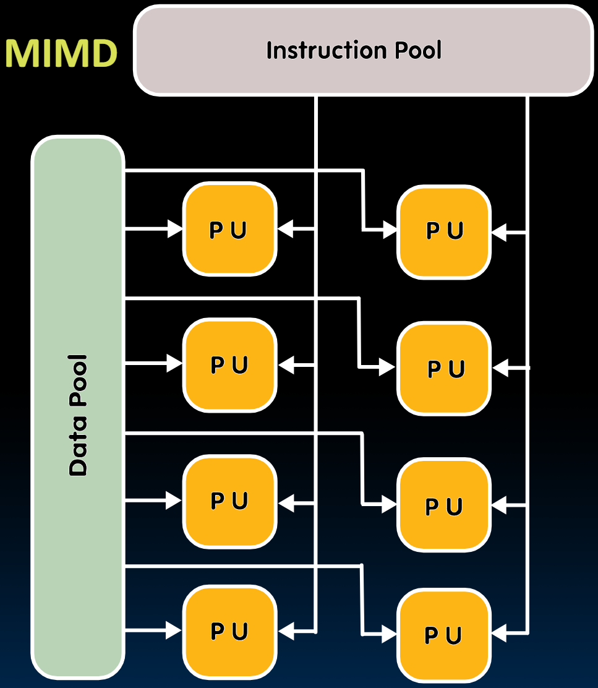
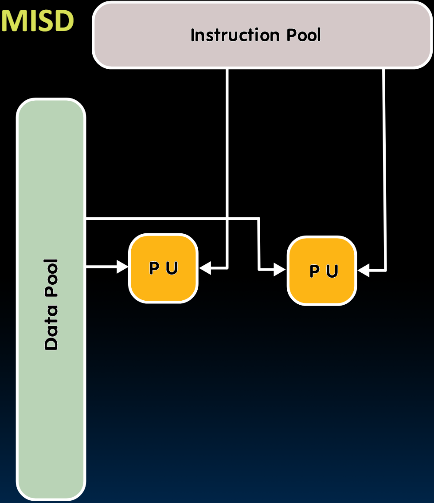

# 32.3-Flynn's Taxonomy


Lecture Video Address


> Flynn's Taxonomy(弗林分类)

## Analysis C vs. Python

上一节，我们比较了用Python和C编写的矩阵乘法的吞吐量，发现C显著快于Python。这是因为Python是一种生产力语言(productivity language)，而且是解释型的，因此在Python中编写代码更容易，但性能有所牺牲。

> "解释型"意味着它不是直接编译的，在执行每一条指令时都有一些**额外的**汇编指令要执行。

另一方面，C是编译型的，直接编译成汇编，因此效率更高。

> 也就是说，上一节中C比Python更高效的原因是因为C是编译型语言，直接翻译成汇编才会更高效。

### How to speed up

1. 能否在处理器上编写更高效的顺序C代码，比如我们到目前为止所研究的串行处理器？也许可以，我们可以编写汇编代码来提高性能。但总体来说，现代编译器已经相当出色了，要超过它们并不容易。

> 但这仍然是在串行的层面来完成

2. 另一种提高速度的方法是通过解决当处理较大矩阵时遇到的性能下降问题（例如在上节的结果中，N = 960的时候C语言的吞吐量下降）。可以通过在C或汇编中使用分块技术(blocking techniques)来解决这个问题。在本模块稍后会看到这些技术。

3. 还有一种方式，就是通过使用并行性来加快速度。并行性的一个目标是通过硬件来同时进行多次乘法，从而并发地执行矩阵乘法的整个或大部分内循环。

---

在深入讨论之前，让我们先看看我们可能遇到的不同类型的并行硬件。

## Software vs. Hardware Parallelism

|                          | Software(Sequential, 顺序)                                   | Software(Concurrent, 并发)                                   |
| ------------------------ | ------------------------------------------------------------ | ------------------------------------------------------------ |
| Hardware(Serial, 串行)   | Matrix Multiply written in MatLab running on an Inter Pentium 4 | Windows Vista Operating System running on an Inter Pentium 4 |
| Hardware(Parallel, 并行) | Matrix Multiply written in MatLab running on an Inter Core i7 | Windows Vista Operating System running an Intel Core i7      |

解释上表：

- Hardware
    - Pentium 4是严格串行的处理器（如同我们之前学的处理器）
    - Inter Core i7是可以并行的处理器
- Software
    - Matrix Multiply是上节课写的baseline，其是顺序的
    - Windows Vista是很古老的操作系统，其采用multiprogramming来运行多个进程，看起来是并发的，即使是在串行硬件上运行。

得出结论：

Choice of hardware and software parallelism are independent

- Concurrent software can also run on serial hardware
- Sequential software can also run on parallel hardware

---

接下来讨论的是`Flynn's Taxonomy`，这种分类法是针对于parallel Hardware的分类。

## Flynn's Taxonomy

这个分类法以斯坦福大学的名誉教授Michael Flynn命名。他将数据流和指令流中的不同类型的并行性进行了分类。

表有四个条目，分别对应单指令单数据（SISD）、单指令多数据（SIMD）、多指令单数据（MISD）和多指令多数据（MIMD）。

|                               | Data Stream(Single)     | Data Stream(Multiple)              |
| ----------------------------- | ----------------------- | ---------------------------------- |
| Instruction Streams(Single)   | SISD: Intel Pentium 4   | SIMD: SSE instructions of x86      |
| Instruction Streams(Multiple) | MISD: No examples today | MIMD: Intel Xeon e5345(Clovertown) |

> 注意，SISD，SIMD，MIMD都是硬件的类型

到目前为止，我们遇到的一切都是SISD，这是单核顺序处理器的工作方式。在本模块中讨论的大部分内容是SIMD和MIMD架构。（MISD目前还没有例子）

SIMD and MIMD most commonly encountered today

- Most common parallel processing programming style:Single Program Multiple Data ("SPMD")，
    - Single program that runs on all processors of an MIMD
    - Cross-processor execution coordination through conditional expressions (will see later in Thread Level Parallelism)

> 现在大多数程序实际上是这些类型的组合，可以称为单程序多数据（SPMD）。其思想是，如果你运行一个单一程序，它会尝试利用多种并行性。因此，它将在所有具有MIMD的处理器上运行，稍后在本模块中我们会看到一些跨处理器的协调。

- SIMD: specialized function units (hardware), for handling lock-step calculations involving arrays
    - Scientific computing, machine learning, signal processing, multimedia (audio/video processing)

> SIMD是一种特定类型的处理器，具有能够在同步模式下同时操作多个数据的专门硬件。这对于运行数组非常有用，它基本上可以在一个指令中处理数组的一个维度。这不仅对神经网络、成像非常有用，对许多科学应用也是如此。

下面快速介绍一下四种硬件

### SISD

之前我们构建的就是SISD处理器，这是一个顺序处理器，它基本上通过指令池顺序执行指令，并与内存中的数据进行匹配，一次处理一个数据。也是传统的单处理器。

- Sequential computer that exploits no parallelism in either the instruction or data streams
- Examples of SISD architecture are traditional uniprocessor machines

This is what we did up to now in 61C

### SIMD

SIMD是一种具有多个处理单元（PUs）的计算机类型。它将发出一个指令，例如加法，并同时对多个数据对进行操作。在这种情况下，将有四个处理单元能够对每个加法指令进行四次加法操作。因此，它基本上是将一个四元素向量加到另一个四元素向量上。

- Computer that applies a single instruction stream to multiple data streams for operations that may be naturally parallelized 
    - (e.g. SIMD instruction extensions or Graphics Processing Unit)

这是本节要学的内容

### MIMD

在MIMD中有多条指令和多条数据流，我们将同时发出多条指令，每条指令将对多条数据进行操作。这通常不是一个处理器在完成，而是多个处理器的概念，每个处理器都是并发操作的SIMD处理器。也就是说，每个处理器发出自己的指令，对多个数据运行。

这些MIMD架构将在本模块稍后讨论，包括多核处理器和数据中心，或者我们称之为仓库级计算机，它们位于同一栋建筑中的多台计算机。

- Multiple autonomous processors simultaneously executing different instructions on different data
- MIMD architectures include multicore and Warehouse Scale Computers

Later in this module

### MISD

对相同的数据进行多种操作，一般不会使用。因为不常需要对相同的数据执行两种不同的操作。

- Exploits multiple instruction streams against a single data stream for data operations that can be naturally parallelized (e.g. certain kinds of array processors)
- MISD no longer commonly encountered, mainly of historical interest only

在本课程中不予讨论。
