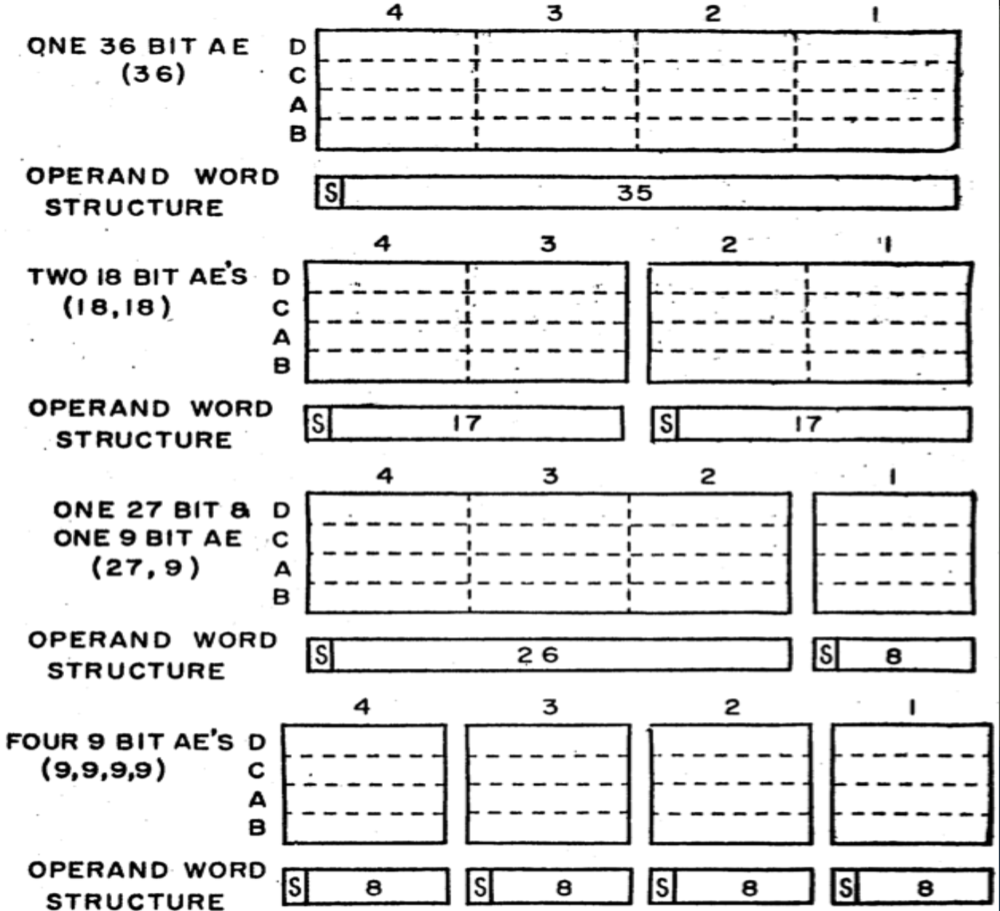
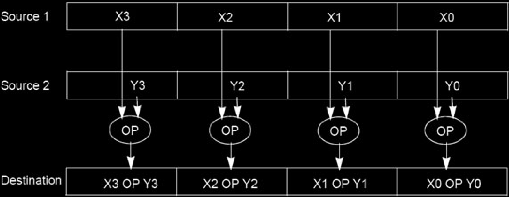
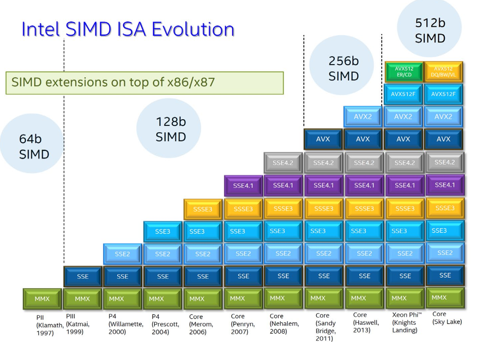
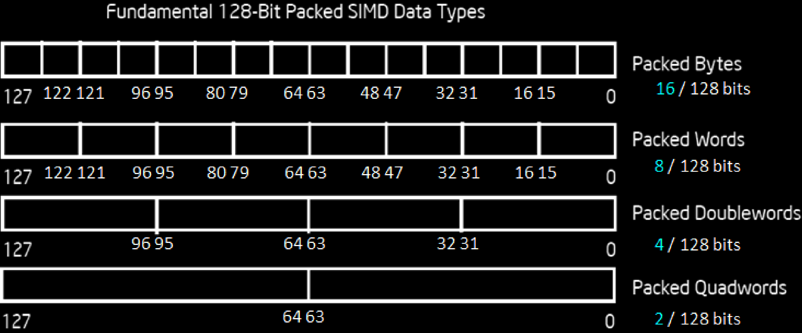
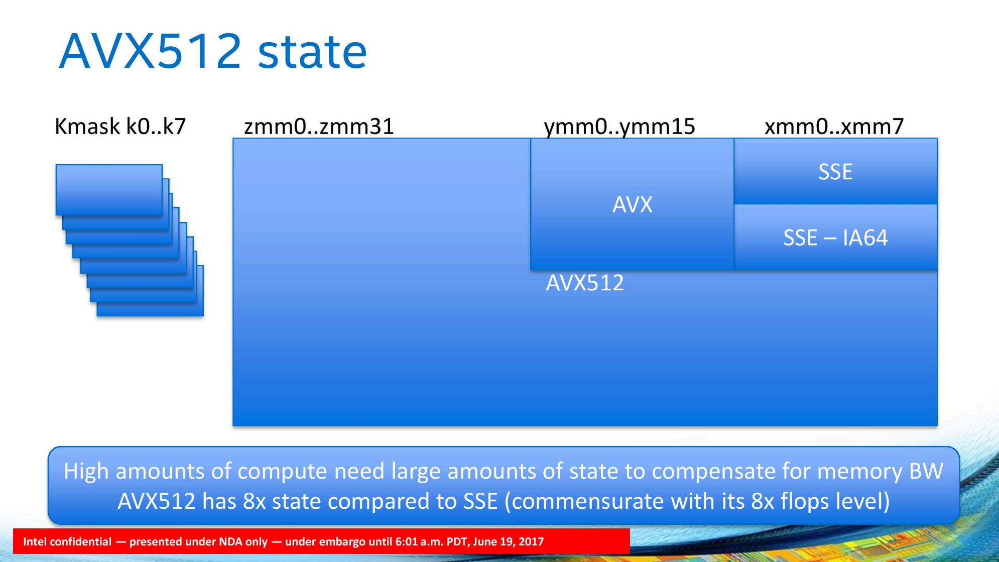
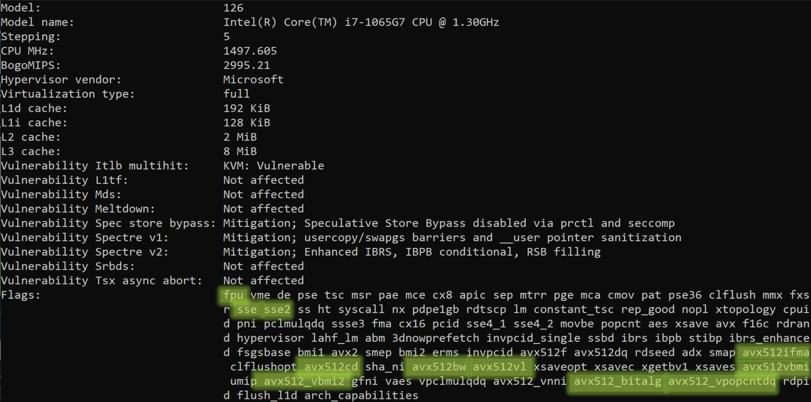

# 32.4-SIMD Architectures


Lecture Video Address


本节将介绍SIMD架构，虽然不会真正构建一个SIMD架构

## SIMD Architectures

SIMD架构旨在利用数据级并行性。获取一条指令并将其应用于多组数据。

Data-Level Parallelism (DLP): Executing one operation on multiple data streams

这样只需要Fetch一个指令，就可以作用到多个不同的数据。

---

Example: Multiplying a **coefficient(系数) vector** by a **data vector** (e.g. in filtering)

- `y[i] := c[i] * x[i], 0≤i`

> 如上，一个乘法指令就可以实现所有的对应位相加。
>
> 这种计算可以用于过滤一些数据。

Sources of performance improvement:

- One instruction is fetched & decoded for entire operation

    > 只需要获取一条指令，而不是每次都需要获取相同的指令。

- Multiplications are known to be independent

- Pipelining/concurrency in memory access as well

---

## SIMD Extension

当然，SIMD有可能被数据限制，但是如果所有数据的带宽足够宽，就可以从Memory或者Cache中获取数据块。这也是SIMD一直追求的——扩展数据传输的带宽。相关研究人员长期以来一直对vectorized architecture或SIMD extension感兴趣。

> 就是在传输的时候以Vector为单位

### First SIMD Extensions: MIT Lincoln Labs TX-2, 1957

第一个著名的SIMD机器是由MIT Lincoln实验室实现的，那就是1957年的TX-2。

> 可以看到，传输的带宽是可以被分解为多个value的

它们可以运行完整的36位数据，或者将其分割成两个17位操作数，或者进一步分割成9位操作数。

> 当时并没有使用标准化的byte和word长度

### Development

这些架构已经存在了一段时间，但在1990年代后期(大约1997年)由Intel引入时，才在广泛的商业用途中得到应用。

> 此时的宽度就是按照标准设计的。

当时的个人电脑上运行越来越多的多媒体应用程序，当时主要是音频和一些视频，这通常涉及某种过滤。而当我们在媒体应用中进行过滤时，我们通常在一维或二维矢量上操作。

实现方式如下

将两个源矢量放置在相对宽的寄存器中，然后在这些相对宽的字的一部分上应用相同的操作，并在目标寄存器中得到结果。

To improve performance, Intel’s SIMD instructions

- Fetch one instruction, do the work of multiple instructions

    > 整个过程只需要Fetch一条指令，将其应用于vectorized data即可完成多条指令对应的工作

- 这种架构被称为MMX(MultiMedia eXtension)多媒体扩展，出现在Pentium II processor family

- 后来几代被命名为SSE (Streaming SIMD Extension)，出现在Pentium III and Pentium 4以后

再后来， 就有了AVX(Advanced Vector Extensions)。

如上便是该领域发展的快速演变。

### Intel x86 SIMD Evolution

如下是Intel x86的SIMD的发展

从左往右：最早始于1997的MMX

> 所有的Intel处理器都必须向后兼容，因此直到现在，MMX仍然存在于我们的计算机中。

每一个更新的处理器仍然在实现MMX。但是SIMD的宽度在增加。最初从64位SIMD增加到128位SIMD，通过添加不同版本的SSEs。然后随着AVX，我们达到了256位SIMD。最后，最新的处理器拥有512位SIMD。预计很快会有1024位宽的SIMD。==**SIMD的宽度增加是非常快的，几乎两三年就得翻一倍。**==

> MMX, SEE, AVX都是在x86架构上的拓展，类似于RISC-V，有对应的指令集，并且在硬件上也要支持这些指令集。

为了支持这样的更新，英特尔不得不在其已经相当复杂的指令集中添加新指令。同时，他们还必须添加新的寄存器，以便能够从这些寄存器中操作，并且随着寄存器变得更宽，寄存器的数量也在增多。

> 总之，由于SIMD的发展，x86的指令和寄存器的数量和宽度都在增加。

### XMM Registers in SSE

在MMX或者SSE中，添加了XMM registers，这些是扩展寄存器，在MMX中是64位，在SSE中是128位。也就是说，处理器中存在一组独立的寄存器，它们不是通用寄存器，也不是浮点寄存器。而是额外的矢量寄存器。

> 在x86 Assembly language中，这些寄存器的名字就叫做xmm, 例如`movaps address %xmm0`

它们也可以被分割，所以一个可以处理整个128位宽的数据，或者将其分割成两个64位字，或四个32位字，甚至进一步分解。MMX通常的使用模式是将这些64位宽的字分解为8位块，并通常以整数的形式处理所有应用程序。

| XMM7 |
| ---- |
| XMM6 |
| XMM5 |
| XMM4 |
| XMM3 |
| XMM2 |
| XMM1 |
| XMM0 |

> 具体怎么分取决于processor

### Intel Architecture SSE2+128-Bit SIMD Data Types

有时会听到Intel中的packed SIMD type。这是在SSE或者SSE2中，XMM有128 bit，可以将其打包为16个bytes；或者打包为8个 16-bit words；又或者打包为4个32-Bits的 double words；又或者2个64 bits。

> packed SIMD type就是指将128位的XMM按照什么规则进行切分。

如下图

Note: in Intel Architecture (unlike RISC V) a word is 16 bits

- Single precision FP: Double word (32 bits)
- Double precision FP: Quad word (64 bits)

具体怎么分取决于Intel processor的类型

> Packed SIMD（Single Instruction, Multiple Data）类型是指一种数据类型，用于在单个CPU指令下同时处理多个数据元素。SIMD指令集允许CPU在同一时间执行多个数据操作，这些操作被打包成一个单一的指令，提高了数据并行处理的效率。
>
> 在程序设计中，常见的SIMD类型包括：
>
> 1. **MMX（MultiMedia eXtension）**：最早的SIMD指令集，提供对8个8位或4个16位数据元素的并行操作。
>
> 2. **SSE（Streaming SIMD Extensions）**：Intel推出的SIMD指令集，包含一系列指令集，如SSE、SSE2、SSE3等，用于处理更多数据元素和更复杂的操作。
>
> 3. **AVX（Advanced Vector Extensions）**：扩展了SSE指令集，提供更长的数据元素（256位和512位），以及更多的并行处理能力。
>
> 这些类型允许程序员利用CPU的并行处理能力，通过向量化操作来提高程序的性能和效率，特别是在科学计算、图形处理、多媒体处理等需要大量数据并行处理的领域。

### SIMD Registers in AVX512

不同的处理器代会支持不同种类的矢量扩展。所以如果你有一台稍微旧一点的处理器，你可能只支持SSE。然后有SSE IA-64，之后升级为AVX，最后我们得到了AVX-512。寄存器的数量也在增加。最初有8个矢量寄存器，然后增加到16个，现在有32个。因此，寄存器的宽度和数量都在增加。

> 如上图，为了兼容性，即使是新版本也会兼容旧版本的寄存器。

如果你有一些非常非常高度并行的任务，例如处理大量矩阵，那么这个架构是很高效的。它非常适合视频处理、图像处理和神经网络处理。

### Check Out My Laptop (lscpu)

我们运行标准的Linux OS CPU命令，然后我们发现我们的处理器支持什么

可以看的，处理器中有fpu(浮点运算)，SSE、SSE2、SSE3和各种AVX扩展。这在我们尝试为其编写汇编代码时是很有用的。同时，这也是`gcc` c编译器通常能够使用的功能。

## C vs. Python

如果在AVX架构上运行先前的baseline，会得到加速吗？如下是结果

| N    | AVX[GFLOPS] | C[GFLOPS] | Python[GFLOPS] |
| ---- | ----------- | --------- | -------------- |
| 32   | 4.56        | 1.30      | 0.0054         |
| 160  | 5.47        | 1.30      | 0.0055         |
| 480  | 5.27        | 1.32      | 0.0054         |
| 960  | 3.64        | 0.91      | 0.0053         |

可以看到，与C相比，快了4倍，但是仍然会被Cache的大小限制。

- Theoretical Intel i7-5557U performance is ~25 GFLOPS

    > 也就是说理论上最大的速度是~25GFLOPs

- 3.1GHz x 2 instructions/cycle x 4 mults/inst = 24.8GFLOPS

所以现在仍然处于最大吞吐量的1/4左右，但是几乎达到了单一标量操作理论上的4倍加速。
