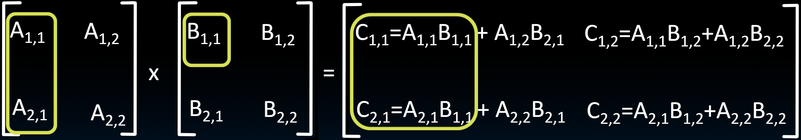
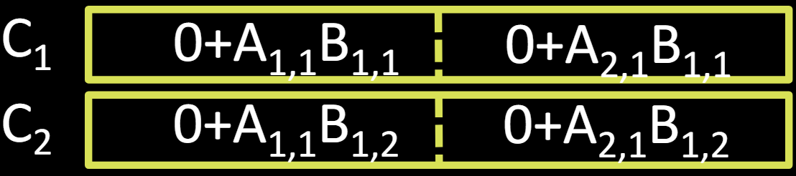

# 32.6-Matrix Multiply Example


Lecture Video Address


现在我们知道了SIMD扩展是如何工作的，它们是如何被指令集架构支持的，一般在硬件中是如何实现的，以及我们如何在汇编语言中使用这些指令，也许还可以作为C语言中的内建函数使用。

下面举一个例子，将这些内容结合起来并使用SIMD指令进行矩阵乘法。

## Example: 2 x 2 Matrix Multiply

如下是一个2×2的矩阵的例子

$$
C_{i,j} = (A \times B)_{i,j} = \sum_{k=1}^2A_{i,j}\times B_{k,j}
$$

首先要明白在计算机中Matrix在内存中的组织方式，这里假设数据是以column Format存储的。在这种情况下，A矩阵在内存中的排列顺序为A~1,1~, A~2,1~, A~1,2~, A~2,2~

下面要实现[A~1,1~, A~2,1~] × B~1,1~得到C~1,1~和C~2,1~的第一项，两个计算要并行实现。

## implementation

要实现计算如下两项

Initialization

最终的结果要保存在C中，首先初始化为0

> C~1~和C~2~都是xmm寄存器，按照Double precision FP划分

1. 首先加载数据

- `_mm_load_pd`: Stored in memory in Column order

- `_mm_load1_pd`: SSE instruction that loads a double word and stores it in the **high and low** double words of the XMM register

> B~1~的两个值都复制为B~1,1~和B~1,2~了，B~2~同理

2. 并行乘法后并行加法
    - `c1 = _mm_add_pd(c1,_mm_mul_pd(a,b1)); `
    - `c2 = _mm_add_pd(c2,_mm_mul_pd(a,b2));`
    - SSE instructions first do parallel multiplies and then parallel adds in XMM registers

`_mm_mul_pd(a,b1)`先进行并行的乘法（A×B~1~, 实际上是A~1,1~×B~1,1~，A~2,1~ × B~1,1~），然后与C~1~相加。

c1, c2, a, b1, b2等都是一种数据类型，对应着底层的xmm寄存器，结果如下

3. 然后进行第二项加法

3. 然后继续获取矩阵的剩余的元素

目标寄存器C1和C2包含了双精度结果矩阵的四个元素。

### Code

这个代码非常直观，就不过多讲解。

在disc12中有这样的例题

## Back to RISC-V: Vector Extensions (Draft)

我们之前一直在讨论RISC-V，但在这个模块中我们不得不切换到Intel x86扩展。虽然RISC-V有一个矢量扩展正在开发中。但它仍然处于草案阶段，几乎已经准备好正式发布了。但目前没有任何支持它的硬件。所以我们无法进行项目和实验等活动。再给它一两年的时间，RISC-V矢量扩展就会出现了，到那时我们可以在RISC-V的世界中完成所有事情。现在，我们需要用Intel的x86、AVX和SSE来补充。

下面是draft中的内容

To improve RISC-V performance, add SIMD instructions (and hardware) – V extension

- Fetch one instruction, do the work of multiple instructions
- OP denotes a vector instruction, prefix v – vector register 
- `vadd vd, vs1, vs2` (adds two vectors stored in vector registers)
- Assume vectors are 512-bits wide 

##  in Conclusion

Flynn Taxonomy of Parallel Architectures

- SIMD: Single Instruction Multiple Data
- MIMD: Multiple Instruction Multiple Data
- SISD: Single Instruction Single Data
- MISD: Multiple Instruction Single Data (unused)

Intel AVX SIMD Instructions

- One instruction fetch that operates on multiple operands simultaneously
- 512/256/128/64-bit AVX registers
- Use C intrinsics

> 实现数据并行就是扩展了指令集，添加几个vector Register，使得一个指令能够同时执行多个数据的操作。

data level parallelization is quite inflexible, and not all applications have data that can be vectorized.

从disc12中的编码例题就可以看出SIMD的内联函数是很不方便的，而且需要自己手动划分，计算哪些数据可以并行。
