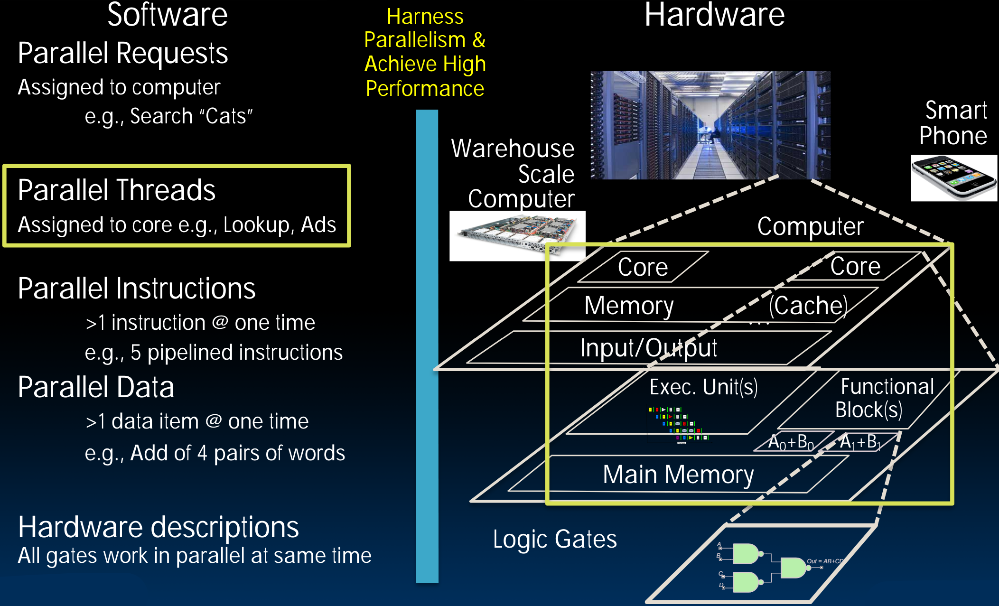
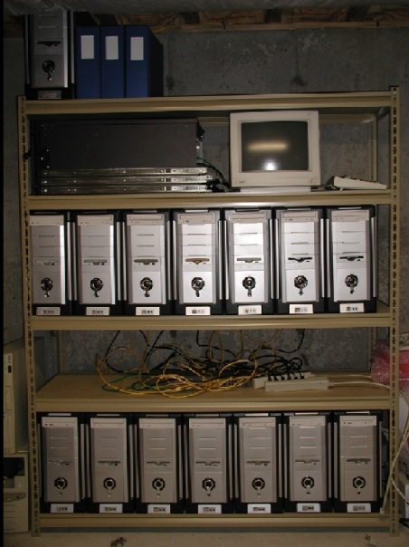
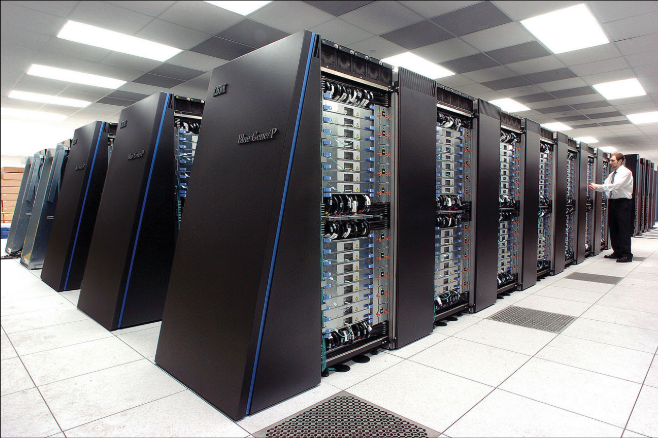
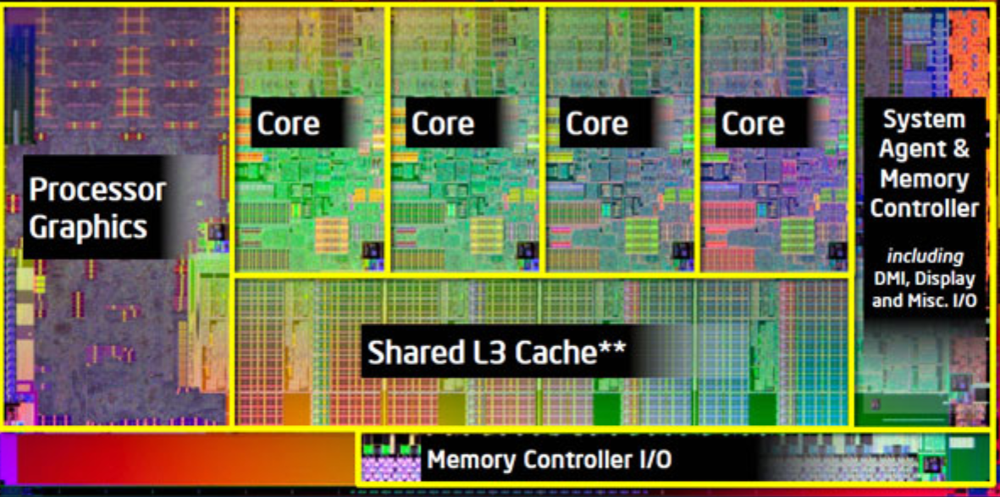
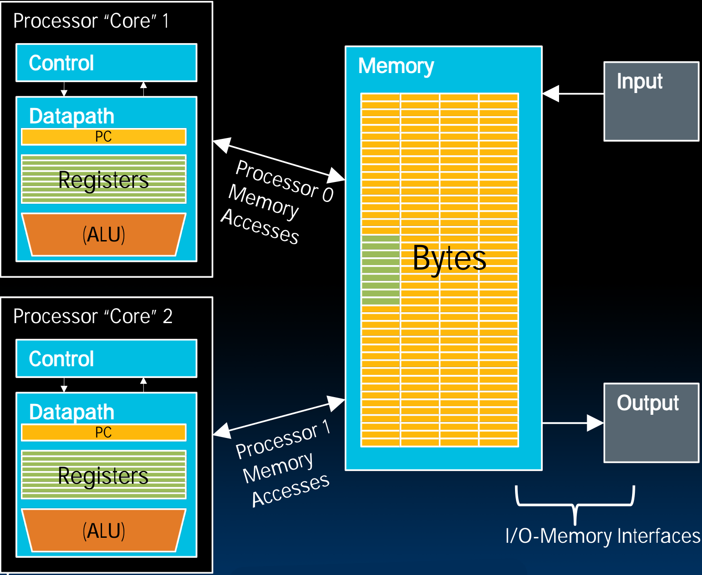

# 33.1-Parallel Computer Architectures


Lecture Video Address


## Improving Performance

61C课程的目标是教你如何高效地编程，以提高计算机的性能。有很多方法可以实现这一目标。

如果你是一个计算机工程师，要构建系统，如下是可以做的。

1. Increase clock rate f~s~
    - Reached practical maximum for today's technology
    - < 5GHz for general purpose computers
    - 时钟频率升高还要考虑功耗散热问题，如果频率过高，可能会无法让芯片保持冷却。
    
2. Lower(降低) CPI (cycles per instruction)
    - 使用SIMD, "instruction level parallelism"
    
        > 使用SIMD可以降低CPI，因为多个操作可以由一条指令同步完成。我们希望CPI越小越好。
    
3. Perform multiple tasks simultaneously
    - Multiple CPUs, each executing different program
    - Tasks may be related
        - E.g. each CPU performs part of a big matrix multiplication
    - or unrelated
        - E.g. distribute different web http requests over different computers
        - E.g. run pptx (view lecture slides) and browser (youtube) simultaneously
    
4. Do all of the above:
    - High f~s~ , SIMD, multiple parallel tasks

本节重点讨论的内容：

3. Perform multiple tasks simultaneously
    - Multiple CPUs, each executing different program
    - Tasks may be related
        - E.g. each CPU performs part of a big matrix multiplication

即要讨论的是多个CPU执行同一程序，共享同一数据，如何为其划分并行空间。

## New-School Machine Structures

前面我们已经学过了Parallel Instructions, Parallel Data, Hardware descriptions

从本节开始，学习Parallel Threads

## Parallel Computer Architectures

下面介绍不同规模的Parallel Computer Architectures

| Several separate computers, some means for communication (e.g., Ethernet) |  | 早期的并行计算机架构(如图一)，就是试图将几台机器拼凑在一起，通过以太网连接起来，并尝试执行一个任务，这就是分布式计算。将一个很大的任务分解后分配到每台计算机，然后将结果收集起来。通常有一个指挥模块将任务分解，执行的计算机完成任务后将结果返回。通过以太网和共享驱动器(shared driver)进行通信。 |
| ------------------------------------------------------------ | ------------------------------------------------------------ | ------------------------------------------------------------ |
| Massive array of computers, fast communication between processors |  | 当规模足够大后，就构成了超级计算机，这种计算机大部分都在处理科学计算问题，例如矩阵乘法，神经网络，气候模拟等，其中的数据都是双精度浮点数，甚至需要更高精度的浮点数。 |
| Multi-core CPU: 1 datapath in single chip share L3 cache, memory, peripherals Example: Hive machines |  | 即使是小规模计算机，例如手机，手表，普通计算机等，也有多核机器，如图是在一个芯片上的多核机器。 |

下面以2 cores介绍一下multi-core CPU

以32-bits Address为例，内存大小为4GB。

有了虚拟内存之后，每个程序都会认为自己有4GB的内存空间，即使实际的物理内存大小并不是4GB(可能大于，也能小于)。虚拟内存隐藏了不同机器间的配置，使得程序在不同机器上能够以同一的方式运行，不用在意不同机器的内存大小的不同。

而有了两个Core之后，并不意味着内存加倍，因为Core并不包含内存。每个Core都有自己的Control，Datapath，PC，Registers，ALU，相当于有两个完整的计算机。两个Core是完全独立的，可以独立运行不同的任务，比如其中一个Load，另一Store。其共享部分是Memory，包括连接Memory的I/O(在Memory mapped I/O中，访问I/O就是通过访问内存)。但是此时就要注意如果两个Core同时操作一个位置该怎么办等问题。

两个Core共享一个内存，这种模型叫做共享内存模型(shared memory model)。

## Multiprocessor Execution Model

1. Each processor (core) executes its own instructions
2. Separate resources (not shared)
    - Datapath (PC, registers, ALU)
    - Highest level caches (e.g., 1st and 2nd)
3. Shared resources
    - Memory (DRAM)，DRAM是非常昂贵的，所以不会为每一个Core添加一个独立的DRAM
    - Often 3rd level cache
        - L3 Cache是非常大的，通常以M为单位
        - Often on same silicon chip
        - But not a requirement（shared L3 Cache并不是必须的）

Nomenclature(命名法)，下面是一些新的术语

- 我们之前讨论的CPU叫做Microprocessor（微处理器）
- Multiprocessor Microprocessor(多处理器微处理器)

> 既可以指多个芯片在同一共享内存区域工作，也可以指单个芯片上有多个core，有歧义

- Multicore processor
    - E.g., four core CPU (central processing unit)
    - Executes four different instruction streams simultaneously

> Multicore processor就指一个processor上有多个core
