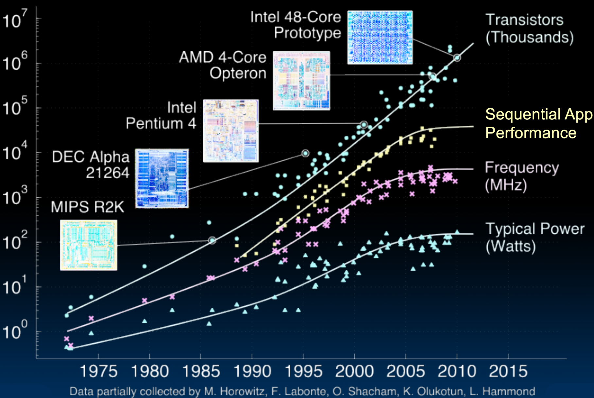
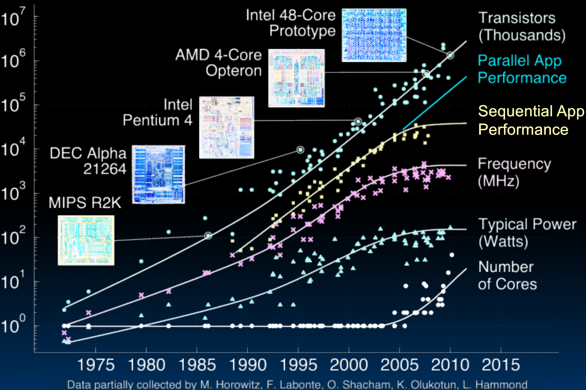
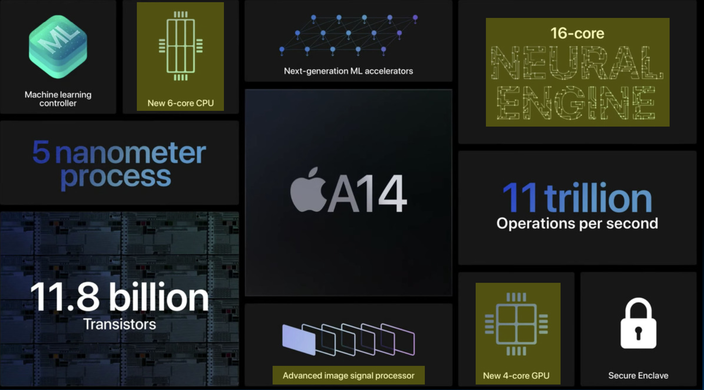
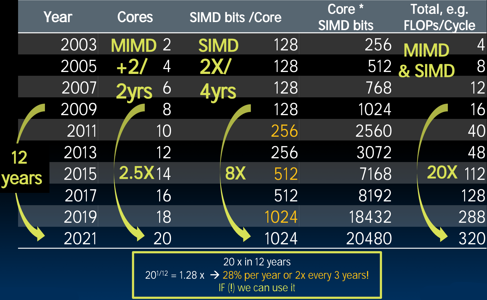

# 33.2-Multicore


Lecture Video Address


本届开始深入的理解多核计算机。

## History

首先来了解关于多核计算机的历史。

### Transition to Multicore

如下图是对多核演进及其原因的精彩可视化展示。

- **Transistors**: 在70年代初期，晶体管的数量只有几千。根据Moore's Law, 晶体管的数量指数级增长。一开始是每两年翻一倍，后来是每18个月翻一倍。（从图中可以看到增长速率在增加）
    - 晶体管被不断地装入集成电路(IC)中，尺寸也越来越小，达到纳米级别，也意味着芯片上信号线之间的距离也越来越小。
    - 计算机的发展离不开这样令人难以置信的工程成就。
- **Frequency**: 为了提高性能，也在不断地增加时钟频率。在早期，计算机结构比较简单，并且频率也很小，并不会考虑功耗散热的问题，所以无顾虑的增加Frequency。但是到了2005年，功耗成为一个主要的问题，不能再增加Frequency了。
    - 在早期那个年代，对于计算机制造商来说很棒，因为Frequency的提升非常快，意味着每隔两三年计算机的速度就会提升一个档次。
    - 当然，现在Frequency已经趋于平缓，提升没有那么快了。
- **Typical Power**: 随着Frequency的提升，原本不是很关心的Power开始上升，此时发现，很难给计算机降温了。
    - Power太高就无法给系统降温，现在计算机的降温系统是很复杂的，有带有散热风扇的散热片系统，或者带有很多辐条的散热系统。如果站在某些电脑的排气风扇一侧，会感到非常热。
    - 甚至会使用液冷系统，因为通过空气已经无法冷却CPU的散热片了，所以使用水，油等液体散热，这设计非常复杂的工程设计，要让液体尽可能多地接触散热片，吸收热量，然后散热，再冷却后重新循环。
    - 计算机的发展也离不开散热系统的工程成就。

当Frequency的升高导致Power过高以至于无法散热时，不能再提高Frequency了，要采取其他的方式（比如SIMD），所以在2005年左右，Frequency和Power开始趋于平稳了。

这个时候Moore's Law仍然有效，仍然能够在CPU中塞入更多的晶体管，但是Sequential App Performance开始受到影响了。

- **Sequential App Performance**: 一开始，即使是一个很糟糕的，没有优化过的程序，什么都不动，也都能享受着Transistor，Frequency增长的红利，其性能也在提升，但是到2005年左右，频率开始趋于平缓，Sequential App的性能也开始平缓
    - 现在我们进入云计算时代。现在我们有越来越大的数据集，继续这样下去就没法处理这么大的数据了。

Frequency和Power的增长都会引发功耗散热问题，必须另辟蹊径。与此同时，多核CPU出现了。

- **Number of Cores**: 在Frequency和Power平缓之后，开始出现多核CPU，此时Core的数量开始上涨
- **Parallel App Performance**: 得益于Core数量的增加，Parallel App Performance也开始提高。
    - 作为一个程序员，最好学会如何并行编程，有效地利用多核。

### Apple A14 Chip

这是比较新的Apple A14 Chip

- 6-Core CPU，这些核心分为Firestorm和Icestorm，即高性能核心和低性能核心。低性能核心速度不是那么快，但是温度较低。当需要全力以赴的时候，所有核心都会用上，但是只是做普通的事情的时候，更多使用更节能的核心。

> 回想在2005年，没有电脑有多个Core。而现在手机上就有6个Core

- 4-Core GPU，16-core Neural Engine(用于神经网络工作)，11.8 billion Transistors

## Multiprocessor Execution Model

多处理器模型的执行机制

### Shared Memory

- Shared memory
    - Each "core" has access to the entire memory in the processor
    
    - Special hardware keeps caches consistent (next lecture!)
    
        > 这里的consistent是与dirty的，就是防止Cache与Memory中的内容不一致
    
    - Advantages: Simplifies communication in program via shared variables
    
    - Drawbacks: Does not scale well:
        - "Slow" memory shared by many cores（因为Memory太慢了，所以多个cores之间的交互也变得很慢）
        - May become bottleneck (Amdahl's Law)

> Amdahl's Law（后面几节课会讲到）
>
> Amdahl's Law（阿姆达尔定律）是由计算机科学家Gene Amdahl提出的一个理论，用于描述在提升计算机系统整体性能时，单个部件或处理器的改进对整体性能的影响。它的核心观点是，无论如何提升某个部件或处理器的性能，整体系统的性能提升受限于该部件或处理器的使用比例。因此，在系统设计和优化中，需要综合考虑串行部分和并行部分的优化策略，以达到更好的性能提升效果。

### Two ways to use a multiprocessor

- Two ways to use a multiprocessor:
    - Job-level parallelism
        - Processors work on unrelated problems
        - No communication between programs
    - Partition work of single task between several cores
        - E.g., each performs part of large matrix multiplication

## Parallel Processing

Parallel Processing属于Parallel Computing和Distributed Computing的范畴

- It's difficult but inevitable(不可避免的)
    - Only path to increase performance
    - Only path to lower energy consumption (improve battery life)

> 使用并行来提高性能是无奈之举，其会让程序更加复杂，但是已经没有其他办法能够提升性能了，并行是增加性能的唯一途径。
>
> 这也是解决电池寿命和电源问题的唯一方法（(提高Frequency会导致Power升高，从而降低电池寿命）
>
> 所以，继续增长和继续利用新硬件的唯一方法是考虑如何很好地编程并行系统。

- In mobile systems (e.g., smart phones, tablets)
    - Multiple cores
    - Dedicated processors(就是有为专门的任务服务的processor)
        - e.g. Motion processor, image processor, neural processor in iPhone 8 + X
        - GPU (graphics processing unit)
- Warehouse-scale computers(后续会将)
    - Multiple "nodes" : "Boxes" with several CPUs, disks per box
    - MIMD (multi-core) and SIMD (e.g. AVX) in each node

## Potential Parallel Performance 

(assuming software can use it)

- Core的数量增加到2.5倍，每个核心的SIMD位数增加到8倍
- Core × SIMD bits/Core，得到每个周期可以进行的浮点数运算达到了20倍
- 也就是说，在12年内每个周期的浮点数计算次数达到了20倍。

现在的问题是，从软件的角度，该如何利用这些性能

> Multicore仅仅是从硬件的角度提供了多核，从而提高了浮点数运算次数等指标。但还需要从软件层面来利用这些提升。
