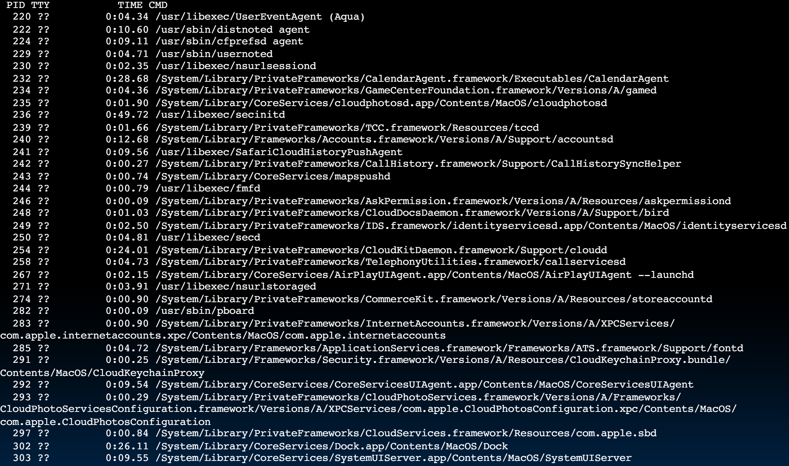
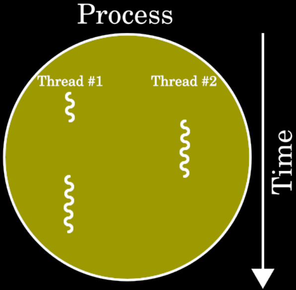
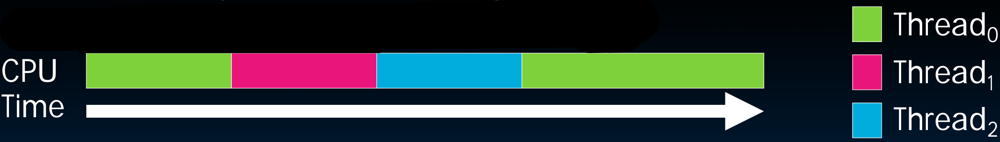
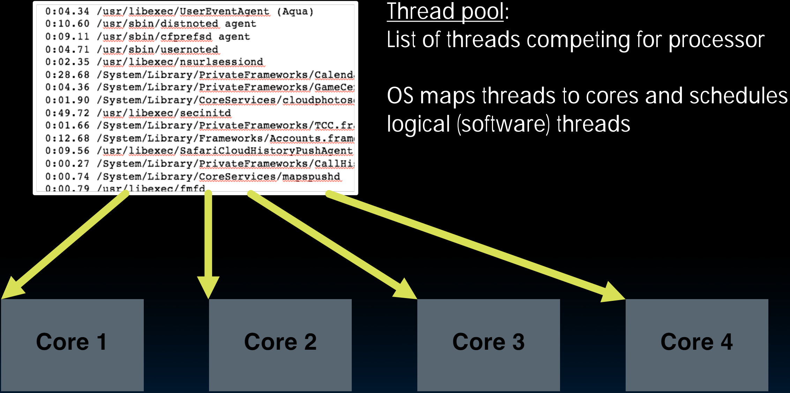

# 33.3-Threads


Lecture Video Address


在上节课最后，我们谈到了近几年Core数量的提升以及SIMD的bits的提升，后者一个程序可以利用(在编译的时候使用SSE，AVX等扩展的指令来利用vector Register)，但是如何使用多个核心，让计算机发挥极致性能，从而在某个庞大的数据集上进行计算？

从本节课开始讲述如何利用好多个Core。

## Programs Running on a typical Computer

首先看看计算机中有多少个程序在运行。

```shell
unix% ps -x # 在Unix Linux输入ps -x
```

> 在不同的OS可能有不同的指令

如下是一台笔记本的结果



仅仅是笔记本，同一时间也有这么多的程序，这是怎么做到的。

## Threads

A Thread stands for "thread of execution", is a single stream of instructions

> a single stream of instructions: 在之前学过的程序都是如此，单独的PC加载一个程序a.out并运行，都是按照一个独立的顺序执行的，虽然中间可能有函数调用或者控制跳转，但是这个指令流仍然是独立的。

- A program / process can split, or fork(分支) itself into separate threads, which can (in theory) execute simultaneously

    > 然后有一个方式能够将他们合并起来得到最终的结果

- An easy way to describe/think about parallelism



### Single Core: Time Sharing

如果只有一个CPU并且是一个Core，那么如何执行多个Thread？

> 在2005年是没有多核处理器的，但是当时已经有多个程序了，比如OS，那个时候是怎么运行OS和其他的程序的？

With a single core, a single CPU can execute many threads by **Time Sharing**



只有一个Core，那么在一个时间段只执行一个Thread的指令，下一个时间段转到下一个Thread。

> 这里的Thread实际上就和之前的process一样

- 如果Time share的足够快的话，也就是时间切分足够快的话，是不会注意到某一个程序终止而不运行的。

- 但是如果计算机过载了，就会出现视频掉帧，分辨率下降的问题；

    > 视频分辨率下降不仅仅是因为数据传输的问题，这还涉及数据处理的事情，如果计算机过载，多个程序运行不过来，那么就没有足够的时间进行数据处理，从而导致分辨率下降。
    >
    > 尽管有的系统能够处理1080p，4k甚至8k流，但如果没有足够的CPU周期，那也只能用低分辨率。

- 在古老的时代，甚至还会出现在文字编辑器中打字后半天光标不会更新移动的场面。

所以，如果有太多任务请求一个CPU的工作。那么时间共享(time sharing)就会出问题。

### Thread(Hardware & Software Thread)

- Thread is sequential flow of instructions that performs some task
    - Up to now we just called this a "program"，现在将一个program叫做Thread
- Each thread has: 
    - Dedicated PC (program counter)
    - Separate registers
    - Accesses the shared memory

下面要搞清楚两个概念，`Hardware Thread`和`software Thread`

- Each physical core provides one (or more)
    - Hardware threads that actively execute instructions
    - Each executes one "hardware thread"

> 每一个Core都可以执行一个或者多个Hardware Thread(Time sharing)，正在硬件上执行的叫做Hardware Thread

- Operating system multiplexes multiple 
    - Software threads onto the available hardware threads
    - All threads except those mapped to hardware threads are **waiting**

> software thread仅仅是在软件角度的划分，由软件创建出来的thread，但是并不一定正在运行。一些在Hardware上运行，一些就在等待。
>
> 可以理解为在Memory space中的都是software thread，但是在Core上运行的是Hardware thread
>
> 例如有4 cores，那么同一时间只有4个software thread在运行(或者说4个software thread有对应的Hardware thread的映射)，其他的都在等待。

### Thoughts about Threads

如下是一位教授对于线程的介绍。

> "Although threads seem to be a small step from sequential computation, in fact, they represent a huge step. They discard(丢弃) the most essential and appealing properties of sequential computation: understandability(可理解性), predictability(可预测性), and determinism(确定性). Threads, as a model of computation, are wildly non-deterministic, and the job of the programmer becomes one of pruning that nondeterminism." — The Problem with Threads, Edward A. Lee, UC Berkeley, 2006

翻译为中文如下：

> 尽管线程似乎是从顺序计算迈出的一小步，实际上，它们代表了一个巨大的进步。它们抛弃了顺序计算最基本和吸引人的特性：可理解性、可预测性和确定性。线程作为一种计算模型，具有极高的非确定性，程序员的工作变成了剪除这种非确定性的过程。

在顺序计算中，代码的执行顺序很多情况都是一目了然的，可读性高，也有确定性，有时甚至可以确定输出的结果是什么。

使用了线程之后，一切都变得不确定了，例如不知道线程的执行顺序，线程执行之后，以什么顺序回来等，这些都是不确定的；有时线程可能被卡住甚至永远不会返回结果，可以理解为这是随机的。现在程序员的工作就是剪除这种不确定性。

### abstraction

在物理角度，多个线程是不可能全都同时运行的：

- Single Core使用Time sharing，宏观上并行，但是在微观上一个时间段仅仅执行一个thread
- Multi-core也可能出现Core的数量小于threads的数量，也会有一部分thread无法运行在等待。

但是，不论哪种情况，这样的运行方式都给程序员提供了一层illusion/abstraction，这几个thread是同时进行的。

程序员不需要关心有多少个Hardware threads。其只要根据逻辑上的需要将程序划分成threads(比如100个)，然后运行这些线程。

---

甚至划分的software threads > Hardware software是更好的。

假设有4个Hardware threads，而将程序分解成100个software threads，在执行的过程中即使有1个threads被阻塞了(可能是计算量过大)，但是其他的99个线程仍然可以运行，阻塞的那一个software thread只占总工作量的1%，然后等到那个阻塞的thread运行。

但是如果只划分成4个software threads的话，就可能有3个结束了，但阻塞的那一个占据25%的执行量。

所以对一些特定的问题，划分更多的software threads是更高效的

## Operating System Threads

如下是在什么时候替换thread以及怎么替换

Give illusion of many "simultaneously" active threads（在软件角度有abstraction）

1. Multiplex software threads onto hardware threads:
    - Switch out blocked(阻塞的) threads (e.g., cache miss, user input, network access，这些问题可能会导致blocked)
    - Timer (e.g., switch active thread every 1 ms)
    
    > 或者thread被阻塞了(例如发生了Cache miss, 等待input，network access等问题)，或者用timer计时。
    >
    > 可以以不同的方式进行选择切换线程
    
2. Remove a software thread from a hardware thread by
    - Interrupting its execution
    - Saving its registers and PC to memory(需要保存thread的状态)
    
3. Start executing a different software thread by 
    - Loading its previously saved registers into a hardware thread's registers 
    - Jumping to its saved PC

## Example: Four Cores

如下是一个例子



- Thread pool中有需要运行的进程和线程（这些都是software threads）
- OS负责将software threads映射到Core(Hardware threads)。

有些程序可能一直运行不会停止，比如Daemon threads，监听硬件连接，监听键盘等threads，都是在后台发生的，所以即使没有运行user program，也会有很多threads在运行（可以输入 ps -x查看）。这些都是OS帮助处理的。
