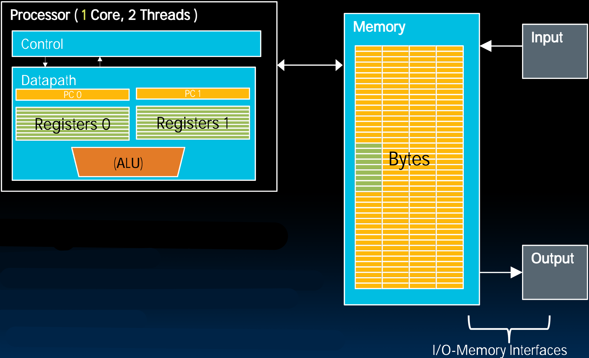
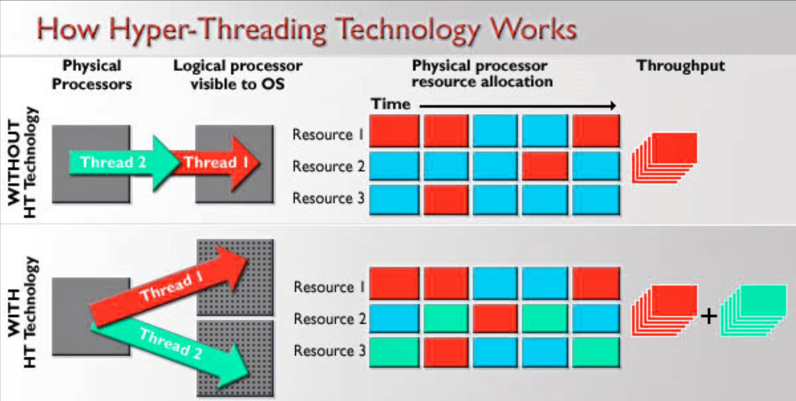
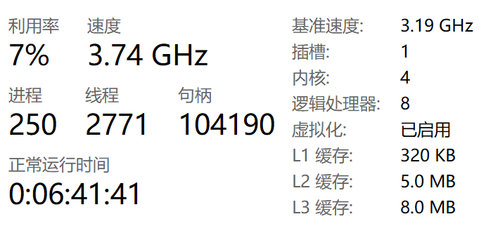
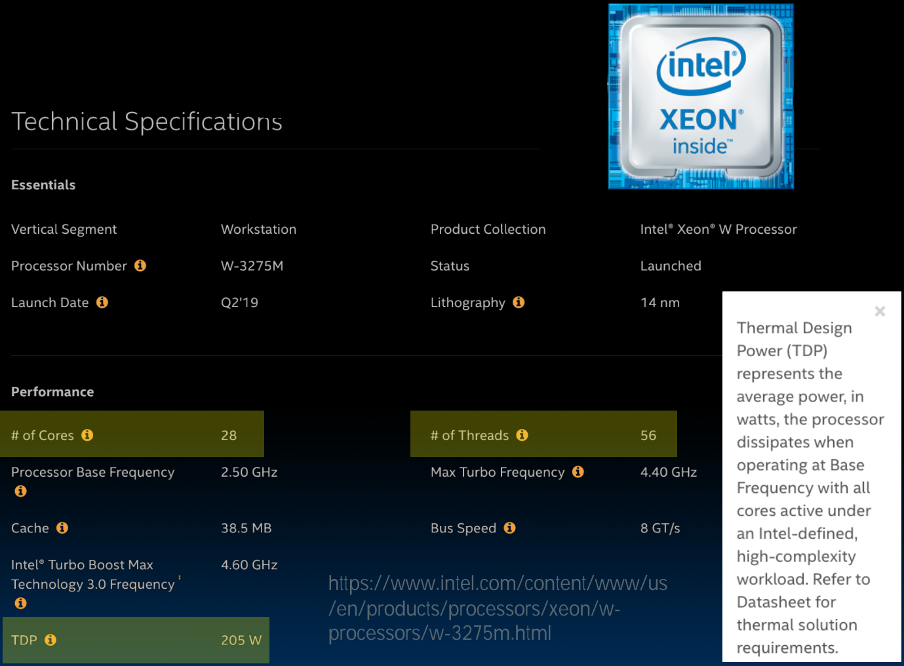
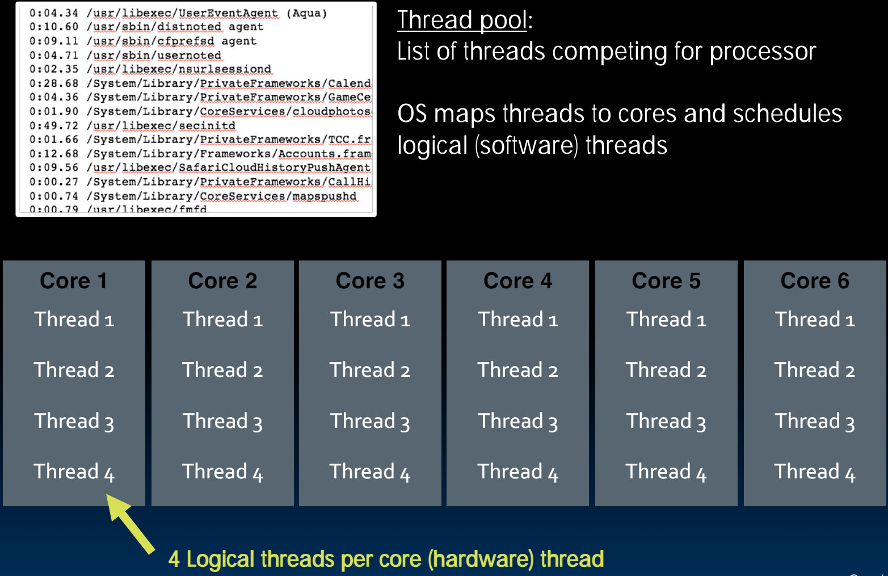

# 33.4-Multithreading


Lecture Video Address


在之前，我们已经学过了single hardware Thread在Single Core运行的情况。

现在要学习每个Core有多个threads

> Multithreading表示在同一时间，一个Core里面有多个Threads

## Problems

Typical scenario:

- Active thread encounters cache miss
- Active thread waits ～ 1000 cycles for data from DRAM
- switch out and run different thread until data available

Problem

- Must save current thread state and load new thread state
    - PC, all registers (could be many, e.g. AVX)
- must perform switch in ≪ 1000 cycles

> 这里切换线程就是为了在从DRAM读取数据的时间内让Core继续工作，所以切换线程的时间一定是<从DRAM中读取数据的时间，否则便毫无意义。

Can hardware help?（硬件能否以某种方式帮助在<1000个cycles内切换线程）

- Moore's Law: transistors are plenty

## Multithreading

### Hardware Assisted Software Multithreading

核心思想就是一个Core运行两个线程

切换线程就是要切换PC和Registers，在之前的情况中是从Memory中读取，可以在一个Core内保存两份PC + registers，如下图

> 但是由于transistor是非常多并且便宜的，所以这样做的成本也很低，但能加快效率



- 一个Core中有两个不同的Core和两组独立的registers
- 对于软件来说，就好像是有两个Hardware Thread，也就有2个Core，但从硬件角度来说只有一个Core。
- 当Hardware Thread0等待从DRAM中读取数据的时候，Hardware Thread1此时就可以使用ALU了进行计算了。

- 这叫做Hyper-Threading(超线程): Both threads can be active simultaneously

> 我们再来分析一下最开始的问题，当Hardware Thread0在等待数据从DRAM读取的时候，其是不使用ALU等执行资源的，因此我们希望切换Thread以利用这些空闲的资源。
>
> 即问题的本质就是提高资源利用率，当一个Thread0不使用resource1的时候，希望切换Thread1来使用resource1。这涉及到context Switch。
>
> 但是，1个Core里面有2组PC + registers就不需要进行context Switch了，在同时运行的两个threads中，当Thread0空闲出一个资源的时候，Thread1使用那个空闲的资源。

### Hyper-Threading

如下是超线程的工作原理，下面会对其进行解析

Simultaneous Multithreading (HT): Logical CPUs > Physical CPUs

- Run multiple threads at the same time per core
- Each thread has own architectural state (PC, Registers, etc.)
- Share resources (cache, instruction unit, execution units)
- See http://dada.cs.washington.edu/smt/

---



- 红色表示Thread1，绿色表示Thread2

> 这里仅仅展示了一个Core有两个Thread的例子，实际上可以有多个。

- 在中间的方格中，同一行表示同一个resource，同一列表示同一时间三个resource的使用情况。蓝色表示空闲，红色表示Thread1使用，绿色表示Thread2使用
- Physical是实际存在的processor的数量，Logical processor是对OS可见的processors的数量

可以看到有无HT技术的区别：

- 当没有HT(也就是一个Core里只运行一个Thread)的时候，当Thread2要从DRAM中读数据的时候，需要切换到Thread1，而此时同一时间只有Thread1在利用资源，其余资源都是空闲的
- 当有HT的时候，可以看到同一时间Thread1和Thread2都在利用资源，可能一个在Load，另一个在使用ALU，彼此互相填补资源上的空白。
- 或者在Thread1在等待DRAM的时候，Thread2继续工作使用资源，然后替换Thread1的寄存器和PC等

最终的结果是，使用Hyper-Threading的吞吐量大大提升。

- Logical processor对于OS是可见的，虽然只有一个Physical processor，但是对于OS来说有两个Logical processors

---

> ChatGPT - Hyper-Threading
>
> Hyper-Threading（超线程）是Intel开发的一项技术，旨在提升处理器性能和多任务处理能力。它通过在单个物理处理器核心上模拟多个逻辑处理器核心来实现这一目标。
>
> 具体来说，Hyper-Threading允许一个物理处理器核心同时处理多个线程。每个物理核心能够同时运行两个逻辑线程，这些线程共享处理器核心的执行资源，如缓存和执行单元。这种技术通过在处理器内部增加并行执行指令的能力，提高了处理器在多任务环境下的效率。
>
> 使用Hyper-Threading技术可以让操作系统和应用程序认为每个物理核心上有两个逻辑核心，从而更好地利用处理器资源，提升系统的整体响应速度和多任务处理性能。然而，性能提升的实际效果取决于应用程序的特性，某些应用程序可能无法充分利用Hyper-Threading带来的潜在优势。
>
> 总体来说，Hyper-Threading技术是通过在单个物理处理器核心上实现多线程执行来提升处理器性能和多任务处理能力的技术。

### Multithreading & Multicore

Multithreading和Multicore是两种不同的技术

|                         | Multithreading                                               | Multicore                                                    |
| ----------------------- | ------------------------------------------------------------ | ------------------------------------------------------------ |
| Hardware cost           | ~1% more hardware(只需要添加一个PC和一些寄存器)              | Duplicate Processors，~50% more hardware                     |
| Performance improvement | ≈10% (?) better performance                                  | ~2X better performance                                       |
| separate                | PC, register                                                 | L1, L2 Caches, Datapath, ALU...                              |
| shared                  | datapath, ALU(s), caches, Memory...                          | L3 Caches, Memory                                            |
| desc                    | 在一个Core内有两组PC和Registers，可以同时运行两个Hardware threads，互补的利用资源。 | multicore意味着在一个CPU中添加多个Core，每个Core的资源不共享 |

Modern machines do both: Multiple cores with multiple threads per core

> 现代的CPU同时拥有两种技术

### lookup the number of CPU

#### Linux

如下在Linux中查看两种CPU的数量

```shell
sysctl hw
```

```
hw.physicalcpu: 4
hw.logicalcpu: 8
```

- 4 Cores
- 8 Threads total

#### Mac

在Mac的Activity Monitor中可以监视CPU的运行状况


总共有逻辑上的8个CPU

#### Windows

参考这篇[博客](https://blog.csdn.net/ltochange/article/details/117335714)

在cmd中输入如下内容可以查看Logical CPU的个数

```
wmic
wmic:root\cli>cpu get NumberOfLogicalProcessors
NumberOfLogicalProcessors
8
```

或者在任务管理器中也能看到



## Example

### Intel Processor

如下是2020年的Intel® Xeon® W-3275M Processor，价钱大概2000$



- \# of Cores = 28, \# of Threads = 56

> 当运行很大的应用时，56个线程在共同工作

- 但是TDP(Thenrmal Design Power)确有205W，这对于很小的芯片来说是非常大的，因此制冷也是一个挑战

### 6 Cores, 24 Logical Threads



## Summary

### Definitions

下面介绍一些术语

Thread Level Parallelism

- Thread: sequence of instructions, with own program counter and processor state (e.g., register file)
- Multicore:
    - Physical CPU: One thread (at a time) per CPU, in software OS switches threads typically in response to I/O events like disk read/write  
    - Logical CPU: Fine-grain thread switching, in hardware, when thread blocks due to cache miss/memory access
    - Hyper-Threading aka Simultaneous Multithreading (SMT): Exploit superscalar architecture to launch instructions from different threads at the same time! 

### in Conclusion

- Sequential software execution speed is limited
    - Clock rates flat or declining（2005年基本趋于平坦）

> 此时尽管还可以往CPU上塞更多的晶体管，但不能通过提高频率来提高性能了。

- Parallelism the only path to higher performance
    - SIMD: instruction level parallelism
        - Implemented in all high perf. CPUs today (x86, ARM, …)
        - Partially supported by compilers
        - 2X width every 3-4 years（SIMD的宽度增加也是非常快的）
    - MIMD: thread level parallelism
        - Multicore processors
        - Supported by Operating Systems (OS)
        - Requires programmer intervention(干预) to exploit at single program level (we see later)
        - Add 2 cores every 2 years (2, 4, 6, 8, 10, …)
            - Intel Xeon W-3275: 28 Cores, 56 Threads
    - SIMD & MIMD for maximum performance

> 这里顺便说一下，在选择Intel处理器的规模时，核数越多，时钟频率越低，比如28核型号是2.5GHz，20核型号甚至8核型号会更高。
>
> 使用较少的核心来换取加高的时钟速度。部分原因是核数太高无法散热。具体选哪个看程序，单线程的程序可能不需要那么多的核，高时钟频率可能更好，反之亦然。

---

最后的问题：随着处理器数量的增加，如何在多处理器上编写高性能的并行程序？

Key challenge: craft parallel programs with high performance on multiprocessors as # of processors increase – i.e., that scale

- Scheduling, load balancing, time for synchronization, overhead communication

> 本节课的内容也都是关于硬件的，下一节讲述软件的内容。
