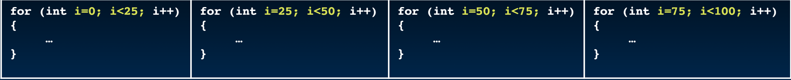
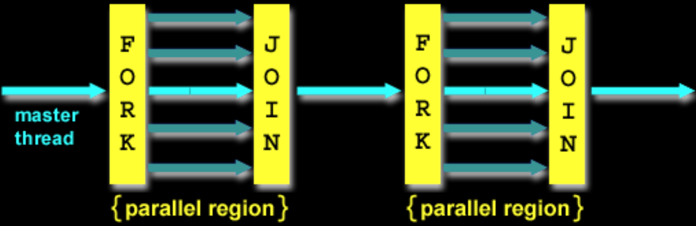

# 34.2-OpenMP


Lecture Video Address


---

本节学习OpenMP这个库（或者说是一个abstraction），它可以让我们非常高效且简单地使用多个Cores，而不需要在C语言中添加大量代码。

> OpenMP: Open Multi-Processing

## Parallel Loops

Serial execution:

```c
for (int i = 0; i < 100; i++) {
    …
}
```

如何将这个程序改成并行执行的呢？（关键是如何划分0~99）

Parallel Execution:

- 假设要分成4个thread。
- 由于Cache的存在，让一个Thread处理一个特定的block是比较高效的，这样加载一个数据的时候，其相邻的数据也会加载到Cache，该Thread处理后续的数据的时候就会很高效。
- 我们不希望4个thread工作于同一个block的特定Offset的word，这样的话一个线程处理的数据就会分散到多个block当中

> 比如第一个thread操作的数据为0,4,8,12... 第二个thread为1,5,9, 13... 这样的划分方法是使用Cache最低效的

- 因此以**连续的方式**划分: 0~24, 25~49, 50~74, 75~99



> 所以在使用并行计算的时候，最好将一块连续的区域划分给一个thread

## Parallel for in OpenMP

下面是OpenMP的语法

```c
#include <omp.h>
#pragma omp parallel for
for (int i=0; i<100; i++) {
	…
}
```

- `#include <omp.h>`引入OpenMP的头文件
- `#pragma`是给compiler看的，compiler遇到这个指令之后会有特护的编译方式
- `#pragma omp parallel for`会将下面的for循环并行化，至于怎么划分0~99，compiler会自动划分

### #pragma

#pragma不仅仅是用于omp的，如下是ChatGPT的解释。

在C语言中，`#pragma` 是一个预处理器指令，用于向编译器发出特定的命令或指示。它通常用于控制编译过程中的行为，如优化选项、警告处理、对齐方式等。每个编译器都可以支持不同的 `#pragma` 指令，因此具体的效果和支持的指令可能会有所不同。

例如，在编译优化方面，可以使用 `#pragma` 来告诉编译器如何处理循环展开、向量化等优化方式；在警告处理方面，可以使用 `#pragma` 来禁用或启用特定的警告信息。

总之，`#pragma` 提供了一种与编译器通信的方式，使得可以对编译过程进行更精细的控制和优化。

## OpenMP Example

下面看一个例子。

```c
#include<stdio.h>
#include<omp.h>

int main(void) {
    omp_set_num_threads(4);
    int a[] = {0, 1, 2, 3, 4, 5, 6, 7, 8, 9};
    int N = sizeof(a) / sizeof(int);

    #pragma omp parallel for
    for (int i = 0; i < N; i++) {
        printf("thread %d, i = %2d\n", omp_get_thread_num(), i);
        a[i] = a[i] + 10 * omp_get_thread_num();
    }

    for (int i = 0; i < N; i++)
        printf("%02d ", a[i]);
    printf("\n");

    return 0;
}
```

我们分析这个代码：

- `omp_set_num_threads(4)`设定了software threads的数量

    > software threads只是在软件层面讲程序划分为多个threads，与硬件无关，包括是否使用Hyper-Threading，有多少个Hardware threads等

- `#pragma omp parallel for`表明下面的循环并行执行，compiler会自动为4个threads划分i的区域

- `omp_get_thread_num()`得到当前的`thread_id`

- 整个程序的作用就是将0~9划分到不同的thread，然后修改为`thread * 10 + a[i]`，结果的个位数是原先的数字，十位数就是`thread_num`了

> The call to find the maximum number of threads that are available to do work is `omp_get_max_threads()` (from `omp.h`).

运行（下面两个指令是课程中给出的）

```shell
$ gcc-5 -fopenmp for.c -o for.out
./for.out
```

```shell
% gcc -Xpreprocessor -fopenmp -lomp -o for for.c; 
./for
```

Windows好像直接用`gcc -fopenmp`即可

结果如下

```c
thread 0, i = 0
thread 1, i = 3
thread 2, i = 6
thread 3, i = 8
thread 0, i = 1
thread 1, i = 4
thread 2, i = 7
thread 3, i = 9
thread 0, i = 2
thread 1, i = 5
00 01 02 13 14 15 26 27 38 39
```

分析结果：

1. 划分方式：i=012被划分到thread0, i=345被划分到thread1, 67是thread2,  89是thread3，这个划分是自动的
2. software threads个数设定为4，compiler会自动将0~9划分为4份。
3. 在上面已经讲过，为了提高Cache的hit rate，连续的划分方式效率比较高，因此这里也是连续划分的
4. 是划分的区域是固定的。但是输出的顺序是不一定的，也就是说多次运行前几行的打印顺序是会改变都

> 因此在写代码时，尽量不要将对时间比较敏感的业务并行化，比如打印，如果采用并行化，那么打印的顺序可能会打乱。

## OpenMP

- C extension: no new language to learn

- Multi-threaded, shared-memory parallelism
    - Compiler Directives(指令), `#pragma`
    - Runtime Library Routines, `#include<omp.h>`
    
- `#pragma`
  
    - Ignored by compilers unaware of OpenMP
    
    - Same source for multiple architectures
        - E.g., same program for 1 & 16 cores
        
            > 忽略了硬件之间配置的差异，不论有多少个cores，都可以工作
    
- Only works with shared memory

## OpenMP Programming Model

下面是使用OpenMP的工作的Model

Fork - Join Model:



- OpenMP programs begin as single process (main thread)
    - Sequential execution
- When parallel region is encountered
    - Master thread "forks" into team of parallel threads
    - Executed simultaneously
    - At end of parallel region, parallel threads "join", leaving only master thread
- Process repeats for each parallel region
    - Amdahl"s Law?
    
    > 也就是说，在串行部分花费的时间越长，整个加速效果就越不好。

## What Kind of Threads?

- OpenMP threads are operating system (software) threads
- OS will multiplex requested OpenMP threads onto available hardware threads
- Hopefully each gets a real hardware thread to run on, so no OS-level time-multiplexing
- But other tasks on machine compete for hardware threads!
- Be "careful" when timing results for Projects

> 就是在使用OpenMP的时候，不建议计时，比如用秒表分别计时单线程与100个多线程的效率，因为秒表也会争用一个线程，从而影响多线程本身的运行结果。
