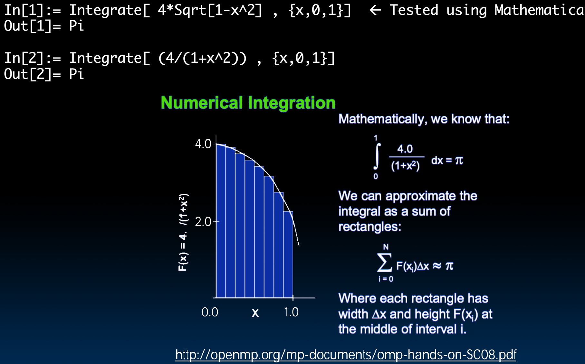
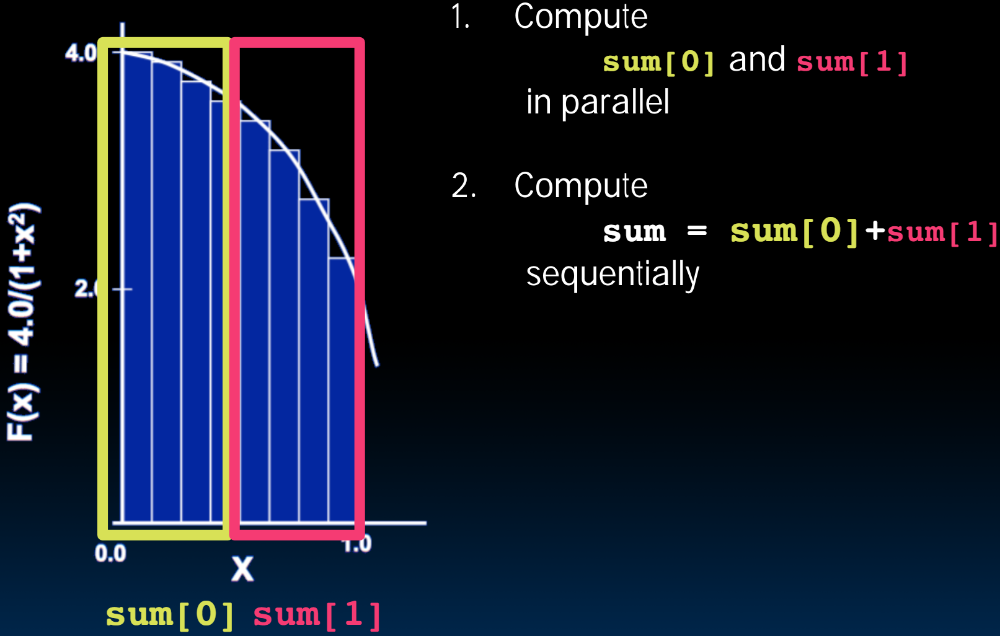

# 34.3-Computing π


Lecture Video Address


本节通过计算π为例演示OpenMP的使用，在这个例子中，我们将计算过程切分，然后组合起来。这是一个很好的fork-join的模型

下面是在数学上计算π的方式



- 标准的方法是对$$y = 4\sqrt{1-x^2}$$从0~1进行积分，得到π/4 * 4 = π
- 但是由于sqrt计算量比较大，因此可以类似的使用$$y = 4 /(1 + x^2)$$从0~1进行积分，得到的也非常接近于π
- 在计算机中进行积分的方式就是将x轴划分成多段，然后计算矩阵的面积求和，当Step无限减小的时候，sum会逐渐逼近真实的积分

## Sequential p

```c
#include<stdio.h>
void main() {
    const long num_steps = 10;
    double step = 1.0 / ((double) num_steps);
    double sum = 0.0;
    for (int i = 0; i < num_steps; i++) {
        double x = (i + 0.5) * step;
        sum += 4.0 * step / (1.0 + x * x);
    }
    printf("pi = %6.12f\n", sum);
}
```

分析代码

- `double x = (i + 0.5) * step`是计算第i个x的坐标，这里+0.5是为了取矩形的中点，要多一个`step * 0.5`
- `4.0 * / (1.0 + x * x)`就是积分的函数，这里用来计算Step对应矩阵的高度
- `4.0 * step / (1.0 + x * x)`就是矩形的面积

```
pi = 3.142425985001
```

- Resembles π, but not very accurate
- Let's increase `num_steps` and parallelize

## shared variable

这里只要加两行：`#include<omp.h>`和`#pragma parallel for`

> 这里没有`omg_set_thread_num()`，会有默认的数量。

```c
#include<stdio.h>
#include<omp.h>
void main() {
    const long num_steps = 10;
    double step = 1.0 / ((double) num_steps);
    double sum = 0.0;

    #pragma parallel for
    for (int i = 0; i < num_steps; i++) {
        double x = (i + 0.5) * step;
        sum += 4.0 * step / (1.0 + x * x);
    }
    printf("pi = %6.12f\n", sum);
}
```

- Problem: each thread needs access to the shared variable `sum`

> 多个线程访问同一个变量，可能会同时读写，导致最终结果出错。

## seperate variable & Sequential sum

为了防止多个thread访问同一个sum变量，因此可以为每一个thread设置一个sum值，然后将最终的sum加起来即可



```c
#include<stdio.h>
#include<omp.h>
void main() {
    const int NUM_THREADS = 4;
    const long num_steps = 10;
    double step = 1.0 / ((double)num_steps);
    double sum[NUM_THREADS];
    for (int i = 0; i < NUM_THREADS; i++)
        sum[i] = 0;

    omp_set_num_threads(NUM_THREADS);

    #pragma omp parallel
    {
        int id = omp_get_thread_num();
        for (int i = id; i < num_steps; i += NUM_THREADS) {
            double x = (i + 0.5) * step;
            sum[id] += 4.0 * step / (1.0 + x * x);
            printf("i = %3d, id = %3d\n", i, id);
        }
    }

    double pi = 0;
    for (int i = 0; i < NUM_THREADS; i++)
        pi += sum[i];
    
    printf("pi = %6.12f\n", pi);
}
```

- 使用常量规定了thread的数量`const int NUM_THREADS = 4;`
- 使用`#pragma omp parallel`而没有加for，这样的语法会自动遍历4个software thread
- 由于这里并没有数组访问，也就不需要进行连续划分，thread0处理的是i = 0, 4, 8的情况 ，thread1处理的是i=1,5,9的情况
- 计算sum就不再是Parallel，而是sequential了：`for (int i = 0; i < NUM_THREADS; i++) pi += sum[i]`

```c
i = 1, id = 1
i = 0, id = 0
i = 2, id = 2
i = 3, id = 3
i = 5, id = 1
i = 4, id = 0
i = 6, id = 2
i = 7, id = 3
i = 9, id = 1
i = 8, id = 0
pi = 3.142425985001
```

- 这样的话效率就非常接近于4倍了

### Scale up: num_steps = 10^6^

我们尝试将NUM_STEPS增大，这样计算的结果就会越来越逼近真实值

```c
#include<stdio.h>
#include<omp.h>
void main() {
    const int NUM_THREADS = 4;
    const long num_steps = 1000000;
    double step = 1.0 / ((double)num_steps);
    double sum[NUM_THREADS];
    for (int i = 0; i < NUM_THREADS; i++)
        sum[i] = 0;

    omp_set_num_threads(NUM_THREADS);

    #pragma omp parallel
    {
        int id = omp_get_thread_num();
        for (int i = id; i < num_steps; i += NUM_THREADS) {
            double x = (i + 0.5) * step;
            sum[id] += 4.0 * step / (1.0 + x * x);
            // printf("i = %3d, id = %3d\n", i, id);
        }
    }

    double pi = 0;
    for (int i = 0; i < NUM_THREADS; i++)
        pi += sum[i];
    
    printf("pi = %6.12f\n", pi);
}
```

```
pi = 3.141592653590
```

- 可以看到，结果更加逼近真实的值了，只是最后一位与结果不同

## Can We Parallelize Computing sum?

但是，计算sum仍然是sequential的，如果Threads的数量比较小还好，但是数量多的时候，比如NUM_THREADS = 1000的时候，`for (int i = 0; i < NUM_THREADS; i++) pi += sum[i]`就会花费很多的时间了。(Amdahl's Law)

能否用并行的方式计算呢？

> Always looking for ways to beat Amdahl's Law …

如下

```c
#include<stdio.h>
#include<omp.h>
void main() {
    const int NUM_THREADS = 1000;
    const long num_steps = 1000000;
    double step = 1.0 / ((double)num_steps);
    double sum[NUM_THREADS];
    double pi = 0;
    for (int i = 0; i < NUM_THREADS; i++)
        sum[i] = 0;

    omp_set_num_threads(NUM_THREADS);

    #pragma omp parallel
    {
        int id = omp_get_thread_num();
        for (int i = id; i < num_steps; i += NUM_THREADS) {
            double x = (i + 0.5) * step;
            sum[id] += 4.0 * step / (1.0 + x * x);
            // printf("i = %3d, id = %3d\n", i, id);
        }
        pi += sum[id];  // parallelize computing sum, Summation inside parallel section
    }
    printf("pi = %6.12f\n", pi);
}
```

- Insignificant speedup in this example(这样做确实加速了), but …
- 结果为：pi = 3.138450662641
- Wrong! And value changes between runs?!

这个问题叫做`race condition`

- What‘s going on?
    - Operation is really `pi = pi + sum[id]`
    - What if >1 threads reads current (same) value of pi, computes the sum, stores the result back to pi?
    - Each processor reads same intermediate value of pi!
    - Result depends on who gets there when
        - A "race" → result is not deterministic

> 假如有两个thread都同时读取了`pi = pi + sum[id]`中=右边的pi，也就是pi的old value，那么最终pi的结果就只有一个`pi + sum[id]`，取决于谁后赋值的

因此我们既要实现并行(包括并行计算sum)，又要避免两个thread同时写pi，下节课来解决这个问题。
