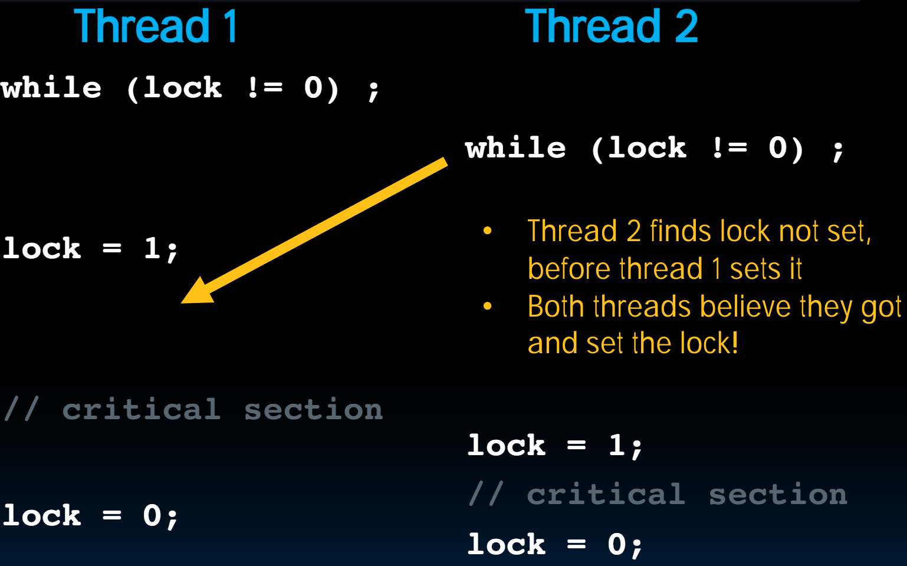

# 34.4-Lock Synchronization


Lecture Video Address


## Problem

race condition:

- Limit access to shared resource to 1 actor at a time
- E.g. only 1 person permitted to edit a file at a time
    - otherwise changes by several people get all mixed up

> 这不仅仅是C或者说OpenMP会发生的，任何的并行问题都会有这样的问题，比如防止两个计算机同时修改一个文件。

## Solution

Take turns:

- Analogy: Only one person get's the microphone & talks at a time

## Lock Synchronization

### Lock & semaphore

在并行分布式计算领域中使用的词叫做锁(Lock)。

- Computers use locks to control access to shared resources
    - Serves purpose of microphone in example
    - Also referred to as "semaphore(信号量)"

> 这个锁也被称作信号量(semaphore)

- Usually implemented with a variable

```c
int lock;
```

- 0 for unlocked
- 1 for locked

### C Synchronization with Locks

下面是用C语言实现lock(只是展示一下Lock的思想)

```c
// wait for lock released
while (lock != 0) ;
// lock == 0 now (unlocked)

// set lock
lock = 1;
    // access shared resource ...
    // e.g. pi
    // sequential execution! (Amdahl ...)
// release lock
lock = 0; 
```

整个过程如下：

1. 当`lock = 1`时，说明有其他线程使用资源，自旋等待Lock被设置为0(被释放)
2. 当锁被释放之后，立即抓住Lock并将其设置为1(锁定)
3. 完成任务后解锁(`lock = 0`)

但是这样能保证同一时间不会有两个Thread访问共享资源吗？看下面的例子。

### Problem

> 在下图中，纵轴方向是时间



- Thread1和Thread2同时越过了while并抓住了Lock，他们都认为自己有访问共享资源的权利。
- Lock本身就是一个共享资源，和普通的共享资源无差，也会遇到race condition

Try as you like, this problem has no solution, not even at the assembly level. Unless we introduce new instructions, that is! (next lecture)

> HLL层面是无法解决这个问题的。

## in Conclusion

- OpenMP as simple parallel extension to C
    - Threads level programming with `parallel for` pragma
    - ≈ C: small so easy to learn, but not very high level and it's easy to get into trouble
- Race conditions – result of program depends on chance (bad)
    - Need assembly-level instructions to help with lock synchronization

> 下一节课会解决这个问题。
