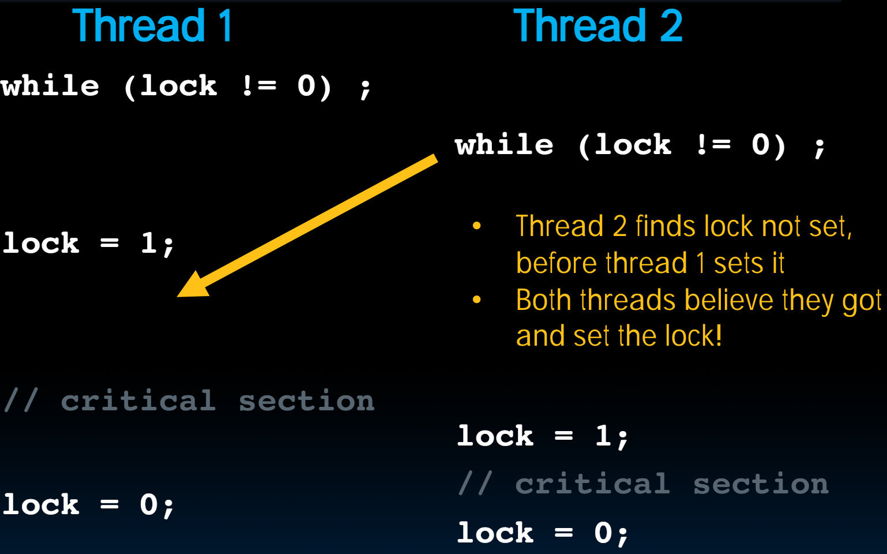
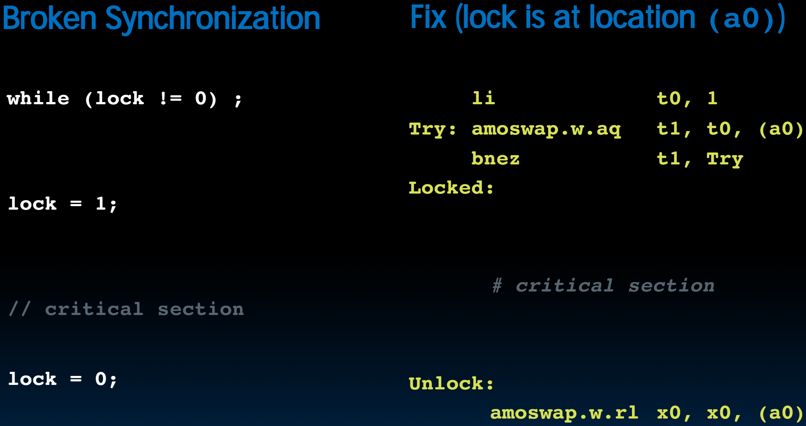

# 35.1-Hardware Synchronization, Deadlock, Livelock & OpenMP Timing


Lecture Video Address


## Review

### OpenMP

OpenMP提供了一种抽象，能够很方便的将并行性添加到C代码当中。

1. OpenMP as simple parallel extension to C
    - Threads level programming with parallel for pragma
    - ≈ C: small so easy to learn, but not very high level and it's easy to get into trouble

```c
for (i=0; i<max; i++) zero[i] = 0;
```

2. Breaks for loop into chunks, and allocate each to a separate thread
    - e.g. if max = 100 with 2 threads: assign 0-49 to thread 0, and 50-99 to thread 1

> 划分的时候将连续的内存划分到一个Thread，这样可以提高Cache的hit rate

3. Must have relatively simple "shape" for an OpenMP-aware compiler to be able to parallelize it
    - Necessary for the run-time system to be able to determine how many of the loop iterations to assign to each thread

> 比如说，双层循环就没法很好的并行化，尽量将其解开成为一层循环。

4. No premature exits from the loop allowed

> 代码中不能有提前退出的情况

- i.e. No `break`, `return`, `exit`, `goto` statements
- In general, don't jump outside of any pragma block

### Data Races & Synchronization

1. Two memory accesses form a data race if from different threads access same location, at least one is a write, and they occur one after another

> 但是两个都是读的话就不会产生race condition

2. If there is a data race, result of program varies depending on chance (which thread first?)

3. Avoid data races by synchronizing writing and reading to get deterministic behavior

4. Synchronization done by user-level routines that rely on hardware synchronization instructions

> 在用户级别(HLL)是无法支持synchronization的，需要依靠Hardware

## RISC-V Atomic Memory Operations (AMOs)

> 所有有相关问题的硬件都需要支持硬件同步，并且能够提供给高级语言实现同步的接口。

### Solution

- Atomic read/write
- Read & write in single instruction: No other access permitted between read and write
- Must use shared memory (multiprocessing)

> 也就是说，硬件实现同步的方案就是原子读写，意味着可以在单个指令中进行读写，并且在读写之间不允许其他任何访问。这是在共享内存空间中进行的。
>
> 共享内存空间：两个线程共享的一部分内存空间。

---

### Common implementations

常见的实现方式有如下两种

1. Atomic swap of `register ↔ memory`

> 将`Register ↔ Memory`这个操作设置为原子操作。在原先的RISC-V中，要实现这个需要分三步，例如将mem与rs1进行交换，那么需要先rs2 = rs1，然后rs1 = mem，最后mem = rs2；在底层是由硬件实现的。
>
> 但是为了实现同步，需要有一个指令能够直接实现rs1 ↔ mem，当硬件接受这个指令的时候也能实现这个任务

2. Pair of instructions for "linked" read and write
    - write fails if memory location has been "tampered" with after linked read

> 两一个方法就是用于将读写指令给链接起来。如果在链接读取后内存位置被“篡改”，写操作将失败。

RISC-V has variations of both, but for simplicity we will focus on the **former**

> 这里我们只讲前一种

### AMO

> ~到这里，硬件实现同步的方式的思路就明确了，在之前，C语言中的pi=pi+sum[id]会出现多个threads同时读取pi的old-value，然后赋值，这样后面的会覆盖前面的结果，而不是将sum[id]累加。~
>
> ~这样的本质原因就是pi=pi+sum[id]这个操作会被翻译为多个汇编指令，硬件也是一个指令一个指令完成，当完成中间的一条指令的时候就有可能被其他指令给覆盖。~
>
> ~解决办法就是提供一种原子指令，将pi=pi+sum[id]翻译为这种原子指令从而将原先多个指令完成的任务一气呵成，从而避免了多个指令无法立即完成的问题~
>
> 上面这个思路是错误的，硬件解决的不是`pi=pi+sum[id]`这个操作的问题。简单的操作可以原子化，但如果a = a + b + c + d这样的操作或者希望多条语句不被打断就无法原子化了。所以硬件实现同步并不是要将这些内容原子化。下面会有说明。

- AMOs atomically perform an operation on an operand in memory and set the destination register to the original memory value

> 回想一下，如果希望将内存中的5加上10，需要进行的操作是健将内存中的值加载到Register，然后在Register中计算出结果再写回到内存当中，这是一个三步的过程。
>
> AMO(atom memory operation)提供硬件支持，允许用一个指令就完成这三个操作，中间没有其他线程可以打断

- R-Type Instruction Format: `Add`, `And`, `Or`, `Swap`, `Xor`, `Max`, `Max Unsigned`, `Min`, `Min Unsigned`（这些指令都支持AMO）

> 这里的`Add`是支持`mem = mem + reg`，而不是`rd = rs1 + rs2`的操作

如下是AMO的格式，其中opcode表明是AMO

| operation | ordering | ordering | src  | addr | width  | dest | AMO    |
| --------- | -------- | -------- | ---- | ---- | ------ | ---- | ------ |
| funct5    | aq       | rl       | rs2  | rs1  | funct3 | rd   | opcode |
| 5         | 1        | 1        | 5    | 5    | 3      | 5    | 7      |

- **.aq（acquire）**：在此指令之前的所有内存操作都在此指令之前完成。
- **.rl（release）**：在此指令之后的所有内存操作都在此指令之后完成。

### Example: amoadd

以amoadd操作为例

Add指令格式为: 

```assembly
amoadd.w rd, rs2, (rs1)
```

rs1中保存着Memory Address，x[rs1]表示rs1的值

所做的任务如下：

1. `x[rd] = M[x[rs1]]`
2. `M[x[rs1]] = x[rs2] + M[x[rs1]]`

所以这个指令完成了这两步。

---

执行过程如下

```c
t = M[x[rs1]]; // 先将M[x[rs1]]赋值到变量t
x[rd] = t;
M[x[rs1]] = t + x[rs2];
```

在一次操作中，实现了读取旧址，对旧址进行加法，然后将其作为新值放回去，这是一种原子操作。

- i.e., the value in memory Store at address in rs1 the calculation 
- aq(acquire) and rl(release) to insure in order execution

## Hard Synchronization

RISC-V实现同步的关键指令就是swap

### AMO swap

首先来看看swap的作用是什么

```
amoswap.w.aq t1, t0, (a0)
```

这条指令在交换前从内存读取数据并保存到`t1`寄存器，然后将`t0`寄存器的值写入到由`a0`指向的内存地址。使用`.aq`标志可以确保指令的内存顺序性。

- `amoswap`：表示这是一个交换操作。
- `.w`：表示操作的数据宽度是32位（word）。
- `.aq`：表示附加顺序（acquire），是一种内存序列化标志，用于确保内存操作的顺序，这里就是先读取`Mem[a0]`的值到t1，然后再`Mem[a0] = t0`
- `rd`：目标寄存器，这里是`t1`。
- `rs2`：源寄存器，这里是`t0`。
- `rs1`：内存地址寄存器，这里是`a0`。

步骤如下：

1. **读取内存**：从由`rs1`（`a0`）指向的内存地址读取32位数据，并将其存储到目标寄存器`rd`（`t1`）。
2. **交换操作**：将源寄存器`rs2`（`t0`）的值写入由`rs1`（`a0`）指向的内存地址。

### Review: Lock Problem

下面来复习一下之前在软件中使用Lock的问题

```c
// wait for lock released
while (lock != 0) ;
// lock == 0 now (unlocked)

// set lock
lock = 1;
    // access shared resource ...
    // e.g. pi
    // sequential execution! (Amdahl ...)
// release lock
lock = 0; 
```



- 这里希望的是`while(lock != 0)` 与 `lock = 1`这两个操作能够一气呵成，在进入循环的同时立即set lock
- 这样就能防止其他的Thread进入。

下面看看RISC-V是如何解决这个问题的。

### RISCV Critical Section

>

解决方式就是将`while(lock != 0)`判断与`lock = 1`设为原子操作。

- lock变量的内存地址存储在寄存器a0中
- The lock is "`set`" if it is 1; it is "`free`" if it is 0 (it's initial value)

过程如下

```assembly
li t0, 1 # Get 1 to set lock
Try: amoswap.w.aq t1, t0, (a0) # t1 gets old lock value
# while we set it to 1
bnez t1, Try # if it was already 1, another
# thread has the lock,
# so we need to try again
… critical section goes here …
amoswap.w.rl x0, x0, (a0) # store 0 in lock to release
```

> critical section(临界区)

分析代码：

- `li t0, 1`: t0寄存器设置为1
- `amoswap.w.aq t1, t0, (a0)`: 将a0地址的变量，也就是lock赋值到t1，将t0的value，也就是1赋予lock

> 这里的`aq`保证先读取lock，然后赋值lock

- `bnez t1, Try`: 当t1不为0，也就是lock不为0的时候，继续循环
- 否则的话，进入critical section，也就是可以同步的块
- `amoswap.w.rl x0, x0, (a0)`，将lock赋值为0

为什么在获取lock的时候需要将其置为1呢

- 当前的Thread需要等到lock为0的时候才能进入循环
- 如果lock此时等于1，那么置为1是没有任何影响的
- 但是，当==**另一个Thread设置lock为0的时候**==，==**swap能够立即读取lock的0并且将lock设置为1**==，这是一个原子操作，阻止了两步之间有其他进程插入

> 实现synchronization并不是将需要同步的过程原子化，而是在这个过程前后使用原子化的操作进行lock和unlock。
>
> 多个线程一直在获取lock并将其设置为1，那么第一个获取lock为0的Thread能够进入critical section

### Lock Synchronization



- 在编程的时候，`while(lock != 0);` 和 `lock = 1;`这两个操作仅仅是逻辑上的思路，高级语言这样写是不能实现lock的
- 实现Lock Synchronization是在编译的时候，插入如上的几个汇编指令，由硬件实现Lock

## OpenMP Locks

下面是OpenMP的lock的语法

### syntax

```c
#include<stdio.h>
#include<stdlib.h>
#include<omp.h>

int main(void) {
    omp_lock_t lock;
    omp_init_lock(&lock);

    #pragma omp parallel
    {
        int id = omp_get_thread_num();

        // parallel section
        // ...

        omp_set_lock(&lock);
        // start sequential section
        // ...

        printf("id = %d\n", id);

        // end sequential section
        omp_unset_lock(&lock);

        // parallel section
        // ...
    }

    omp_destroy_lock(&lock);
}
```

- `omp_lock_t lock`声明lock变量
- `omp_init_lock(&lock)`初始化lock
- `omp_set_lock(&lock)`锁定lock，如果lock已经被占住了，那么就会在这里**循环等待**。
- `omp_unset_lock(&lock)`释放lock

要注意的几点：

1. 在`set`与`unset`之间是sequential section，然后前后是Parallel section
2. 这几个接口都是将Lock的操作封装起来。但与普通的接口不一样的是，这些接口底层并不是C语言，而是在编译的时候会翻译为特殊的汇编语言。从而实现Hardware synchronization。
3. 所以实现synchronization的关键就是AMO，Hardware synchronization

### Synchronization In OpenMP

Typically are used in libraries of higher level parallel programming constructs

> 不仅是C语言，其他的高级语言也都会提供相应的接口或者写法来同步并行操作，以确保同一时间只有一个线程可以拥有这些资源(lock或者synchronization)。
>
> 而这些方法是在编译或者解释的时候，通过调用下层的AMO来实现的

---

OpenMP还有其他不同用途的`#pragma`

E.g. OpenMP offers `#pragmas` for common cases:

- critical
- atomic
- barrier
- ordered

OpenMP offers many more features

- E.g., private variables, reductions
- See online documentation
- Or tutorial at [here](http://openmp.org/mp-documents/omp-hands-on-SC08.pdf)

### Example: OpenMP Critical Section(Mutual exclusion)

> Critical Section(临界区)

下面使用使用`#pragma omp critical`的例子，实际效果和之前的效果一样，但是这样的写法更方便，更紧密了。

```c
#include<stdio.h>
#include<omp.h>
void main() {
    const int NUM_THREADS = 1000;
    const long num_steps = 1000000;
    double step = 1.0 / ((double)num_steps);
    double sum[NUM_THREADS];
    double pi = 0;
    for (int i = 0; i < NUM_THREADS; i++)
        sum[i] = 0;

    omp_set_num_threads(NUM_THREADS);

    #pragma omp parallel
    {
        int id = omp_get_thread_num();
        for (int i = id; i < num_steps; i += NUM_THREADS) {
            double x = (i + 0.5) * step;
            sum[id] += 4.0 * step / (1.0 + x * x);
            // printf("i = %3d, id = %3d\n", i, id);
        }

        #pragma omp critical
        pi += sum[id];  // parallelize computing sum, Summation inside parallel section
    }
    printf("pi = %6.12f\n", pi);
}
```

Mutual(互斥) exclusion: Only one thread at a time can enter a `critical` region. (Threads wait their turn)

> 至此，可以将后续for 1000的sequential section合并到Parallel section当中，提升了效率。

## Deadlock & Livelock

> 在引入Lock之后，可以解决race condition的问题，但是又引入了新的问题，死锁(Deadlock)和活锁(Livelock)

Deadlock: a system state in which no progress is possible

> 死锁是指多个操作单元相互等待，导致整个系统停止。而活锁则是类似的概念，但在活锁中，尽管存在动作，但仍然被卡住了。死锁是双方互相等待，而没有任何进展。

### Deadlock

如下是一个现实生活中死锁的例子，四个方向的车都无法动弹。


以下是著名的死锁问题，哲学家就餐问题。

Dining Philosopher's Problem:

- Think until the left fork is available; when it is, pick it up
- Think until the right fork is available; when it is, pick it up
- When both forks are held, eat for a fixed amount of time
- Then, put the right fork down
- Then, put the left fork down
- Repeat from the beginning


出现的问题是，如果每个人都拿起左边的fork，那么所有人都会在等待右边的fork，此时所有人都陷入到死锁的状态，都无法运动。

### Livelock

假设两个机器人以相对的方向走同一时间只允许两个人通过的通道，他们一开始彼此挡住了，然后每过相同的时间就换一个位置。

由于两个机器人移动的时间是一样的，所以总是处于被挡的状态，即使双方一直在移动，但是仍然无法前进。

这就是活锁。

---

> deadlock（死锁）和livelock（活锁）都是与多线程或进程管理相关的重要概念。
>
> 1. **死锁（Deadlock）**：
>    死锁指的是系统中的几个进程或线程因为彼此占有了对方所需的资源而无法继续执行的状态。死锁通常发生在多个进程同时等待系统资源（如内存、文件、设备等）的情况下，每个进程都在等待其他进程释放它所需要的资源，导致所有进程都无法继续运行。要解决死锁，常见的方法包括资源分配策略、资源预先分配和资源的超时释放等。
>
> 2. **活锁（Livelock）**：
>    活锁是指系统中的几个进程或线程在尝试解决死锁或资源争夺问题时，反复改变状态而无法继续正常执行的状态。不同于死锁，活锁中的进程或线程并不是被阻塞，它们在不断重试中消耗资源，却无法取得进展。解决活锁的方法通常涉及到引入随机性或者改变进程的执行顺序，以避免进程陷入无休止的竞争状态。
>

死锁需要解决，但是本课程并不予讨论。

## OpenMP Timing

我们需要估计时间，用来测试不同参数下哪个并行程序运行的更快。

> 这与CS61A、B中进行算法分析并计算基本的原始操作次数，从而得出所谓的运行时间，即原始步骤的数量（其实也就是时间复杂度）。这个数量是随着输入规模增长而增长的。
>
> 但是在并行线程中，我们不太关心每个线程执行了多少步骤，而是比较不同并行化的速度。

之前说过，不要使用普通的时间记数，因为那样计算时间也是需要线程的。下面是OpenMP提供的方式。

Elapsed(已经过去的) wall clock time:

```c
double omp_get_wtime(void); 
```

- Returns elapsed wall clock time in seconds
- Time is measured per thread, no guarantee can be made that two distinct threads measure the same time
- Time is measured from "some time in the past", so subtract results of two calls to `omp_get_wtime` to get elapsed time

可以两次调用这个函数，然后相减得到执行的时间。

> 在计算机领域中，"wall clock time"（墙上钟时间）通常指的是从一个事件或操作开始到完成所经过的实际时间，即我们通常所说的"实际时间"或"挂钟时间"。它是指在现实世界中真正流逝的时间，包括所有可能的延迟、等待和计算时间，与计算机系统中的其他抽象时间测量（如CPU时间）有所区别。 Wall clock time是指用来度量一段程序实际运行所需的时间，包括等待输入/输出、线程切换等。
