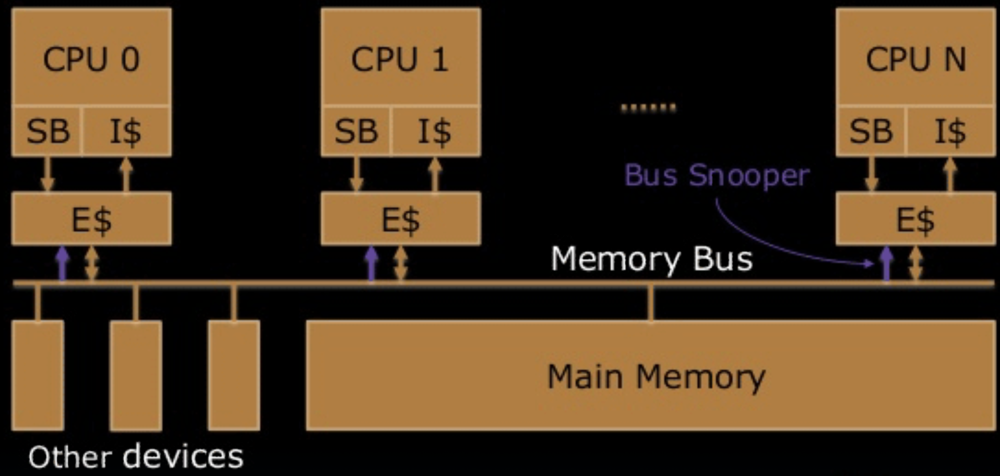
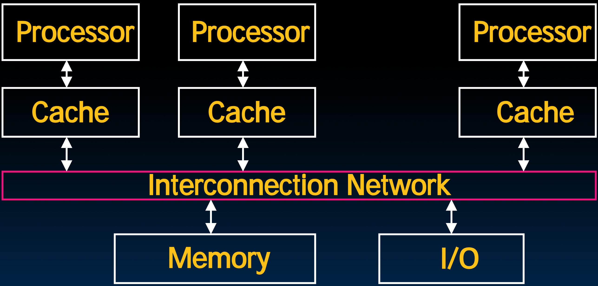
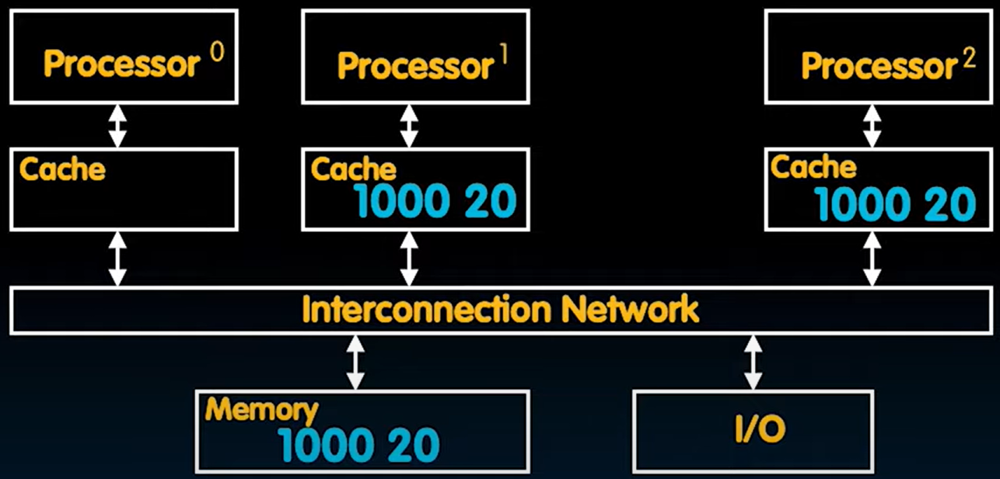
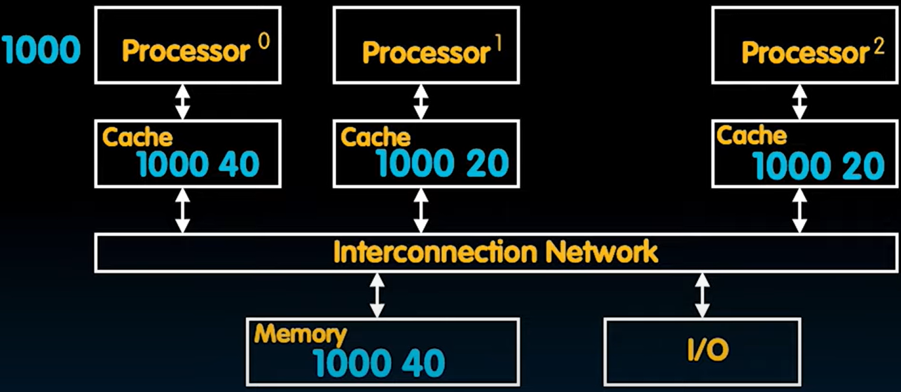

# 35.2-Shared Memory and Caches, SMP


Lecture Video Address


前面几节课已经讨论了使用OpenMP在软件层面支持并行，包括处理race condition，怎么使用lock，以及会出现的deadlock是什么

下面要讨论在硬件层面是怎么支持并行的，特别是shared Memory和Cache，其中L1和L2 Cache是独立的，就可能出现不一致的问题（L3是共享的，不会有不一致的问题，所以本节先不予讨论）

> 之前讲的都是software Threads，接下来要讲的是Hardware Threads。
>
> 这些问题在之前设计的Single-Core CPU是不存在的，但是由于使用了multiprocessor，才引发了如下的讨论。

## Shared memory

先来解决Shared Memory的问题

### SMP: Symmetric Multiprocessor

如下是multiprocessor CPU chip的模型

> All multicore computers today are SMP，所以分析多核计算机的时候都需要参考SMP

SMP: (Shared Memory) Symmetric(对称的) Multiprocessor

- Two or more identical CPUs/Cores
- 每一个cores都连接着Memory bus，与Memory和其他的device进行连接

> 操作设备的方法就是内存地址映射，将内存的一部分地址映射到device当中，所以可以用Memory bus与cores连接

- 每个cores都有各自的caches，其中L1、L2 Caches是不共享的，L3 Cache是共享的
- 在Memory bus以上的是独立的cores，在以下的是共享的Memory
- Single shared coherent(一致的) memory。

> 这里的一致指的是所有CPU所共享的memory的内容都是一致的，不存在不一致的问题。

---

> 对称多处理器（Symmetric Multiprocessor，SMP）是一种计算机体系结构，其中多个处理器核心共享同一组内存资源。SMP系统中的每个处理器核心都可以访问共享的主存储器，这使得多个处理器能够同时运行多个程序或线程，从而提高了系统的整体性能和并行处理能力。SMP架构通常用于需要高性能和可扩展性的应用，如服务器和高性能计算领域。
>
> 在对称多处理器（SMP）架构中，"**Symmetric**"（对称）指的是系统中的处理器核心在硬件和软件层面上是对等的，它们具有相同的访问权限和功能。换句话说，每个处理器核心都可以通过相同的总线或互联网络访问系统中的共享资源，如内存和设备。这种对称性使得操作系统能够以相似的方式管理和调度各个处理器核心，而无需关心它们之间的具体物理配置或性能差异，从而简化了系统的设计和管理。简单来说，就是每个Core的地位是一致的

### Multiprocessor Key Questions

如下是任何multiprocessor system共有的问题，并不仅仅是上述一个CPU的Model的问题。例如两个不同的芯片通信、分布式系统也会考虑这样的问题。

- Q1 – How do they share data?

- Q2 – How do they coordinate?

    > 这里的coordinate是指在执行的过程中，在代码逻辑上的协调。

- Q3 – How many processors can be supported?

### Shared Memory Multiprocessor (SMP)

在Shared Memory中解决方式如下

- Q1 – Single address space shared by all processors/cores

> 这样就需要Page Table在映射地址的时候，不同的cores的发出的相同或者不同的虚拟地址也需要映射为相同的物理地址。
>
> 多个cores本是独立的，要进行数据共享只能通过Memory这个中介，不能直接共享

- Q2 – Processors coordinate/communicate through shared variables in memory (via loads and stores)
    - Use of shared data must be coordinated via synchronization primitives (locks) that allow access to data to only one processor at a time

> 可以共享数据之后，就可以通过共有的变量来协调不同进程之间的任务。但是访问这些变量也需要同步，不能让多个processor同时访问这些变量，因此也需要lock synchronization。

- All multicore computers today are SMP

## Multiprocessor Caches

如下的模型先忽略L3 Cache

- Memory is a performance bottleneck even with one processor
- Use caches to reduce bandwidth demands on main memory

> Cache的作用不仅仅是提高访问速度，还有提高带宽。
>
> 例如在单核处理器中的IMEM和DMEM，使用两种Cache将Memory划分成两个部分：假设Memory一次只能接受一个地址输出一个数据，但是有了Cache，就可以提前将内容存储在多个caches中，这给processor提供了一层抽象，可以同时从Memory中读取多个数据。
>
> 如果在Single-Cycle中这没什么，以为读取Instruction和Data是不同时间段的，不会出现同时读取两部分的情况。但是为了提高吞吐量，我们实现了Pipeline，此时有同一时间分别进行IF和MEM操作，也就是说，正因为有了Cache，才能帮助实现流水线。
>
> 在multiprocessor中使用SMP，因此提高memory的带宽或者说并行性的重要性就越发突出，因此这里我们重点研究Cache的这个功能。
>
> 现在多个processor，每个都有独立的Cache但是相同的clock cycle，这些caches可以并行访问，也有相同的作用。

- Each core has a local private cache holding data it has accessed recently
- Only cache misses have to access the shared common memory

> 只有当Cache miss的时候才会要真正访问内存，此时才会出现内存带宽的问题。（这里先不考虑Shared L3 Cache）

## Cache Coherency Issue

下面是一个例子

What if? Processors 1 and 2 read Memory[1000] (value 20)

- 此时processor1和processor2的Cache都有了`Memory[1000]`的数据的copy 20

Now: Processor 0 writes Memory[1000] with 40

> 这里我们为了讲课方便，使用Write-through，在写到Cache的同时更新Memory的值

- 此时`Memory[1000] = 40`，processor1和processor2中的值与Memory中不一致了。

> 在Single-Core CPU中就不存在不一致的问题，但是在multiprocessor就会出现不一致问题。
