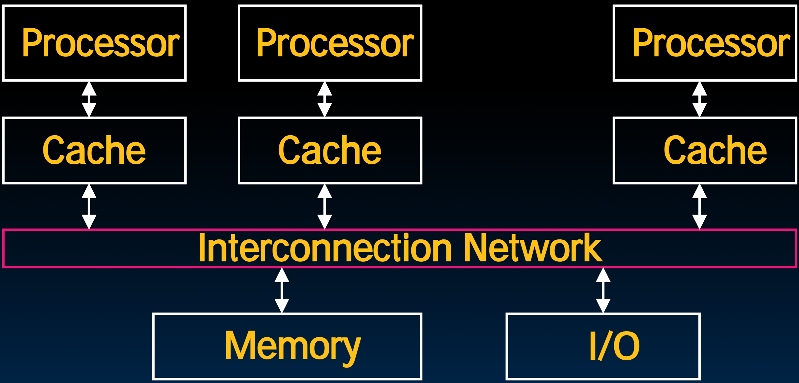

# 35.3-Cache Coherency


Lecture Video Address


> Cache Coherency(一致性)

本节探讨缓存一致性，这是构建多核系统最困难的部分之一。

> 缓存一致性和多线程下的race condition的本质一样，都是在多线程条件下的一致性问题；race condition是软件层面的，Cache coherency是硬件层面的

## Keeping Multiple Caches Coherent

- Architect's job: shared memory → keep cache values coherent
- Idea: When any processor has `cache miss` or `writes`, notify other processors via interconnection network

> 在上一节我们讨论过，在SMP中，连接其他处理器的方式是通过Shared memory作为中介。此处为了实现Cache coherency，引入了另一种通信方式，interconnection network。
>
> 通过Interconnection network，Cache可以请求其他Cache中某个block中的值，或者一起爱Cache中的某个block失效，通过unset valid bit即可。

- notify的方式如下：
    - If only reading, many processors can have copies
    - If a processor writes, invalidate any other copies

> 如果当前processor仅仅是read的话，那么不会引发不一致的问题，不需要做什么。但是如果processor要进行Write，那么就会引发不一致问题，就必须使其他Cache的副本失效。
>
> 为了减少讨论的情况，也为了简化电路，即使写入的值与原先的值一样，我们仍然会认为写入了新值，这与在single-core中的情况一样

- Write transactions from one processor, other caches "snoop" the common interconnect checking for tags they hold
    - Invalidate any copies of same address modified in other cache

> "Snoopy"通常指的是计算机体系结构中的一种缓存一致性协议，例如总线上的Snooping。这里的Snoopy是指将每个Core的每个块分类为几种状态。在要进行修改的时候根据状态进行不同的操作。
>
> 在进行invalidate的时候，使用Index寻找set或者block然后进行tags比对以确保是同一位置的copy，然后根据State操作。

## How Does HW Keep $ Coherent?

### Snoopy Protocol

- 每个Cache都会跟踪其中的block的状态：在Cache中每个block都会有额外的标记位，用于记录block的状态
- 这些状态都是站在各自processor的角度看待Cache中block的状态的

| State    | desc                                                         | 从processor的视角下说明                                      |
| -------- | ------------------------------------------------------------ | ------------------------------------------------------------ |
| Invalid  | not in cache                                                 |                                                              |
| Shared   | up-to-date data, other caches may have a copy                | 在processor的视角下，这个block是最新的，并且其他的Cache也可能有这个数据，定义状态为Shared |
| Modified | up-to-date data, changed (dirty), **no** other cache has a copy, OK to write, memory out-of-date (i.e., write back) | 在processor的视角下，这个block的数据是已经修改的(但是dirty，也就是没有写回到内存当中，与内存中不一致，这出现在Write-back的情况中)，但是其他的Cache是没有这个block对应的copy的，因此在Write-back的时候可以放心的写回到内存。 |

如下是自己的理解

- 在multiprocessor中，使用Invalid，Shared，Modified这几个状态来取代了在single-core中的valid bit, dirty bit

如下是对应表

|          | valid bit | dirty bit |
| -------- | --------- | --------- |
| Invalid  | 0         | -         |
| Shared   | 1         | 0         |
| Modified | 1         | 1         |

唯一不同的是，为了维持Cache一致性，在设置Modified的时候，需要将Shared的状态设为Invalid。

---

有了Invalid，Shared，Modified已经可以工作了，下面的Exclusive和Onwer是为了提高效率添加的。

| State           | desc                                                         | 从processor的视角下说明                                      |
| --------------- | ------------------------------------------------------------ | ------------------------------------------------------------ |
| Exclusive(独占) | up-to-date data, **no** other cache has a copy, OK to write, memory up-to-date | 与Modified很像，唯一的区别是Exclusive的Cache不是dirty的，也就是说与memory中的数据一致，同时没有其他的Cache有这个block的copy。这个状态的优点如下  1. Avoids writing to memory if block replaced  2. Supplies data on read instead of going to memory |
| Owner           | up-to-date data, other caches **may** have a copy (**they** must be in Shared state) | This cache is one of several with a valid copy of the cache line, but has the exclusive right to make changes to it. It must broadcast those changes to all other caches sharing the line.  The introduction of owned state allows dirty sharing of data, i.e., a modified cache block can be moved around various caches without updating main memory.  The cache line may be changed to the Modified state after invalidating all shared copies, or changed to the Shared state by writing the modifications back to main memory.  Owned cache lines must respond to a snoop request with data. |

同样，Exclusive和Onwer也

先介绍一下Exclusive:

- 与Single-core不一样，Single-core当写入的内容与old value一致时也会认为是写了新内容，设置dirty bit = 1，在block replacement的时候需要替换内存中的值
- 但是在multiprocessor，添加了Exclusive状态，也就是在write的时候如果写入的新值与old value一致的话会记录下来，在block replacement的时候就不需要写入到内存当中了。

下面详细介绍一下Onwer：

1. Owner表示当前的Cache是修改过的

    - 与Modified不同的是，其他的Cache也有这个copy(但是这些copy的状态是Shared的)

        > 也就是说对于多个Cache的同一个block的copy，有一个Cache的状态是Onwer的，其余的都是Shared的，这个Onwer有很特殊的权利

    - 与Exclusive不同的是，Owner的block是dirty的

2. 假设所有的copy都是20，Onwer将其改为40但并未同步到内存当中，然后通过interconnection network将40推送到其他的Cache当中，这样不需要通过memory也能共享数据了。

3. 但是如果有的Cache没有这个block的copy，就无法得到这个更新，而此时memory中的数据仍然是20，那么这个Cache会优先发出请求(避免先访问memory，也是为了提高性能)，询问谁是Onwer，然后Onwer会响应这个请求将40发送给那个Cache，然后将其设置为Shared状态。

> Onwer状态的存在可以在不用访问内存的情况下读取不一致的信息。

---

几种状态之间都是可以相互转换的，这有一个非常复杂的状态转换图，讨论如何在几个状态之间转换，但是61C不讲这个，下面简要讲一下Onwer转化为Modified和Shared的过程。

4. Onwer可以转化为Modified和Shared:
    - 如果某个processor想要修改这个block，Cache可以将其设置为Modified，然后即将其他的Cache的block设置为invalidate
    - 如果Onwer的内容被同步到memory当中，那么就会被修改为Shared（在Onwer的时候已经将修改的内容同步到其他的Cache当中了）

### MOESI

Memory access to cache is either

- <u>M</u>odified (in cache)
- <u>O</u>wned (in cache)
- <u>E</u>xclusive (in cache)
- <u>S</u>hared (in cache)
- <u>I</u>nvalid (not in cache)

这几个状态取代了single-core的`valid bit`和`dirty bit`，构成了multiprocessor的新状态

> 如下表，最左侧一列表示"我"的状态，顶头一行表示"其他的Cache"的状态

|      | M    | O    | E    | S    | I    |
| ---- | ---- | ---- | ---- | ---- | ---- |
| M    | ×    | ×    | ×    | ×    | √    |
| O    | ×    | ×    | ×    | √    | √    |
| E    | ×    | ×    | ×    | ×    | √    |
| S    | ×    | √    | ×    | √    | √    |
| I    | √    | √    | √    | √    | √    |

下面是一些解释

|      | M    | O    | E    | S    | I    | desc                                                         |
| ---- | ---- | ---- | ---- | ---- | ---- | ------------------------------------------------------------ |
| M    | ×    | ×    | ×    | ×    | √    | 当我是Modified的时候，其他的block必须是invalid的，并且Modified表示dirty，还未同步到memory |
| O    | ×    | ×    | ×    | √    | √    | 我是Onwer的时候，其他的可以是Shared，也可以是Invalid         |
| E    | ×    | ×    | ×    | ×    | √    | 我是Exclusive的时候，其他的必须是inclusive的，Exclusive不是dirty的，也就是memory与Cache一致(这个是为了防止替换的时候修改memory的内容) |
| S    | ×    | √    | ×    | √    | √    | 我是Shared，其他的可以是Onwer，可以是Shared，也可以是Invalid |
| I    | √    | √    | √    | √    | √    | 我是Invalid的时候，其余的任何情况都可以。                    |

- 查看对角线，可以看到，**不能同时拥有两个Exclusive，Onwer，Modified**
- Onwer是一种很高效的方式，避免了每个Cache从memory中读取值，而是从Onwer中读取。

> Onwer就好像是Cache之间可以彼此交谈，不必去很远的地方(Memory)，而是彼此可以同学，比如向其他的Cache请求一块block。memory就像是一个老师一样在前排，而Cache相当于在低下交流的学生。

Snooping/Snoopy Protocols e.g., the Berkeley Ownership Protocol

See https://en.wikipedia.org/wiki/MOESI_protocol

### process

下面看看在这个协议下Cache是怎么工作的

Example, now with cache coherence

- Processors 1 and 2 read Memory[1000]
- Processor 0 writes Memory[1000] with 40

1. Processor1和Processor2都有`Memory[1000]`的copy 20（此时两个Cache的block都是Shared）

2. 此时Processor 0想要write: `Memory[1000] = 40`，其会invalidate其余Cache的对应的block（状态由Shared改为Invalid）

![write Memory[1000] = 40](.image/image-20240703222745112.png)

3. 如果不使用Onwer状态的话，那么后续会将40写回到Memory（Processor 0的Cache的block的State会改成Shared）

4. 还有另一种选择：如果有Onwer的状态，那么Processor0在Cache中写了40之后，会将processor1和processor2的值都改为40。
4. 总之，绝对不会出现一个cache的block为40，另一个的为20(这里状态全部为valid)，caches之间保持一致性。Cache与Memory可能不一致，当Mem[1000]要被替换的时候，40必须要写入内存。

> 这里就不具体介绍怎么在状态之间转换了。

## False Sharing

> 一致性问题解决了，下面是关于效率的问题。

下面是当Cache的block非常大的时候要遇到的问题。

- Suppose block size is 32 bytes(4 words)
- Suppose Processor 0 reading and writing variable X, Processor 1 reading and writing variable Y
- Suppose in X location 4000, Y in 4012
- What will happen?

- Block ping-pongs between two caches even though processors are accessing disjoint variables

> 分析过程：
>
> - Cache0和Cache1都有 Tag = 4000的block
> - Cache中以一个block为单位标注状态
> - 没有Onwer，只有Modified状态
>     - 当Cache 0写4000的时候，会将Cache1的block标注为Invalid
>     - 当Cache 1写4012的时候，会从内存中重新读取Tag = 4000的block，然后应该会将Cache 0的block写回到Memory并标为Invalid(为了保持Cache的一致性，一个block不能既有Shared又有Modified)
> - 有Onwer
>     - 当Cache 0写4000的时候，会将Cache1的4000的内容置换，Cache 0的状态为Owner
>     - 当Cache 1写4012的时候，会将Cache0的4012的内容置换，Cache1的状态为Onwer
>
> 只有Modified非常麻烦，即使是有Onwer，块也要在两个Cache之间进行交换。产生了ping pong effect。
>
> 由于其还是使用的是分离的独立的Cache，无法让两个Cache写入同一个区域，避免block的传递。

- Effect called **false sharing**
- How can you prevent it?
    - 有一种方式是减小block size，block越大，那么两个Cache写入同一个block的几率越大。
    - 从编程的角度，如果知道block size，可以在编程的时候尽量不要让多个processor享有共同的block(当然，这样可能很麻烦，而且移植到其他的计算机时block size可能改变，这样就不一定能够生效了)

> 总之，当多个processor有一个block的时候，就很容易出现False sharing，要尽量避免

## Cache miss

下面总结一下Cache的三种miss，前三种是single-core中提到的，作为回顾。第四种是在multiprocessor中出现的，就是

| miss                                                        | desc                                                         | solution                                                     |
| ----------------------------------------------------------- | ------------------------------------------------------------ | ------------------------------------------------------------ |
| Compulsory (cold start or process migration, 1st reference) | First access to block, impossible to avoid; small effect for long- running programs | increase block size (increases miss penalty; very large blocks could increase miss rate) |
| Capacity                                                    | Cache cannot contain all blocks accessed by the program even with perfect replacement policy in fully associative cache | increase cache size (may increase access time)               |
| Conflict                                                    | Multiple memory locations map to the same cache location     | Solution 1: increase cache size Solution 2: increase associativity (may increase access time) Solution 3: improve replacement policy, e.g.. LRU |
| Coherence Misses(也叫作communication miss)                  | Misses caused by coherence traffic with other processor Also known as communication misses because represents data moving between processors working together on a parallel program    For some parallel programs, coherence misses can dominate total misses | reduce block size;...(上面提到了)                            |

## in Conclusion

OpenMP as simple parallel extension to C

- Threads level programming with `parallel for` pragma, `private` variables, `reductions`, …
- ≈ C: small so easy to learn, but not very high level and it's easy to get into trouble

TLP

- Cache coherency implements shared memory even with multiple copies in multiple caches
- False sharing a concern; watch block size!
