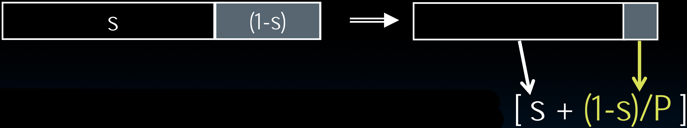
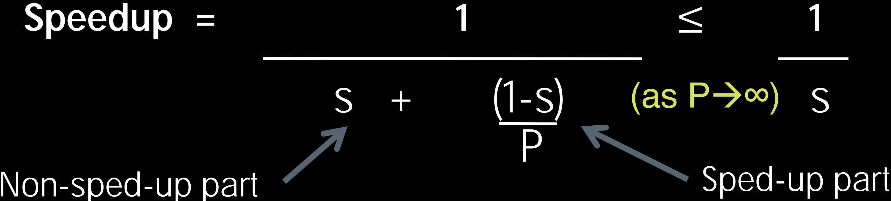
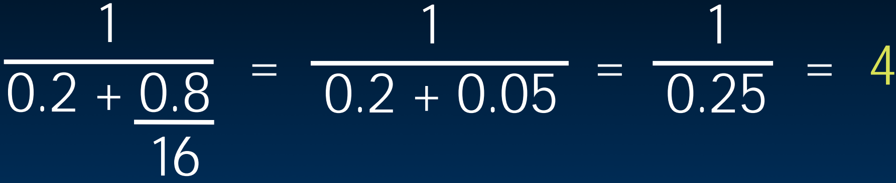
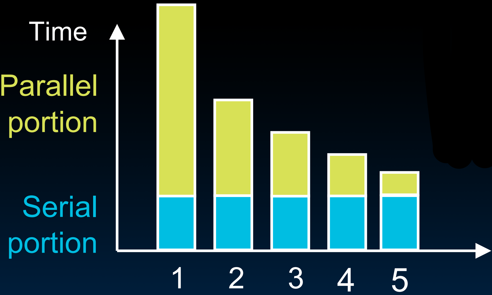
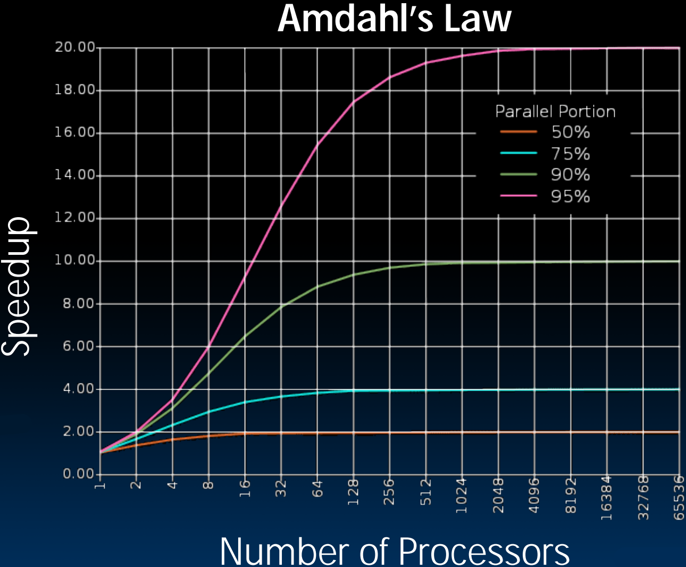

# 36.1-Amdahl's Law


Lecture Video Address


> Amdahl's Law(阿姆达尔定律)

从本节开始，将会讲述新的抽象概念，MapReduce，并且会用多种语言来实现它，尤其是在Python中实现的Spark。

但是首先，要先讲述一个定律(这个定律也适用于前几节)。

> Amdahl's Law 是一个计算性能提升的经典法则，主要用于评估**并行计算的效率**。它由 Gene Amdahl 提出，指出在提升系统中某一部分的性能时，受到该部分运行时间比例限制，整体性能提升受到限制。具体来说，如果某个程序中有一部分可以并行化，比如可以在多核处理器上同时运行，Amdahl's Law 提供了一个公式来估计总体速度提升的上限。

## Amdahl's (Heartbreaking) Law

> 有时Amdahl's Law也叫作Amdahl's Heartbreaking Law，Heartbreaking(心碎)的原因是无法超越这个定律。

下面介绍一下Amadahl's law的推导过程

---

Speedup due to enhancement E:

> E可能是升级GPU，可能是升级内存等部分带来的在并行部分的提升。

$$
Speedup\space w/E = \frac{Exec \space time \space w/o \space E}{Exec \space time \space w/E}
$$

> - `w/E` = with E, `w/oE` = without E
> - 如果Exec time with E是without E的一半，那么结果就是2×
> - 在形容加速的时候也不建议使用百分比，比如说1.5×而不是150%

Example

- Enhancement E does not affect a portion s (where s<1) of a task. 
- It does accelerate the remainder (1-s) by a factor P (P>1).

> 一般来说，E是对并行部分的提升，所以在程序中
>
> - `s`是顺序执行部分的比例
> - `1-s`是并行执行部分的比例。
> - `P`是加速因子，比如并行部分加速了3×，P=3

改动如下

- Exec time w/E = `Exec Time w/o E × [ s + (1-s)/P ]`
- Speedup w/E = `1 / [ s + (1-s)/P]`

最终得到的结果如下

$$
Speedup = \frac{1}{s + \frac{(1-s)}{P}} \le \frac{1}{s}
$$

- 当P→∞，也就是当并行部分加速到无限大的时候，整体的加速也不超过 1/s
- 这也是这个定律让人heartbreaking的原因，无论怎么对并行部分加速，整体的加速也是有上限的

> 这个定律适用于计算机所有的并行结构，但是在程序中，并行与串行之间的分界比较明显，更容易应用这个共识。

---

Example: the execution time of 4/5 of the program can be accelerated by a factor of 16. What is the program speed-up overall?

- 有80%的代码可以并行化，但是20%的代码是串行的，所以加速的上限就是5×
- 即使对并行部分提升了16×，但整体的速度提升只有4×
- 这也是定律让人heartbreaking的原因

## Consequence of Amdahl's Law Speedup

这个定律可以揭示的结果如下

- **The amount of speedup that can be achieved through parallelism is limited by the serial (s) portion of your program!**
- Speedup ≤ 1/s

> 串行部分会限制加速效果

### Execute Time

如下是一段代码的并行部分和串行部分的执行时间，横轴是processor的个数

- 随着processor个数的提升，并行部分的执行时间逐渐减少，但是串行部分的执行时间是不变的
- 最终的时间最快也无法小于serial portion的时间

> 回顾Threads中的内容，A Thread stands for "thread of execution", is a single stream of instructions。一个processor执行的是一个threads的指令。如果一个程序是串行的(且在编译过程中也没有并行化)，那么就无法运行在多个processor，因此尽管有再多的cores也无法享受到加速。
>
> 如果# software Thread < # hardware Thread，那么此时增加cores也不一定能够享受到加速。但是software threads也不是越多越好。
>
> 这也是为什么编程语言为程序员提供了并行化的接口，程序员通过手动分解程序，将其分解为多个可以并行执行的部分，然后才能应用到多个cores当中。

### Speedup limitation

下图是不同的Parallel portion的情况下，随着processor的提升，speedup的提升效率。

- 随着processor的数量的提升，加速永远是会有瓶颈的（几乎不会有程序全部都是并行化的）
- 并行化的部分越多，加速效率越多；反之，processors数量的提升对于整个程序的提升很有限。（例如并行化为50%，那么最多加速一般，极限情况是并行化的）

### recommendation

- 在编程的时候，尽可能多的增加并行部分的比例，这样在底层提高并行效率的时候，对于程序的提升效果会更大。
- 例如在之前计算pi的时候，将sum的过程移动到并行部分。

## My View

下面我来说一下自己的看法：

1. Amdahl's Law仅仅揭示了当对并行部分进行提升的时候，整体的提升效果（这个提升可能往往是硬件的提升），由此建议写程序的时候尽可能多的并行化（串行 部分是无法运行在多个processor的）
2. 但是Amdahl's Law并没有指明并行化部分该怎样设计，比如开多少线程，每个线程该做什么事情等等。这些配置的加速效果与具体的硬件有关。之前学过测量并行化前后的时间的接口`omp_get_time()`，可以通过测量不同配置的时间来挑选不同的参数。

> 可以理解为
>
> - `Amdahl's Law`是对多个并行部分不同的程序，在底层不同的并行优化下加速效果的衡量
> - 后者是对同一业务，在相同的底层并行优化之下，不同的并行化配置对于程序的优化效果。
