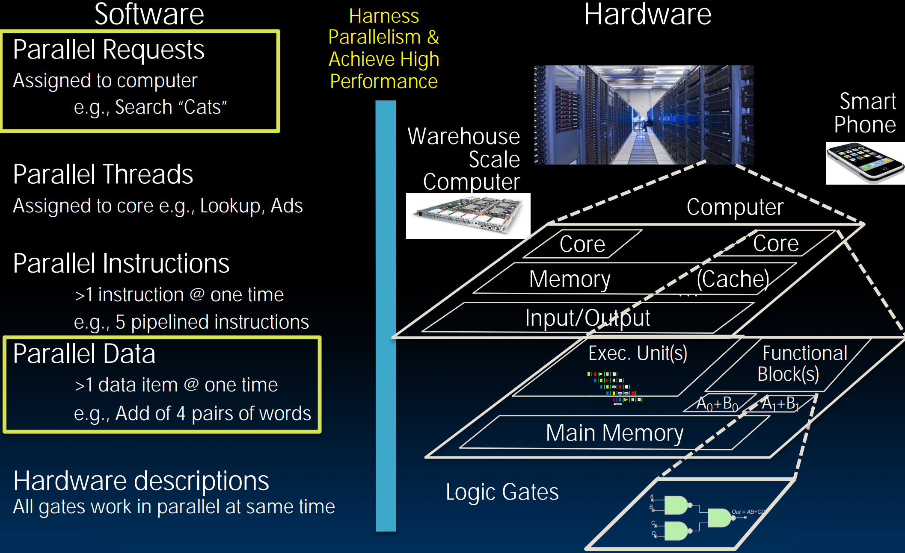
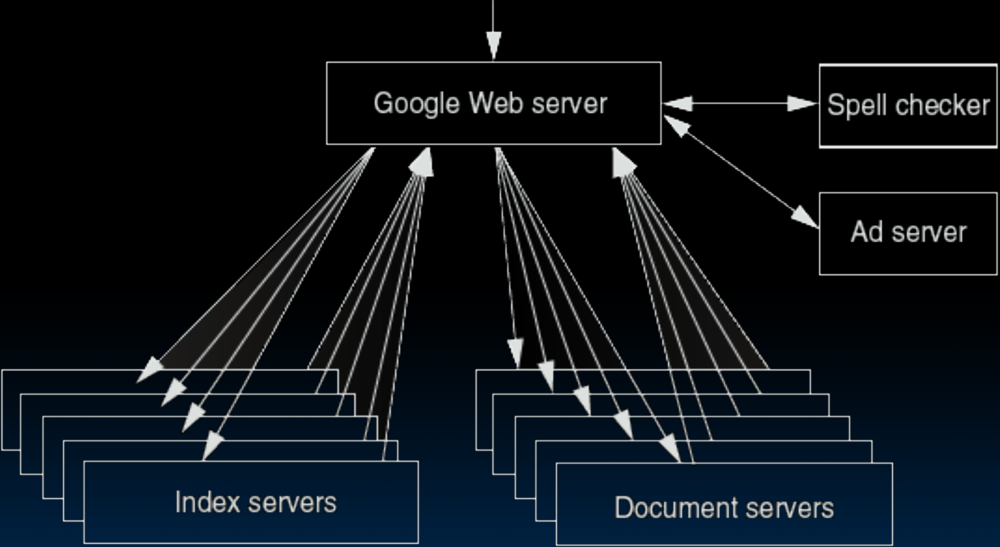

# 36.2-Request-Level and Data-Level Parallelism


Lecture Video Address


## New-School Machine Structures

从本节开始将讨论请求级并行(Request-Level-Parallelism)和数据级并行(Data-Level-Parallelism)。

后面会讲述MapReduce这种计算模型。

## Request-Level Parallelism (RLP)

> DDoS: 网络服务器处理的就是请求级并行，可能每秒数有十万次请求。当这个数字超过机器的处理能力时，它就变成了一个分布式拒绝服务攻击（DDoS），系统会被压垮，只能勉强维持运转并试图响应请求。
>
> 只要有足够的拒绝服务请求，你就可以发动DDoS，利用大量计算机同时对一个服务器进行攻击，使其无法正常工作。
>
> CS161会涉及DDoS攻击

> 顺便说一句，可以自己动手做一个网络服务器，例如你有一些传感器可以拍照或者测量，制作一个能够响应请求并提供数据的服务器，例如植物长多高了，拍了什么照片等。逐渐向优秀的计算机科学家或者是黑客前进。

Hundreds or thousands of requests/sec

- Not your laptop or cell-phone, but popular **Internet services** like web search, social networking, …

> 一般RLP都会涉及到网络，不仅仅是单机可以运行的程序

- Such requests are largely independent

> 这些请求大多数是独立的，例如很多人同时访问一个服务器，也可能一个人频繁访问以请求很多的数据。但是大多情况下是独立的。

- Request Often involve read-mostly databases（这些请求都是从大型数据库或者大型数据中心读取数据）

> 如何构建服务可以在CS186数据库中学习

- Rarely involve strict read–write data sharing or synchronization across requests

> 这些请求很少涉及严格的读写数据共享或请求间的同步，也就是说，大多数情况下，这些请求只是同时发生的大量**读取**请求，当然有一部分是写请求，比如说Piazza中的编辑，这些就涉及到云服务了，后面会学习关于云仓库规模计算的知识。

- Computation easily partitioned within a request and across different requests

> 计算可以很轻松的在多个请求之内分区，每一个都可以是原子请求。例如两个人在编辑同一个Piazza的帖子，会提示有冲突，需要处理这种race condition。

### Google Query-Serving Architecture

下面以Google查询服务器架构为例子，当我们在Google搜索引擎搜索信息后回发生什么

下面是架构示意图

当你访问谷歌的网络服务器(Google Web server)

1. 首先它会进行拼写检查(Spell checker)并抓取一些广告(Ad server)。
    - Speller checker也是一个server，单独用来进行拼写检查
    - 抓取广告时，Web server会像Ad server发出请求，后者会根据商家出的钱等规则返回优先的广告。一般来说，付的钱更多的广告会更优先出现
2. 然后它需要从Index servers中查找已经建立的索引。
    - 在进行搜索的时候，并不是输入某个东西就会开始搜索网络。
    - Google会一直不断地爬取网络，建立一个巨大的索引数据库，这些索引数据库保存着索引Index和文档Document的映射。Web server从Index servers中获取索引，然后从Document servers中获取页面。
    - Index servers是并行工作的(可以看到有很多servers)，Google Web server访问多个Index servers，然后将结果汇总。
3. 获取索引之后，从Document servers中获取页面。

## Data-Level Parallelism (DLP)

之前在SIMD中见识过数据级并行，这种是并行操作在内存中的数据。

Two kinds:

- Lots of data **in memory** that can be operated on in parallel (e.g. adding together 2 arrays)
- Lots of data on **many disks** that can be operated on in parallel (e.g. searching for documents)

跨越多个磁盘中的数据还未曾见识过，巨大量的数据也叫作大数据(Big Data)。大数据存在的问题是数据量太大，无法放入到内存当中，而必须放在磁盘当中(甚至是多个磁盘当中)，最多可以读取一部分到内存当中并处理，这是能做的最大限度。

我们要做的是处理在一个大的RAID磁盘的数据。

> RAID磁盘可以理解为一组磁盘的抽象，是一种虚拟磁盘。这些磁盘可能存储在云端，也就是云存储。

我们希望的事输入一些命令然后可以在这些磁盘上工作，就好像将所有的磁盘都抽象成了一个磁盘。

> 可以理解为，大数据解决的就是磁盘上的数据集并行。

---

### MapReduce Intro

MapReduce是一个软件基础设施，让我们可以在许多磁盘上工作，这是一个文件到文件的模型。

Today’s lecture: DLP across many servers and disks using MapReduce

> 后面两节的内容主要还是DLP
