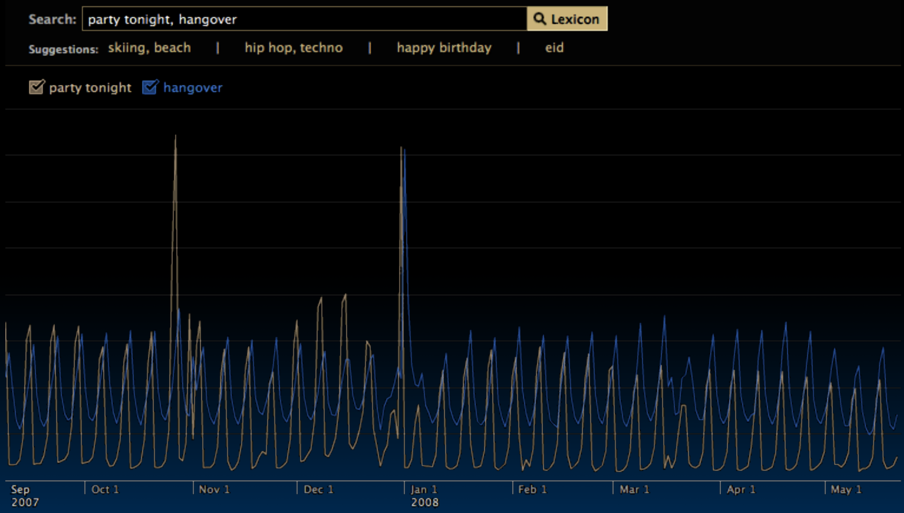
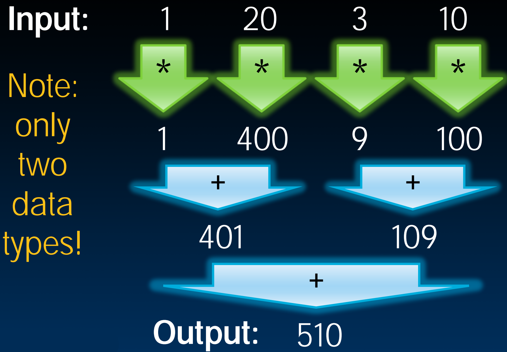
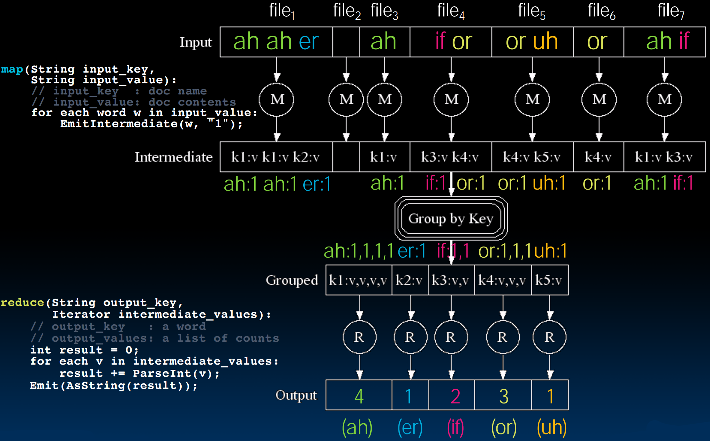
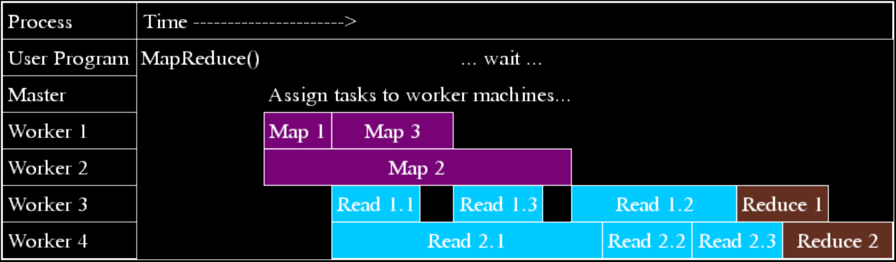

# 36.3-MapReduce


Lecture Video Address


## MapReduce Introduction

- Simple data-parallel programming model designed for scalability(扩展性) and fault-tolerance(容错性)

> scalability(扩展性): 扩展机器的数量。
>
> 关键是fault-tolerance(容错性)，如果仅仅在单机上，Core大部分不会出现问题，但是如果在多个机器，特别是机器位于不同的国家时，可能会出现很多问题，比如网络中断等。不仅简单的将任务分配给1000台不同的机器并认为这些机器都能毫无问题的返回结果，特别是机器数量非常大的情况下。（这样的计算也叫作分布式计算）

- Pioneered by Google: Processes more than 25 petabytes of data per day

- Open-source Hadoop project: Used at Yahoo!, Facebook, Amazon, …

> Hadoop是基于Java的架构
>
> Jeffrey Dean and Sanjay Ghemawat, "MapReduce: Simplified Data Processing on Large Clusters," 6th USENIX Symposium on Operating Systems Design and Implementation, 2004.

### What is MapReduce used for?

At Google:

- Index construction for Google Search
- Article clustering(文章聚类) for Google News
- Statistical machine translation(机器翻译)
- For computing multi-layer street maps(街道地图)

At Yahoo!:

- "Web map" powering Yahoo! Search
- Spam detection for Yahoo! Mail(垃圾邮件检测)

At Facebook:

- Data mining; Ad optimization; Spam detection

### Example: Facebook Lexicon

如下是Facebook以前使用MapReduce的一个例子: Facebook Lexicon（这个例子现在好像不能使用了）



- 这个功能在输入内容之后，会显示不同时间段人们输入这个内容的频率
- 如图，"party tonight"和"hangover"的输入频率，后者往往在前轴的之后达到高峰。

## MapReduce Design Goals

- Scalability to large data volumes: 1000's of machines, 10,000's of disks
- Cost-efficiency:
    - Commodity machines (商品级机器，cheap, but unreliable)，不选择最高端的机器，带液体冷却等等
    - Commodity network，商品级网络
    - Automatic fault-tolerance via re-execution (fewer administrators)
    - Easy, fun to use (fewer programmers)

## Typical Hadoop Cluster

> Cluster(集群)


解释:

1. 每台机器称为节点(Nodes)。每个节点可能有一个本地磁盘。
2. 有一个机架交换机(Rack switch)将这些连接起来。该交换机能够接收请求并知道与哪台计算机通信，以及它来自哪里，要去哪里。类似于路由器。
3. aggregation switch(聚合交换机)也在做类似的事情，但是两种Switch的带宽需求不同。越中心的Switch需要处理的数据越多，所需要的带宽也越多（可以看图中的箭头的颜色），因此更高层次需要更昂贵的交换机，因为要处理的是更大的数据通路。

如下是一个集群的规模

- 40 nodes/rack, 1000-4000 nodes in cluster
- 1 Gbps bandwidth within rack, 8 Gbps out of rack(Rack以外是8Gbps)
- Node specs (这是几年的规模了): 8 x 2GHz cores, 8 GB RAM, 4 disks (~ 4 TB)

## MapReduce

### Functional programming paradigm

在本课程中，我们仅仅使用函数式编程范式来讲解MapReduce，以便于更容易理解其工作原理。

> 函数式编程范式是一种编程范式，其核心思想是将计算视为数学函数的评估。在函数式编程中，函数被视为一等公民，即函数可以像变量一样被传递、赋值和使用。函数式编程强调纯函数的使用，即函数的输出仅依赖于输入，不依赖于外部状态或副作用。此外，函数式编程还倡导不可变性，即数据一旦创建就不能被修改，而是通过创建新的数据来表示变化。函数式编程通常使用高阶函数(Higher Order Function)、递归和Lambda演算等技术来实现程序逻辑。
>
> 可以简单理解为，使用函数范式来清晰的描述这个系统，比如MapReduce，如果使用文字来描述的话可能很麻烦，但是使用函数来描述map和reduce的过程就会很简便（前提是map和reduce是没有副作用的，因此使用函数范式很好描述）。
>
> 函数式范式也可以作为一种思想，在理解一个概念的时候根据函数的方式来解释。

这里以sum of square为例来演示。



- map是对一组数据执行一个函数(对这组数据的每一个元素应用一个函数)，得到新的一组数据。如上图，对`(1, 20, 3, 10)`进行square操作得到`(1, 400, 9, 100)`
    - map的函数通常是一元函数，有一个参数
- 然后需要对结果进行组合，组合的方式可能是左、右关联等，这里是按照数的结构组合的
    - 如上图，output相当于root，input相当于leaf，以属性结构逐步reduce
    - 这里是进行两两相加
- MapReduce提供了一种抽象，程序员不用关心底层是怎么实现的，只需要写map和reduce的逻辑即可

> 在底层，数据的分布对于程序员来说是不可见的，这涉及到分布式文件系统，并且有多少个节点，每个节点有多少个cores等配置信息对于程序员来说也是不可见的，数据怎么在节点之间传输，比如怎么将map的结果分配给reduce节点等也都是不可见的。程序员只需要写map和reduce的逻辑即可。

下面用函数式范式来描述这个过程

使用scheme为例

```scheme
> (reduce + (map square '(1 20 3 10))
510
```

> 在scheme中，`+`，`square`都可以作为参数

使用Python为例

```Python
>>> from functools import reduce
>>> def plus(x,y): return x+y
>>> def square(x): return x*x
>>> reduce(plus, map(square, (1,20,3,10)))
```

如上只是MapReduce的简化版本，实际上会简化一些

### MapReduce Programming Model

在Dean Jeff提出的完整的MapReduce编程模型中，有一个中间步骤。这个步骤是在map阶段和reduce阶段之间的，它包含一个键值对。

Input & Output: each a set of key/value pairs

Programmer specifies two functions:

```python
map (in_key, in_value) -> list(interm_key, interm_value)
```

- Processes input key/value pair
- Slices data into "shards" or "splits"; distributed to workers
- Produces set of intermediate pairs
    - 这些shards会被分配给其他的工作节点，并生成中间的key/value pair
    - shards根据key进行排序，所有key相同的shards会被发送到同一台机器，也就是说，key是用来标记数据以便在这些机器之间分配的一种方式。


> 使用key不是为了增加数据，而是为了更好地分配数据，使其在reduce阶段分布的更好。

```
reduce (interm_key, list(interm_value)) → list(out_value)
```

- Combines all intermediate values for a particular key
- Produces a set of merged output values (usu just one)

http://code.google.com/edu/parallel/mapreduce-tutorial.html

## MapReduce WordCount Example

### wordCount Issue

WordCount就相当于并行和分布式系统里面的"hello world"

wordCount的任务是: 假设有一个文本语料库，也许是莎士比亚的全部作品，对于其中每个唯一的词，统计其出现的次数。

比如说语料库为一句话"I do, I learn"，那么希望统计的结果就是出现词`"i", "do", "learn"`的出现频率: `("I", 2), ("do", 1), ("learn", 1)`

### pseudocode

"Mapper" nodes are responsible for the map function

```python
# "I do I learn" → ("I",1), ("do",1), ("I",1), ("learn",1)
map(String input_key, String input_value):
    # input_key: document name (or line of text)
    # input_value: document contents
    for each word w in input_value:
        EmitIntermediate(w, "1");
```

> Emit 发出

- map接受一句话，然后遇到一个word，就生成一个`(word, 1)`的key-value pair
- 这里，map仅仅负责生成这一个键值对，并不负责进行加法（当然也可以进行加法）
- 并且不是所有的word都需要emit，比如当遇到"do"的时候，可以直接跳过循环，不进行emit
    - **map也可以起到一个过滤的作用**

"Reducer" nodes are responsible for the `reduce` function

```python
# ("I",[1,1]) → ("I",2)
reduce(String output_key, Iterator intermediate_values): 
    # output_key : a word
    # output_values: a list of counts
    int result = 0;
    for each v in intermediate_values:
    	result += ParseInt(v);
    Emit(AsString(result));
```

---

### where is data?

Data on a distributed file system (DFS)

也就是说，数据并不在内存当中，而是存储在文件当中。而这些文件位于分布式网络上，所以处理的不只是本地磁盘上的数据，是存储在"云"中的数据。

MapReduce框架为我们提供了一层抽象，不用管这些数据存在哪里，系统会为我们生成一个抽象的DFS，抽象出一个集中的文件系统，我们写的MapReduce也是在这个系统中进行工作（实际上是底层有多个节点在工作）

### MapReduce WordCount Diagram

下面是对应的图

- 输入来源于多个file（这是DFS抽象出来的多个文件）



- 在Group by Key的过程中，key相同的intermediate结果都会被送到同一个节点，所以一个节点就恶意进行计数
- 有时reduce也可以忽略key。在WordCount中：输出是一个dictionary

## MapReduce Processing Time Line

下面看看是怎么工作的，也就是每个节点的工作时间



以下是注意事项:

map和reduce的时间

1. 不会是所有的map的任务都需要相同的时间，在WordCount中，取决于文件大小，可能某个worker处理的文件比较大，时间就比较久。如上，Map1, 2, 3的时间都是不一样的

    > 分配任务时一般是以文件为单位分配给一个节点。

2. reduce的任务的时间也可能不同，在上面的代码中，采用累加的Sequential section进行reduce，那么如果某个词的频率比较高，也就是"1"比较多，那么需要的时间就比较多

执行过程:

1. Master负责将map和reduce的任务分配各个worker服务器

2. 一旦一个worker的map任务完成，这个worker就可以被分配新的**map或者reduce任务**。为了方便演示，图中的worker1 和 worker2负责map，worker1在执行完Map1之后(可能是统计完一个文件之后)重新处理新的文件

3. 同样，为了方便演示，worker3和worker4负责reduce(在WordCount任务中就是计数)。

    - worker1和2将Map结果传递给reduce节点，key相同的传递给同一个节点。比如Read1.1, 1.2, 1.3应该就是相同的key，Read2.1, 2.2, 2.3同理
    - 在WordCount中，reduce节点先读取一个Map的结果(一般是一个文件的同一个key的统计)，然后等待下一个Map的结果。当读取了所有Map的结果之后，才能进行reduce

    > 在WordCount的任务中，reduce任务需要等待所有的任务都shuffle之后才能进行，也就是得等所有的1都统计完成之后才能进行累加。不过可以先开始读取这些值，除了map和reduce任务之外，还有Read的任务。
    >
    > 当然，有些reduce任务可以在map完成之间就开始。

4. 上图仅仅是为了便于理解时间分配，所以划分了四种工作节点，但是实际上，Map节点和reduce节点并不是是严格区分的

    - Master会一直从空闲的worker pool中寻找worker分配任务，当一个worker完成当前map或者reduce任务之后就可以被分配新的map或者reduce任务

    - 例如worker1在执行完map任务之后也可以进行reduce任务，比如worker1在执行完Map1任务之后可以进行Read1.1的任务

        > As soon as a map task finishes, worker server can be assigned a new map or reduce task

    - **这样看来，即使是一个节点也可以完成整个MapReduce，只不过时间会慢一些**

    - 并且并不是说一个worker要map和reduce交替执行，可能进行一次map任务之后仍然被分配下一个map任务。

5. 如果一个工作节点没有响应(可能发生了网络故障，磁盘故障，硬件故障，内存故障等)，就要重新分配任务。

---

可以这么理解，DFS和MapReduce是分开的：

- 文件在物理上存在于多个节点的disks当中，DFS为每个节点的processor和Memory提供了一层抽象
- MapReduce在抽象出的文件系统上分配文件给节点
- 比如说file1可能在node1和node2的disk上，在MapReduce过程中Master可能会将file1分配给node3来处理。

## MapReduce WordCount Java code

如下是用Java实现的WordCount

```java
public class MapReduceTest {
    public static void main(String[] args) {
        JobConf conf = new JobConf(WordCount.class);
        conf.setJobName("wordcount");
        conf.setOutputKeyClass(Text.class);
        conf.setOutputValueClass(IntWritable.class);
        conf.setMapperClass(WCMap.class);
        conf.setCombinerClass(WCReduce.class);
        conf.setReducerClass(WCReduce.class);
        conf.setInputPath(new Path(args[0]));
        conf.setOutputPath(new Path(args[1]));
        JobClient.runJob(conf);
    }
}
```

```java
public class WCMap extends MapReduceBase implements Mapper{
    private static final IntWritable ONE = new IntWritable(1);
    public void map(WritableComparable key, Writable value, OutputCollector output, Reporter reporter) throws IOException {
        StringTokenizer itr = new StringTokenizer(value.toString());
        while (itr.hasMoreTokens()) {
            output.collect(new Text(iter.next()), ONE);
        }
    }
}
```

```java
public class WCReduce extends MapReduceBase implements Reducer{
    public void reduce(WritableComparable key, Iterator values, OutputCollector output, Reporter reporter) throws IOException {
        int sum = 0;
        while (values.hasNext()) {
            sum += ((IntWritable) values.next()).get();
        }
        output.collect(key, new IntWritable(sum));
    }
}
```

- MapReduce重点是在不同机器上的并行
- 但是在同一个机器上，也可以并行的处理一个任务，比如开多个线程读取文件的不同部分，这就需要在代码中使用并行编程了。
