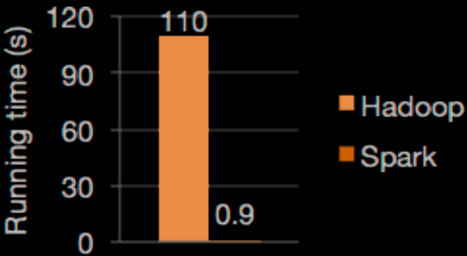
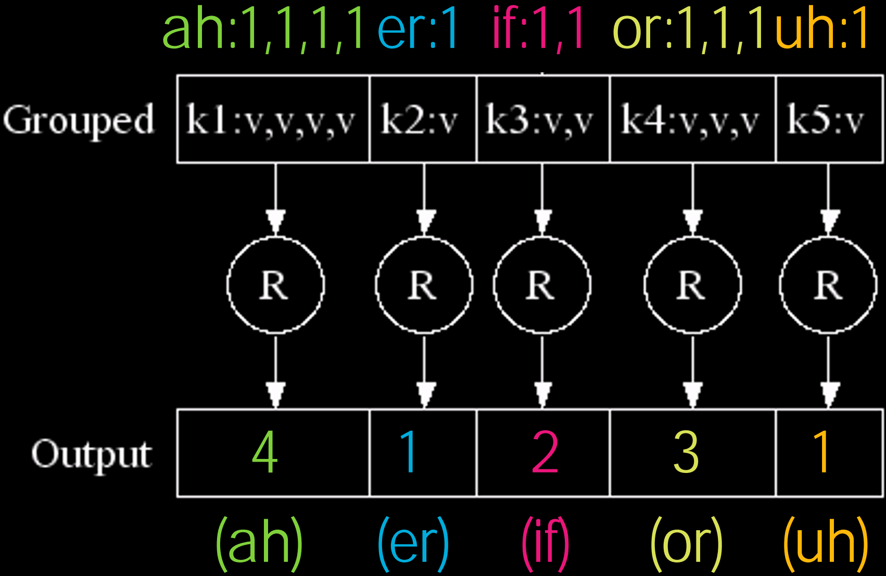

# 36.4-Spark


Lecture Video Address


本节要学习Spark，这是一种不同于 MapReduce 范式的方式，在编程工作量上稍微轻量一些。

> Spark来自于UCB

## Spark vs. MapReduce

Apache Spark™ is a fast and general engine for large-scale data processing

下面这个性能图表显示了在处理特定文件时的运行时间，而Spark 的速度比Hadoop快了100倍以上。



### Why Spark so fast

下面是spark比MapReduce快的理由

Apache Spark相对于传统的MapReduce有显著的性能提升，主要有以下几个原因：

1. **内存计算（In-Memory Computing）**：Spark最大的优势之一是其内存计算能力。MapReduce在每个阶段结束时会将中间结果写入磁盘，而Spark则尽可能在内存中保留数据，减少了大量的磁盘I/O操作。这极大地提高了性能，尤其是在多次迭代的算法中（例如机器学习和图处理）。

2. **基于DAG的执行引擎**：Spark使用了基于有向无环图（DAG）的调度和执行引擎，而MapReduce仅限于Map和Reduce两个阶段。这意味着Spark可以更好地优化任务执行顺序，进行更智能的任务调度和执行，从而减少了数据在不同阶段之间的移动和转换。

3. **延迟计算（Lazy Evaluation）**：Spark采用了延迟计算的策略，即它会构建一个包含一系列变换（transformation）的DAG，并在遇到行动（action）操作时才真正执行。这使得Spark可以优化整个计算过程，并减少不必要的数据处理步骤。

4. **高级编程接口**：Spark提供了更高级和易用的编程接口，支持复杂的操作和数据处理流水线。它有丰富的API，支持SQL查询、流处理、机器学习等，使得开发者能够更高效地编写和优化数据处理应用。

5. **数据共享**：在Spark中，可以使用共享变量（如广播变量和累加器）在任务之间高效地共享数据，而在MapReduce中，实现类似的功能则更为复杂且低效。

6. **调优和优化**：Spark内置了多种优化机制，如查询优化器Catalyst和物理执行计划优化。通过这些优化机制，Spark可以生成高效的执行计划，进一步提高性能。

7. **支持多种数据源和格式**：Spark支持从多种数据源和格式中读取和写入数据，如HDFS、HBase、Cassandra、Amazon S3等，并且可以无缝集成不同的数据源，这使得数据处理更加灵活和高效。

这些特性使得Spark在处理大规模数据时，比传统的MapReduce框架要快得多，尤其是在迭代计算和交互式数据分析场景下表现尤为突出。

---

Ease of Use

- Write applications quickly in Java, Scala or Python.

    > Spark是一个用于大规模数据处理的开源分布式计算系统，支持多种编程语言，包括Java、Scala、Python和R。

- Spark offers over 80 high-level operators that make it easy to build parallel apps. And you can use it interactively from the Scala and Python shells.

## Word Count in Spark's Python API

之前我们使用Java的MapReduce接口，如下

```Java
public class MapReduceTest {
    public static void main(String[] args) {
        JobConf conf = new JobConf(WordCount.class);
        conf.setJobName("wordcount");
        conf.setOutputKeyClass(Text.class);
        conf.setOutputValueClass(IntWritable.class);
        conf.setMapperClass(WCMap.class);
        conf.setCombinerClass(WCReduce.class);
        conf.setReducerClass(WCReduce.class);
        conf.setInputPath(new Path(args[0]));
        conf.setOutputPath(new Path(args[1]));
        JobClient.runJob(conf);
    }
}

public class WCMap extends MapReduceBase implements Mapper{
    private static final IntWritable ONE = new IntWritable(1);
    public void map(WritableComparable key, Writable value, OutputCollector output, Reporter reporter) throws IOException {
        StringTokenizer itr = new StringTokenizer(value.toString());
        while (itr.hasMoreTokens()) {
            output.collect(new Text(iter.next()), ONE);
        }
    }
}

public class WCReduce extends MapReduceBase implements Reducer{
    public void reduce(WritableComparable key, Iterator values, OutputCollector output, Reporter reporter) throws IOException {
        int sum = 0;
        while (values.hasNext()) {
            sum += ((IntWritable) values.next()).get();
        }
        output.collect(key, new IntWritable(sum));
    }
}
```

但是这些内容可以用如下spark的Python接口来实现。

```python
# load the file
file.flatMap(lambda line: line.split())
.map(lambda word: (word, 1))
.reduceByKey(lambda a, b: a + b)
```

- `reduceByKey`的参数是对key-value中的value进行reduce的

### flatMap in Spark's Python API

下面介绍一下flatmap接口：

```Python
>>> def neighbor(n):
... return [n-1,n,n+1]
>>> R = sc.parallelize(range(5))
>>> R.collect()
[0, 1, 2, 3, 4]
>>> R.map(neighbor).collect()
[[-1, 0, 1], [0, 1, 2], [1, 2,
3], [2, 3, 4], [3, 4, 5]]
>>> R.flatMap(neighbor).collect()
[-1, 0, 1, 0, 1, 2, 1, 2, 3, 2,
3, 4, 3, 4, 5]
```

这段代码使用了PySpark的RDD（Resilient Distributed Dataset）进行并行计算。下面是对代码的详细解释：

1. 定义一个函数`neighbor(n)`，它接受一个整数`n`并返回一个包含`n-1`、`n`和`n+1`的列表：
   ```python
   def neighbor(n):
       return [n-1, n, n+1]
   ```

2. (sc是SparkContext)使用`sc.parallelize(range(5))`创建一个RDD `R`，包含从0到4的整数：
   ```python
   R = sc.parallelize(range(5))
   ```

3. 使用`R.collect()`将RDD中的元素收集到一个列表中并打印出来：
   ```python
   R.collect()
   ```
   输出：
   ```
   [0, 1, 2, 3, 4]
   ```

4. 使用`R.map(neighbor)`对RDD中的每个元素应用`neighbor`函数，并将结果收集到一个列表中：
   ```python
   R.map(neighbor).collect()
   ```
   `map`函数会对RDD中的每个元素应用`neighbor`函数，结果是一个RDD，其中每个元素都是一个包含相邻三个数的列表。输出：
   ```
   [[-1, 0, 1], [0, 1, 2], [1, 2, 3], [2, 3, 4], [3, 4, 5]]
   ```

5. 使用`R.flatMap(neighbor)`对RDD中的每个元素应用`neighbor`函数，并将结果展开（flatten）成一个单一的列表：
   ```python
   R.flatMap(neighbor).collect()
   ```
   `flatMap`函数类似于`map`函数，但它会将每次应用函数的结果列表展开成一个单一的RDD。输出：
   ```
   [-1, 0, 1, 0, 1, 2, 1, 2, 3, 2, 3, 4, 3, 4, 5]
   ```

总结：
- `map`方法返回一个包含多个列表的RDD，每个列表对应`neighbor`函数返回的结果。
- `flatMap`方法返回一个包含所有`neighbor`函数结果的单一列表。

注意的几点:

1. `R = sc.parallelize(range(5))`中:

    - **`sc` 是一个 `SparkContext` 对象**：它是Spark的主入口，用于连接Spark集群并创建RDD。
    - `parallelize`用于将本地集合（如列表、范围等）并行化成一个并行化的RDD(Resilient Distributed Dataset)。

2. 但是在执行`R = sc.parallelize(range(5))`的时候，什么也没有发生，因为在Python3中的range是lazy computing的，只有在需要的时候才会返回一个值。例如在执行`R.collect()`的时候才会返回

    > 这是Python3的特性，如果是Python2中，range(1million)会立即返回1m的list

    - 不仅仅是range，`parallelize`也是lazy computing的，当进行`R.collect()`的时候才会从range(5)中取值然后计算

3. 同理`R.map(neighbor)`也是返回和R一样类型的结果，map函数也是lazy computing的，执行的时候不会做任何事情，只有在`R.map(neighbor).collect()`的时候才会返回所有的结果

> 由此可见，spark的很多接口都是lazy computing的

4. `flatMap`和`map`的区别在于，flatMap会将所有的结果展开

### Word Count in Spark's Python API

首先查看文件中的内容

```shell
unix% cat file.txt
ah ah er

ah
if or
or uh
or
ah if
```

下面是python实现WordCount的代码

```shell
>>> W = sc.textFile("file.txt")

>>> W.flatMap(lambda line: line.split()).collect()
['ah', 'ah', 'er', 'ah', 'if', 'or', 'or', 'uh', 'or', 'ah', 'if']
>>> W.flatMap(lambda line: line.split()).map(lambda word:
(word,1)).collect()
[('ah', 1), ('ah', 1), ('er', 1), ('ah', 1), ('if', 1), ('or', 1),
('or', 1), ('uh', 1), ('or', 1), ('ah', 1), ('if', 1)]
>>> W.flatMap(lambda line: line.split()).map(lambda word:
(word,1)).reduceByKey(lambda a,b: a+b).collect()
[('er', 1), ('ah', 4), ('if', 2), ('or', 3), ('uh', 1)]
```

如下是reduce的过程



## sanity-check the parallel

> sanity-check(合理性检查)

验证spark并行工作的方式

```shell
>>> def crunch(n):
... time.sleep(5) ## to simulate number crunching
... return n*n
...
>>> crunch(10) ## 5 seconds later
100
>>> list(map(crunch,range(4))) ## 20 seconds later
[0, 1, 4, 9]
>>> R = sc.parallelize(range(4))
>>> R.map(crunch).collect() ## 5 seconds later
[0, 1, 4, 9]
```

- 只要是并行计算，即使是单核也可以做到只需要等待5s，当一个线程在等待的时候，cores会切换到另一个进程开始等待，4个线程的等待过程是同时的
- 但是当线程太多的时候，也可能有影响。尝试将`R = sc.parallelize(range(4))`的范围增大，看变大到什么程度不会是5s

> 在MapReduce中，要进行并行工作需要手动还要自己开线程，但是Spark的接口自动使用并行计算，编程更简单，效率更高。

## Conclusion

1. 4th big idea is parallelism（本节中学到了Request-Level-Parallelism和Data-Level-Parallelism）
2. Amdahl's Law constrains performance wins
    - With infinite parallelism, Speedup = 1/s (s=serial %)
3. MapReduce is a wonderful abstraction for programming thousands of machines
    - Hides details of machine failures, slow machines
    - File-based（包括中间的计算结果也需要写在文件当中）
4. Spark does it even better
    - Memory-based
    - Lazy evaluation

> Spark的开发者数量在增长，鼓励学习并且精通spark，可以说自己会处理big Data，会增强竞争力。

本节的内容也就是在讨论大数据，下一节讨论云计算。
