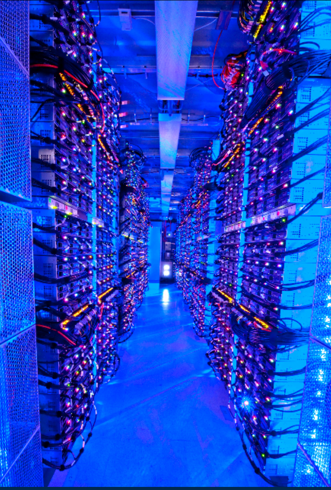

# 37.1-Eras of Computing Hardware


Lecture Video Address


本节讨论数据中心和云计算。

## History

| Era                      | time                  | picture                                                      | desc                                                         | business                    | price                                                        | app                                        |
| ------------------------ | --------------------- | ------------------------------------------------------------ | ------------------------------------------------------------ | --------------------------- | ------------------------------------------------------------ | ------------------------------------------ |
| Computer Eras: Mainframe | 1950s-60s             |  | "Big Iron"                                                   | IBM, UNIVAC, Digital...     | build $1M computers for businesses                           | COBOL, Fortran, timesharing OS             |
| Minicomputer Eras        | 1970s                 |  | Using integrated circuits                                    | Digital, HP, IBM...         | build $10k computers for labs, universities                  | C, UNIX OS                                 |
| PC Era                   | Mid 1980s - Mid 2000s |  | Using microprocessors                                        | Apple, IBM...               | build $1k computer for 1 person                              | Basic, Java, Windows OS                    |
| PostPC Era(后PC时代)     | Late 2000s - ??       |  | Personal Mobile Devices (PMD): Relying on wireless networking | Apple, Nokia, Google...     | build $500 smartphone and tablet computers for individuals   | Objective C, Swift, Java, Android OS + iOS |
|                          |                       |  | Cloud Computing: Using **Local Area Networks**               | Amazon, Google, Facebook... | build $200M Warehouse Scale Computers with 100,000 servers **for Internet Services for PMDs** | MapReduce, Ruby on Rails                   |

> 云计算的建立为PMD提供服务，PMD向云计算发出请求。

以下是补充

| era                      | picture                                                      | supplyment                                                   |
| ------------------------ | ------------------------------------------------------------ | ------------------------------------------------------------ |
| Computer Eras: Mainframe |  | 灰色部分是processor，其余全是I/O：磁带读取器、控制台、卡片打孔系统、卡片读取器、控制台、高速打印机、磁盘存储、磁带控制器、磁带单元；存在于大公司，大型研究实验室，大学当中，在早期，整个校园可能只有一台 |
