# 37.2-Warehouse Scale Computers


Lecture Video Address


> Warehouse Scale Computers(仓库级规模计算机)

## Why Cloud Computing Now?

云计算是如何产生的呢？

- "The Web Space Race": Build-out of extremely large datacenters (10,000's of commodity PCs)
    - Build-out driven by growth in demand (more users)
    - Infrastructure software and Operational expertise
- Discovered economy of scale: 5-7x cheaper than provisioning a medium-sized (1000 servers) facility
- More pervasive broadband Internet so can access remote computers efficiently
- Commoditization of HW & SW
    - Standardized software stacks

---

用中文来表述。

在20多年前，每家公司都有自己的IT部门，在地下室有一些服务器来自给自足。随着大公司的出现，例如Google、Amazon、Apple、Facebook等，这些公司意识到需要更大的计算机规模。规模的增大使其开始考虑成本问题，因此其开始想到使用普通的商用PC来构建数据中心(不用买最高端的机器，只用性价比高的商用PC)，虽然这些机器的故障率更高，但是可以接受并处理。

大公司中云计算的由来可以追溯到以下几个关键因素：

1. **规模经济效益**：发现大型数据中心的成本效益比中型设施（1000台服务器）便宜5-7倍

2. **更广泛的宽带互联网**：能够高效地访问这些计算机

3. **硬件和软件的商品化**：标准化的软件栈

4. **"网络空间竞赛"**：超大规模数据中心的建立（成千上万的商品级PC）
    - 数据中心的建设受到需求增长的驱动（更多用户）
    - 基础设施软件和运营专业知识的积累

### AWS EC2 Price

如下是从AWS提供的弹性服务的价格https://aws.amazon.com/ec2/pricing/on-demand/

> AWS EC2（Elastic Compute Cloud）是亚马逊提供的一种弹性计算服务。它允许用户租用虚拟计算资源，可以根据需要快速扩展或缩减计算能力，以满足不同的应用需求。用户可以在EC2上选择不同类型的实例，例如通用用途、计算优化、存储优化等，根据自己的计算和存储需求进行配置。EC2实例可以运行各种操作系统，支持自定义安全设置和网络配置，使用户能够灵活管理其计算资源。

如下是2020年的信息

| Instance                                 | Per Hour | $Ratio to Small | EC2 Compute Unit(integer) | Virtual Cores(vCPU) | Memory(GiB) | Disk(GiB) |
| ---------------------------------------- | -------- | --------------- | ------------------------- | ------------------- | ----------- | --------- |
| Standard Small (t3.small)                | $0.021   | 1               | Variable                  | 2                   | 2           | EBS       |
| Standard Large (t3.large)                | $0.083   | 4               | Variable                  | 2                   | 8           | EBS       |
| **Standard 2x Extra Large (t3.2xlarge)** | $0.333   | 16              | Variable                  | 8                   | 32          | EBS       |
| High-Mem Large(r5.large)                 | $0.126   | 6               | 10                        | 2                   | 16          | EBS       |
| High-Mem Double Xlarge(r5.2xlarge)       | $0.504   | 24              | 37                        | 8                   | 64          | EBS       |
| High-Mem 24 Large(r5.24xlarge)           | $6.048   | 288             | 337                       | 96                  | 768         | EBS       |
| High-CPU Large (c5.large)                | $0.085   | 4               | 10                        | 2                   | 4           | EBS       |
| High-CPU 18x Large(c5.18xlarge)          | $3.060   | 146             | 281                       | 72                  | 144         | EBS       |

- `Standard 2X Extra Large`是最接近我们要讲的WSC中service的例子
    - 除了上面提供的标准外，还可以自己配置，指定CPU的数量，Memory的大小，Compute Unit的数量等
        - 比如说要加载很大的矩阵进行几次搜索的时候，就可能需要很大的内存，而CPU的周期要求很小
        - 如果要处理几个小的数据集，但是要有很多操作，那么就要高CPU

- At these low rates, Amazon EC2 can make money! (even utilized 50% time)
    - 可以看到，机器的价格是比较便宜的

- EBS = Elastic Block Store (SSD=\$0.10/GB-month, HDD=\$0.045/GB-month)
- Each also comes with dedicated attached SSD if you choose

## Warehouse Scale Computers

### features

下面是关于WSC的几个重点

1. **大规模**: Massive scale datacenters: 10,000 to 100,000 servers + networks to connect them together

    - Emphasize cost-efficiency
    - Attention to power: distribution and cooling

    > 要注意功率，降温是很重要的事情，并且需要占地很多面积

2. **同质化**:(relatively) homogeneous(同质化) hardware/software
3. Offer very large applications (Internet services): search, social networking, video sharing

- **高可用性**: Very highly available: < 1 hour down/year(5 nines)

    - 必须应对大规模情况下常见的故障
    - 有时可以在新闻中看到，亚马逊宕机后，许多公司也会跟着宕机
    - 为了提高可靠性，可能要购买冗余

- "…WSCs are no less worthy of the expertise of computer systems architects than any other class of machines"  —— Barroso and Hoelzle 2009

    > 仓库规模的计算机对于计算机系统架构师来说，不亚于其他任何种类的机器。微观角度，可以到达智能尘埃级别的处理器，宏观方面，可以到达WSC。这都属于计算机架构的一种。

### Design Goals

Unique to Warehouse-scale

1. **Ample(充足的) parallelism:**

    - Batch apps: large number independent data sets with independent processing. 
    - Also known as Data-Level Parallelism

    > 也就是说WSC需要能够独立地处理很多独立的数据，这就需要很高的并行性。

2. Scale and its Opportunities/Problems（规模及其机遇/问题: 随着规模扩大而带来的机会和问题）
    - Relatively small number of these make design cost expensive and difficult to amortize(偿还)（全世界的WSC的数量也就几个，Facebook，Amazon，Google，Apple等，这使得WSC的设计成本比较高）
    - But price breaks are possible from purchases of very large numbers of commodity servers（可以通过够吗大量的商用服务器来降低成本）
    - Must also prepare for high # of component failures（还需要能够处理组件的故障，有一些人员就是专门替换组件的，或者使用RAID类似的机制）

3. Operational Costs Count:  Cost of equipment purchases << cost of ownership

    > 购买设备的成本并不是最高的，购买后运行和维护的成本才是更高的

## Example: Google's Oregon WSC

### WSC

下面举一个例子

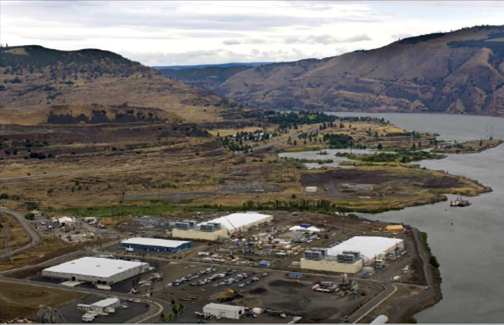

> 如上的一个大建筑就是一个WSC

WSC的选址就可以体现出构建WSC要考虑的问题(设计WSC的目标)

| 特点     | 目的                                                         | 反例       |
| -------- | ------------------------------------------------------------ | ---------- |
| 地址偏僻 | 隐私，WSC中有很多公司的敏感数据，不希望很容易被找到          | 市中心     |
| 土地便宜 | 地方偏僻，土地价格便宜，减少建造成本(没人会建在市中心)       | 市中心     |
| 地区寒冷 | Oregon是一个很凉爽的地方，用来减少降温的成本(有时甚至要建在夏雪的地方) | 较热的地方 |
| 靠近河流 | 引用河流的水来帮助降温并引出热量(水控冷却可以节省成本)       |            |

如上，仅仅是选址就可以保护隐私，在土地和降温方面节省成本。

---

放大，可以看得更清晰

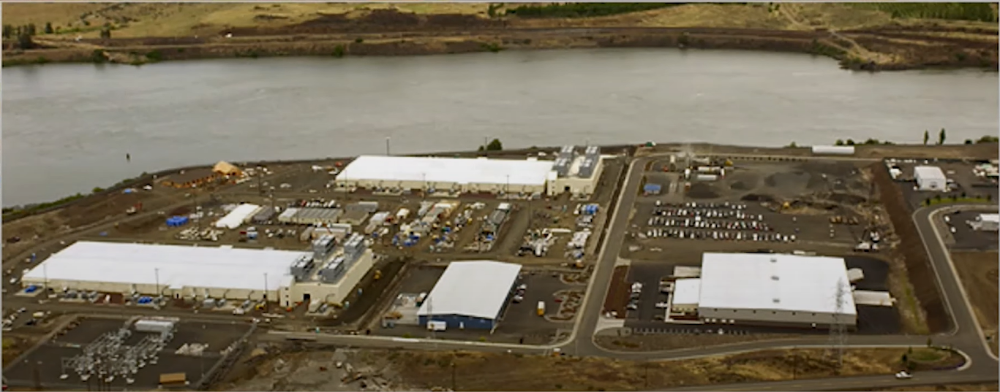

再放大，可以看到周围有一个特殊的建筑

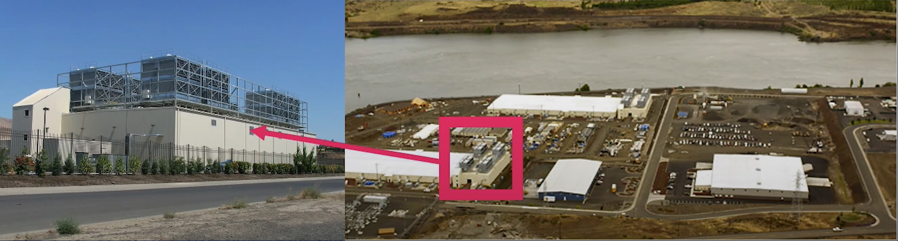

- 这个是冷却中心，用来为服务器散热。
- 也就是说WSC的热量需要一个完整的建筑来进行冷却。

### inside: container

| inside WSC                                                   | inside Container                                             |
| ------------------------------------------------------------ | ------------------------------------------------------------ |
| 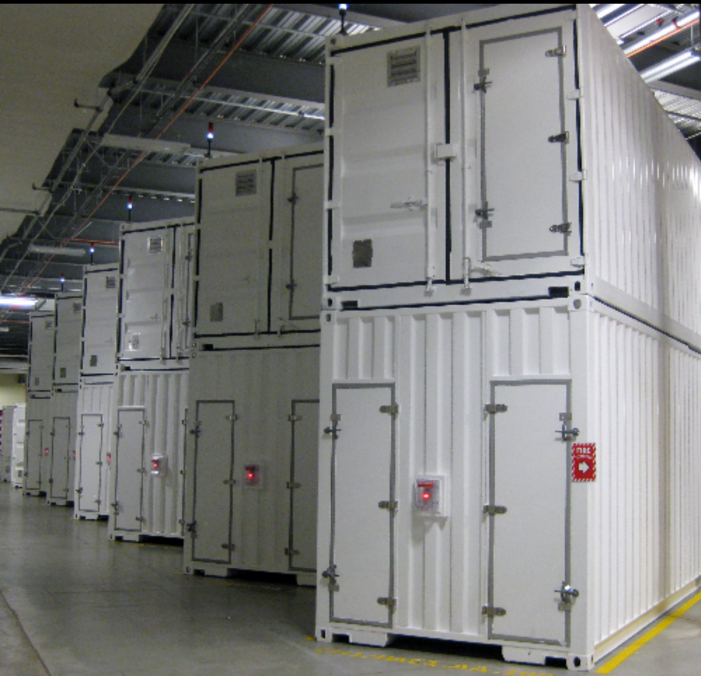 |  |

- 左边的图类似于货船上的集装箱，以一定的角度排放。
- 右图是集装箱内部，是高密度服务器，中间有走道。
    - 一般有两侧走道，一侧用于人同行以更换硬盘，一侧用于布线。
    - 图中的走到可以看到有很多线，应该是用于布线的，更换硬盘的走到在另一侧。
    - 布线走到需要有电缆扎来固定线缆，否则无法移动。

### inside container: Server, Rack, Array

| equipment               | picture                                                      | instance                                                     | config                                                       | desc                                                         |
| ----------------------- | ------------------------------------------------------------ | ------------------------------------------------------------ | ------------------------------------------------------------ | ------------------------------------------------------------ |
| Server (in rack format) |  | 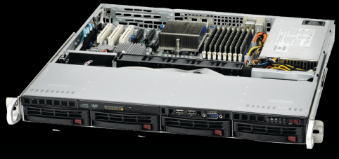 | ¾ inches high x 19 inches width x 16-20 inches depth  8 cores, 16 GB DRAM, 4x1 TB disk | 不同的server的内部配置可能不同                               |
| Rack                    | 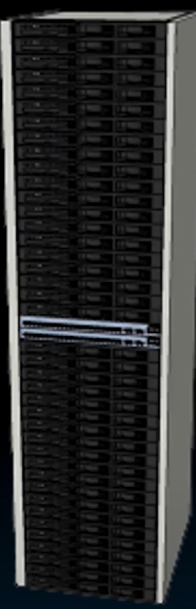 | 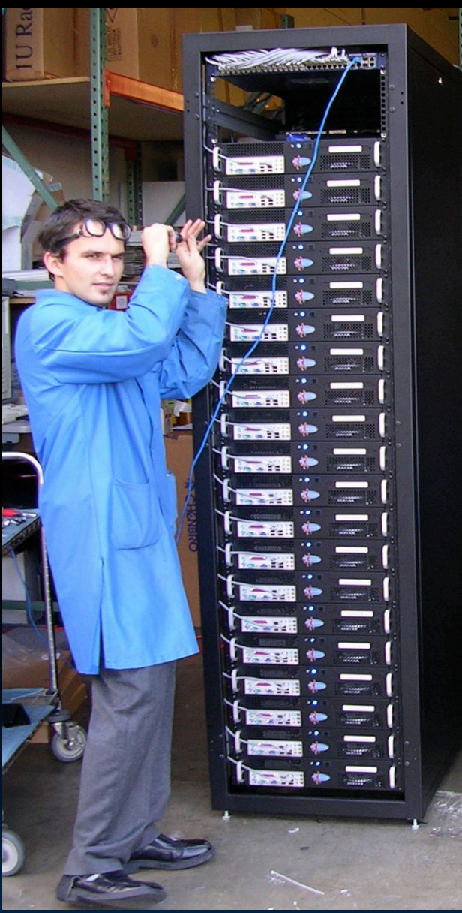 | 7 foot; 40-80 servers; Ethernet local area network (1-10 Gbps) switch in middle ("rack switch") | 每个机架中间都有一个机架交换机，放在中间方便所有服务器到达   |
| Array (aka cluster      | 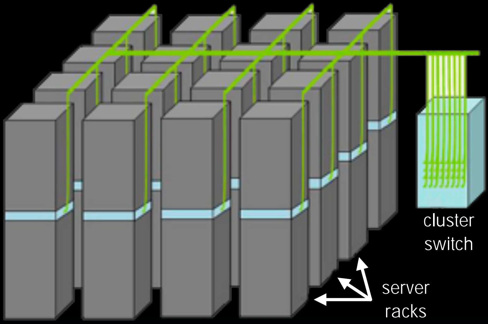 | 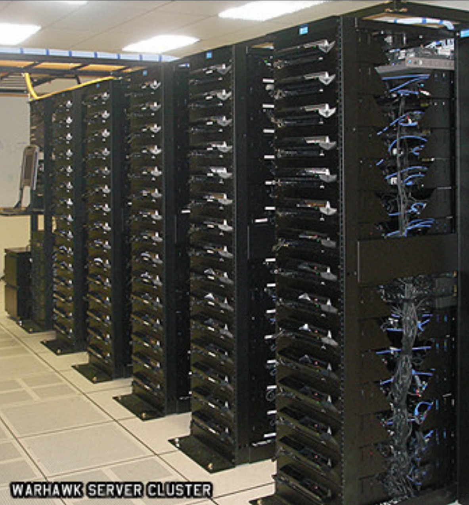 | 16-32 server racks; larger local area network switch ("array switch") 10X faster →cost 100X: cost f(N^2^) | 阵列(集群),机架的交换机会连接到一个更大的集群交换机，速度快10倍，但是成本是100倍。 |

> 在之前MapReduce就讲过，越集中的交换机需要的带宽速度就越高，因此在cluster中，cluster Switch的速度是更快的。
>
> 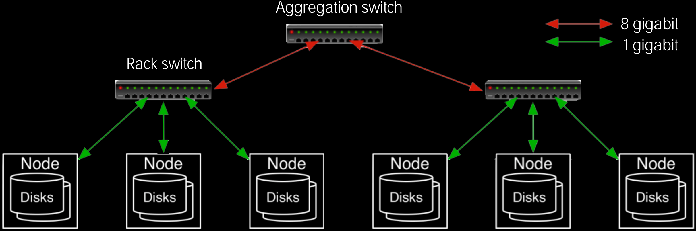

- 在上表中cluster的instance图中，左边的是用于用户操作的地方，例如更换硬盘，空间更大。
- 在另一个方向是布线的地方。
- 在机架侧边，相邻机架之间有一些空隙，设置不当可能会造成空间的浪费。

高端系统通常会更加紧凑和高效，以减少空间浪费，同时提高散热效率和维护便捷性。这样的设计在数据中心中尤为重要，因为它可以最大化利用有限的物理空间，同时确保良好的空气流动和散热性能。

### Google Server Internals

> Internals(内部结构)

Google的Server是自己研发的。如下是Google Server的内部结构

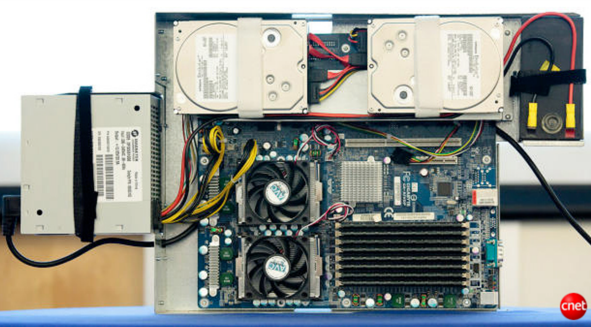

具体构成如下

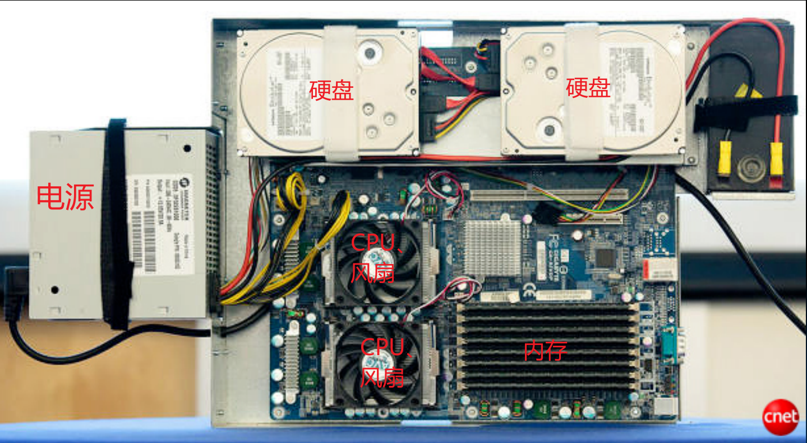

### battery

如下红框中的是Server的电池，准确的说，这是UPS

> Uninterruptible Power Supply（不间断电源）：用于保障设备在停电时继续供电的设备。

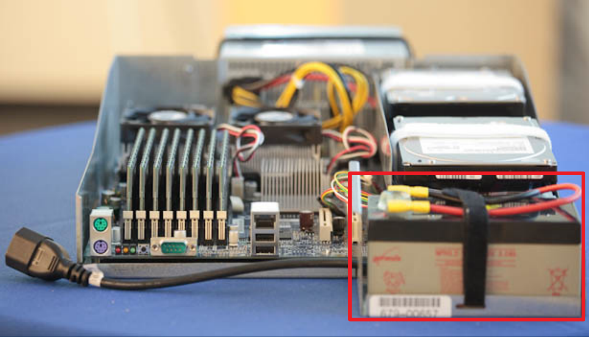

使用大型的电源供应系统要面临的两个问题：

1. clean the power: 有时电源并不是完美的60Hz， 120V到达峰值，在交流电系统中通常会有一些噪音。
2. 电源断电时，系统不能中断，需要尽可能长时间的运行。

一般的设施（比如医院）都会在地下室放一个大型的UPS，而不会在每层楼，每个房间放一个UPS。但是Google认为，对于WSC，每个设备有一个UPS更有效率。这涉及到规模、成本、热量和其他因素。放置一个大的UPS来处理整个系统的电源问题，他们的电源需求是巨大的。

UPS保证了电源断电时，他们仍然可以让计算机在电池最终耗尽之前继续运行一段时间。

> 正常情况下，计算机是连接电源的，但是当电源断电后，需要使用UPS来维持。

## Performance

### Performance Matrices

如何定义X比Y快呢？

我们用两种车来做类比

|                       | 2009 Ferrari 599 GTB                                         | 2009 Type D school bus                                       |
| --------------------- | ------------------------------------------------------------ | ------------------------------------------------------------ |
| picture               |  |  |
| # of passengers       | 2                                                            | 54                                                           |
| time for quarter mile | 10 secs                                                      | 1 min                                                        |

评价有两种指标

| Matrices    | Response Time / Latency                                      | Throughput / Bandwidth                                       |
| ----------- | ------------------------------------------------------------ | ------------------------------------------------------------ |
| desc        | time between start and completion of a task                  | total amount of work in a given time                         |
| car analogy | time to move vehicle ¼ mile                                  | passenger-miles in 1 hour                                    |
| winner      |  |  |

也就是说，并没有绝对的快慢，要看选用什么模型评估，校车在吞吐量方面胜出，而法拉利在响应时间方面胜出。

### Coping with Performance in Array

下面是分别是Local，Rack，Array的配置信息以及性能。

先解释性能的含义

|                            | Local                        | Rack                                            | Array                                            |
| -------------------------- | ---------------------------- | ----------------------------------------------- | ------------------------------------------------ |
| DRAM Latency(microseconds) | 将1 Byte写入Local DRAM的时间 | Local向同一个Rack的Server的DRAM写入一字节的时间 | Local向同一个Array的Server的DRAM写入一字节的时间 |
| Disk Latency(microseconds) | 将1 Byte写入Local Disk的时间 | Local向同一个Rack的Server的Disk写入一字节的时间 | Local向同一个Array的Server的Disk写入一字节的时间 |
| DRAM Bandwidth(MB/sec)     | -                            | Local向同一个Rack的Server的DRAM读写的带宽       | Local向同一个Array的Server的DRAM读写的带宽       |
| Disk Bandwidth(MB/sec)     | -                            | 同上                                            | 同上                                             |

数据如下

|             |                            | Local   | Rack   | Array  |
| ----------- | -------------------------- | ------- | ------ | ------ |
| config      | Racks                      | --      | 1      | 30     |
|             | Servers                    | 1       | 80     | 2400   |
|             | Cores(Processors)          | 8       | 640    | 19,200 |
|             | DRAM Capacity(GB)          | 16      | 1,280  | 38,400 |
|             | Disk Capacity(TB)          | 4       | 320    | 9,600  |
| Performance | DRAM Latency(microseconds) | 0.1     | 100    | 300↑   |
|             | Disk Latency(microseconds) | 10,000↓ | 11,000 | 12,000 |
|             | DRAM Bandwidth(MB/sec)     | 20,000  | 100↓   | 10     |
|             | Disk Bandwidth(MB/sec)     | 200↑    | 100    | 10     |

- Rack和Array的DRAM Latency表示在Rack或者Array中，不仅仅有分布式文件系统，还有分布式内存系统，也就是一个Server不仅仅可以将文件通过DFS保存在其他Server的Disk当中，还可以使用其他Server的内存
- 这意味着一个Server内存量不仅仅是Local 16GB，而是一个Array总共的38,400GB！

> 所以说WSC不不单单是单个计算机各自工作，而是可以共享内存，共享硬盘，这极大的提高了效率。

接下来比较一些数据

latency

- Local的Disk Latency是10,000microsecs，相当于10ms，也就是将一个字节写入到Disk的时间是10ms
- Array的DRAM Latency是300microsecs
- 假设有3TB的文件，这超出了Local DRAM Capacity(16GB)，正常情况下需要写入到Local Disk当中，但是在Array中，可以写入到其他计算机的内存当中。
- 使用RAM作为磁盘

> 一般使用硬盘的原因是:1. 内存的容量较小，太大的数据需要存放在硬盘当中，这也是虚拟内存做的事情；2. 需要在关机后也能保存数据；3. 此外，在MapReduce，多个机器之间通过DFS来进行数据传输；换言之，如果不考虑容量和关机，计算机可以不用disks而一直使用内存，计算机运行的本质就是FSM，内存才是保存FSM状态的组件。
>
> 对于WSC来说，几乎需要不间断的工作，也就是说内存可以一直运行，不大需要担心关机的问题(如果真的要关机，此时再将Memory中的内容写到Disk当中，避免了内存过小频繁读写硬盘的时间损耗)。因此可以将过大的文件写到其他Server的内存当中。

---

Bandwidth

- Local的Disk Bandwidth > Rack的DRAM Bandwidth
- 如果需要持续的流数据，此时需要更高的bandwidth，将数据写入Local Disk比写入其他Server的Disk效率更高。
- 当然，如果实在不行，也可以写到其他Server的Disk当中。

总结: Local可以写入Local DRAM和Disk当中，也可以写入其他的DRAM和Disk当中，写入Local DRAM是最好的，但是如果Local DRAM容量不够时，可以写入到其他的DRAM；如果有大量的数据需要持续的流出(需要高吞吐量)，写入Local Disk比写入其他的Disk效率更高。

---

这种设计理念太令人震惊了，操作系统不仅允许一台机器写入自己的内存和磁盘，还允许写入他人的内存和磁盘。

回忆之前学习的MapReduce和Spark: Spark是在内存中完成的，可以想想每个Server的processor共用彼此的Memory，除了在任务开始时可能读取文件和任务结束时写入文件外，没有任何中间计算涉及到磁盘。这就是为什么Spark比MapReduce更好的原因。
