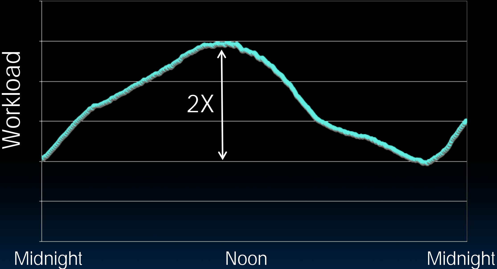
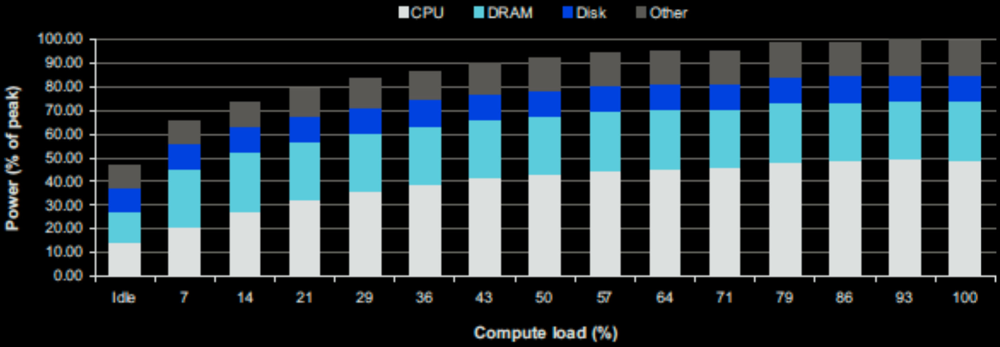
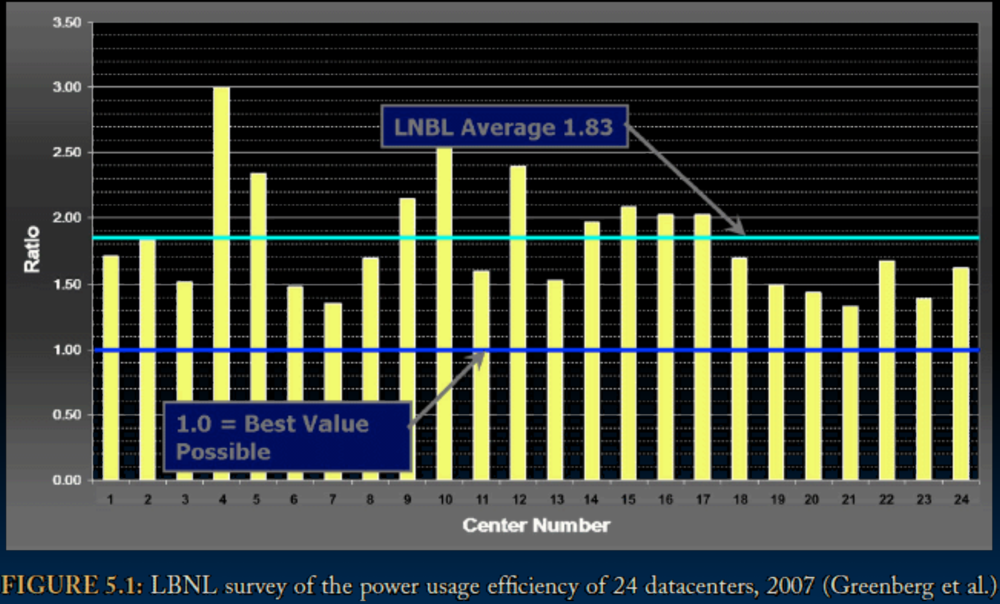
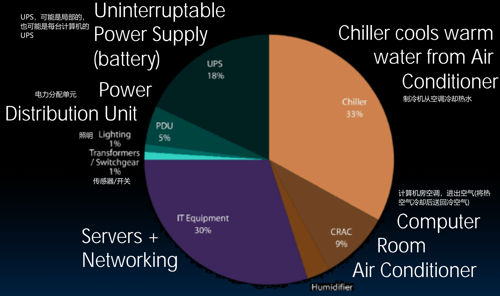
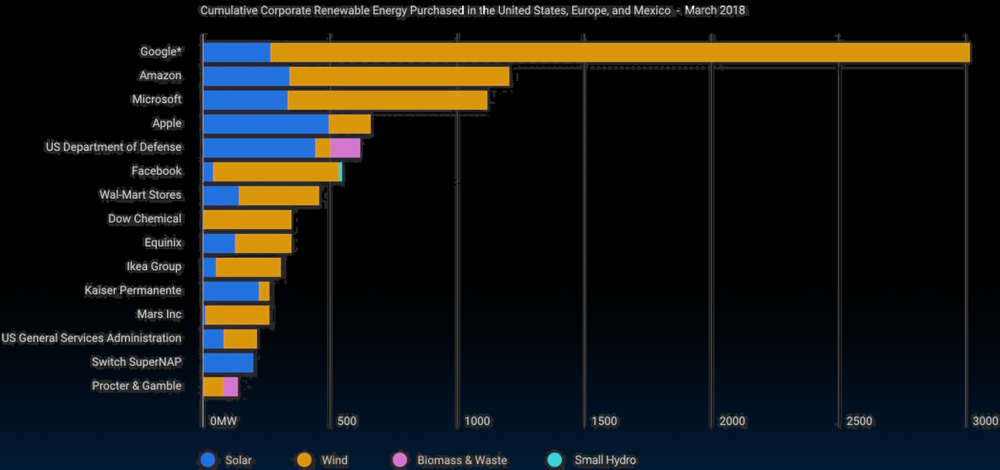

# 37.3-Workload Variation, SW Problems, PUE


Lecture Video Address


本节讨论的是关于WSC的一些问题，电力使用效率的内容。

## Workload Variation

- WSC工作负载是会随着时间的变化而波动，并且差异的规模很大
- 一般在晚上用户大都睡觉，工作负载比较小；在白天使用应用的人增多，工作负载增大
- 如果发生特殊的事情，比如世界杯，明星效应等，也会增加工作负载

> 与个人计算机不同，WSC会为PMD提供服务，也就是为几乎世界上的所有用户提供服务，所以其工作负载的拨动是非常大的，需要考虑这一点。

如下是Twitter的工作负载波动

- Online service: Peak usage 2X off-peak
- 对于特定的服务，差距可能是10倍甚至100倍

因此，处理工作负载的变化是很重要的事情

## Problems of WSC Software

Impact of latency, bandwidth, failure, varying workload on WSC software?

延迟、带宽、故障、变化的工作负载对仓库规模计算机软件有何影响？

1. **More elaborate hierarchy of memories**: WSC Software must take care where it places data within an array to get good performance
    - 为了提高效率，会尽量将数据放在距离交换机较近的地方，而不是放在边缘位置，需要经过好多交换机才能到达。
    - 并且数据尽可能的集中紧密，如果可以尽量放在同一台机器上，而不是这边一块，那边一块。

2. **failure tolerance**: WSC Software must cope with failures gracefully
    - 比较简单的情况例如在MapReduce中，如果机器故障了，只需要将任务分发给其他的机器。
    - 同时还需要如何标记故障的机器，每当一台机器出现故障时，作为IT部门的工作人员需要知道。例如磁盘故障时，需要在整个RAID故障之前找到故障的磁盘故障并替换。
    - 但是这种情况通常会爆发式的发生，因为一般磁盘都是统一安装的，所以一般故障的时间也可能很集中，一台故障后紧接着会有很多台故障。
    - 有一个办法就是提前预测什么时候会发生故障然后提前替换。当一台故障之后，其他同时生产安装的磁盘也可能会发生故障，由此提前替换。

3. **workload accommodation**: WSC Software must scale up and down gracefully in response to varying demand
    - 在可能的情况下关闭电源，或者让服务器闲置
    - 需要考虑电力，以及在使用量增加或减少时应该如何应对扩展和缩减成本的复杂性。
    - cores一般不会故障(Core故障的情况非常少)。也就是说工作节点一般不会故障，但是网络中断或者硬盘故障时常有的事，尽管固态硬盘(SSD)的故障率比早期少得多。

More elaborate hierarchy of memories, failure tolerance, workload accommodation makes **WSC software development more challenging than software for single computer**

## Power Usage Effectiveness

### Power vs. Server Utilization

前面也提到了，WSC的工作负载是会变化的。下图显示了当计算机负载从闲置(idle)到100%时，电力的变化情况。

几个关键的节点如下：

| Power          | Compute load | desc                                                     |
| -------------- | ------------ | -------------------------------------------------------- |
| ½ peak power   | idle         | 在计算机空闲的时候，电力就已经到达了½ peak，这是很浪费的 |
| ⅔ peak power   | 10% utilized | 只使用了10%，这并不高，但是电力已经到达⅔ peak            |
| 90% peak power | 50% utilized | 在一半利用率的时候，电力已经快到达峰值了                 |

- 我们希望: Most servers in WSC utilized 10% to 50%，保持在这个范围，不要满负载运行
- Goal should be Energy-Proportionality: % peak load = % peak energy，也就是说Power和Compute load应该是线性增长的，当利用率较低的时候，电力也较低。

人们正在努力建立越来越多的系统来达到这个目标，但这很难，非常难。

### PUE

PUE是衡量整个数据中心耗能的指标，而不是IT设备完成任务的耗能指标。

- Overall WSC Energy Efficiency(整体能源利用效率) = `amount of computational work performed / total energy used in the process`(完成的计算工作量 / 过程中使用的总能量)
- Power Usage Effectiveness (PUE): Total building power / IT equipment power (数据中心总耗能 / IT设备电力)
    - A power efficiency measure for WSC, not including efficiency of servers, networking gear
    - 当做的最好的情况下，PUE = 1

---

下面是ChatGPT的解释

PUE（Power Usage Effectiveness）是用于衡量数据中心能效的一个指标。它表示数据中心总能耗与其IT设备能耗之间的比率。**PUE越低，表示数据中心的能效越高**，因为**更多的能量被用于运行IT设备而不是冷却和其他非IT负载**。

具体地说，PUE可以通过以下公式计算得出：

$\text{PUE} = \frac{\text{总能耗}}{\text{IT设备能耗}}$

其中，总能耗包括数据中心用于**冷却**、**照明**和其他非IT设备的能耗，而IT设备能耗仅包括服务器、存储设备等实际运行计算任务的设备能耗。

### PUE in the Wild (2007)

> "In the wild" 可以翻译为 "在野外" 或 "在自然环境中"，在技术领域中常用来指某个技术、软件或设备在现实世界中被实际使用，而不是在实验室或受控环境中。

如下是24个数据中心的PUE，PUE越高意味着浪费越多，开销越大。

> 最极端的情况是整个WSC全部为IT设备计算工作，那么就没有开销，PUE = 1

- 这24个数据中心的平均值为1.83，而理想的目标是达到1，这是非常困难的。
- 有的数据中心做的很好，在1.2~1.4左右，有的效率很低，达到了3。

### Where Does Power Go?

电力都损耗在哪里了？

- 只有30%的IT Equipment
- 其中有将近一般用于冷却。

因此，冷却、气流、温度等是WSC必须要考虑的事情，即使学习的是计算机体系结构。

这也是为什么计算机的频率不能再增加了，以及为什么28核机器是2.5GHz而不能是6GHz，因为无法将其冷却。

### Google: How to decrease PUE

谷歌进行了研究并写了一份报告。Google WSC A PUE: 1.24

1. Careful air flow handling

    - Don't mix server hot air exhaust with cold air (separate warm aisle from cold aisle): 不要将服务器的热空气排气与冷空气混合(将热通道与冷通道分开，冷空气从一个通道进来，带走系统的热量，然后从另一个通道出去，保持独立)
    - Short path to cooling so little energy spent moving cold or hot air long distances
        - 为了避免将热空气长距离传输再冷却并送回的高成本和低效率，我们应尽量缩短冷却路径，实现局部化冷却。
        - 这就像数据一样，我们希望数据集中靠近计算中心，而不是分散并且远离。缩短冷却路径同理。
    - Keeping servers inside containers helps control air flow
        - 这也是为什么WSC里面有很多的container，将Array装在container的原因。一方面，这些服务器很吵，但不是什么大问题。更主要的是，不装在container里面，冷热空气混合，整个房间会非常热。
        - 将Server装在集装箱内，可以更好的引导空气，而不是让空气四处旋转形成涡流和流动（在一个较小的容器内控制气流比较容易）
        - 使用集装箱也便于替换。

2. Elevated(提升) cold aisle temperatures

    - 81°F instead of traditional 65°- 68°F
    - Found reliability OK if run servers hotter

    > 冷空气温度太低意味着消耗更多的电力，但实际上不用非常低，80度左右即可，服务器仍然会正常运行。所以在进入集装箱的时候，并不会感到很冷，而是很暖和

3. Use of free cooling（使用免费冷却）

    - Cool warm water outside by evaporation in cooling towers
    - Locate WSC in moderate climate so not too hot or too cold

    > 比如通过蒸发冷却塔冷却热水。如果可以，还可以利用适度气候的自然冷却，甚至引水帮助冷却系统。

4. Per-server 12-V DC UPS

    - Rather than WSC wide UPS, place single battery per server board
    - Increases WSC efficiency from 90% to 99%

5. Measure vs. estimate PUE, publish PUE, and improve operation

    > 不要单打独斗，测量和估算PUE，公开发布结果，改进操作，共享最佳实践。像Google、Facebook、Amazon这些公司不应该各自为战，而应该互相交流最佳实践。举办WSC相关的会议，讨论最佳方法，有助于所有公司。这种开放的精神非常值得提倡，尽管某些具体细节可能涉及商业机密。

## Computing in the News

以下是关于计算机的新闻报道。

[2011](http://www.nytimes.com/2011/09/09/technology/google-details-and-defends-its-use-of-electricity.html)

- 2011年，谷歌披露他们使用的电力足够供应20万个家庭，这相当于一个小城市的规模。但是谷歌声称，通过这样做，可以使地球更环保：没有谷歌提供搜索的能力，可能不得不打电话给别人，甚至亲自开车去图书馆或者买东西。也就是说，谷歌提供的服务可以省去在其他方面使用的能源。

- 但是，有人说搜索每天的成本相当于点亮一个60瓦的灯泡三个小时。
- 总之，谷歌由此收到了批评。

[2018](https://techcrunch.com/2018/04/04/google-matches-100-percent-of-its-power-consumption-with-renewables/)

- Google: "Over the course of 2017, across the globe, for every kilowatt-hour of electricity we consumed, we purchased a kilowatt-hour of renewable(可再生能源) energy from a wind or solar farm that was built specifically for Google. This makes us the first public Cloud, and company of our size, to have achieved this feat"

    > 在2017年期间，全球范围内，对于我们消耗的每一千瓦时的电力，我们购买了一千瓦时的可再生能源，这些能源来自专门为谷歌建造的风电或太阳能农场。这使我们成为第一个实现这一壮举的公共云公司，也是第一个达到这一成就的大规模公司。

如下是2018年3月在美国、欧洲和墨西哥的累积企业可再生能源购买情况。

可以看到谷歌在大型服务运营商中遥遥领先，微软和苹果等也很高。

> 总之，电力是WSC非常重要的问题，特别是对于Google这样大的企业来说，其可能要花费非常多的能源，并由此要担负一定的社会责任。这也是我们在学习计算机体系结构中药考虑的。

## Summary

- Parallelism is one of the Great Ideas
    - Applies at many levels of the system – from instructions to warehouse scale computers
- Post PC Era: Parallel processing, smart phone to WSC
- WSC software must cope with failures, varying load, varying HW latency bandwidth
- WSC Hardware sensitive to cost, energy efficiency
- WSCs support many of the applications we have come to depend on
