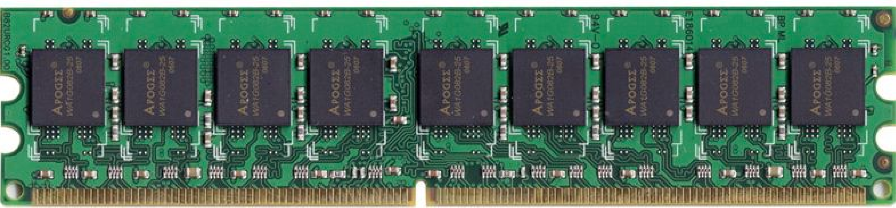

# 38.1-Intro


Lecture Video Address


回顾之前学的内容

1. Abstraction (Layers of Representation/Interpretation)
2. Moore's Law
3. Principle of Locality/Memory Hierarchy

    > 局部性原理和存储层次结构，它使我们能够构建看起来无限快且无限大的存储系统。
4. Parallelism(在功率受限的情况下提高性能的一种方式。)
5. Performance Measurement & Improvement(Iron & ATAM)
6. **Dependability via Redundancy**

## Why Dependability?

为什么需要可靠性呢？因为我们在日常生活中越来越依赖计算系统，不仅仅是在纯计算领域，包括金融交易都是通过计算机进行的。许多人的生活都依靠着计算机的支持。

但是计算机会发生错误，可能会暂时崩溃，比如说蓝屏死机或者许多其他的计算机故障模式。

- 通常，在计算机崩溃后，可以重新启动。这称之为暂时性故障模式(transient mode of failure)。这种故障可能是由于代码错误引起的。例如忘记清理退出函数(有时候production software也会有这样的问题)。有时，这些暂时性故障是因为硬件出现了问题，硬件出错了。
- 如果这些错误持续存在，也就是说计算机某个部件真的永久性故障了，那么通常会丢弃它们，或者尝试修复它们（如果它们是可修复的）。

| May fail transiently(短暂的)…                                | or permanently(永久报废)                                     |
| ------------------------------------------------------------ | ------------------------------------------------------------ |
|  |  |

所以在这个模块中，我们将讨论如何通过使用冗余来减轻这些硬件故障。

## Great Idea #6: Dependability via Redundancy

有两种形式的冗余：

- 第一种是单纯的增加硬件，当硬件故障的时候使用备用的硬件。这种冗余不涉及内容
- 第二种是内容方面的冗余，比如多一份数据拷贝，增加校验码等等。

Redundancy so that a failing piece doesn't make the whole system fail

- 当系统的某个部分出现故障时，可以使用冗余来替换。
    - 冗余经常出现在内存系统中：在内存中有备用的部分(当某一块内存出问题的时候，启用备用的内存)。
    - 在并行计算机中，可能有备用的processor cores。
    - 在市场上可以买到8 cores或者7cores的GPU，这两种芯片看起来是一样的，7cores的GPU是因为某一个Core失效了，性能会降低，但换来的是更加便宜的价格

工作原理是有多个硬件副本。通过某种投票机制，选择多数硬件的结果为正确答案。比如下图的1 + 1

- Increasing transistor density reduces the cost of redundancy

> 集成、晶体管集成密度的进步，使得这变得更加容易。

这里有个小问题，随着随着组件变得更小，线条变得更细，它们更容易频繁地失败。但失败率并没有增加到我们能够集成更多组件的速度，所以我们可以增加冗余。

---

Applies to everything from datacenters to storage to memory to instructors

- Redundant datacenters so that can lose 1 datacenter but Internet service stays online
- Redundant disks so that can lose 1 disk but not lose data (Redundant Arrays of Independent Disks/RAID)
- Redundant memory bits of so that can lose 1 bit but no data (Error Correcting Code/ECC Memory)

| datacenter                                                   | disk                                                         | memory bit                                                   |
| ------------------------------------------------------------ | ------------------------------------------------------------ | ------------------------------------------------------------ |
|  |  |  |
