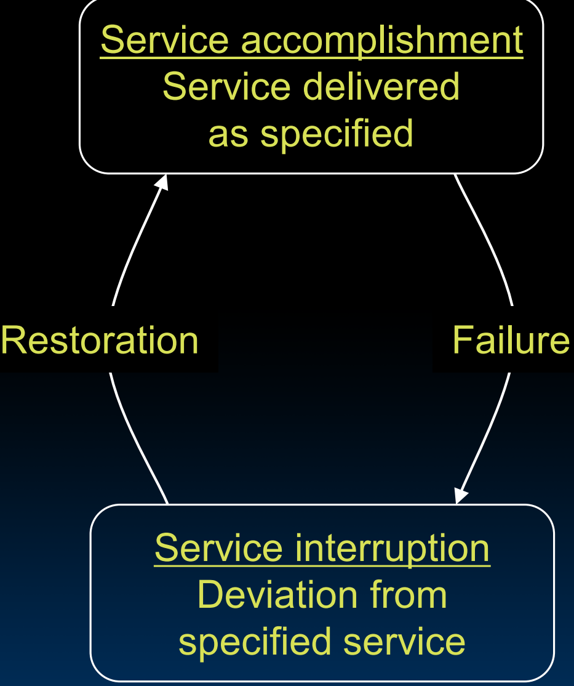
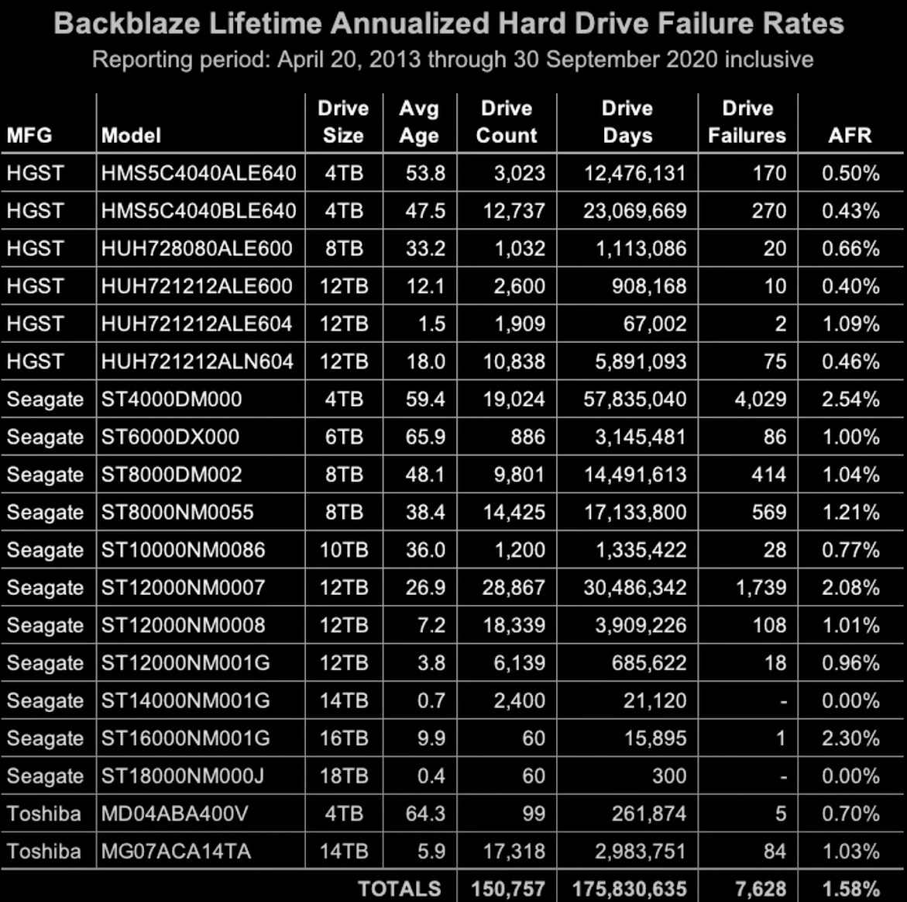
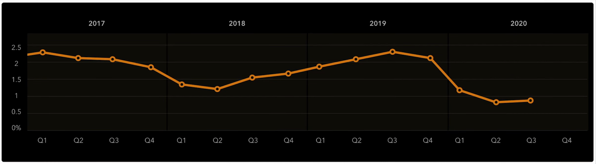

# 38.2-Dependability Metrics


Lecture Video Address


本模块的目的是希望利用冗余来提高可靠性。在每个计算机系统中，需要测量某些指标来衡量是否进行了改进。

本节讨论可靠性的指标。

## Computer State

首先来了解计算机是怎么运行的。

在正常操作中，计算机为我们运行一些服务，但有时可能会发生故障。故障(fault)是计算系统中某个组件的失效。但是组件的故障不一定能够导致系统的故障。

该组件是否导致系统故障取决于它是否正在使用以及它是否具有冗余，例如，是否有其他东西可以接管。

所以计算机系统在两个状态之间操作：

- Service accomplishment，系统正常运行，服务得以完成
- Service interruption，服务终端

- Service accomplishment → Service interruption的过程叫做Failure
- Service interruption → Service accomplishment的过程是restoration，表示系统从中断到正常工作

最重要的是，这个过程发生的频率和事件

## Time vs. Space

当谈论冗余时，会看到时间和空间上的冗余使用。

### Spatial Redundancy

Spatial Redundancy – replicated **data**、**check information** or **hardware** to handle hard and soft (transient) failures

空间冗余意味着有多个副本。可能有多个计算单元的副本，或者更常见的是有多个数据副本。

多个数据副本可能存在于DRAM或硬盘(disk)中。

- 在DRAM中，更常见的是通过某种代数方式添加冗余位，以便我们可以从临时错误中恢复。
- 硬盘中，通常保留冗余设备，以帮助我们从任何类型的故障中恢复。

所以**数据副本**本质上是空间冗余。

### Temporal Redundancy

Temporal Redundancy – redundancy in time (retry) to handle soft (transient) failures

时间冗余本质上意味着，如果计算系统出现临时故障，并且有时间重复计算。

所以如果检测到计算失败或服务未完成，可以重新进行。如果完成了并且没有任何后果地恢复了，那就没问题了。

## Dependability Measures

下面是一些可靠性的度量

- Reliability(可靠性): Mean Time To Failure (MTTF)
    - 这也是最常用的
    - 平均故障间隔时间，衡量的是设备故障需要多长时间，或者如果是可恢复的，同一设备两次故障之间的时间。
    - 实际上就是在Service accomplishment的时间。

- Service interruption: Mean Time To Repair (MTTR)
    - 平均修复时间。服务中断，本质上是我们在中断状态下停留的时间，这就是平均修复时间

> 在Service Interruption的过程中就要进行修复，所以在终端过程中的时间就是修复的时间

- Mean time between failures (MTBF)
    - MTBF = MTTF + MTTR

> 两次Failure之间的平均时间，在Service accomplish的时间 + Service Interruption的时间。
>
> Failure和restoration的过程的时间是不考虑的。

- Availability = MTTF / (MTTF + MTTR)

---

- Improving Availability
    - Increase MTTF: More reliable hardware/software + Fault Tolerance
    - Reduce MTTR: improved tools and processes for diagnosis and repair

> 就是想办法增加Service Accomplish，也就是正常工作的时间。减少Service Interruption，也就是服务终端的时间。

## Availability Measures

下面定义的事可用性指标。

`Availability = MTTF / (MTTF + MTTR)`，通常以百分比表示。

MTTF, MTBF usually measured in hours。

现在的计算机很少会宕机，所以通常假设有很高的时间可用性。

Since hope rarely down, shorthand is "number of 9s of availability per year"

> 使用9来表示每年的可用性

| n nine  | percentage | 每年修复的时间             |
| ------- | ---------- | -------------------------- |
| 1 nine  | 90%        | 36 days of repair/year     |
| 2 nines | 99%        | 3.6 days of repair/year    |
| 3 nines | 99.9%      | 526 minutes of repair/year |
| 4 nines | 99.99%     | 53 minutes of repair/year  |
| 5 nines | 99.999%    | 5 minutes of repair/year   |

其中percentage就是由`Availability = MTTF / (MTTF + MTTR)`计算而来的，不过经常使用9的个数来作为缩写表示可用性(Availability)

- 1\~3个9几乎是无法容忍的，4\~5个9是YouTube的可用性
- 有些系统有6~7个9，这些是更依赖的系统，宕机的代价也更高。例如，几年前YouTube宕机几小时的损失，基本上是每分钟损失数百万。

> 一般计算机系统会保持很高的可用性，在5 nines的情况下，每年只有5minutes的时间用于维修，如果真的能够遇到，那可以去买彩票了

## Reliability Measures

同理，reliability也可以转化成另一种表现形式

### AFR

Reliability(可靠性): Mean Time To Failure (MTTF)

Another is average **number** of failures per year: `Annualized Failure Rate (AFR)`（年度故障率）

> 这个指标衡量的事每年发生故障的组件数目

- E.g., 1000 disks with 100,000 hour MTTF
- 365 days * 24 hours = 8760 hours
- (1000 disks * 8760 hrs/year) / 100,000 = 87.6 failed disks per year on average

> 每年有多少个故障的disks

- 87.6/1000 = 8.76% annual failure rate

> 每年故障的disks的数量 / disks的总数，得到disks每年的故障率。

因为一般不会有0.6个磁盘故障，因此约等于8.8%，相当于1000个磁盘中每年有88个失效的磁盘。这个数据结局与在实际中看到的情况。

Google's 2007 study* found that actual AFRs for individual drives(驱动器) ranged from 1.7% for first year drives to over 8.6% for three-year old drives，[数据来源](https://research.google.com/archive/disk_failures.pdf)

#### Backblaze Hard Drive Failures

如下是backblaze发布的驱动器的AFR，这是在购买driver时可以参考的指标，

- 这些驱动器的AFR都很好，基本都为个位数甚至小于个位数，大约相当于1m或者100m小时的MTTF

还有，驱动器的故障率实际上随着时间在下降，故障率逐渐减少

### FIT

这个度量曾经用于汽车

> Failures In Time (FIT) Rate

- The Failures In Time (FIT) rate of a device is the number of failures that can be expected in one billion (10^9^) device-hours of operation
  
    > 就是在10亿设备小时的操作中发生的故障数量
    
    - Or 1000 devices for 1 million hours, 1 million devices for 1000 hours each

> 10亿小时听起来难以想象，但是设备的数据量是非常大的，如果是1000台设备，就相当于1million小时的故障数，如果是1million台设备，那就是1000小时的故障数。像手机这样的设备数量是非常大的，可能以十亿为单位，为了评估其故障率，所以将时间设置的非常大。

- MTBF = 1,000,000,000 x 1/FIT

    > MTBF(Mean time between failures) = MTTF + MTTR，

Relevant: Automotive safety integrity level (ASIL) defines FIT rates for different classes of components in vehicles

> FIT很重要，因为计算机越来越多地进入我们的汽车，所有的可靠性规范都以FIT率表示。在汽车安全完整性等级（Automotive Safety Integrity Level，简称ASIL）中，为车辆中不同类别的组件定义了不同的FIT率。

---

AFR & FIT 区别：

- AFR主要强调一个设备的故障率
- FIT强调在基数很大的情况下，固定时间内的故障数量

## Dependability Design Principle

-  Design Principle: No single points of failure: "Chain is only as strong as its weakest link"

> 当我们设计一个可靠的系统时，不应有单点故障。通俗来说，链条的强度只取决于它最弱的一环。

-  Dependability corollary(推论) of Amdahl's Law: Doesn't matter how dependable you make one portion of system, Dependability limited by part you do not improve

> 不管你把系统的某一部分做得多么可靠，系统的可靠性仍受到你没有改进的部分的限制。

总之不能允许有单个点出错，不论其他的组件多么可靠，那么最终的可靠性仍然受可靠性较低的组件限制。
