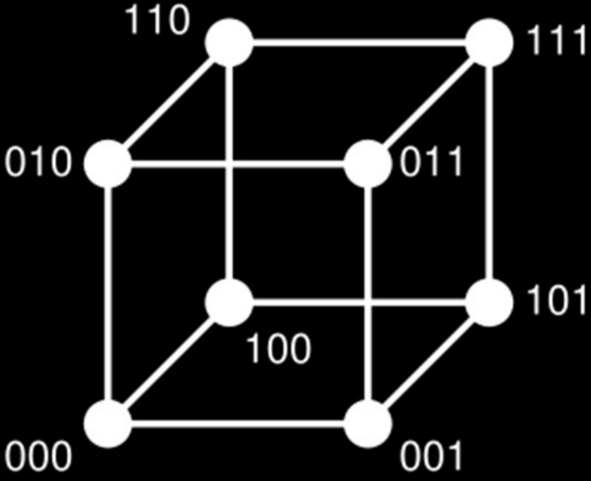
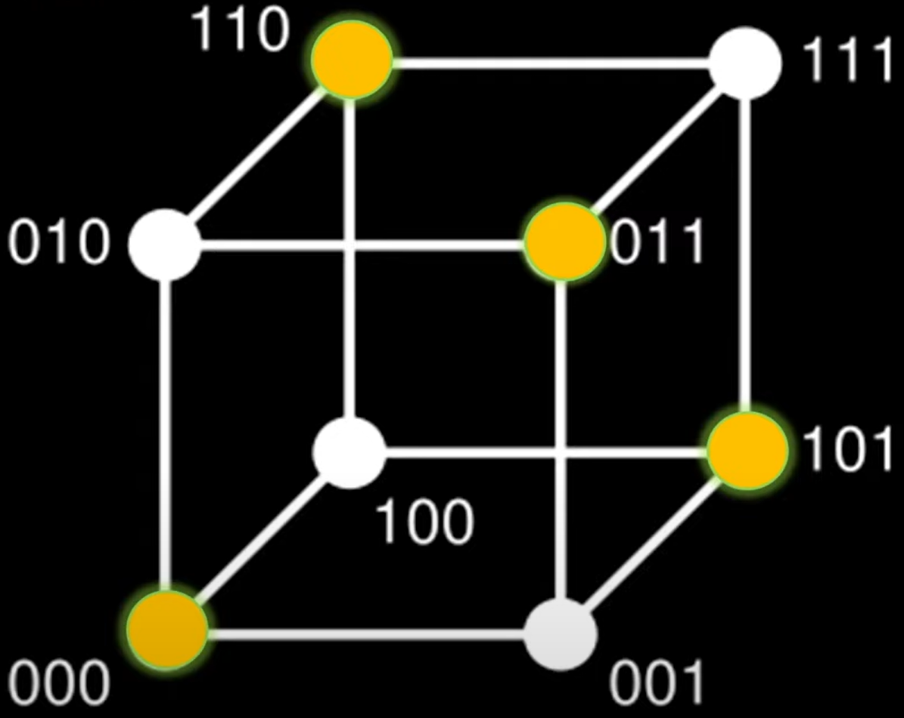
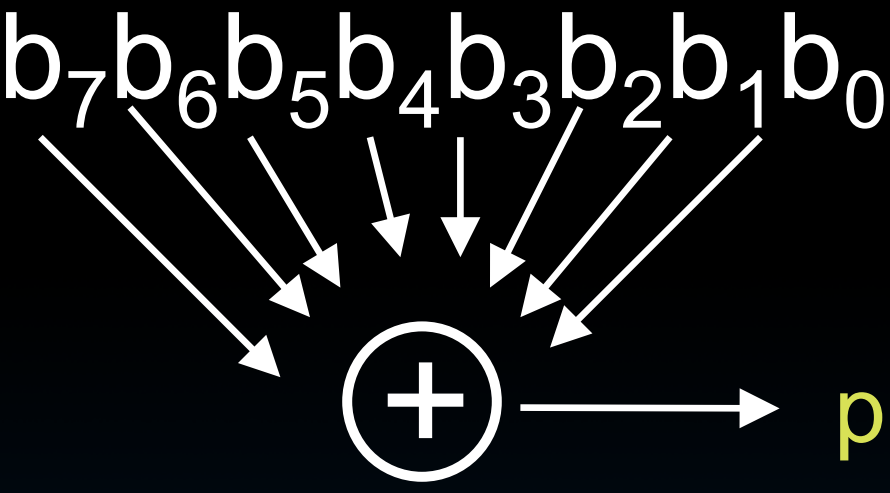
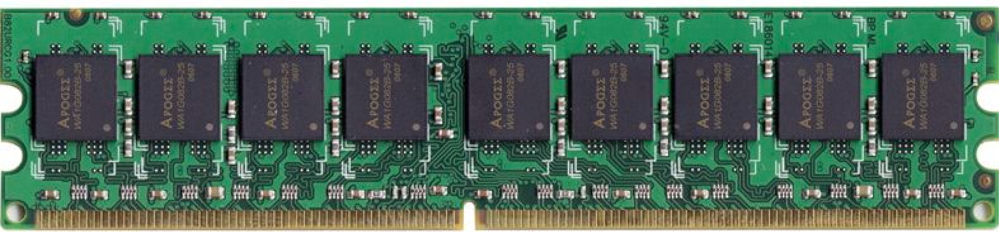
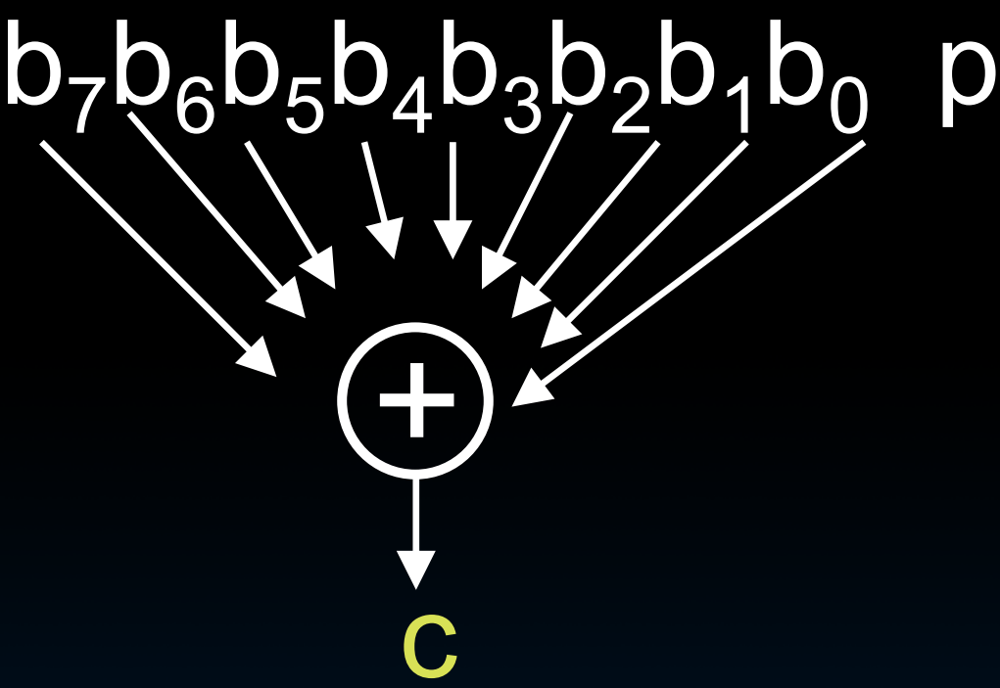

# 38.3-Error Detection & Parity


Lecture Video Address


在上节课中，我们已经定义了衡量可靠性(Dependability)的指标。在此过程中，我们还定义了如何衡量可靠性(Availability)和可用性(relability)。

在尝试增加冗余之前，要先弄清楚如何检测系统中是否存在错误或故障。

## Error Detection/Correction Codes

计算系统中的错误可能发生在任何地方。包括ALU，Register file。但最有可能出现错误的是DRAM，因此我们重点介绍如何防止DRAM的错误。

为了防止DRAM的错误，需要添加一些冗余位，以检测到内存中特定word发生了错误。这里将引入错误检测，并稍后引入纠错码来实现这一点。

### Memory errors

Memory systems generate errors (accidentally flipped bits)

为什么内存容易发生错误呢？

软错误: "Soft" errors occur occasionally when cells are struck by alpha particles or other environmental upsets

- 内存单元(bit)有很多，并且非常小， 每个bit都是一个存储少量电荷的小电容器，如果存储在DRAM单元中的电荷受到干扰，我们可能认为我们在单元中写入了0，但读取到的是1。

- 为什么会发生这种情况？可能是因为电源供应的干扰，或者可能是一个以宇宙射线形式出现的粒子击中了那个特定的位置并翻转了比特，实质上是通过足够的充电将对应于0的值改为1。

    > 粒子只能进行充电，也就是说只能实现0→1，这个过程叫做flip。1→0的过程叫做flop，这也是flip-flop(触发器命名的由来)

- 这种类型的错误称为软错误。内存物理上并没有问题，只是在数据存储期间发生了错误。所以，当执行操作时，它们会正常工作(但是得到的结果是有问题的)。

    > 软错误是临时的，所以一般蓝屏之后重启电脑就可解决。

硬错误: "Hard" errors can occur when chips permanently fail。

- 内存中的一个bit单元或一个word，甚至整个芯片发生故障，这些被称为硬故障或硬错误。在这种情况下，需要使用不同类型的冗余来修复它们。
- 可以修复内存芯片，这超出了本课程的范围，但可以替换计算系统中的故障芯片或故障硬盘。稍后会详细讨论这一点。

Problem gets worse as memories get denser and larger

### prevent soft error

防范软错误的方法是使用错误检测(Error Detection Code)和纠错码(Error Correction Code)，简称EDC/ECC。

> 无法通过某种方式屏蔽计算系统来真正地防范错误。有些宇宙粒子可以穿过地球，所以几乎不可能通过其他方式来保护系统。也就是说，它们无论如何都会击中，不论是计算机，甚至还会击中人。这些例子随时都有机会翻转比特。

因此这里的办法是在内存系统中添加一些冗余位，以检测是否粒子撞击或电源干扰已经改变了一些比特。与复制整个字相比，这些额外的比特会带来更少的开销和冗余，但会提供足够的保护。

其工作原理是，我们在存储常规计算结果之前，先将它们转换为某种代码空间，这个代码空间作为冗余。发生故障将有效代码变成无效的代码，我们可以检测到这一点，因为那个代码字不存在于我们的代码集中。

---

Extra bits are added to each data-word

- Used to detect and/or correct faults in the memory system

> 检测和纠错是两回事。

- Each data word value mapped to unique code word
- A fault changes valid code word to invalid one, which can be detected

## Block Code Principles

> "Block Code Principles" 可以翻译为 "块码原理"，指的是在编码理论中使用的一种技术，通过将输入数据分成固定大小的块，并将每个块映射到一个特定的编码词，以便在传输过程中检测和纠正错误。

在介绍如何添加冗余之前，先介绍原理——汉明距离

> Hamming distance是以理查德·汉明(Richard Hamming)命名的。
>
> 理查德·汉明（Richard Hamming）是一位著名的美国数学家和计算机科学家，生于1915年，于1998年去世。图灵奖获得者。曾在贝尔实验室工作很长时间，后来转到学术界。
>
> 其最为人知的是他在编码理论中的工作，特别是汉明码（Hamming code）。汉明码是一种错误检测和纠正码，可以在数据传输过程中检测和纠正单个比特的错误，广泛应用于通信和存储系统中，提高了数据可靠性。

汉明距离本质上是两个二进制数的位数差异：`Hamming distance = difference in # of bits`

如下

- p = 0<u>1</u>1<u>0</u>11, q = 0<u>0</u>1<u>1</u>11, Ham. distance (p,q) = 2，有两个对应位置的bits不一样
- p = <u>0</u>1<u>1</u>0<u>1</u>1, q = <u>1</u>1<u>0</u>0<u>0</u>1, distance (p,q) = 3

在这种情况下，任意两个不同的二进制数，其最小汉明距离是1（因为最小的情况下只有1位是不一样的）

> 最小汉明距离（Minimum Hamming Distance）是指在信息论中，两个等长字符串之间相同位置上不同元素的个数的最小值。换句话说，它衡量了两个字符串之间的相似度，具体是通过计算它们在相同位置上不同元素的最小数量来确定的。

> 下面是我用**几何原理**理解的汉明距离，以3-bits word为例（更高维度无法画图了）
>
> - 3-bits可以有8中pattern，构成如下所示的空间，每个pattern对应空间中的一个点
>
> 
>
> - 衡量两点之间的距离就要数两个点之间边的条数
> - 汉明距离就相当图两个点之间的距离，如果相差一个bit，那么在这个空间中，就相距一条边
> - 例如`Ham. distance (010,000) = 1`，说明两点之间只有一条边，如果`Ham. distance (000,111) = 3`，那么就说明两点之间有三条边，比如000→001→101→111
> - 最小汉明距离就是指相邻两个valid word之间的距离，这里所有的pattern全部都是valid，所以最小汉明距离为1

---

那么如何利用汉明距离呢？

- 在之前的课程中，我们的计算结果为binary word，并且为了有效的使用计算机硬件，没有任何冗余，这就导致了这些bits的所有pattern都是valid的，最小汉明距离为1
- 因此，我们尝试不使用全部的空间来存储数据，而是存储含有冗余的codeword，这样在code space中，只有一部分是valid的
- 假设valid codeword的最小汉明距离为2，那么如果发生1-bit的错误会怎么办？

> 同样在如下的图中，是一个最小汉明距离为2的例子（这里只是挑选了这几个点为valid value）
>
> 
>
> 假设原先的值都是valid value，如果粒子击中一个bit发生了flip，那么相当于从这些黄色点打到了白色的invalid bit，由此可以检测出错误。

所以下面的办法就是如何设置冗余的规则。

## Parity: Simple Error-Detection Coding

先想办法检测出错误

> Parity(奇偶校验)，这是一个比较简单的检测的例子。

### Store data

- 在计算中会生成一个binary word, before it is written to memory is "tagged" with an extra bit to force the stored word to have even parity(偶校验):

这里以偶校验(parity even)为例，奇校验同理。校验位是通过数据位进行XOR获得的。如果是32-bit word，也可以适用

然后将这9个bits一起存储在内存当中，这就是为什么在一些DRAM DIMM中有9个芯片，其中一个用来存储奇偶校验位。

> DIMM(双列直插式内存模块, Dual Inline Memory Module)

### Read data

Each word, as it is read from memory is "checked" by finding its parity (including the parity bit). 

- 在读取数据的时候，将数据位再次通过8个输入的异或门，根据parity bit和输出c来判断
- 如果p = 0，那么b~0~\~b~1~中1的数量需要为偶数；如果p = 1，那么b~0~\~b~1~中需要1的数量为技术
- 如果不符合要求，那么需要抛出Exception由OS来解决（由OS来替换为valid words）

---

### Minimum Hamming distance

在这种情况下，汉明距离如下

Minimum Hamming distance of parity code is 2（奇偶校验编码的最小汉明距离为2）

> 下面再次使用几何来解释一下使用奇偶校验码之后的code space的样子，仍然以3-bits 为例
>
> - 在3-bits中，2 bits是数据位，1bit是校验位，可以理解为将2-bits通过添加1个bit映射到3-bits的code space当中
> - 而在3-bits当中，由于取了1bit为校验位，这就导致valid word必须符合一定的格式，也就是说，只有符合格式的一部分pattern才是valid的，如下
>
> 
>
> - 只有000,101,011,111是even parity，是valid的
> - 此时最小汉明距离就成了2，例如110和011之间的距离为2
> - 由于是选取了固定一个bit作为校验位，因此相邻两个valid word的距离就是2，所以在这个例子中，汉明距离就是2的倍数
> - 可以理解为，通过添加校验位，将原先的数据从低维度映射到更高维度的空间当中，而在这个高维度空间中，由于一部分为校验位(检验位是由数据位生成的)，只有一部分的点是有效的。
>     - 所以说，冗余的不仅仅是bit，还是在这个code space中的点。
>     - 想想一下，在N维的code space中，可能只有几个点是valid的

### issue

在这里，已经会想到一些问题：

1. 检错能力有限，只能检测到奇数个错误位

> 如果有偶数个错误位的话，体现在code space中就相当于从一个valid codeword移动到另一个valid codeword

但总的来说，单一的奇偶校验位已经足够，因为内存系统设计的方式是，当受到粒子撞击时，一般只有一个比特会翻转。

2. 没有纠错能力

## Parity Example

下面是例子

存数据

- Data 0101 0101，有4个1，现在是even parity的状态(已经是偶校验)，在写入内存前需要保持even parity，因此parity bit = 0，最终写入内存的位0101 0101 0
- Data 0101 0111，有5个1，现在是odd parity的状态，在写入内存前需要保持even parity，因此parity bit = 1，最终写入内存的位是0101 0111 1

读数据（这里以原数据为0101 0101为例）

- Read from memory 0101 0101 0，有4个1，是even parity，没有错误
- Read from memory 1101 0101 0，有5个1，是odd parity，发生错误，向OS抛出Exception

有一个问题，如果原始字中的8个bits都是正确的，但是最后一个parity bit从0翻转到1，仍然会检测到错误。此时不知道错误在哪里。

在这种情况下，可以理解为，parity bit既可以保护数据位，但也可能引发错误。因为parity bit本身就有可能出错。

下一节讨论error correction。
