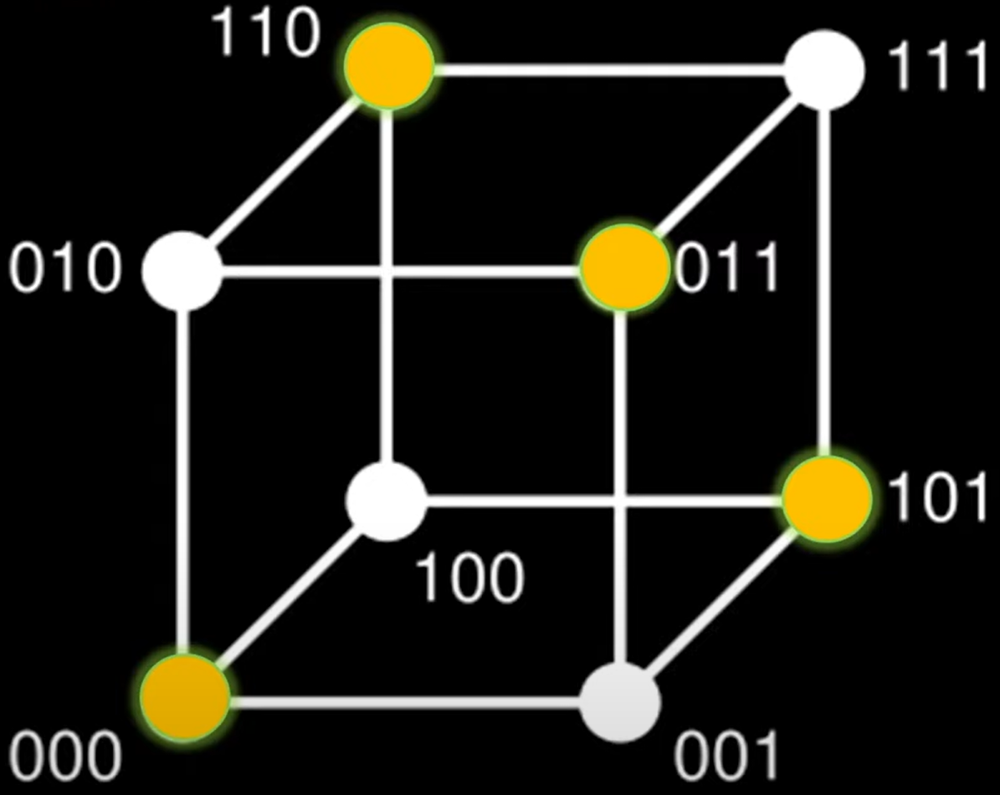
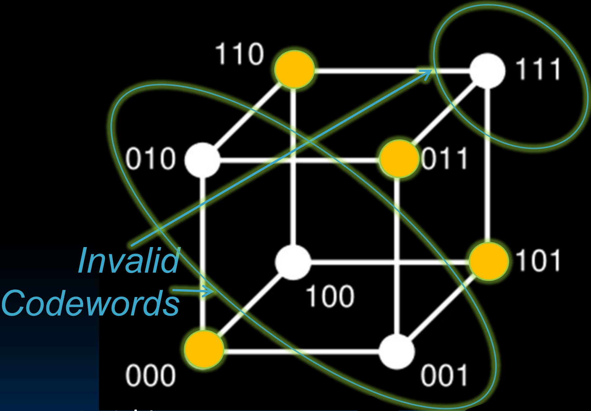
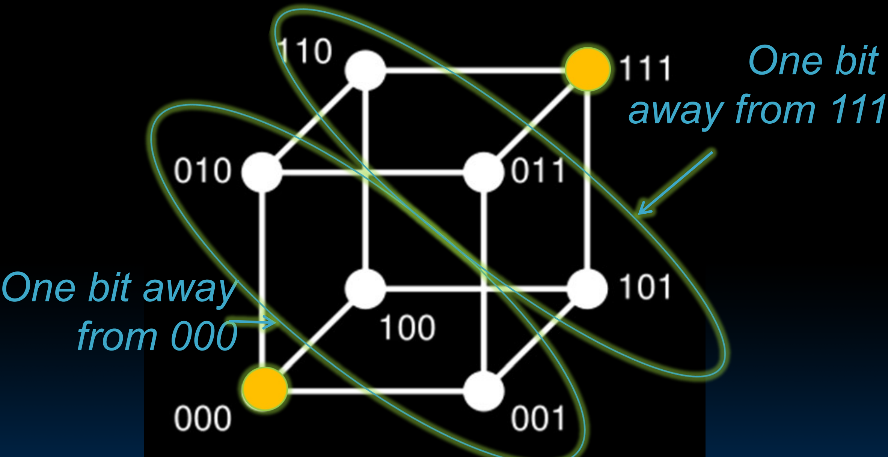

# 38.4-Error Correction


Lecture Video Address


上节中，通过引入校验位来检测内存中的错误。使用校验位将最小汉明距离从1增加到2（这样在内存中可能一半的字都是无效的，因为在引入校验位后的code space中，只有一半的数据是符合要求的）。

如果读取了一个无效的字，可以知道至少有1个位出错了。但是无法校正，因为最小汉明距离为仅仅为2，有多个有效的字与读取的无效的字相差1bit。

于是，汉明想出了增加一些冗余来进行错误矫正的方法。

> 上一节仅仅想出如何检测，本节要进行校正

## Suppose Want to Correct One Error?

汉明提出了Error Correction Code的概念，所需要的最小汉明距离为3，就可以进行单错误校正，双错误检测（Single error correction, double error detection），也成为SECDED码。

> 如果有一个错误bit，那么可以校正，如果有2个错误bits，那么只能检测出来

- 灵感来源于旧式继电器计算机上的机械卡片阅读器，在读取打孔卡片时不断出现错误。所以他对输入进行了编码，这样他就不必处理连续上升的读取错误率。
- Got interested in error correction; published 1950
- R. W. Hamming, “Error Detecting and Correcting Codes,” The Bell System Technical Journal, Vol. XXVI, No 2 (April 1950) pp 147-160.

## Detecting/Correcting Code Concept

工作原理如下：

- 假设有N位进行编码，有2^N^种可能的pattern，取N = 8，则有256种可能的pattern
- 这256可以表示为空间中的256个可能的点，选取其中的一个子集作为valid codeword，其他的点是有错误的codeword
- Detection: bit pattern fails codeword check
- Correction: map to nearest valid code word

> 检测可以通过硬件来检测其是否符合规范，纠错就使用离其最近的valid codeword进行纠正

- 如上图，在256个点中，我们仅仅选择8个为valid codeword（一般来说，valid codeword的分布是非常稀疏的）
- 如果某个位发生错误，基本上返回到离非法codeword最近的valid codeword，这是最初写入的word

> 这里的假设就是发生错误的可能很小，因此选择最近距离

## Example

下面演示一下为什么最小汉明距离为3的时候可以实现SECDED

### Hamming Distance: Eight Code Words

下面用图示来说明一下原理

- 假设有3-bits words，总共有8种组合，其code space如下

- 所有的组合都是有效的，那么最小汉明距离就是1
- 此时无法检测出任何一个是错误的

### Hamming Distance 2: Detection

设计一个汉明距离为2的码字以便检测单比特错误，我们这里选择一般的可能codeword

> 选择valid codeword的方式有很多种，上一节中的parity仅仅是其中一种，好处是规律性很强，检测起来很方便而且能够自动平均分成汉明距离为2的空间，

Detect Single Bit Errors

- 将其中一个bit作为冗余位，实际上就是将2-bits words映射到3-bits code space中
- 在3-bits code space中由于校验位的存在，只有符合格式的，才是有效words，这里以even parity为例
- 如下图，只有110,000,011,101符合格式，其余的全部不符合格式

| valid pattern                                                | invalid pattern                                              |
| ------------------------------------------------------------ | ------------------------------------------------------------ |
|  |  |

- 此时对于每一个invalid pattern，都有两个相邻的valid pattern，因此无法纠错
- No 1-bit error goes to another valid codeword（如果发生了1位错误，是没法找到valid codeword的）
- ½ codewords are valid

### Hamming Distance 3: Correction

为了实现correction，需要让点变得更加稀疏，需要更多的冗余

- 这里我们选择一对对角为valid codeword，此时的最小汉明距离为3,
- invalid word周围就只有一个valid word，由此可以纠错

- 现在的问题，就是怎样选择这样min hamming distance为3的codeword

> 现在可以想到，假设有长度为N的binary sequence，其可能的组合为2^N^，这是一个N维的code space，这个space中的每一个点都是有效的
>
> 但是如果取其中的一些bits作为冗余位，那么本质上，就是选取code space中某些特定的点为valid word，其余的都是invalid word，并且要求距离invalid word最近的valid word只有一个
