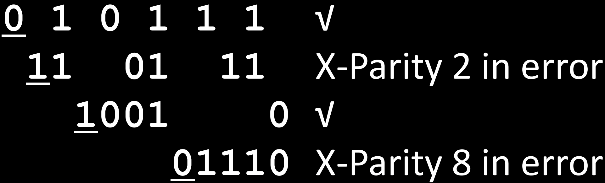

# 38.5-Hamming ECC


Lecture Video Address


上节课提到，使用最小汉明距离为3的编码方式就可以实现SECDED，但上节中所展示的例子并不是一个非常实用的例子，如下。

- 只有2个valid codeword，也就是只有1个信息位，但是使用了3个bits来表示，开销高达200%(有效位为1bit，冗余位为2bits)

所以需要做的就是

1. 怎么设计这个冗余规则，使其在表示相同长度的信息下，开销，也就是冗余位最少。
2. 在纠错的时候怎么找到错误的位置

Hamming ECC就是其中一个例子。

## Hamming ECC

- Interleave(交错) data and parity bits

解释上面这张表:

1. Bit position是需要全部存在内存当中的bits，其中parity bits和data bits是交错的

    > bit的位置该图中是从左往右的，并且从1开始，有的可成可能从右往左

2. 在Encoded data bits中，d1 d2 ...为数据位，p1 p2...为parity bits校验位

3. p1，p2，p3的位置为1, 10, 100, 也就是powers of 2，每个校验位负责校验的范围如下：

| position of parity bit | binary position | position of covered data bits | example                     | tricks            |
| ---------------------- | --------------- | ----------------------------- | --------------------------- | ----------------- |
| 1                      | 1               | XXXX1(二进制末尾是1的位)      | 1(001) 3(011) 5(101) 7(111) | 从p1开始，每隔1位 |
| 2                      | 10              | XXX1X                         | 2 3 6(110) 7(111)           | 从p2开始，每隔2位 |
| 4                      | 100             | XX1XX                         | 4 5 6 7...                  | 从p4开始，每隔4位 |
| 8                      | 1000            | X1XXX                         | 8, 9, 10, 11...             | 从p8开始，每隔8位 |

> 这样的设计是有用的，在纠错的时候可以快速定位错误的位置

这样的定义可以无限的继续下去，在8位宽的data word，需要4个parity bits。（如上图中在d8之前有p1~p4）

> 在时间计算机中，应该就是以8为宽为一个检查单位。

### Why Min Hamming Distance 3?

为什么这样设置最小汉明距离为3呢？

- 在codeword的Code space中，valid codeword都是data bits添加了parity bits后映射得到的点
- 因此比较hamming distance就是比较两个data bits添加了parity bits后的距离
- parity bits是根据data bits计算得出的
- 在hamming ECC中，每个data都至少由两个Parity bits检测(可以从上图中同一列得出)，如果两个data的某一位不同，必然导致至少两个Parity bit发生变化，因此一个data bit的不同会导致最终3个bit不同，所以最小汉明距离为3
- parity bit只有自己一个bit检测，当其发生错误的时候不属于invalid codeword

## Example

### generate Parity bits

下面来演示怎么生成parity bits

Set parity bits to create `even parity` for each group

- A byte of data: 10011010
- Create the coded word, leaving spaces for the parity bits: _ _ 1 _ 0 0 1 _ 1 0 1 0

> 先为parity bits预留空间

下面计算校验码

Calculate the parity bits

| position of parity bit | position of covered data bits | covered data bits(bold)                         | parity bit |
| ---------------------- | ----------------------------- | ----------------------------------------------- | ---------- |
| 1                      | 1,3,5,7,9,11                  | **?** _ **1** _ **0** 0 **1** _ **1** 0 **1** 0 | 0          |
| 2                      | 2,3,6,7,10,11                 | 0 **? 1** _ 0 **0 1** _ 1 **0 1** 0             | 1          |
| 4                      | 4,5,6,7,12                    | 0 1 1 **? 0 0 1** _ 1 0 1 **0**                 | 1          |
| 8                      | 8,9,10,11,12                  | 0 1 1 1 0 0 1 **? 1 0 1 0**                     | 0          |

> 在分析的时候可以发现，计算每个parity bit是可以并行进行的，前后的parity bit不会包含，比如说p2校验的范围是不包含p4，p8，p16的

- Final code word: 011100101010

### Detection & Correction

- Suppose receive <u>01</u>1<u>1</u>001<u>0</u>1110

#### Detection

- 每个parity bit检测自己对应组的位置。
- p2和p8检测的范围出现了问题

说明出现了错误，那么怎么定位错误呢？

#### Correction

在之前，我们划分每个parity bits的检测范围的时候，规则如下

| position of parity bit | binary position | position of covered data bits | example      | tricks            |
| ---------------------- | --------------- | ----------------------------- | ------------ | ----------------- |
| 1                      | 1               | XXXX1                         | 1,3,5,7..    | 从p1开始，每隔1位 |
| 2                      | 10              | XXX1X                         | 23,67        | 从p2开始，每隔2位 |
| 4                      | 100             | XX1XX                         | 4567,...     | 从p4开始，每隔4位 |
| 8                      | 1000            | X1XXX                         | 8,9,10,11... | 从p8开始，每隔8位 |

- 这样划分每个区域是有重合的

- 现在p2负责的XXX1X和p8负责的X1XXX发生了问题，那么出错的就是这两个区域的重叠范围 10 + 1000 = 1010，即10号位

- 查看下图也可以看出p2和p8的重叠位置是10号位

    

> - 所以说，确定错误位的方式就是将检查出错误的parity bits的位置相加，本质上是求取这几个parity bits的重叠部分
> - 这样也解决了之前所说的parity bits本身也会出错的问题：如上图，所有的数据位都由至少两个parity bits检测，但是parity bit只有一个校验位检测，如果parity bit出现了错误，那么在检测中只会有一组出现问题，其他组不会检测这个parity bit的

然后做的就是翻转10号位: Flip the incorrect bit … 011100101**0**10

## What if More Than 2-Bit Errors?

现在有两个问题：

1. 以上仅仅达到了SECDED的标准，但是在现实中，我们需要有更高的要求。
2. Hamming ECC仅仅解决了Memory的问题，但是在其他的领域也可能存在错误，并且错误的位数更多，其需要

处理器使用汉明码：

1. 高端微处理器通常采用SECDED的标准
2. 处理更重要工作的服务器处理器有更高的要求：Use double-error correction, triple-error detection (DECTED)，此时就需要更复杂的hamming ECC，本课程不深入讨论。

---

但是当处理比微处理器噪音更大的东西时，会看到更多的错误

Network transmissions, disks, distributed storage common failure mode is bursts(突发的) of bit errors, not just one or two bit errors
- Contiguous sequence of B bits in which first, last and any number of intermediate bits are in error
- Caused by impulse noise or by fading in wireless
- Effect is greater at higher data rates

Solve with **Cyclic Redundancy Check (CRC)**, **interleaving** or other more advanced codes，本节不予以讨论。

---

分析一下两种发生错误的区别

> - Memory的数据是具有一定持久性的，问题发生在保存的过程中(因为电容很容易翻转)，但是有错误的bit可能很小，而且需要有纠错能力，因此使用hamming Code，可以准确定位错误的位置，但是只能处理比较少的错误，开销较大
> - 但是网络，硬盘传输等，问题发生在传输的过程中，有错误的bit可能很多，但是不需要纠错(出错了重新传输即可)，因此可以使用CRC类似的方式，主要用于检测数据传输或存储中的错误，但它通常不能直接确定出错位的位置。

## Hamming Conclusion

理一下整个汉明码的思路:

- 定义了汉明距离的概念，由于没有冗余位的codewords的最小汉明距离为1，无法检错，更无法纠错
- 如果最小汉明距离为2的话，那么就可以进行纠错，添加一个parity bit既可以实现这样的编码方式，但是无法检测偶数个错误，也无法纠错，parity bit本身也可能出现错误
- 因此汉明提出，如果最小汉明距离为3的话，那么就可以进行single-error correction, double-error detection，因此需要设计一个开销较低的编码方式，并且实现最小汉明距离为3
- Hamming ECC实现了这样的要求。

由此解决了Memory的soft Error
