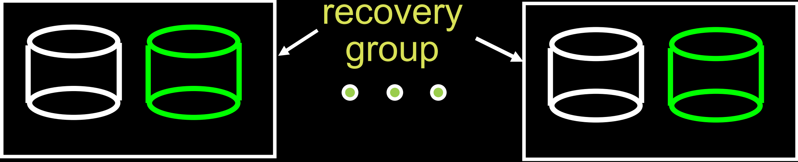
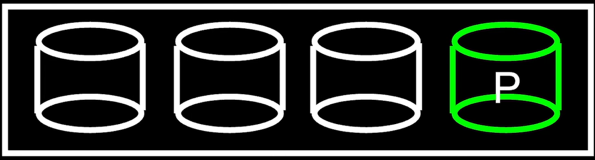
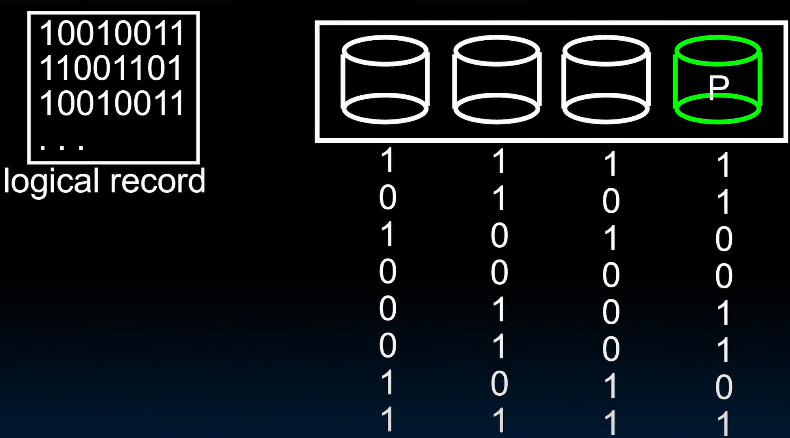
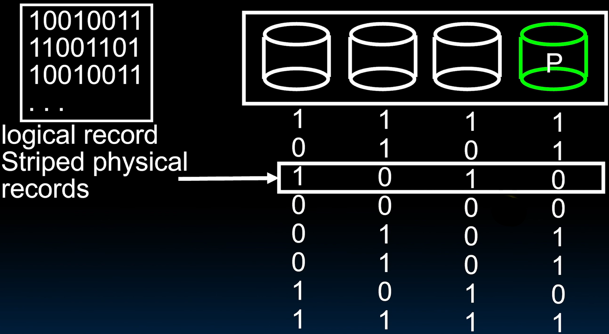
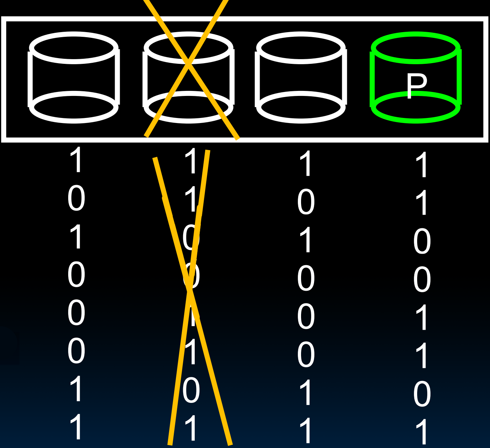
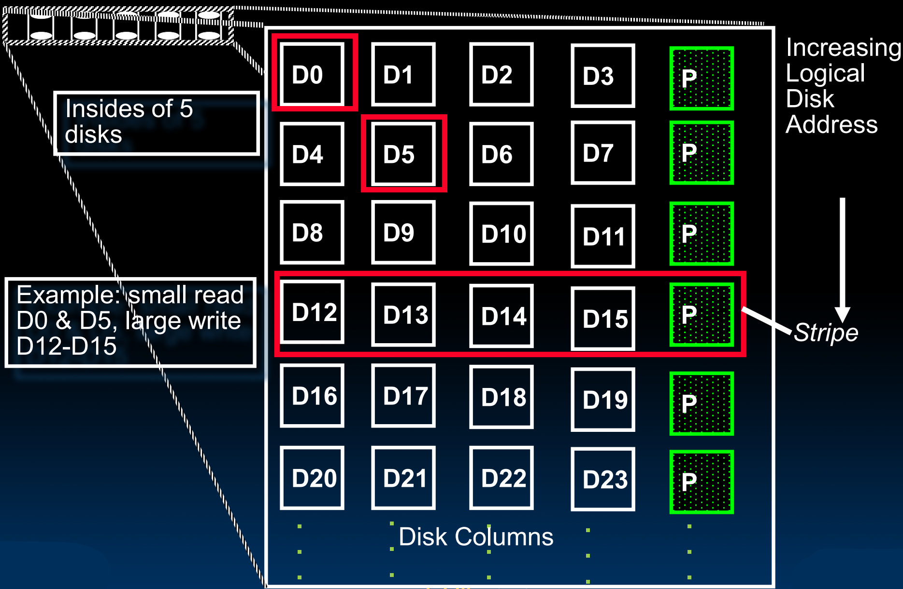
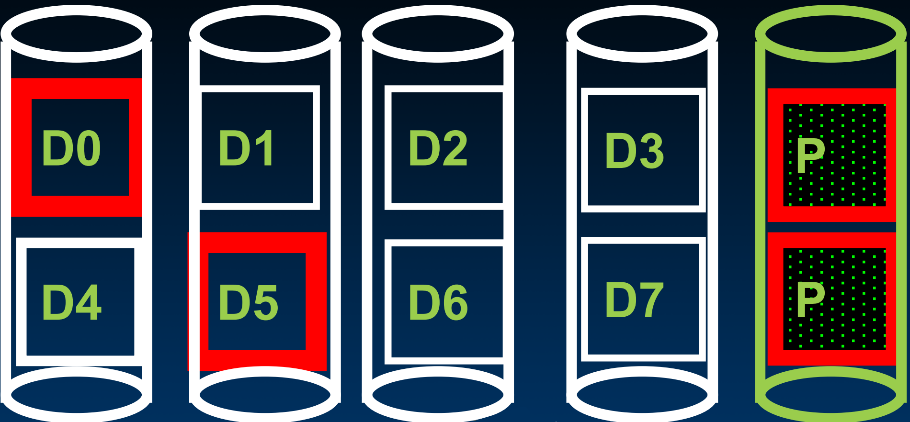
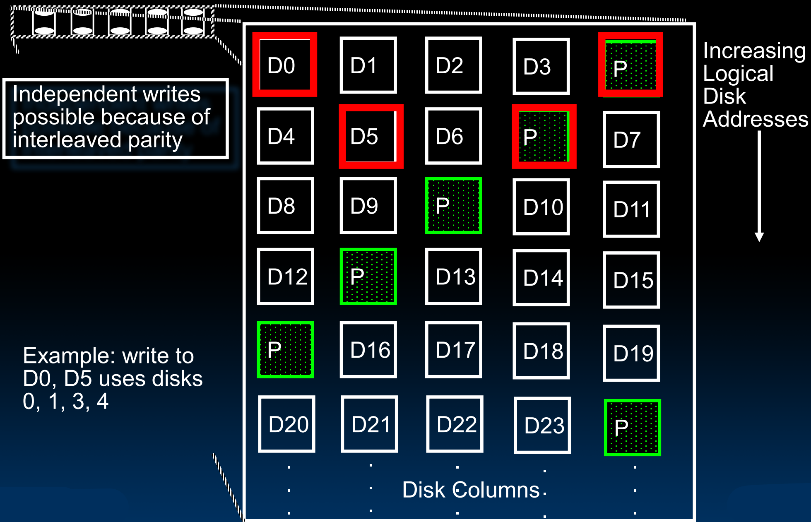

# 38.6-RAID


Lecture Video Address


到目前为止，我们已经了解了如何添加位级(bit-level)冗余来避免由一些瞬态缺陷(transient defects)（如宇宙射线或环境干扰）引起的软错误(soft error)。

那么如何处理硬件中的永久性故障呢？使用某种错误纠正来防止瞬态错误的开销非常高。

通常在硬件中使用备用零件，这些零件可以接替故障部分。这种情况也发生在内存芯片中，但它深深嵌入在内存芯片的实际设计中，因此对于本课程来说并不适用。但是，有一个很好的例子是磁盘驱动器(disk drives)。

> 硬件中的永久性故障不宜纠错，因为成本很高，解决办法就是备份。

## RAID: Redundant Arrays of (Inexpensive) Disks

### introduction

磁盘驱动器（硬盘驱动器）是机械设备，容易出现故障。前面已经看到磁盘驱动器的AFR(年度故障率)大约在1%到2%之间。

磁盘驱动器上可能存储着宝贵的数据。通常情况下会有备份，但在驱动器故障后恢复操作的备份成本相当高。

因此，UCB的Randy Katz和Dave Patterson提出了一个很好的想法，即提供有助于解决磁盘故障的冗余——RAID(Redundant Arrays of (Inexpensive) Disks)。

这里的“廉价”非常合适，因为它适用于任何磁盘，无论是昂贵还是便宜。这个想法实际上是作为替代非常昂贵的高可靠性磁盘而提出的，这些高可靠性磁盘可以被一组相对便宜的现成磁盘所取代。

> 就是使用多个磁盘阵列来取到一个磁盘

### RAID

Redundancy yields high data availability

> Availability: service still provided to user, even if some components failed

---

- 数据就不会仅存储在一张磁盘上，而是存储在多张磁盘上。
- Files are "striped" across multiple disks
    - 如果有一个大文件，与其将所有内容写入一张磁盘，我们会将其分成块，并在多张磁盘上以条带形式写入。
    - 磁盘速度很慢，如果能将文件的各部分并行写入多张磁盘，就可以加快操作速度。
    - 除此之外，还可以防止服务中断和故障，从而提高可靠性。
    - 即使磁盘仍会发生故障，用户文件的内容仍可以从阵列中的其他磁盘中重建。当然，这有一定的开销。
    - 我们并不是用所有磁盘来存储不同用户的数据，而是用一些磁盘作为冗余来源。

> 磁盘条带化（Disk Striping）是一种将数据分散存储在多个物理磁盘上的技术。它的目的是提高数据读写性能、增加存储容量，并增强数据的冗余和可靠性。在磁盘条带化中，数据被分成固定大小的条带，然后按顺序写入多个磁盘上。这样，多个进程可以同时访问不同部分的数据，而不会造成磁盘冲突。此技术在需要顺序访问数据时，还能获得最大程度的I/O并行能力，从而实现非常好的性能

- Disks will still fail
- Contents reconstructed from data redundantly stored in the array
    - Capacity penalty to store redundant info
    - Bandwidth penalty to update redundant info

## Different RAID

下面介绍RAID的几种传统用法。

有不同级别的RAID。RAID 0不提供任何冗余只是通过提供条带化来加快速度，在此不予讨论。

### RAID 1: Disk Mirroring/Shadowing

RAID 1是第一种冗余磁盘阵列形式。

有两个磁盘组，无论我们有多少个主磁盘，就有多少个备份磁盘，这些备份磁盘被称为恢复组(recovery group).

- Each disk is fully duplicated onto its "mirror" Very high availability can be achieved
- Writes limited by single-disk speed
- Reads may be optimized

Most expensive solution: 100% capacity overhead(RAID 1阵列很昂贵。每需要一个磁盘，我们就提供一个额外的磁盘作为备份)

在DRAM ECC中并不需要全部的备份，能否采用类似的概念在磁盘中提供冗余呢？

### RAID 3: Parity Disk

和DRAM为了添加parity bit而多一个chip一样，在RAID 3中也会多一个Parity disk，如下

磁盘中的数据仍然会按照条带化的方式存储在原本的disk上，并由此计算出Parity disk中的内容

|  |  |
| ------------------------------------------------------------ | ------------------------------------------------------------ |

> - 这里我们以单bit数据为例，表示RAID 3中的word
> - 前面几个磁盘存放真正的用户数据，parity disk存放校验信息
> - 在这个例子中，P contains sum of other disks per stripe mod 2 (“parity”)

与DRAM不同

- DRAM的parity bit只能检测出错误，但是不能纠错，根本原因是不知道错误的是哪一个bit，也就无法进行翻转
- 但是在RAID中，是可以知道哪个磁盘故障的(也就是有额外的信息)，并且可以通过其他的disks和parity disk倒推出故障的磁盘的内容，也就是说，RAID的parity disks是可以恢复数据的

如下，第二个disk失效之后，可以通过Parity disk恢复

If disk fails, subtract P from sum of other disks to find missing information

### RAID 4: High I/O Rate Parity

RAID 4是RAID 3的一个变种，原理类似，只是提供了更高的输入输出速率。

如下我们以5个磁盘的阵列为例，其中四个磁盘存储用户数据，第五个磁盘存储校验数据。

- 从上往下，磁盘的逻辑地址在递增，同一列是一个磁盘的不同扇区，同一行是一个条带，划分到多个磁盘

- RAID 4有更高的读取效率，例如同时从D0和D5中并发读取小文件（假设一个小文件可以装进一个扇区）

    > 这是RAID 3无法做到的。RAID 3在读取D0的同时只能读取D1

- 但是对写入有限制，主要是大文件

    - 写大文件的时候，可以通过条带化，写入D12, D13, D14, D15，同时写入parity disks
    - 但是写入小文件的时候，假设要写入到D0和D5，由于所有的校验位都存在一个磁盘上，只能同时写一个位置，所以这会成为瓶颈

#### Inspiration for RAID 5

下面是

- RAID 4 works well for small reads

> 如果要进行write操作的时候，有如下两种方式

- Small writes (write to one disk): 
    - Option 1: read other data disks, create new sum and write to Parity Disk
    - Option 2: since P has old sum, compare old data to new data, add the difference to P
- Small writes are limited by Parity Disk: Write to D0, D5 both also write to P disk

为了解决这个问题，提出了RAID 5

---

#### ChatGPT: RAID 4

以下是ChatGPT对RAID 4的介绍

RAID 4（独立磁盘结构的第四级）是一种存储技术，旨在通过将数据分散存储在多个硬盘驱动器上来提供数据冗余和提高性能。RAID 4的关键特征如下：

1. **数据分布**：RAID 4使用条带化（striping）技术将数据分割成固定大小的块（通常是块或扇区级别），然后将这些数据块分布在多个硬盘驱动器上。每个硬盘上的数据块大小相同，这样可以提高读写性能。

2. **奇偶校验**：RAID 4引入了一个专门的硬盘用于存储奇偶校验信息。奇偶校验数据通过对数据块进行异或（XOR）运算生成，用于在发生单个硬盘故障时恢复丢失的数据。由于所有的奇偶校验数据都存储在一个专门的硬盘上，因此这个硬盘成为了一个瓶颈，特别是在写操作频繁的情况下。

3. **读写性能**：在读取操作中，RAID 4可以并行访问多个硬盘，从而提高读性能。然而，在写操作中，由于每次写入都需要更新奇偶校验硬盘，奇偶校验硬盘会成为写操作的瓶颈，从而限制了写性能。

4. **故障恢复**：如果一个数据硬盘发生故障，可以通过读取其余硬盘上的数据和奇偶校验信息来重建丢失的数据。RAID 4可以容忍一个硬盘故障而不丢失数据。

5. **优缺点**：
    - **优点**：RAID 4提供了良好的读取性能，且可以通过奇偶校验信息在单个硬盘故障时恢复数据。
    - **缺点**：奇偶校验硬盘成为了写操作的瓶颈，影响了写性能。此外，RAID 4比RAID 5更少用，因为RAID 5通过分布式奇偶校验技术克服了RAID 4的奇偶校验瓶颈问题。

RAID 4主要适用于读操作频繁、写操作较少的应用场景，但由于奇偶校验硬盘的瓶颈问题，实际应用中更多的是使用RAID 5或其他RAID级别。

## RAID 5: High I/O Rate Interleaved Parity

RAID 5是一种提高吞吐量并保持校验的方法。其实现方式是将校验简单地分布在整个阵列的交错校验中。因此，校验不会仅在第五个磁盘上，而是分布在所有磁盘上。如下：

- 同一列是一个磁盘的不同扇区
- 条带1(也就是第一行)的校验位在磁盘5上，条带2的校验位在磁盘4上
- 如果此时要同时写入D0和D5，那么可以并行修改磁带5和磁带4

还有其他类型的RAID，通常会使用更多的磁盘，但在本课程中不会涉及这些内容。

优点：

- **避免单点瓶颈**：奇偶校验块分布在所有硬盘上，避免了单个奇偶校验硬盘成为写操作的瓶颈。
- **提高可靠性**：分布式奇偶校验使得RAID 5在任意一个硬盘故障时都能恢复数据。

##  in Conclusion

- Great Idea: Redundancy to Get Dependability
    - Spatial (extra hardware) and Temporal (retry if error)
- Dependability Matrices:
    - Reliability: MTTF, Annualized Failure Rate (AFR), and FIT
    - Availability: % uptime (MTTF/MTTF+MTTR)

- Memory redundancy:
    - Hamming distance 2: Parity for Single Error Detect
    - Hamming distance 3: Single Error Correction Code + encode bit position of error
- Treat disks like memory, except you know when a disk has failed—erasure makes parity an Error Correcting Code
    - RAID-2, -3, -4, -5 (and -6, -10): Interleaved data and parity

如下是所有RAID的总结对比

|        | Configure                                                  | Pro                               | Con                                                          |
| ------ | ---------------------------------------------------------- | --------------------------------- | ------------------------------------------------------------ |
| RAID 0 | Split data across multiple disks                           | No overhead, fast read / write    | Reliability                                                  |
| RAID 1 | Mirrored Disks: Extra copy of data                         | Fast read / write, Fast recovery  | High overhead → expensive                                    |
| RAID 2 | Hamming ECC: Bit-level striping, one disk per parity group | Smaller overhead                  | Redundant check disks                                        |
| RAID 3 | Byte-level striping with single parity disk.               | Smallest overhead to check parity | Need to read all disks, even for small reads, to detect errors |
| RAID 4 | Block-level striping with single parity disk.              | Higher throughput for small reads | Still slow small writes (A single check disk is a bottleneck) |
| RAID 5 | Block-level striping, parity distributed across disks      | Higher throughput of small writes | The time to repair a disk is so long that another disk might fail in the meantime |
