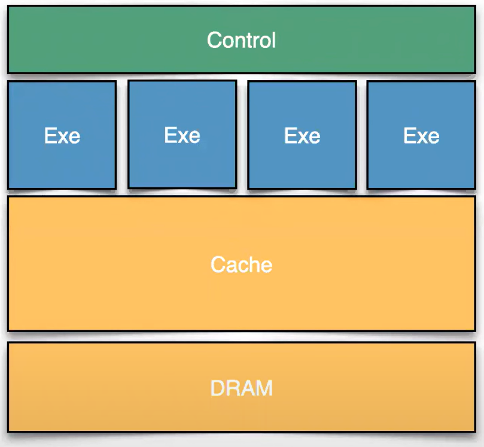
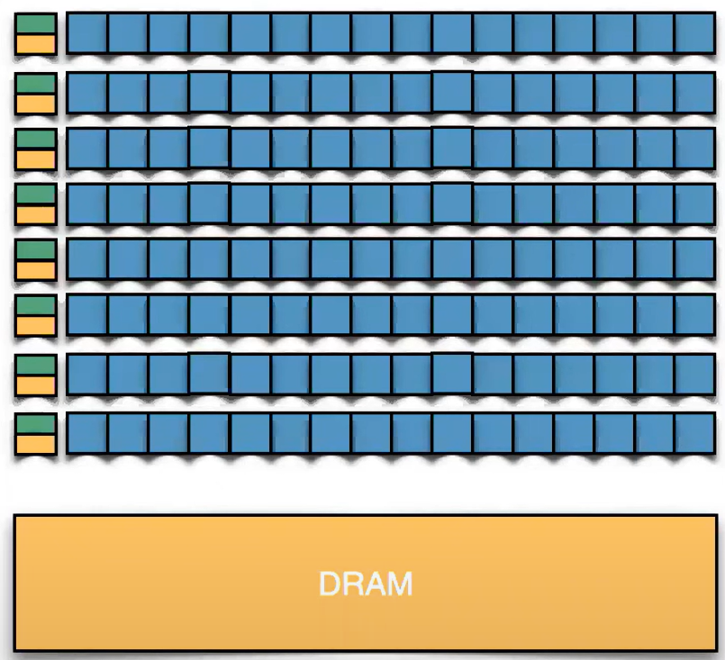

# 39.1-What's a GPU


Lecture Video Address


本节使用与CPU进行比较的方式来介绍GPU

## GPU vs. CPU

### architecture

如下是CPU和GPU的简化示意图

|              | CPU                                                          | GPU                                                          |
| ------------ | ------------------------------------------------------------ | ------------------------------------------------------------ |
| diagram      |                    |                    |
| desc         | CPU有大量的控制逻辑来解码和执行指令；执行单元(Exe)进行数学运算并运行这些指令(这里的Exe可以理解为Core，包含寄存器，但是实际的Core是包含Control的)；并且有一个由内存（通常是分层的缓存系统）支持的内存系统。 | 有大量的执行单元，可能超过100个，提供了很强的并行能力；控制单元比较小，也更简单，但是数量比较多；每个控制单元都有关联的缓存；一个内存DRAM |
| goal         | Minimize latency of limited threads using complex control    | Maximize throughput by scheduling many parallel threads      |
| explaination | CPU的结构已定，为了从CPU中获得更好的性能，需要尽量减少这些步骤中的延迟。实际上，现代CPU——从这些执行单元到内存的延迟周期数是性能的关键因素(这里指的是延迟而不是时钟周期) | 在上述结构的基础上，为了从GPU中获得最大性能，我们的目标是最大化通过执行单元的吞吐量，在优化的时候使用尽可能多的执行单元(后续会使用GPU处理图像为例介绍其在像素移动上的匹配) |

### Matrices

|                   | CPU                                       | GPU                       | desc                                                         |
| ----------------- | ----------------------------------------- | ------------------------- | ------------------------------------------------------------ |
| Cores             | Fewer                                     | Many                      |                                                              |
| Frequency         | Higher                                    | Lower                     | 在上个世纪，为了提升性能，CPU不断追求高频率(当然后续由于散热问题频率无法再上升)，GPU追求吞吐量，对频率要求不高 |
| Latency           | Low                                       | Higher                    |                                                              |
| Parallelism       | Instruction Level                         | Thread Level              |                                                              |
| Registers         | Fewer(Register Renaming)                  | Many                      | 每个Cores都有很多寄存器，如上表所示，GPU内的cores是非常多的  |
| Speculation(推测) | Highly Leveraged(Br Prediction, 分支预测) | Limited(no Br Prediction) | CPU追求最大化性能，追求指令执行的速度，减少nop，也就是空转的情况。所以对branch指令会进行预测。GPU更考虑吞吐量。 |
| Execution Order   | Out of Order(Reorder Buffers)             | In Order                  | 同理，lw，sw等指令也会影响后续指令的结果，一种方式是将后续指令替换为nop，但是效率太低，因此CPU的方式是调换执行顺序，将不受影响的指令移动到前面。而GPU并不考虑这个。 |
| Execution Units   | Fewer                                     | Many                      | CPU要做预测，考虑执行顺序以最大化性能，这占用了很多的逻辑和电路面积，执行和控制单元较为复杂 |
| Execution Control | Complex                                   | Simpler                   | GPU不考虑这些，因为在那么多执行单元上做这些优化非常复杂并且扩展性低，所以执行和控制逻辑更简单。 |
| Coherency         | Hardware Managed                          | Software Managed          | 多核CPU有很多复杂性来管理多个线程的一致性上(例如Cache一致性)，其软件编程模型相对简单；但是GPU的硬件是很简单的，但是软件编程模型比较复杂，这意味着如果有两个不同的线程需要同学，需要由程序员管理这种同步以确保数据一致性。 |

### Analogy

下面做一个类比

|          | CPU      | GPU            |
| -------- | -------- | -------------- |
| analogy  | 数学教授 | 小学课堂       |
| handling | 复杂问题 | 大量简单的问题 |

- CPU要进行推测，考虑执行顺序以最大化效率，其执行和逻辑单元更复杂，但是频率更高，更适合在短时间内解决一个复杂的问题。
- 但是GPU不考虑这些，GPU更强调吞吐量，其逻辑和执行单元更简单，因此更适合解决大量的简单的问题。在面对大量简单的问题时，即使最聪明的教授也不一定能比得上许多学生的速度。

## GPU

Maximize Throughput, Hide Latency

- High throughput SIMD leveraging Thread Level Parallelism(利用线程级并行性的高吞吐量SIMD)
    - independent threads executing the same program
    - SIMD可以一个指令执行原本多条指令的任务，并且每个Thread使用
- Threads grouped into Threadgroups (aka Blocks or Workgroups)
    - shared local memory
- Threadaroups broken into SIMD Groups (aka Warps or Wavefronts)
    - identical, independent, lockstep programs of multiple threads
- High memory latency, high memory bandwidth
    - switch SIMD Group execution to maintain high shader occupancy
    - 通常GPU可以访问非常高的内存带宽，假设在玩游戏，每秒要刷新屏幕30次才能确保游戏看起来流畅，需要刷新屏幕上的每个像素；此外，你需要在背后渲染很多东西。每秒多次移动数据以生成这些图像，因此需要高内存带宽才能高效地完成这些操作。
    - 因此，许多GPU的挑战和优化都围绕着减少内存带宽——如何移动更少的数据，如何有缓存层次结构以减少从芯片上移动到芯片外的数据。
