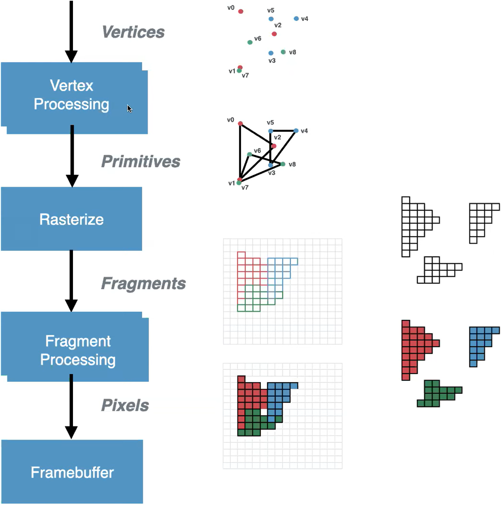
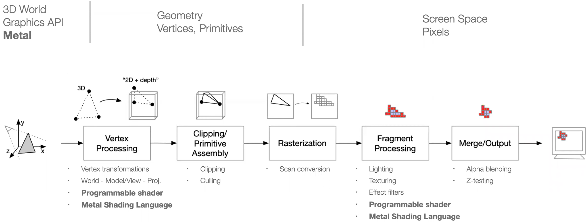

# 39.2-Graphics Pipeline


Lecture Video Address


> Graphics Pipeline(图形管线)，指的是计算机图形学中，将三维图形渲染为二维图像的处理过程。

本节先简要介绍一下图像管线，为下一节GPU处理图像做准备。

## Simplified Graphics Pipeline

首先来简要介绍一下图形管线，GPU工作的几个阶段

| stage               | stage(中文) | task                                                         |
| ------------------- | ----------- | ------------------------------------------------------------ |
| vertex Processing   | 顶点处理    | 处理定点，实现图形的变换、光照、颜色计算等操作。如上将图形转化为三角形等。在这个过程中可以对每一个vertex执行程序 |
| rasterize           | 光栅化      | 将几何图元（如三角形、线段等）转换为屏幕上的像素             |
| Fragment Processing | 片段化      | 对光栅化阶段生成的片段进行进一步处理（可以理解为对每一个像素运行程序），用来生成颜色等 |
| Framebuffer         | 帧缓冲      | 最终的像素数据存储到帧缓冲中，并在显示设备上输出最终图像。(帧缓冲存储最终渲染结果的内存区域。它包含多个缓冲区，用于存储颜色、深度、模板等信息) |

通过以上各个阶段的协作，GPU能够高效地将三维场景渲染为二维图像。

---

上面讲到，vertex Processing和Fragment Processing可以分别对一个vertex和Fragment执行程序。

GPU实际上使用相同的硬件来执行这些程序。

为了每秒处理数百万像素和可能的数百万顶点，需要很大的计算引擎来运行这些程序。

实际上，在屏幕上的像素中(如下图)

每个方块都可以运行一个程序来生成最终的像素并将它们写入内存。可以理解为，在玩游戏并在屏幕上看到像素，每个像素都在运行一个程序，可能是相同的程序，叫做像素着色器(pixel shader)

这就是GPU并行处理的美妙之处。

---

如下是本节课要用的例子。

## Graphics Pipeline - Overview

下面更详细的介绍图形管线

起初，会有一个3D模型，简单的例子是由三角形组成的物体模型，所以这里以三角形为例。下面是每一阶段的任务

| stage                                 | task                                                         | output                                                       | supplyment                                                   |
| ------------------------------------- | ------------------------------------------------------------ | ------------------------------------------------------------ | ------------------------------------------------------------ |
| 顶点处理(Vertex Processing)           | 接收顶点数据作为输入，对每个顶点进行变换、投影和其他计算，以便将顶点从模型空间转换到屏幕空间。这包括模型变换、视图变换、投影变换等操作。 | 经过变换处理后的顶点数据，包括位置坐标、法线向量、纹理坐标等。 | 输出只有顶点，并不包含边                                     |
| 图元组装(Chipping/Primitive Assembly) | 将顶点数据组装成几何图元（如三角形、线段等）。每个几何图元需要从顶点数据中选择适当的顶点，并确定它们的顺序，以定义完整的几何形状。 | 组装好的几何图元，包括三角形的三个顶点（或其他几何图元的对应顶点集合）。 | 添加了边，并且将超出屏幕无法渲染的部分截去了（此时仍然是几何内容） |
| 光栅化(Rasterization)                 | 将几何图元转换为屏幕上的像素（片段），确定每个像素的覆盖情况。 | 屏幕上的像素（片段），每个像素包含其屏幕位置和与几何图元相关的属性（如深度值、颜色值等）。 | 将几何的内容转换为计算机的像素，包括填充中间的看空白，此时每个像素有一些属性值 |
| 片段处理(Fragment Processing)         | 对光栅化阶段生成的每个像素（片段）进行处理，计算其最终的颜色和深度值。 | 经过处理后的像素（片段），包括最终的颜色值和深度值。         | 根据得到的像素属性值计算出最终显示的内容                     |
| 合并/输出(Merge/Output)               | 将处理后的像素（片段）合并到帧缓冲中，准备输出到显示设备。   | 最终的图像数据，将显示在屏幕上供用户观看。                   |                                                              |
