# 39.3-Detailed Graphics Pipeline


Lecture Video Address


下面对每一个过程进行相信的说明

## Vertex Processing

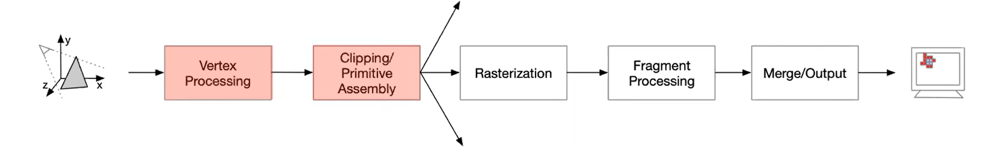

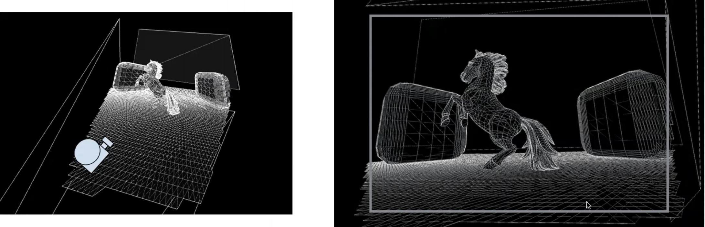

1. 模型中的一切都被分解为三角形(即使是方形的形状也会分解为三角形)，因为三角形是平面的(三点确定一个平面)，对硬件来说比真正的3D形状更容易处理

    > 分解为三角形并不是一开始就有的，一开始我们只有模型中的点，vertex Processing处理的就是对点进行转换。这里为了看起来方便就先将其划分为三角形。

2. 根据视角(如图中的照相机)，通过vertex shader(顶点着色器)对模型中的点进行一系列的变换，包括旋转，移动，在xyz的维度上拉伸，将所有物体转换到合适的位置（如右图）

3. 其中所有的变换都是通过一个矩阵乘法实现的，vertex Processing的转换矩阵是一个4×4的矩阵，然后与所有vertex构成的高矩阵相乘。也就是一个非常高的矩阵与4×4矩阵的相乘。（在通用GPU出现之前，处理图像的GPU就是实现这个任务）

> vertex并不是只有图中所示的三角形的三个顶点，点是非常密集的。

## Clipping/Primitive Assembly

现在已经将模型转化为几何图形——点了，下面就是要进行几何处理。

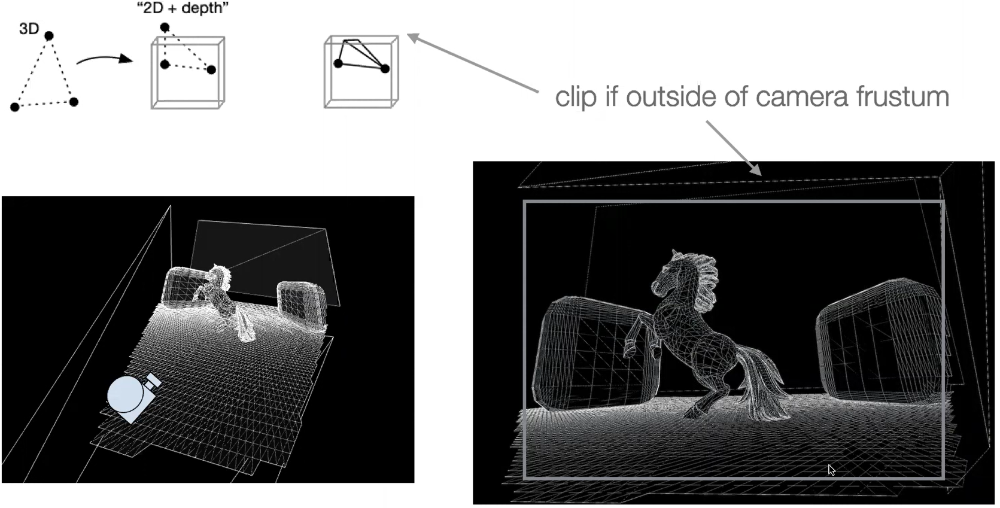

这是两个过程

### clipping

> "Clipping" 指的是在计算机图形学中，根据视口或裁剪窗口的定义，将超出指定区域的图元（如线段、多边形等）部分进行裁剪或剪切的过程。这个过程确保只有位于指定区域内的图元会被绘制，从而提高渲染效率并避免不必要的计算。

1. Cull back-facing primitives: 剔除背面的图元，这在图形学中是一个常见的优化技术，因为背面的图元通常不可见，不需要进行渲染。
2. Clip primitives: 裁剪图元，即根据视口或其他几何限制将超出屏幕或视野范围的图元部分剪裁掉，以提高渲染效率和减少不必要的计算。

如上图，将背面的点都给裁掉，将超出屏幕范围的点也都裁掉

### primitive Assembly

> - primitive(在计算机图形学中，"primitive" 指的是绘图的基本元素，如点、线、三角形等, 这里是指点)
> - assembly(组装，装配，将多个部件或组件组合在一起形成一个完整的整体)

primitive Assembly就是指将vertex Processing处理后得到的点装配成一个个三角形。三角形并不是只有三个点，中间也有点，只不过没有画出来

### Tile based rendering

现代GPU还会对装配好的三角形进行装箱(Bin primitives into screen tiles)，如下图

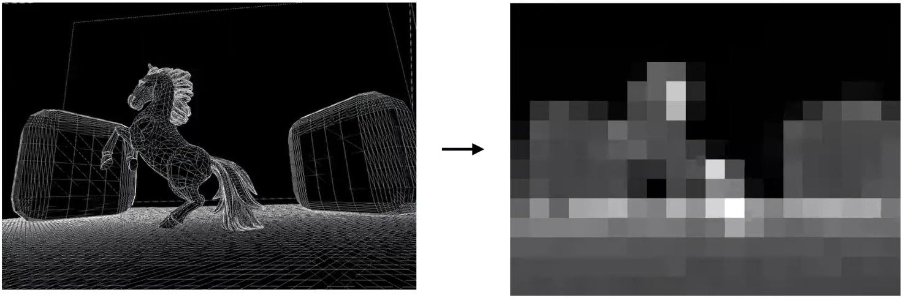

- Estimate tile cost: 每一个tile的颜色用来衡量这片区域三角形的密集程度，例如头发，尾巴等地方三角形比较密集，剃了就是白色的，背景中几乎没有三角形，就位黑色。由此来大致估计出渲染这个tile的成本。
- Create per-tile control streams: 估计渲染成本之后，可以帮助进行工作分配。

> 由于我们之前提到过要提高GPU的吞吐量，将任务尽可能多的分配给执行单元，现在评估得到那些tile的工作量高，就会将这一部分分配给更多的执行单元。

现代GPU大部分都会这样做。

## Rasterization

现在得到了三角形，下面对三角形进行处理

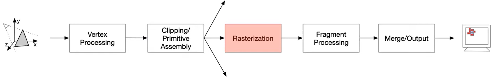

- Work can now be performed per tile
- Fetch vertex data from memory. Generate plane equations.

在光栅化的过程中需要执行扫描转换(Scan conversion)的步骤，将三角形转换为单个像素。

- Scan conversion
    - Convert triangles into candidate pixels/fragments
    - Sub-pixel accuracy AA techniques
    - Subsequent stages operate in screen space

相当于从一个顶点开始，从左往右扫描，直到遇到一条边。

每个像素都保存有信息，包括颜色，深度等

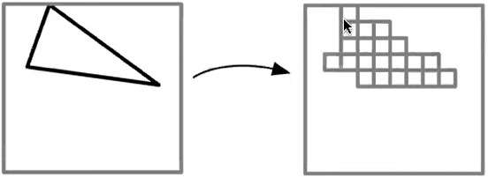

最终的效果如下

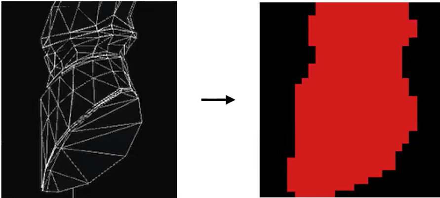

## Fragment Processing

现在已经得到了像素，需要处理像素

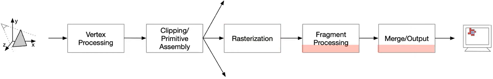

### Depth & Stencil test

Rasterization得到的像素含有深度信息。

- Reject fragments that fail tests
    - Depth test - remove occluded(被遮挡的) fragments
    - Stencil test - remove masked fragments


- 深度测试(Depth test)用于确定像素的可见性，防止被遮挡的像素进行绘制。它通过比较像素的深度值与深度缓冲区中的值，决定是否更新像素和深度缓冲区。
- 模板测试(Stencil  Test)用于控制像素的绘制范围，通过模板缓冲区中的值和预定义的模板操作，决定是否绘制或修改像素。

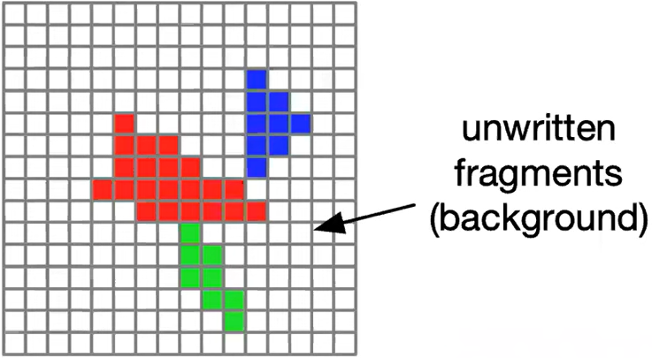

Fragment Processing

- Deferred buffering
    - Reduce down-stream workload
- Trigger/schedule fragment shading work
    - Pixels turn into threads

### Shading

> Shading(着色)

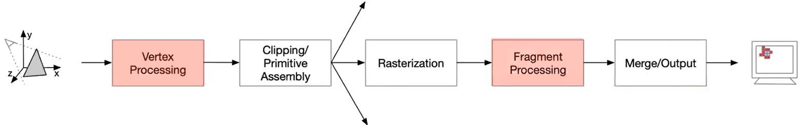

着色器让你可以指定**每个像素**要运行的算法来进行光照计算。

如下是一个简单的光照算法。

- 左边的茶壶没有着色，只是简单的黑白
- 右边的茶壶加上了一些高光照明

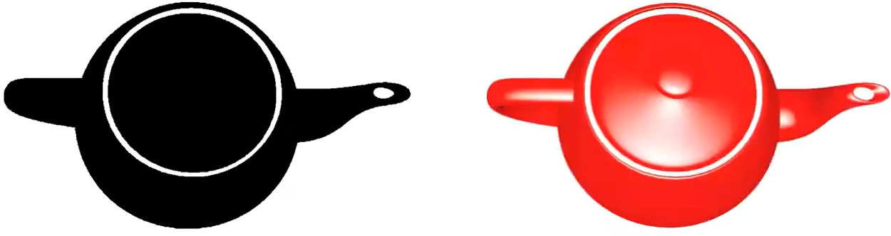

虽然算法很简单，但是仍然需要相当多的计算，包括计算角度，纹理查找。

对于每个像素，都需要执行同一个算法，因此可以使用SIMD指令来并行处理多个像素点，而不是在CPU上逐个像素处理，这就是专用GPU硬件的优势所在

每个像素执行的程序如下（这是调用Metal shading API写的，是针对苹果硬件的编程语言）

```
fragment half4 my_fragment_shader(
	Vertex v [[stage_in]],
	texture2d<float, access::sample> tex [[texture(0)]],
	sampler smp [[sampler(0)]]
) {
	float lightAngle = max(0.5, dot(normalize(v.normal), float3(1, 0, 1))); // 计算光线角度，做点积运算
	float4 diffuse = tex.sample(smp, v.uv); // high latency, 进行纹理查找一确定漫反射颜色
	float4 outputColor = lightAngle * diffuse;  // 漫反射颜色*光线角度得到显示的颜色
	return half4(ooutputColor.r, outputColor.g, outputColor.b, 1);  // 输出结果
}
```

- 现代的着色语言要复杂得多。最初的GPU只能进行简单的数学运算和纹理查找。如今，已经可以进行更复杂的运算，比如矩阵乘法，神经网络的特殊指令等
- 任何与并行处理相关的内容都是现代GPU着色语言的一部分。
- 现在也有用于同步的指令，可以等待其他线程完成一同步数据。
- 并且有一些类似于if-else的指令。

#### Execution Model

- Execute fragment shader on every touched pixel/fragment (c.f., vertex shader)

> 每一个pixel都需要经过Fragment shader的处理

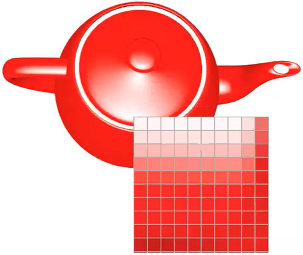

每个像素进行的指令都是一样的，只是数值不同，因此可以利用线程级并行。

- Thread-level parallelism: Independent threads executing the same program on multiple data (SIMD)

|         | single-threaded                                              | SIMD group(lock step)                                        | Multiple SIMD groups in singlegroup(shared memory)           |
| ------- | ------------------------------------------------------------ | ------------------------------------------------------------ | ------------------------------------------------------------ |
| diagram | 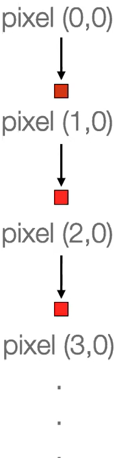 | 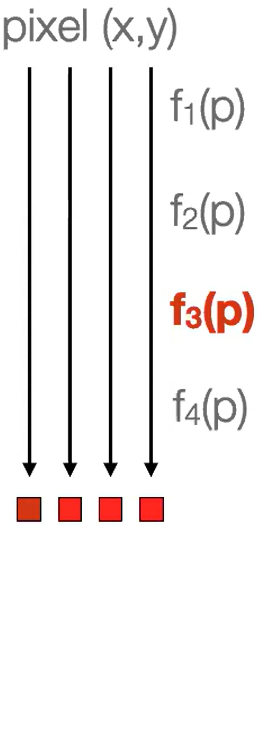 | 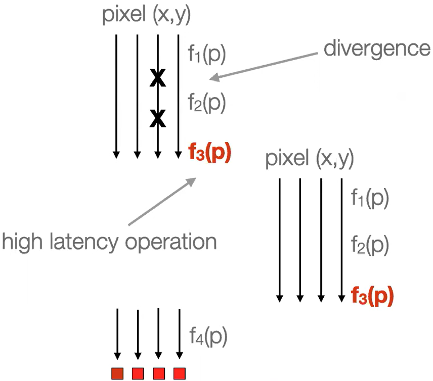 |
| desc    | 对于所有的像素，一个接一个从左向右逐个处理，每个像素都运行一次程序。由于一次只处理一个程序，所以很慢 | 这里将4个像素分为一组，对4个像素执行相同的指令。当执行简单的指令的时候，会在同步的方式下执行1234并同时完成 | 可能其中一个像素会执行一个高延迟的纹理效应(texture effect)或者延迟操作f3，此时会找另一组像素执行12操作，等原来的f3操作执行结束之后，继续执行f4操作 |


### Texture Mapping

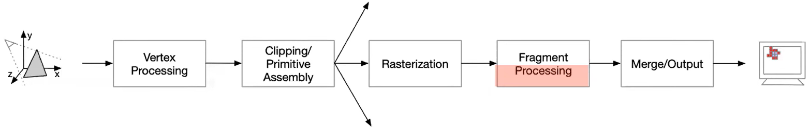

在原先的模型中，有一部分是二维的图片，贴到3维模型的上面。如下图中的烟花，是预选存储的图像或者纹理。需要将这些预先存储的图像映射到渲染图像当中。

**纹理映射**（Texture Mapping）是计算机图形学中的一种技术，用于将二维图像（纹理）应用到三维模型的表面，以增加其视觉细节和真实感。纹理映射使得一个简单的几何模型可以表现出复杂的表面特征，如颜色变化、光照效果和细微的表面细节。

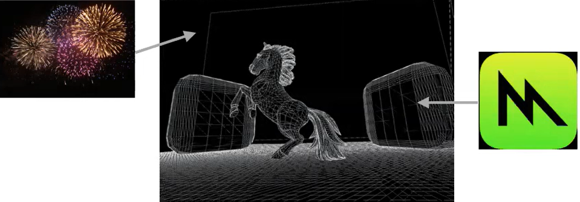


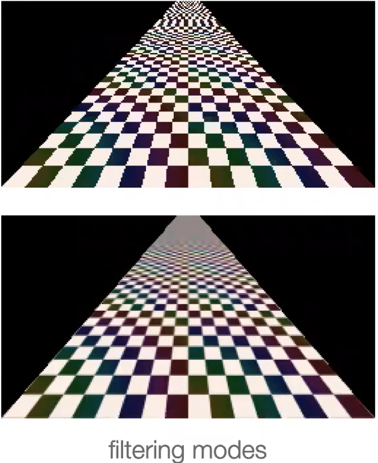

## Merge/Output

merge过程：

Color write instruction from shader

- Convert color from shader to output type
- Blend multi-sample data
- Surface addressing
- Compress and write to memory

---

现在已经得到了可以显示到屏幕的像素了

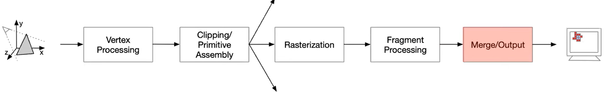

需要将像素存储在芯片的缓存当中，需要将他们写入framebuffer，告诉framebuffer或显示器渲染完成了。然后其获取所有数据并显示出来。

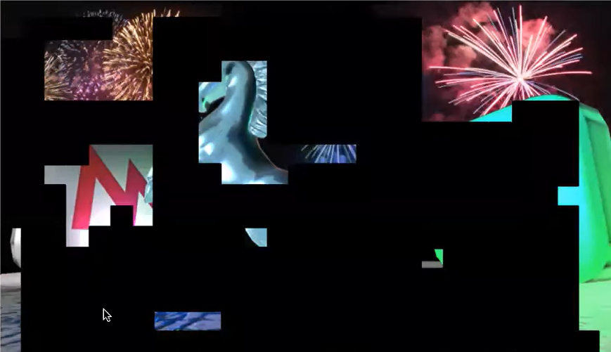
