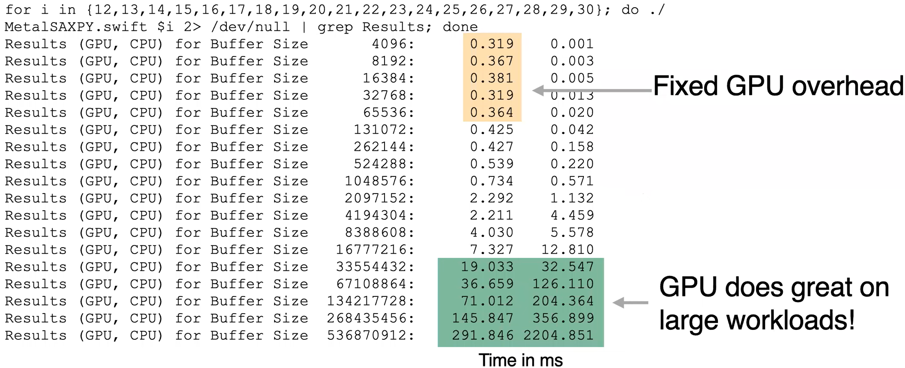
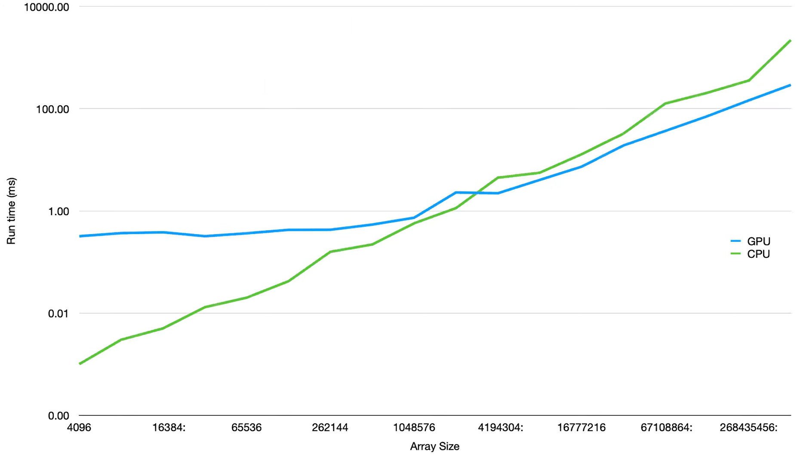

# 39.4-SAXPY GPU vs. CPU


Lecture Video Address


## SAXPY

### SAXPY in C on a CPU

```c
// Multiply each element in an array by a constant, a, and store the result
void saxpy(int n, float a, float* x, float* y) {
	for (int i = 0; i < n; i++)
		y[i] = a * x[i];
}
```

在单线程CPU上运行这个程序

### SAXPY in Metal on a GPU

```c++
using namespace metal;
kernel void saxpy(
	constant float& a [[buffer(0)]],
	constant float * x [[buffer(1)]],
    device float *y [[buffer(2)]],
    uint threadIndex [[thread_position_in_grid]]) {
    y[threadIndex] += a * x[threadIndex];
}
```

这个程序和C的程序的功能一样，y为输出缓冲区。

## GPU vs. Single Threaded CPU

运行结果如下



- 当缓冲区比较小的时候，CPU更快，因为启动和设置GPU有很多开销，这些开销的时间是固定的
- 当缓冲区非常大的时候，GPU在性能上明显高于CPU，得益于SIMD，可以并行执行很多相同的操作（一次操作32,64甚至更多的数据）

> 因此在处理比较小量的数据时，使用GPU比较好，而数据量比较大的时候，GPU会很好

这只是一个非常简单的程序，并没有多少计算。

前面说过，GPU的内存带宽是很高的，如果要进行大块内存的移动，那么GPU会体现出更高的效率。所以GPU不仅受益于执行单元的数量，还受益于内存带宽。

### Logarithmic



从这个图中可以清楚地看到，随着数组大小的增大，CPU的运行时间显著增加，而GPU则保持相对平稳的增长。这进一步证明了GPU在处理大规模并行计算任务时的优势。对数刻度图让我们更容易观察到这种性能差异，特别是在数据量大的情况下，GPU能够更高效地完成任务。

总结来说，当任务规模较小时，CPU由于其较低的启动开销，表现出更好的性能；而当任务规模增加时，GPU利用其强大的并行处理能力，显著超越了CPU的性能。这也解释了为什么在现代计算中，GPU在处理大规模数据和高性能计算任务时越来越受欢迎。
